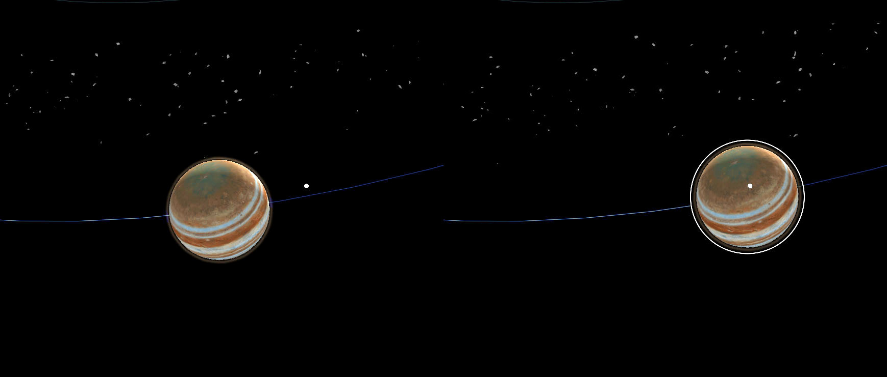

# The Making of Galaxy Explorer for HoloLens 2

Welcome to the journey of how we are updating Galaxy Explorer for HoloLens 2. [Galaxy Explorer](https://docs.microsoft.com/windows/mixed-reality/galaxy-explorer "Galaxy Explorer") was originally developed as an open source application for HoloLens (1st gen) through the Share Your Idea program, and is one of the first mixed reality experiences many people had. Now we are updating it for the [new and exciting capabilities of HoloLens 2](https://www.microsoft.com/hololens/hardware).

As one of the [Microsoft Mixed Reality Studios](###Mixed-Reality-Studios), we usually develop commercial grade solutions and are developing & testing on target platforms throughout the creative and development process. We now have the unique situation where don’t yet have access to HoloLens 2 devices, but are excited to start the updates to Galaxy Explorer. We're embarking on this project utilizing the frameworks and tools (like [MRTK v2](https://microsoft.github.io/MixedRealityToolkit-Unity/Documentation/GettingStartedWithTheMRTK.html)) as they become available to us and the community - and we want to bring you along for the ride.

Just like the original Galaxy Explorer, [our team](##Meet-the-team) will be [open sourcing the project on GitHub](https://github.com/Microsoft/GalaxyExplorer) to ensure that the community has full access. We will also be documenting our journey here in complete transparency about the ways in which we undertook porting from MRTK v1 to MRTK v2, how we enhanced the experience based on the new features available in HoloLens 2, and how we ensured that Galaxy Explorer remained a multi-platform experience. So whether you're viewing Galaxy Explorer on HoloLens (1st gen), HoloLens 2, a Windows Mixed Reality headset or on your Windows 10 desktop, we want to ensure that you're having an immersive experience and enjoy the journey as much as we are!

This page will expand as we progress through the project, and we'll link out to more detailed articles, code, design artefacts, additional MRTK v2 documentation, etc. to provide you with an insider's look at the project.

## Unveiling the new logo

We're excited to kick off with a preview of the new Galaxy Explorer logo! While paying homage to the original logo by featuring the Milky Way, we've designed a realistic visualization and updated the typography to provide a more sleek and modern feel. Included in the logo is a sneak peek at one of the new icons.

The design and typography of the logo will set the tone for the overall look and feel of UI elements throughout the experience. 

## Thinking about interactions

As a creative studio, we were ecstatic about the privilege to port Galaxy Explorer to HoloLens 2. We knew from the start that we wanted the experience to be a celebration of the new device and to demonstrate that Mixed Reality empowerment is limited only to the imagination.

HoloLens 2 allows users to touch, grasp, and move holograms in ways that feel natural – they respond a lot like real objects. Fully articulated hand models are amazing, because it lets users do what feels natural. For example, everybody picks up a cup slightly differently – and instead of enforcing one particular way to do it, HoloLens 2 lets you do it your way.

>[!VIDEO https://www.youtube.com/embed/wogJv5v9x-s]

This is a big change from the Air Tap-based interfaces on first generation HoloLens devices. Instead of interacting with holograms from a distance, users can now get "up close and personal". When porting existing experiences over to HoloLens 2 or planning new ones, it is important to make yourself familiar with the direct manipulation of holograms.

### Direct manipulation vs. the vast distances in space

It is a magical experience to be able to reach out, grab a planet and hold it in your hand. The challenge with this approach is the size of the solar system – it's huge! The user would need to walk around their room to get close to each planet to be able to interact with it.

To allow users to interact with objects that are farther away, MRTK offers hand rays that shoot out from the center of the user's palm, acting as an extension of the hand. A donut-shaped cursor is attached to the end of the ray to indicate where the ray intersects with a target object. The object that the cursor lands on can then receive gestural commands from the hand. 

>[!VIDEO https://www.youtube.com/embed/Qol5OFNfN14]

In the original version of Galaxy Explorer, the user would target a planet with the gaze cursor and then air tap to call it closer. The easiest way to port the experience to HoloLens 2 is to take this behavior and use hand rays to select planets. While this was functional, it left us wanting more.

### Back to the drawing board

We came together to ideate what could be built on top of the existing interactions. The thinking was: Although HoloLens 2 allows users to interact with holograms in natural, realistic ways, holograms are by definition not real. So as long as an interaction is plausible for the user, it doesn't matter if that interaction would be possible with a real object or not – we can make it possible.

One concept that we explored was based on telekinesis – the power to manipulate objects with one's mind. Often seen in super hero movies, a person would reach out with their mind and call an object into their open hand. We played around with the idea some more and came up with a quick sketch of how the concept could work.

The user would point the hand ray at a planet, which would provide target feedback. As the user then extends their open hand, the planet would be pulled towards the user by a magical force until it is close enough to grab it. Hence our name for the interaction: force grab. As the user would push away the planet with their open hand, it would return again to its orbit.

### Force grab prototyping

We then created multiple prototypes to test the concept: How does the interaction feel overall? Should the called object stop in front of the user or stick to their hands until placed? Should the called object change size or scale while being called?

Here is Amit Rojtblat (Technical Artist) presenting one of the prototypes to Yasushi Zonno (Creative Lead).

__*--- VIDEO OF AMIT PLAYING AND EXPLAINING THE PROTOTYPE ---*__

__*--- NEEDS TO BE UPLOADED (TO YOUTUBE?) AND LINKED ---*__

### Implementing force grab into the application

When we tried the force grab on planets, we realized that we had to change the scale of the solar system. It turned out that an accurate, medium-sized representation of the solar system is difficult for users to understand and navigate - they did not know where to look. However an accurate, small-sized-representation made some planets too small to be easily selected. As a result, the size of the planets and the spacing between solar objects was designed to feel comfortable within a medium-sized room while maintaining relative accuracy.

During the later stages of our development sprint, we were lucky enough to have fellow MSFT Mixed Reality experts in-house, so we got to work getting their input as expert testers and doing quick iterations on the force grab interaction.

--- PICTURE OF A MENTOR TESTING ---

From left to right: ---- -- -- -TBD

### Adding affordances for targeting

As we experimented on HoloLens 2, we found that even though the new interactions are natural and intuitive, holograms remain the same: with no weight or tactile sensations. Since holograms don't provide natural feedback that humans are used to receiving when they interact with objects, we needed to create them.

We thought about the visual and audio feedback that users would be provided for the various stages of their interactions, and since the force grab mechanism is central to interacting with Galaxy Explorer, we did many iterations. The aim was to find the right balance of audio and visual feedback for each stage of the interaction: focusing on the intended object, calling it to the user, and then releasing it. What we learned is that significantly more audio and visual feedback was required to reinforce the interaction than we were used to for HoloLens (1st gen).

### Adding affordances for force grab
 
Once we had the basic force grab mechanism with audio and visual affordances, we looked at how to make selecting planets more user friendly. There were two main things to address: Because the solar system is a 3D moving interface, there is added complexity for users to learn how to target objects consistently. This was compounded by the fact that the hand ray is very fast at selecting an object, making planets move towards the user incredibly quickly.

We approached this with a three-pronged solution. The first was fairly intuitive: slow down the selection process so that planets approach the user at a more natural pace. Once the speed was adjusted, we had to revisit the audio and visual affordances, adding additional audio feedback as the planet tracked towards the user.

The second part of the solution was to make the visualization of the entire force grab interaction extremely tangible. We visualized a thick line that moves towards the targeted object once the hand ray connects with it, and then brings the object back to the user - like a lasso. 

Finally, we optimized the scale of the solar system so that the planets were large enough for the user's gaze and hand ray to target them. 

These three improvements allowed users to make accurate selections, calling planets to them in an intuitive way. Overall, the effect of the final force grab is a more immersive and interactive experience in the solar system.

## Meet the team 

Our Mixed Reality studio team is made up of designers, 3D artists, UX specialists, developers, a program manager and a studio head. We hail from all over the world: Belgium, Canada, Germany, Israel, Japan, the United Kingdom and the United States. We are a multidisciplinary team that comes from a diverse background: gaming - both traditional and indie, digital marketing, health care and science.

We are excited to create Galaxy Explorer for HoloLens 2, and to update the HoloLens (1st gen), VR and desktop versions. 

On top from left to right: Artemis Tsouflidou (Developer), Angie Teickner (Visual Designer), David Janer (UX Designer), Laura Garrett (Delivery & Production Lead), Yasushi Zonno (Creative Lead), Eline Ledent (Developer), Ben Turner (Sr. Developer).
Bottom from left to right: Amit Rojtblat (Technical Artist), Martin Wettig (3D Artist), Dirk Songuer (Studio Head).
Not featured: Tim Gerken (Tech Lead), Oscar Salandin (Visual Designer).

## Additional information

### Mixed Reality Studios

Microsoft Mixed Reality Studio teams - located in the Americas, Europe and Asia-Pacific - are experts in user experience design, holographic computing, AR/VR technologies, and 3D development; including 3D asset creation, DirectX, Unity and Unreal. We help envision desired futures, design, build and deliver solutions, while enabling customers to create measurable impact across their organization. The studios work closely with over 22,000 Microsoft Services professionals for enterprise application integration, adoption, operations and support.
