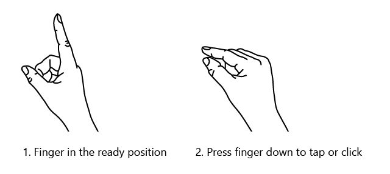
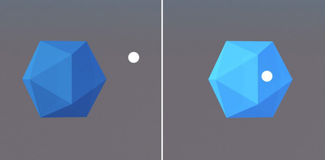
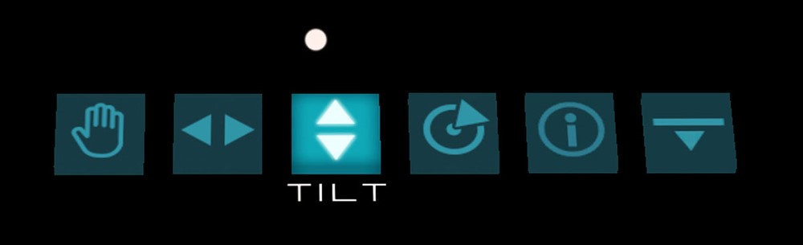

# Head-gaze and commit
Head-gaze and commit is an input model that involves targeting an object with the direction of your head pointing forward (head-direction), and then acting on it with a secondary input such as the hand gesture Air Tap or the voice command “Select”. It is considered a "far" input model with indirect manipulation, meaning it is best used for interacting with content that is beyond arms reach.

## Device support

<table>
    <colgroup>
    <col width="25%" />
    <col width="25%" />
    <col width="25%" />
    <col width="25%" />
    </colgroup>
    <tr>
        <td><strong>Input model</strong></td>
        <td><a href="hololens-hardware-details.md"><strong>HoloLens (1st gen)</strong></a></td>
        <td><strong>HoloLens 2</strong></td>
        <td><a href="immersive-headset-hardware-details.md"><strong>Immersive headsets</strong></a></td>
    </tr>
     <tr>
        <td>Head-gaze and commit</td>
        <td>✔️ Recommended</td>
        <td>✔️ Recommended (third choice - <a href="interaction-fundamentals.md">See the other options</a>)</td>
        <td>➕ Alternate option</td>
    </tr>
</table>

## Head-gaze
Mixed reality headsets use the position and orientation of the user's head to determine their head direction vector. You can think of this as a laser that points straight ahead from directly between the user's eyes. This is a fairly coarse approximation of where the user is looking. Your application can intersect this ray with virtual or real-world objects and draw a cursor at that location to let the user know what they are currently targeting.

In addition to head gaze, some mixed reality headsets like the HoloLens 2 include eye tracking systems that produce an eye-gaze vector. This provides a fine-grained measurement of where the user is looking. It is possible to build gaze and commit interactions using eye gaze, but this comes with a very different set of design constraints, which will be covered separately in the [eye tracking article](eye-tracking.md).

## Commit
After targeting an object or UI element, the user can interact or "click" on it using a secondary input. This is known as the commit step of the model. The following commit methods are supported:

- Air Tap gesture
- Speak the voice command "Select" or one of the targeted voice commands
- Press the single button on a [HoloLens Clicker](hardware-accessories.md#hololens-clicker)
- Press the 'A' button on an Xbox Gamepad
- Press the 'A' button on an Xbox Adaptive Controller

### Head-gaze and air tap gesture
Air tap is a tapping gesture with the hand held upright. To perform an Air tap, raise your index finger to the ready position, then pinch with your thumb and raise your index finger back up to release. On HoloLens 1, Air tap is the most common secondary input.

 

Air tap is also available on HoloLens 2, and it has been relaxed from the original version. Nearly all types of pinches are now supported, as long as the hand is upright and holding still. This makes it much easier for users to learn and perform the gesture.  This new Air tap replaces the old one through the same API, so existing applications will get the new behavior automatically after recompiling for HoloLens 2.

### Head-gaze and "Select" voice command
Voice commanding is one of the primary interaction methods on Mixed Reality. It provides a very powerful "Hands Free" mechanism to control the system. There are diferent types of voice interaction models:

- The generic command "Select" that allows to perform a "click" actuation or commit as a secondary input.
- Object commands like "Close" or "Make it bigger" that allow to perform and commit to an action as a secondary input.
- Global commnads like "Go to start" that don't require a target.
- Conversation user interfaces or entities like Cortana that have an AI Natural Language capability.
- Custom commnads

To find more details and a comprenhesive list of available commands and how to use, check out our [voice commanding](voice-design.md) guidance.

### Head-gaze and HoloLens Clicker
The HoloLens Clicker is the first peripheral device built specifically for HoloLens and is included with the HoloLens 1 Development Edition. The HoloLens Clicker allows a user to click with minimal hand motion and commit as a secondary input. The HoloLens clicker connects to the HoloLens 1 or 2 using Bluetooth Low Energy (BTLE).

 
*HoloLens Clicker*

More information and instructions to pair the device can be found [here](hardware-accessories.md#pairing-bluetooth-accessories)

### Head-gaze and Xbox Wireless Controller
The Xbox Wireless Controller allows to perform a "click" actuation as a secondary input by using the A button. The device is mapped to a default set of actions that help navigate and controll the system. If you want to customize the controller, use the Xbox Accesories App to configure your Xbox Wireless Controller.

 
*Xbox Wireless Controller*

[Pairing an Xbox controller with your PC](hardware-accessories.md#pairing-bluetooth-accessories)

### Head-gaze and Xbox Adaptive Controller
Designed primarily to meet the needs of gamers with limited mobility, the Xbox Adaptive Controller is a unified hub for devices that helps make Mixed Reality more accessible.

The Xbox Adaptive Controller allows to perform a "click" actuation as a secondary input by using the A button. The device is mapped to a default set of actions that help navigate and controll the system. If you want to customize the controller, use the Xbox Accesories App to configure your Xbox Adaptive Controller.

 
*Xbox Adaptive Controller*

Connect external devices such as switches, buttons, mounts, and joysticks to create a custom controllers experience that is uniquely yours. Button, thumbstick and trigger inputs are controlled with assistive devices connected through 3.5mm jacks and USB ports.

 
*Xbox Adaptive Controller ports*

[Instructions to pair the device](hardware-accessories.md#pairing-bluetooth-accessories)

<a href=https://www.xbox.com/en-US/xbox-one/accessories/controllers/xbox-adaptive-controller>More info available on the Xbox site</a>

## Design guidelines
> [!NOTE]
> More guidance specific to gaze design [coming soon](index.md).

## Head-gaze targeting
All interactions are built upon the ability of a user to target the element they want to interact with, regardless of the input modality. In Windows Mixed Reality, this is generally done using the user's gaze.
To enable a user to work with an experience successfully, the system's calculated understanding of a user's intent, and the user's actual intent, must align as closely as possible. To the degree that the system interprets the user's intended actions correctly, satisfaction increases and performance improves.

## Target sizing and feedback
The gaze vector has been shown repeatedly to be usable for fine targeting, but often works best for gross targeting (acquiring somewhat larger targets). Minimum target sizes of 1 to 1.5 degrees should allow successful user actions in most scenarios, though targets of 3 degrees often allow for greater speed. Note that the size that the user targets is effectively a 2D area even for 3D elements--whichever projection is facing them should be the targetable area. Providing some salient cue that an element is "active" (that the user is targeting it) is extremely helpful - this can include treatments like visible "hover" effects, audio highlights or clicks, or clear alignment of a cursor with an element.

 
*Optimal target size at 2 meter distance*

 
*An example of highlighting a gaze targeted object*

## Target placement
Users will often fail to find UI elements that are positioned very high or very low in their field of view, focusing most of their attention on areas around their main focus (usually roughly eye level). Placing most targets in some reasonable band around eye level can help. Given the tendency for users to focus on a relatively small visual area at any time (the attentional cone of vision is roughly 10 degrees), grouping UI elements together to the degree that they're related conceptually can leverage attention-chaining behaviors from item to item as a user moves their gaze through an area. When designing UI, keep in mind the potential large variation in field of view between HoloLens and immersive headsets.

 
*An example of grouped UI elements for easier gaze targeting in Galaxy Explorer*

## Improving targeting behaviors
If user intent to target something can be determined (or approximated closely), it can be very helpful to accept "near miss" attempts at interaction as though they were targeted correctly. There are a handful of successful methods that can be incorporated in mixed reality experiences:

### Head-gaze stabilization ("gravity wells")
This should be turned on most/all of the time. This technique removes the natural head/neck jitters that users may have. Also movement due to looking/speaking behaviors.

### Closest link algorithms
These work best in areas with sparse interactive content. If there is a high probability that you can determine what a user was attempting to interact with, you can supplement their targeting abilities by simply assuming some level of intent.

### Backdating/postdating actions
This mechanism is useful in tasks requiring speed. When a user is moving through a series of targeting/activation maneuvers at speed, it can be useful to assume some intent and allow missed steps to act upon targets which the user had in focus slightly before or slightly after the tap (50ms before/after was effective in early testing).

### Smoothing
This mechanism is useful for pathing movements, reducing the slight jitter/wobble due to natural head movement characteristics. When smoothing over pathing motions, smooth by size/distance of movements rather than over time

### Magnetism
This mechanism can be thought of as a more general version of "Closest link" algorithms - drawing a cursor toward a target, or simply increasing hitboxes (whether visibly or not) as users approach likely targets, using some knowledge of the interactive layout to better approach user intent. This can be particularly powerful for small targets.

### Focus stickiness
When determining which nearby interactive elements to give focus to, provide a bias to the element that is currently focused. This will help reduce erratic focus switching behaviours when floating at a midpoint between two elements with natural noise.

## Composite gestures
Apps can recognize more than just individual taps. By combining tap, hold and release with the movement of the hand, more complex composite gestures can be performed. These composite or high-level gestures build on the low-level spatial input data (from Air tap and Bloom) that developers have access to.

### Air tap
The Air tap gesture (as well as the other gestures below) reacts only to a specific tap. To detect other taps, such as Menu or Grasp, your app must directly use the lower-level interactions described in two key component gestures section above.

### Tap and hold
Hold is simply maintaining the downward finger position of the air tap. The combination of air tap and hold allows for a variety of more complex "click and drag" interactions when combined with arm movement such as picking up an object instead of activating it or "mousedown" secondary interactions such as showing a context menu.
Caution should be used when designing for this gesture however, as users can be prone to relaxing their hand postures during the course of any extended gesture.

### Manipulation
Manipulation gestures can be used to move, resize or rotate a hologram when you want the hologram to react 1:1 to the user's hand movements. One use for such 1:1 movements is to let the user draw or paint in the world.
The initial targeting for a manipulation gesture should be done by gaze or pointing. Once the tap and hold starts, any manipulation of the object is then handled by hand movements, freeing the user to look around while they manipulate.

### Navigation
Navigation gestures operate like a virtual joystick, and can be used to navigate UI widgets, such as radial menus. You tap and hold to start the gesture and then move your hand within a normalized 3D cube, centered around the initial press. You can move your hand along the X, Y or Z axis from a value of -1 to 1, with 0 being the starting point.
Navigation can be used to build velocity-based continuous scrolling or zooming gestures, similar to scrolling a 2D UI by clicking the middle mouse button and then moving the mouse up and down.

Navigation with rails refers to the ability of recognizing movements in certain axis until certain threshold is reached on that axis. This is only useful, when movement in more than one axis is enabled in an application by the developer, e.g. if an application is configured to recognize navigation gestures across X, Y axis but also specified X axis with rails. In this case system will recognize hand movements across X axis as long as they remain within an imaginary rails (guide) on X axis, if hand movement also occurs Y axis.

Within 2D apps, users can use vertical navigation gestures to scroll, zoom, or drag inside the app. This injects virtual finger touches to the app to simulate touch gestures of the same type. Users can select which of these actions take place by toggling between the tools on the bar above the app, either by selecting the button or saying '<Scroll/Drag/Zoom> Tool'.

[More info on composite gestures](gestures.md#composite-gestures)

## Gesture recognizers

One benefit of using gesture recognition is that you can configure a gesture recognizer just for the gestures the currently targeted hologram can accept. The platform will do only the disambiguation necessary to distinguish those particular supported gestures. That way, a hologram that just supports air tap can accept any length of time between press and release, while a hologram that supports both tap and hold can promote the tap to a hold after the hold time threshold.

## Hand recognition
HoloLens recognizes hand gestures by tracking the position of either or both hands that are visible to the device. HoloLens sees hands when they are in either the ready state (back of the hand facing you with index finger up) or the pressed state (back of the hand facing you with the index finger down). When hands are in other poses, the HoloLens will ignore them.
For each hand that HoloLens detects, you can access its position (without orientation) and its pressed state. As the hand nears the edge of the gesture frame, you're also provided with a direction vector, which you can show to the user so they know how to move their hand to get it back where HoloLens can see it.

## Gesture frame
For gestures on HoloLens, the hand must be within a “gesture frame”, in a range that the gesture-sensing cameras can see appropriately (very roughly from nose to waist, and between the shoulders). Users need to be trained on this area of recognition both for success of action and for their own comfort (many users will initially assume that the gesture frame must be within their view through HoloLens, and hold their arms up uncomfortably in order to interact). When using the HoloLens Clicker, your hands do not need to be within the gesture frame.

In the case of continuous gestures in particular, there is some risk of users moving their hands outside of the gesture frame while in mid-gesture (while moving some holographic object, for example), and losing their intended outcome.

There are three things that you should consider:

- User education on the gesture frame's existence and approximate boundaries (this is taught during HoloLens setup).

- Notifying users when their gestures are nearing/breaking the gesture frame boundaries within an application, to the degree that a lost gesture will lead to undesired outcomes. Research has shown the key qualities of such a notification system, and the HoloLens shell provides a good example of this type of notification (visual, on the central cursor, indicating the direction in which boundary crossing is taking place).

- Consequences of breaking the gesture frame boundaries should be minimized. In general, this means that the outcome of a gesture should be stopped at the boundary, but not reversed. For example, if a user is moving some holographic object across a room, movement should stop when the gesture frame is breached, but not be returned to the starting point. The user may experience some frustration then, but may more quickly understand the boundaries, and not have to restart their full intended actions each time.

## See also
* [Direct manipulation with hands](direct-manipulation.md)
* [Point and commit with hands](point-and-commit.md)
* [Instinctual interactions](interaction-fundamentals.md)
* [Head-gaze and dwell](gaze-and-dwell.md)
* [Voice commanding](voice-design.md)

