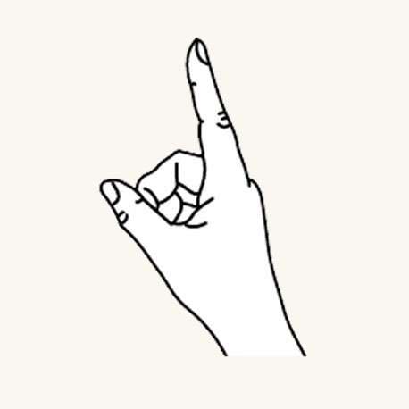
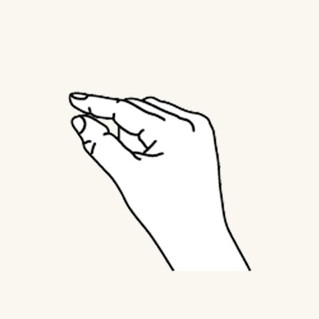

# Gaze and commit

_Gaze and commit_ is a fundamental input model that is closely related with the way we're interacting with our computers using the mouse: _Point & click_.
On this page, we introduce two types of gaze input (head- and eye-gaze) and different types of commit actions. 

Mixed reality headsets can use the position and orientation of the user's head to determine their head direction vector. 
You can think of this as a laser that points straight ahead from directly between the user's eyes. 
This is a fairly coarse approximation of where the user is looking. 
Your application can intersect this ray with virtual or real-world objects, and draw a cursor at that location to let the user know what they are currently targeting.

In addition to head gaze, some mixed reality headsets, such as HoloLens 2, include eye tracking systems that produce an eye-gaze vector. 
This provides a fine-grained measurement of where the user is looking. 
In both cases, the gaze represents an important signal for the user's intent. 
The better the system can interpret and predict the user's intended actions, user satisfaction increases and performance improves.

Below are a few examples for how you as a mixed reality developer can benefit from head- or eye-gaze:
* Your app can intersect gaze with the holograms in your scene to determine where the user's attention is (more precise with eye-gaze).
* Your app can channel gestures and controller presses based on the user's gaze, letting the user seamlessly select, activate, grab, scroll, or otherwise interact with their holograms.
* Your app can let the user place holograms on real-world surfaces by intersecting their gaze ray with the spatial mapping mesh.
* Your app can know when the user is *not* looking in the direction of an important object, which can lead your app to give visual and audio cues to turn towards that object.

 

## Device support

<table>
    <colgroup>
    <col width="25%" />
    <col width="25%" />
    <col width="25%" />
    <col width="25%" />
    </colgroup>
    <tr>
        <td><strong>Input model</strong></td>
        <td><a href="hololens-hardware-details.md"><strong>HoloLens (1st gen)</strong></a></td>
        <td><a href="https://docs.microsoft.com/hololens/hololens2-hardware"><strong>HoloLens 2</strong></td>
        <td><a href="immersive-headset-hardware-details.md"><strong>Immersive headsets</strong></a></td>
    </tr>
     <tr>
        <td>[Head-gaze and commit](gaze-and-commit-head.md)</td>
        <td>✔️ Recommended</td>
        <td>✔️ Recommended (third choice - <a href="interaction-fundamentals.md">See the other options</a>)</td>
        <td>➕ Alternate option</td>
    </tr>
	     <tr>
        <td>[Eye-gaze and commit](gaze-and-commit-eyes.md)</td>
        <td>❌ Not available</td>
        <td>✔️ Recommended (third choice - <a href="interaction-fundamentals.md">See the other options</a>)</td>
        <td>❌ Not available</td>
    </tr>
</table>

## Eye- or head-gaze?
There are several considerations to take into account when faced with the question whether you should use the "eye-gaze and commit" or "head-gaze and commit" input model. 
If you're developing for an immersive headset or for HoloLens (1st gen) then the choice is simple: Head-gaze and commit. 
If you're developing for HoloLens 2, the choice becomes a little harder which is why it's important to understand the advantages and challenges that come with each of them.
We compiled some broad pro's and con's in the table below to contrast head- vs. eye-gaze targeting. 
This is far from complete and we suggest learning more about eye-gaze targeting in mixed reality here:
* [Eye tracking on HoloLens 2](eye-tracking.md): General introduction of our new eye tracking capability on HoloLens 2 including some developer guidance. 
* [Eye-gaze interaction](eye-gaze-interaction.md): Design considerations and recommendations when planning to use eye tracking as an input.

<table>
    <colgroup>
    <col width="25%" />
    <col width="25%" />
    <col width="25%" />
    <col width="25%" />
    </colgroup>
    <tr>
        <td><strong>Eye-gaze targeting</strong></td>
        <td><strong>Head-gaze targeting</strong></td>
    </tr>
     <tr>
        <td>Super fast</td>
		<td>Low effort (barely any body movements necessary)</td>
        <td>Does not require a cursor, but subtle feedback is recommended</td>
		<td>Works great for big targets</td>
		<td>Difficult for very small targets (e.g., tiny buttons or weblinks)</td>
		<td>...</td>
		<td></td>
    </tr>
	<tr>
        <td>More controlled and explicit</td>
		<td>Very reliable</td>
		<td>Requires to show a cursor</td>
		<td>Slower</td>
        <td>Can be fatiguing</td>
		<td>Possible discomfort (e.g., neck strain)</td>
        <td>...</td>
    </tr>
</table>

Whether you use head-gaze or eye-gaze for your gaze-and-commit input model comes with different sets of design constraints, which will be covered separately in the [eye-gaze and commit](eye-gaze-and-commit-eyes.md) and [head-gaze and commit](eye-gaze-and-commit-eyes.md) articles.

 

---

## Commit
After talking about different ways to _gaze_ at a target, let's talk a bit more about the _commit_ part in _gaze and commit_.
After targeting an object or UI element, the user can interact or click on it using a secondary input. 
This is known as the commit step of the input model. 

The following commit methods are supported:
- Air tap hand gesture (i.e., raise your hand in front of you and bring together your index finger and thumb)
- Say _"select"_ or one of the targeted voice commands
- Press a single button on a [HoloLens Clicker](hardware-accessories.md#hololens-clicker)
- Press the 'A' button on an Xbox gamepad
- Press the 'A' button on an Xbox adaptive controller

### Gaze and air tap gesture
Air tap is a tapping gesture with the hand held upright. 
To perform an air tap, raise your index finger to the ready position, then pinch with your thumb, and raise your index finger back up to release. 
On HoloLens (1st gen), air tap is the most common secondary input.

:::row:::
    :::column:::
        
       **Finger in the ready position** 
    :::column-end:::
    :::column:::
        
        **Press finger down to tap or click** 
    :::column-end:::
:::row-end:::

Air tap is also available on HoloLens 2. 
It has been relaxed from the original version. 
Nearly all types of pinches are now supported as long as the hand is upright and holding still. 
This makes it much easier for users to learn and perform the gesture. 
This new air tap replaces the old one through the same API, so existing applications will have the new behavior automatically after recompiling for HoloLens 2.

 

---

### Gaze and "Select" voice command
Voice commanding is one of the primary interaction methods in mixed reality. 
It provides a very powerful hands-free mechanism to control the system. 
There are different types of voice interaction models:

- The generic "Select" command that performs a click actuation or commit as a secondary input.
- Object commands (e.g., "Close" or "Make it bigger") perform and commit to an action as a secondary input.
- Global commands (e.g., "Go to start") don't require a target.
- Conversation user interfaces or entities like Cortana have an AI natural language capability.
- Custom voice commands

To find out more details as well as a comprehensive list of available voice commands and how to use them, check out our [voice commanding](voice-design.md) guidance.

 

---

### Gaze and HoloLens Clicker

:::row:::
    :::column:::
        The HoloLens Clicker is the first peripheral device built specifically for HoloLens. It is included with HoloLens (1st gen) Development Edition. The HoloLens Clicker lets a user click with minimal hand motion, and commit as a secondary input. The HoloLens Clicker connects to HoloLens (1st gen) or HoloLens 2 using Bluetooth Low Energy (BTLE). 
         
        [More information and instructions to pair the device](hardware-accessories.md#pairing-bluetooth-accessories) 
         
        *Image: HoloLens Clicker*
    :::column-end:::
        :::column:::
        
    :::column-end:::
:::row-end:::

 

---

### Gaze and Xbox Wireless Controller

:::row:::
    :::column:::
        The Xbox Wireless Controller performs a click actuation as a secondary input by using the 'A' button. The device is mapped to a default set of actions that help navigate and control the system. If you want to customize the controller, use the Xbox Accessories application to configure your Xbox Wireless Controller. 
         
        [How to pair an Xbox controller with your PC](hardware-accessories.md#pairing-bluetooth-accessories) 
         
        *Image: Xbox Wireless Controller*
    :::column-end:::
        :::column:::
        
    :::column-end:::
:::row-end:::

 

---

### Gaze and Xbox Adaptive Controller
Designed primarily to meet the needs of gamers with limited mobility, the Xbox Adaptive Controller is a unified hub for devices that helps make mixed reality more accessible.

The Xbox Adaptive Controller performs a click actuation as a secondary input by using the 'A' button. The device is mapped to a default set of actions that help navigate and control the system. If you want to customize the controller, use the Xbox Accessories application to configure your Xbox Adaptive Controller.

 
*Xbox Adaptive Controller*

Connect external devices such as switches, buttons, mounts, and joysticks to create a custom controller experience that is uniquely yours. Button, thumbstick, and trigger inputs are controlled with assistive devices connected through 3.5mm jacks and USB ports.

 
*Xbox Adaptive Controller ports*

[Instructions to pair the device](hardware-accessories.md#pairing-bluetooth-accessories)

<a href=https://www.xbox.com/en-US/xbox-one/accessories/controllers/xbox-adaptive-controller>More info available on the Xbox site</a>

 

---

## Cursor

:::row:::
    :::column:::
        For head gaze, most apps should use a [cursor](cursors.md) (or other auditory/visual indication) to give the user confidence in what they're about to interact with. 
        You typically position this cursor in the world where their head gaze ray first intersects an object, which may be a hologram or a real-world surface. 
         
        For eye gaze, we generally recommend *not* to show a cursor, as this can quickly become distracting and annoying for the user. 
        Instead subtly highlight visual targets or use a very faint eye cursor to provide confidence about what the user is about to interact with. For more information, please check out our [design guidance for eye-based input](eye-tracking.md) on HoloLens 2.
    :::column-end:::
        :::column:::
        
       *Image: An example visual cursor to show gaze*
    :::column-end:::
:::row-end:::

 

---

## See also
* [Eye-based interaction] (eye-gaze-interaction.md)
* [Gaze and dwell](gaze-and-dwell.md)
* [Hands - Direct manipulation](direct-manipulation.md)
* [Hands - Gestures](gaze-and-commit.md#composite-gestures)
* [Hands - Point and commit](point-and-commit.md)
* [Instinctual interactions](interaction-fundamentals.md)
* [Voice input](voice-input.md)

