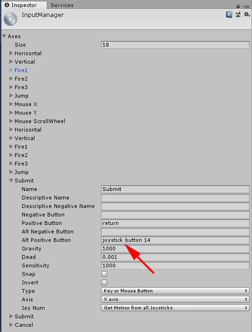
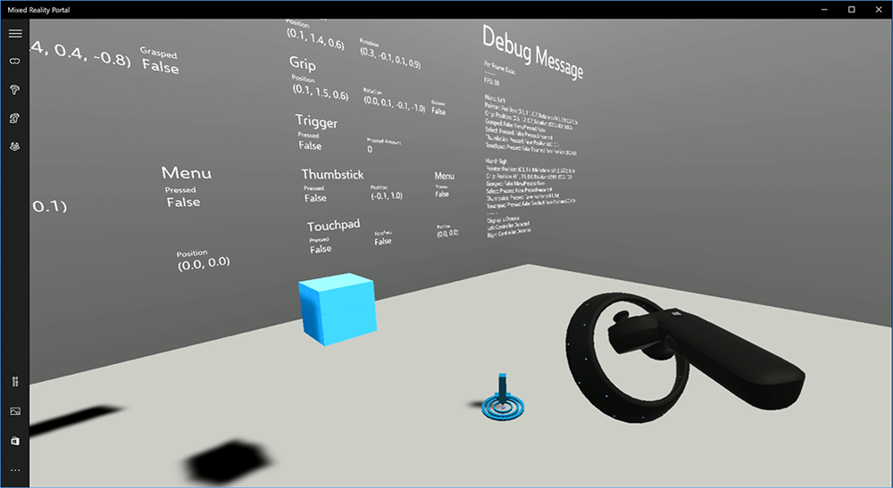
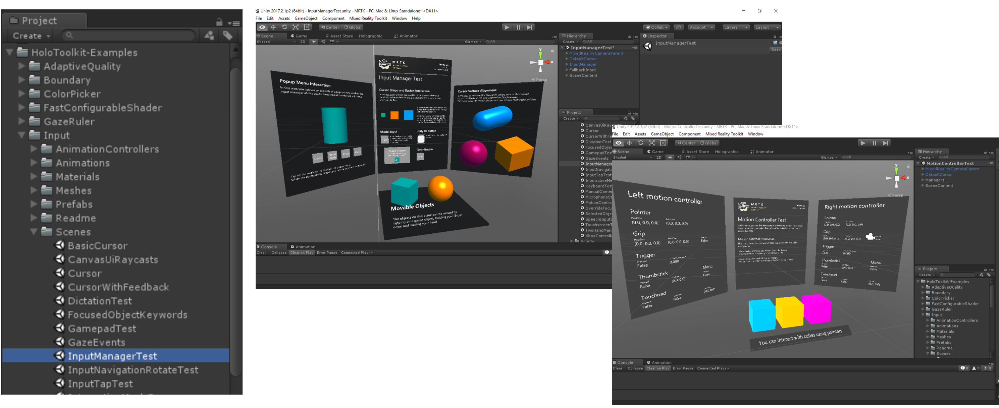
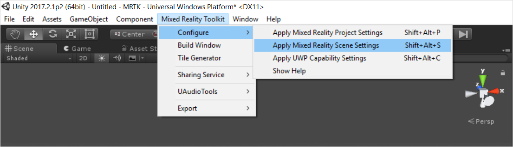
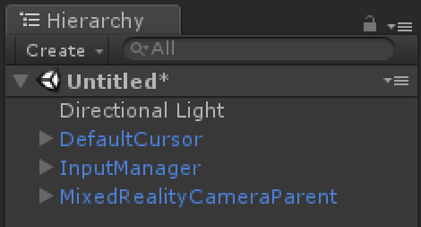
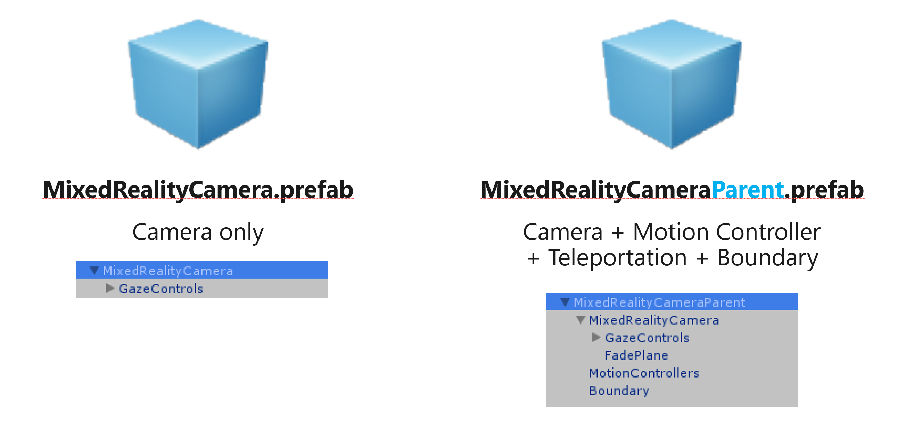
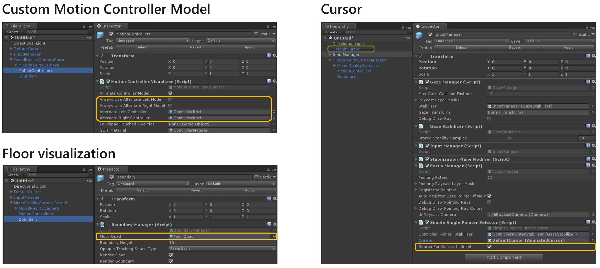

# Gestures and motion controllers in Unity

There are two key ways to take action on your [gaze in Unity](gaze-in-unity.md), [hand gestures](gestures.md) and [motion controllers](motion-controllers.md). You access the data for both sources of spatial input through the same APIs in Unity.

Unity provides two primary ways to access spatial input data for Windows Mixed Reality, the common *Input.GetButton/Input.GetAxis* APIs that work across multiple Unity XR SDKs, and an *InteractionManager/GestureRecognizer* API specific to Windows Mixed Reality that exposes the full set of spatial input data available.

## Unity button/axis mapping table

The button and axis IDs in the table below are supported in Unity's Input Manager for Windows Mixed Reality motion controllers through the *Input.GetButton/GetAxis* APIs, while the "Windows MR-specific" column refers to properties available off of the *InteractionSourceState* type. Each of these APIs are described in detail in the sections below.

The button/axis ID mappings for Windows Mixed Reality generally match the Oculus button/axis IDs.

The button/axis ID mappings for Windows Mixed Reality differ from OpenVR's mappings in two ways:
1. The mapping uses touchpad IDs that are distinct from thumbstick, to support controllers with both thumbsticks and touchpads.
2. The mapping avoids overloading the A and X button IDs for the Menu buttons, to leave those available for physical ABXY buttons.

<table>
<tr>
<th rowspan="2">Input </th><th colspan="2"><a href="gestures-and-motion-controllers-in-unity.md#common-unity-apis-inputgetbuttongetaxis">Common Unity APIs</a><br />(Input.GetButton/GetAxis) </th><th rowspan="2"><a href="gestures-and-motion-controllers-in-unity.md#windows-specific-apis-xr.wsa.input">Windows MR-specific Input API</a><br />(XR.WSA.Input)</th>
</tr><tr>
<th> Left hand </th><th> Right hand</th>
</tr><tr>
<td> Select trigger pressed </td><td> Axis 9 = 1.0 </td><td> Axis 10 = 1.0 </td><td> selectPressed</td>
</tr><tr>
<td> Select trigger analog value </td><td> Axis 9 </td><td> Axis 10 </td><td> selectPressedAmount</td>
</tr><tr>
<td> Select trigger partially pressed </td><td> Button 14 <i>(gamepad compat)</i> </td><td> Button 15 <i>(gamepad compat)</i> </td><td> selectPressedAmount &gt; 0.0</td>
</tr><tr>
<td> Menu button pressed </td><td> Button 6* </td><td> Button 7* </td><td> menuPressed</td>
</tr><tr>
<td> Grip button pressed </td><td> Axis 11 = 1.0 (no analog values)<br />Button 4 <i>(gamepad compat)</i> </td><td> Axis 12 = 1.0 (no analog values)<br />Button 5 <i>(gamepad compat)</i> </td><td> grasped</td>
</tr><tr>
<td> Thumbstick X <i>(left: -1.0, right: 1.0)</i> </td><td> Axis 1 </td><td> Axis 4 </td><td> thumbstickPosition.x</td>
</tr><tr>
<td> Thumbstick Y <i>(top: -1.0, bottom: 1.0)</i> </td><td> Axis 2 </td><td> Axis 5 </td><td> thumbstickPosition.y</td>
</tr><tr>
<td> Thumbstick pressed </td><td> Button 8 </td><td> Button 9 </td><td> thumbstickPressed</td>
</tr><tr>
<td> Touchpad X <i>(left: -1.0, right: 1.0)</i> </td><td> Axis 17* </td><td> Axis 19* </td><td> touchpadPosition.x</td>
</tr><tr>
<td> Touchpad Y <i>(top: -1.0, bottom: 1.0)</i> </td><td> Axis 18* </td><td> Axis 20* </td><td> touchpadPosition.y</td>
</tr><tr>
<td> Touchpad touched </td><td> Button 18* </td><td> Button 19* </td><td> touchpadTouched</td>
</tr><tr>
<td> Touchpad pressed </td><td> Button 16* </td><td> Button 17* </td><td> touchpadPressed</td>
</tr><tr>
<td> 6DoF grip pose or pointer pose </td><td colspan="2"> <i>Grip</i> pose only: <a href="https://docs.unity3d.com/ScriptReference/XR.InputTracking.GetLocalPosition.html">XR.InputTracking.GetLocalPosition</a><br /><a href="https://docs.unity3d.com/ScriptReference/XR.InputTracking.GetLocalRotation.html">XR.InputTracking.GetLocalRotation</a></td><td> Pass <i>Grip</i> or <i>Pointer</i> as an argument: sourceState.sourcePose.TryGetPosition<br />sourceState.sourcePose.TryGetRotation<br /></td>
</tr><tr>
<td> Tracking state </td><td colspan="2"> <i>Position accuracy and source loss risk only available through MR-specific API</i> </td><td> <a href="https://docs.unity3d.com/ScriptReference/XR.WSA.Input.InteractionSourcePose-positionAccuracy.html">sourceState.sourcePose.positionAccuracy</a><br /><a href="https://docs.unity3d.com/ScriptReference/XR.WSA.Input.InteractionSourceProperties-sourceLossRisk.html">sourceState.properties.sourceLossRisk</a></td>
</tr>
</table>

>[!NOTE]
>These button/axis IDs differ from the IDs that Unity uses for OpenVR due to collisions in the mappings used by gamepads, Oculus Touch and OpenVR.

## Grip pose vs. pointing pose

Windows Mixed Reality supports motion controllers in a variety of form factors, with each controller's design differing in its relationship between the user's hand position and the natural "forward" direction that apps should use for pointing when rendering the controller.

To better represent these controllers, there are two kinds of poses you can investigate for each interaction source, the **grip pose** and the **pointer pose**. Both the grip pose and pointer pose coordinates are expressed by all Unity APIs in global Unity world coordinates.

### Grip pose

The **grip pose** represents the location of either the palm of a hand detected by a HoloLens, or the palm holding a motion controller.

On immersive headsets, the grip pose is best used to render **the user's hand** or **an object held in the user's hand**, such as a sword or gun. The grip pose is also used when visualizing a motion controller, as the **renderable model** provided by Windows for a motion controller uses the grip pose as its origin and center of rotation.

The grip pose is defined specifically as follows:
* The **grip position**: The palm centroid when holding the controller naturally, adjusted left or right to center the position within the grip. On the Windows Mixed Reality motion controller, this position generally aligns with the Grasp button.
* The **grip orientation's Right axis**: When you completely open your hand to form a flat 5-finger pose, the ray that is normal to your palm (forward from left palm, backward from right palm)
* The **grip orientation's Forward axis**: When you close your hand partially (as if holding the controller), the ray that points "forward" through the tube formed by your non-thumb fingers.
* The **grip orientation's Up axis**: The Up axis implied by the Right and Forward definitions.

You can access the grip pose through either Unity's cross-vendor input API (*[XR.InputTracking](https://docs.unity3d.com/ScriptReference/XR.InputTracking.html).GetLocalPosition/Rotation*) or through the Windows MR-specific API (*sourceState.sourcePose.TryGetPosition/Rotation*, requesting pose data for the **Grip** node).

### Pointer pose

The **pointer pose** represents the tip of the controller pointing forward.

The system-provided pointer pose is best used to raycast when you are **rendering the controller model itself**. If you are rendering some other virtual object in place of the controller, such as a virtual gun, you should point with a ray that is most natural for that virtual object, such as a ray that travels along the barrel of the app-defined gun model. Because users can see the virtual object and not the physical controller, pointing with the virtual object will likely be more natural for those using your app.

Currently, the pointer pose is available in Unity only through the Windows MR-specific API, *sourceState.sourcePose.TryGetPosition/Rotation*, passing in *InteractionSourceNode.Pointer* as the argument.

## Controller tracking state

Like the headsets, the Windows Mixed Reality motion controller requires no setup of external tracking sensors. Instead, the controllers are tracked by sensors in the headset itself.

If the user moves the controllers out of the headset's field of view, in most cases Windows will continue to infer controller positions and provide them to the app. When the controller has lost visual tracking for long enough, the controller's positions will drop to approximate-accuracy positions.

At this point, the system will body-lock the controller to the user, tracking the user's position as they move around, while still exposing the controller's true orientation using its internal orientation sensors. Many apps that use controllers to point at and activate UI elements can operate normally while in approximate accuracy without the user noticing.

The best way to get a feel for this is to try it yourself. Check out this video with examples of immersive content that works with motion controllers across various tracking states:

<br>

 >[!VIDEO https://www.youtube.com/embed/QK_fOFDHj0g]

### Reasoning about tracking state explicitly

Apps that wish to treat positions differently based on tracking state may go further and inspect properties on the controller's state, such as *SourceLossRisk* and *PositionAccuracy*:

<table>
<tr>
<th> Tracking state </th><th> SourceLossRisk </th><th> PositionAccuracy </th><th> TryGetPosition</th>
</tr><tr>
<td> <b>High accuracy</b> </td><td style="background-color: green; color: white"> &lt; 1.0 </td><td style="background-color: green; color: white"> High </td><td style="background-color: green; color: white"> true</td>
</tr><tr>
<td> <b>High accuracy (at risk of losing)</b> </td><td style="background-color: orange"> == 1.0 </td><td style="background-color: green; color: white"> High </td><td style="background-color: green; color: white"> true</td>
</tr><tr>
<td> <b>Approximate accuracy</b> </td><td style="background-color: orange"> == 1.0 </td><td style="background-color: orange"> Approximate </td><td style="background-color: green; color: white"> true</td>
</tr><tr>
<td> <b>No position</b> </td><td style="background-color: orange"> == 1.0 </td><td style="background-color: orange"> Approximate </td><td style="background-color: orange"> false</td>
</tr>
</table>

These motion controller tracking states are defined as follows:
* **High accuracy:** While the motion controller is within the headset's field of view, it will generally provide high-accuracy positions, based on visual tracking. Note that a moving controller that momentarily leaves the field of view or is momentarily obscured from the headset sensors (e.g. by the user's other hand) will continue to return high-accuracy poses for a short time, based on inertial tracking of the controller itself.
* **High accuracy (at risk of losing):** When the user moves the motion controller past the edge of the headset's field of view, the headset will soon be unable to visually track the controller's position. The app knows when the controller has reached this FOV boundary by seeing the **SourceLossRisk** reach 1.0. At that point, the app may choose to pause controller gestures that require a steady stream of very high-quality poses.
* **Approximate accuracy:** When the controller has lost visual tracking for long enough, the controller's positions will drop to approximate-accuracy positions. At this point, the system will body-lock the controller to the user, tracking the user's position as they move around, while still exposing the controller's true orientation using its internal orientation sensors. Many apps that use controllers to point at and activate UI elements can operate as normal while in approximate accuracy without the user noticing. Apps with heavier input requirements may choose to sense this drop from **High** accuracy to **Approximate** accuracy by inspecting the **PositionAccuracy** property, for example to give the user a more generous hitbox on off-screen targets during this time.
* **No position:** While the controller can operate at approximate accuracy for a long time, sometimes the system knows that even a body-locked position is not meaningful at the moment. For example, a controller that was just turned on may have never been observed visually, or a user may put down a controller that's then picked up by someone else. At those times, the system will not provide any position to the app, and *TryGetPosition* will return false.

## Common Unity APIs (Input.GetButton/GetAxis)

**Namespace:** *UnityEngine*, *UnityEngine.XR*<br>
**Types**: *Input*, *XR.InputTracking*

Unity currently uses its general *Input.GetButton/Input.GetAxis* APIs to expose input for [the Oculus SDK](https://docs.unity3d.com/Manual/OculusControllers.html), [the OpenVR SDK](https://docs.unity3d.com/Manual/OpenVRControllers.html) and Windows Mixed Reality, including hands and motion controllers. If your app uses these APIs for input, it can easily support motion controllers across multiple XR SDKs, including Windows Mixed Reality.

### Getting a logical button's pressed state

To use the general Unity input APIs, you'll typically start by wiring up buttons and axes to logical names in the [Unity Input Manager](https://docs.unity3d.com/Manual/ConventionalGameInput.html), binding a button or axis IDs to each name. You can then write code that refers to that logical button/axis name.

For example, to map the left motion controller's trigger button to the Submit action, go to **Edit > Project Settings > Input** within Unity, and expand the properties of the Submit section under Axes. Change the **Postive Button** or **Alt Positive Button** property to read **joystick button 14**, like this:

<br>
*Unity InputManager*

Your script can then check for the Submit action using *Input.GetButton*:

```cs
if (Input.GetButton("Submit"))
{
  // ...
}
```
You can add more logical buttons by changing the **Size** property under **Axes**.

### Getting a physical button's pressed state directly

You can also access buttons manually by their fully-qualified name, using *Input.GetKey*:

```cs
if (Input.GetKey("joystick button 8"))
{
  // ...
}
```

### Getting a hand or motion controller's pose

You can access the position and rotation of the controller, using *XR.InputTracking*:

```cs
Vector3 leftPosition = InputTracking.GetLocalPosition(XRNode.LeftHand);
Quaternion leftRotation = InputTracking.GetLocalRotation(XRNode.LeftHand);
```

Note that this represents the controller's grip pose (where the user holds the controller), which is useful for rendering a sword or gun in the user's hand, or a model of the controller itself.

Note that the relationship between this grip pose and the pointer pose (where the tip of the controller is pointing) may differ across controllers. At this moment, accessing the controller's pointer pose is only possible through the MR-specific input API, described in the sections below.

## Windows-specific APIs (XR.WSA.Input)

**Namespace:** *UnityEngine.XR.WSA.Input*<br>
**Types**: *InteractionManager*, *InteractionSourceState*, *InteractionSource*, *InteractionSourceProperties*, *InteractionSourceKind*, *InteractionSourceLocation*

To get at more detailed information about Windows Mixed Reality hand input (for HoloLens) and motion controllers, you can choose to use the Windows-specific spatial input APIs under the *UnityEngine.XR.WSA.Input* namespace. This lets you access additional information, such as position accuracy or the source kind, letting you tell hands and controllers apart.

### Polling for the state of hands and motion controllers

You can poll for this frame's state for each interaction source (hand or motion controller) using the *GetCurrentReading* method.

```cs
var interactionSourceStates = InteractionManager.GetCurrentReading();
foreach (var interactionSourceState in interactionSourceStates) {
    // ...
}
```

Each *InteractionSourceState* you get back represents an interaction source at the current moment in time. The *InteractionSourceState* exposes info such as:
* Which [kinds of presses](motion-controllers.md) are occurring (Select/Menu/Grasp/Touchpad/Thumbstick)

   ```cs
   if (interactionSourceState.selectPressed) {
       // ...
   }
   ```
* Other data specific to motion controllers, such the touchpad and/or thumbstick's XY coordinates and touched state

   ```cs
   if (interactionSourceState.touchpadTouched && interactionSourceState.touchpadPosition.x > 0.5) {
       // ...
   }
   ```
   
* The InteractionSourceKind to know if the source is a hand or a motion controller

   ```cs
   if (interactionSourceState.source.kind == InteractionSourceKind.Hand) {
       // ...
   }
   ```

### Polling for forward-predicted rendering poses

* When polling for interaction source data from hands and controllers, the poses you get are forward-predicted poses for the moment in time when this frame's photons will reach the user's eyes.  These forward-predicted poses are best used for **rendering** the controller or a held object each frame.  If you are targeting a given press or release with the controller, that will be most accurate if you use the historical event APIs described below.

   ```cs
   var sourcePose = interactionSourceState.sourcePose;
   Vector3 sourceGripPosition;
   Quaternion sourceGripRotation;
   if ((sourcePose.TryGetPosition(out sourceGripPosition, InteractionSourceNode.Grip)) &&
       (sourcePose.TryGetRotation(out sourceGripRotation, InteractionSourceNode.Grip))) {
       // ...
   }
   ```

* You can also get the forward-predicted head pose for this current frame.  As with the source pose, this is useful for **rendering** a cursor, although targeting a given press or release will be most accurate if you use the historical event APIs described below.

   ```cs
   var headPose = interactionSourceState.headPose;
   var headRay = new Ray(headPose.position, headPose.forward);
   RaycastHit raycastHit;
   if (Physics.Raycast(headPose.position, headPose.forward, out raycastHit, 10)) {
       var cursorPos = raycastHit.point;
       // ...
   }
   ```

### Handling interaction source events

To handle input events as they happen with their accurate historical pose data, you can handle interaction source events instead of polling.

To handle interaction source events:
* Register for a *InteractionManager* input event. For each type of interaction event that you are interested in, you need to subscribe to it.

   ```cs
   InteractionManager.InteractionSourcePressed += InteractionManager_InteractionSourcePressed;
   ```
   
* Handle the event. Once you have subscribed to an interaction event, you will get the callback when appropriate. In the *SourcePressed* example, this will be after the source was detected and before it is released or lost.

   ```cs
   void InteractionManager_InteractionSourceDetected(InteractionSourceDetectedEventArgs args)
       var interactionSourceState = args.state;
       
       // args.state has information about:
          // targeting head ray at the time when the event was triggered
          // whether the source is pressed or not
          // properties like position, velocity, source loss risk
          // source id (which hand id for example) and source kind like hand, voice, controller or other
   }
   ```

### How to stop handling an event

You need to stop handling an event when you are no longer interested in the event or you are destroying the object that has subscribed to the event. To stop handling the event, you unsubscribe from the event.

```cs
InteractionManager.InteractionSourcePressed -= InteractionManager_InteractionSourcePressed;
```

### List of interaction source events

The available interaction source events are:
* *InteractionSourceDetected* (source becomes active)
* *InteractionSourceLost* (becomes inactive)
* *InteractionSourcePressed* (tap, button press, or "Select" uttered)
* *InteractionSourceReleased* (end of a tap, button released, or end of "Select" uttered)
* *InteractionSourceUpdated* (moves or otherwise changes some state)

### Events for historical targeting poses that most accurately match a press or release

The polling APIs described earlier give your app forward-predicted poses.  While those predicted poses are best for rendering the controller or a virtual handheld object, future poses are not optimal for targeting, for two key reasons:
* When the user presses a button on a controller, there can be about 20ms of wireless latency over Bluetooth before the system receives the press.
* Then, if you are using a forward-predicted pose, there would be another 10-20ms of forward prediction applied to target the time when the current frame's photons will reach the user's eyes.

This means that polling gives you a source pose or head pose that is 30-40ms forward from where the user's head and hands actually were back when the press or release happened.  For HoloLens hand input, while there's no wireless transmission delay, there is a similar processing delay to detect the press.

To accurately target based on the user's original intent for a hand or controller press, you should use the historical source pose or head pose from that *InteractionSourcePressed* or *InteractionSourceReleased* input event.

You can target a press or release with historical pose data from the user's head or their controller:
* The head pose at the moment in time when a gesture or controller press occurred, which can be used for **targeting** to determine what the user was [gazing](gaze.md) at:

   ```cs
   void InteractionManager_InteractionSourcePressed(InteractionSourcePressedEventArgs args) {
       var interactionSourceState = args.state;
       var headPose = interactionSourceState.headPose;
       RaycastHit raycastHit;
       if (Physics.Raycast(headPose.position, headPose.forward, out raycastHit, 10)) {
           var targetObject = raycastHit.collider.gameObject;
           // ...
       }
   }
   ```

* The source pose at the moment in time when a motion controller press occurred, which can be used for **targeting** to determine what the user was pointing the controller at.  This will be the state of the controller that experienced the press.  If you are rendering the controller itself, you can request the pointer pose rather than the grip pose, to shoot the targeting ray from what the user will consider the natural tip of that rendered controller:

   ```cs
   void InteractionManager_InteractionSourcePressed(InteractionSourcePressedEventArgs args)
   {
       var interactionSourceState = args.state;
       var sourcePose = interactionSourceState.sourcePose;
       Vector3 sourceGripPosition;
       Quaternion sourceGripRotation;
       if ((sourcePose.TryGetPosition(out sourceGripPosition, InteractionSourceNode.Pointer)) &&
           (sourcePose.TryGetRotation(out sourceGripRotation, InteractionSourceNode.Pointer))) {
           RaycastHit raycastHit;
           if (Physics.Raycast(sourceGripPosition, sourceGripRotation * Vector3.forward, out raycastHit, 10)) {
               var targetObject = raycastHit.collider.gameObject;
               // ...
           }
       }
   }
   ```

### Event handlers example

```cs
using UnityEngine.XR.WSA.Input;

void Start()
{
    InteractionManager.InteractionSourceDetected += InteractionManager_InteractionSourceDetected;
    InteractionManager.InteractionSourceLost += InteractionManager_InteractionSourceLost;
    InteractionManager.InteractionSourcePressed += InteractionManager_InteractionSourcePressed;
    InteractionManager.InteractionSourceReleased += InteractionManager_InteractionSourceReleased;
    InteractionManager.InteractionSourceUpdated += InteractionManager_InteractionSourceUpdated;
}

void OnDestroy()
{
    InteractionManager.InteractionSourceDetected -= InteractionManager_InteractionSourceDetected;
    InteractionManager.InteractionSourceLost -= InteractionManager_InteractionSourceLost;
    InteractionManager.InteractionSourcePressed -= InteractionManager_InteractionSourcePressed;
    InteractionManager.InteractionSourceReleased -= InteractionManager_InteractionSourceReleased;
    InteractionManager.InteractionSourceUpdated -= InteractionManager_InteractionSourceUpdated;
}

void InteractionManager_InteractionSourceDetected(InteractionSourceDetectedEventArgs args)
{
    // Source was detected
    // args.state has the current state of the source including id, position, kind, etc.
}

void InteractionManager_InteractionSourceLost(InteractionSourceLostEventArgs state)
{
    // Source was lost. This will be after a SourceDetected event and no other events for this
    // source id will occur until it is Detected again
    // args.state has the current state of the source including id, position, kind, etc.
}

void InteractionManager_InteractionSourcePressed(InteractionSourcePressedEventArgs state)
{
    // Source was pressed. This will be after the source was detected and before it is 
    // released or lost
    // args.state has the current state of the source including id, position, kind, etc.
}

void InteractionManager_InteractionSourceReleased(InteractionSourceReleasedEventArgs state)
{
    // Source was released. The source would have been detected and pressed before this point. 
    // This event will not fire if the source is lost
    // args.state has the current state of the source including id, position, kind, etc.
}

void InteractionManager_InteractionSourceUpdated(InteractionSourceUpdatedEventArgs state)
{
    // Source was updated. The source would have been detected before this point
    // args.state has the current state of the source including id, position, kind, etc.
}
```

## High-level composite gesture APIs (GestureRecognizer)

**Namespace:** *UnityEngine.XR.WSA.Input*<br>
**Types**: *GestureRecognizer*, *GestureSettings*, *InteractionSourceKind*

Your app can also recognize higher-level composite gestures for spatial input sources, Tap, Hold, Manipulation and Navigation gestures. You can recognize these composite gestures across both [hands](gestures.md) and [motion controllers](motion-controllers.md) using the GestureRecognizer.

Each Gesture event on the GestureRecognizer provides the SourceKind for the input as well as the targeting head ray at the time of the event. Some events provide additional context specific information.

There are only a few steps required to capture gestures using a Gesture Recognizer:
1. Create a new Gesture Recognizer
2. Specify which gestures to watch for
3. Subscribe to events for those gestures
4. Start capturing gestures

### Create a new Gesture Recognizer

To use the *GestureRecognizer*, you must have created a *GestureRecognizer*:

```cs
GestureRecognizer recognizer = new GestureRecognizer();
```

### Specify which gestures to watch for

Specify which gestures you are interested in via *SetRecognizableGestures()*:

```cs
recognizer.SetRecognizableGestures(GestureSettings.Tap | GestureSettings.Hold);
```

### Subscribe to events for those gestures

Subscribe to events for the gestures you are interested in.

```cs
void Start()
{
    recognizer.Tapped += GestureRecognizer_Tapped;
    recognizer.HoldStarted += GestureRecognizer_HoldStarted;
    recognizer.HoldCompleted += GestureRecognizer_HoldCompleted;
    recognizer.HoldCanceled += GestureRecognizer_HoldCanceled;
}
```

>[!NOTE]
>Navigation and Manipulation gestures are mutually exclusive on an instance of a *GestureRecognizer*.

### Start capturing gestures

By default, a *GestureRecognizer* does not monitor input until *StartCapturingGestures()* is called. It is possible that a gesture event may be generated after *StopCapturingGestures()* is called if input was performed before the frame where *StopCapturingGestures()* was processed. The *GestureRecognizer* will remember whether it was on or off during the previou frame in which the gesture actually occurred, and so it is reliable to start and stop gesture monitoring based on this frame's gaze targeting.

```cs
recognizer.StartCapturingGestures();
```

### Stop capturing gestures

To stop gesture recognition:

```cs
recognizer.StopCapturingGestures();
```

### Removing a gesture recognizer

Remember to unsubscribe from subscribed events before destroying a *GestureRecognizer* object.

```cs
void OnDestroy()
{
    recognizer.Tapped -= GestureRecognizer_Tapped;
    recognizer.HoldStarted -= GestureRecognizer_HoldStarted;
    recognizer.HoldCompleted -= GestureRecognizer_HoldCompleted;
    recognizer.HoldCanceled -= GestureRecognizer_HoldCanceled;
}
```

## Rendering the motion controller model in Unity

<br>
*Motion controller model and teleportation*

To render motion controllers in your app that match the physical controllers your users are holding and articulate as various buttons are pressed, you can use the **MotionController prefab** in the [Mixed Reality Toolkit](https://github.com/Microsoft/MixedRealityToolkit-Unity/).  This prefab dynamically loads the correct glTF model at runtime from the system's installed motion controller driver.  It's important to load these models dynamically rather than importing them manually in the editor, so that your app will show physically accurate 3D models for any current and future controllers your users may have.

1. Follow the [Getting Started](https://github.com/Microsoft/MixedRealityToolkit-Unity/blob/master/GettingStarted.md) instructions to download the Mixed Reality Toolkit and add it to your Unity project.
2. If you replaced your camera with the *MixedRealityCameraParent* prefab as part of the Getting Started steps, you're good to go!  That prefab includes motion controller rendering.  Otherwise, add *Assets/HoloToolkit/Input/Prefabs/MotionControllers.prefab* into your scene from the Project pane.  You'll want to add that prefab as a child of whatever parent object you use to move the camera around when the user teleports within your scene, so that the controllers come along with the user.  If your app does not involve teleporting, just add the prefab at the root of your scene.

## Throwing objects

Throwing objects in virtual reality is a harder problem then it may at first seem. As with most physically based interactions, when throwing in game acts in an unexpected way, it is immediately obvious and breaks immersion. We have spent some time thinking deeply about how to represent a physically correct throwing behavior, and have come up with a few guidelines, enabled through updates to our platform, that we would like to share with you.

You can find an example of how we recommend to implement throwing [here](https://github.com/keluecke/MixedRealityToolkit-Unity/blob/master/External/Unitypackages/ThrowingStarter.unitypackage). This sample follows these four guidelines:
* **Use the controller’s *velocity* instead of position**. In the November update to Windows, we introduced a change in behavior when in the [''Approximate'' positional tracking state](motion-controllers.md#controller-tracking-state). When in this state, velocity information about the controller will continue to be reported for as long as we believe it is high accuracy, which is often longer than position remains high accuracy.
* **Incorporate the *angular velocity* of the controller**. This logic is all contained in the `throwing.cs` file in the `GetThrownObjectVelAngVel` static method, within the package linked above:
   1. As angular velocity is conserved, the thrown object must maintain the same angular velocity as it had at the moment of the throw:
   `objectAngularVelocity = throwingControllerAngularVelocity;`
   2. As the center of mass of the thrown object is likely not at the origin of the grip pose, it likely has a different velocity then that of the controller in the frame of reference of the user. The portion of the object’s velocity contributed in this way is the instantaneous tangential velocity of the center of mass of the thrown object around the controller origin. This tangential velocity is the cross product of the angular velocity of the controller with the vector representing the distance between the controller origin and the center of mass of the thrown object.
    
      ```cs
      Vector3 radialVec = thrownObjectCenterOfMass - throwingControllerPos;
      Vector3 tangentialVelocity = Vector3.Cross(throwingControllerAngularVelocity, radialVec);
      ```
   
   3. The total velocity of the thrown object is thus the sum of velocity of the controller and this tangential velocity:
   `objectVelocity = throwingControllerVelocity + tangentialVelocity;`

* **Pay close attention to the *time* at which we apply the velocity**. When a button is pressed, it can take up to 20ms for that event to bubble up through Bluetooth to the operating system. This means that if you poll for a controller state change from pressed to not pressed or vice versa, the controller pose information you get with it will actually be ahead of this change in state. Further, the controller pose presented by our polling API is forward predicted to reflect a likely pose at the time the frame will be displayed which could be more then 20ms in the future. This is good for *rendering* held objects, but compounds our time problem for *targeting* the object as we calculate the trajectory for the moment the user released their throw. Fortunately, with the November update, when a Unity event like *InteractionSourcePressed* or *InteractionSourceReleased* is sent, the state includes the historical pose data from back when the button was actually pressed or released.  To get the most accurate controller rendering and controller targeting during throws, you must correctly use polling and eventing, as appropriate:
   * For **controller rendering** each frame, your app should position the controller's *GameObject* at the forward-predicted controller pose for the current frame’s photon time.  You get this data from Unity polling APIs like *[XR.InputTracking.GetLocalPosition](https://docs.unity3d.com/ScriptReference/XR.InputTracking.GetLocalPosition.html)* or *[XR.WSA.Input.InteractionManager.GetCurrentReading](https://docs.unity3d.com/ScriptReference/XR.WSA.Input.InteractionManager.GetCurrentReading.html)*.
   * For **controller targeting** upon a press or release, your app should raycast and calculate trajectories based on the historical controller pose for that press or release event.  You get this data from Unity eventing APIs, like *[InteractionManager.InteractionSourcePressed](https://docs.unity3d.com/ScriptReference/XR.WSA.Input.InteractionManager.InteractionSourcePressed.html)*.
* **Use the grip pose**. Angular velocity and velocity are reported relative to the grip pose, not pointer pose.

Throwing will continue to improve with future Windows updates, and you can expect to find more information on it here.

## Accelerate development with Mixed Reality Toolkit

There are two example scenes about InputManager and MotionController in Unity. Through these scenes, you can learn how to use MRTK's InputManager and access data handle events from the motion controller buttons.

- [HoloToolkit-Examples/Input/Scenes/InputManagerTest.unity](https://github.com/Microsoft/MixedRealityToolkit-Unity/blob/master/Assets/HoloToolkit-Examples/Input/Scenes/InputManagerTest.unity)
- [HoloToolkit-Examples/Input/Scenes/MotionControllerTest.unity](https://github.com/Microsoft/MixedRealityToolkit-Unity/blob/master/Assets/HoloToolkit-Examples/Input/Scenes/MotionControllerTest.unity)
- [Technical details README File](https://github.com/Microsoft/MixedRealityToolkit-Unity/tree/master/Assets/HoloToolkit/Input)

<br>
*Input example scenes in MRTK*

### Automatic scene setup

When you import [MRTK release Unity packages](https://github.com/Microsoft/MixedRealityToolkit-Unity/releases) or clone the project from the [GitHub repository](https://github.com/Microsoft/MixedRealityToolkit-Unity), you are going to find a new menu 'Mixed Reality Toolkit' in Unity. Under 'Configure' menu, you will see the menu 'Apply Mixed Reality Scene Settings'. When you click it, it removes the default camera and adds foundational components - [InputManager](https://github.com/Microsoft/MixedRealityToolkit-Unity/blob/master/Assets/HoloToolkit/Input/Prefabs/InputManager.prefab), [MixedRealityCameraParent](https://github.com/Microsoft/MixedRealityToolkit-Unity/blob/master/Assets/HoloToolkit/Input/Prefabs/MixedRealityCameraParent.prefab), and [DefaultCursor](https://github.com/Microsoft/MixedRealityToolkit-Unity/blob/master/Assets/HoloToolkit/Input/Prefabs/Cursor/DefaultCursor.prefab).

<br>
*MRTK Menu for scene setup*

<br>
*Automatic scene setup in MRTK*

### MixedRealityCamera prefab

You can also manually add these from the project panel. You can find these components as prefabs. When you search **MixedRealityCamera**, you will be able to see two different camera prefabs. The difference is, **MixedRealityCamera** is the camera only prefab whereas, **MixedRealityCameraParent** includes additional components for the immersive headsets such as Teleportation, Motion Controller and, Boundary.

<br>
*Camera prefabs in MRTK*

**MixedRealtyCamera** supports both HoloLens and immersive headset. It detects the device type and optimizes the properties such as clear flags and Skybox. Below you can find some of the useful properties you can customize such as custom Cursor, Motion Controller models, and Floor.

<br>
*Properties for the Motion controller, Cursor and Floor*

## Follow along with tutorials

Step-by-step tutorials, with more detailed customization examples, are available in the Mixed Reality Academy:

- [MR Input 211: Gesture](holograms-211.md)
- [MR Input 213: Motion controllers](mixed-reality-213.md)

[](https://docs.microsoft.com/windows/mixed-reality/mixed-reality-213)<br>
*MR Input 213 - Motion controller*

## See also

* [Gestures](gestures.md)
* [Motion controllers](motion-controllers.md)
* [UnityEngine.XR.WSA.Input](https://docs.unity3d.com/ScriptReference/XR.WSA.Input.InteractionManager.html)
* [UnityEngine.XR.InputTracking](https://docs.unity3d.com/ScriptReference/XR.InputTracking.html)
* [InteractionInputSource.cs in MixedRealityToolkit-Unity](https://github.com/Microsoft/MixedRealityToolkit-Unity/blob/master/Assets/HoloToolkit/Input/Scripts/InputSources/InteractionInputSource.cs)
