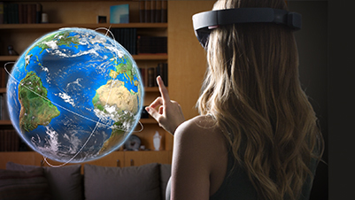
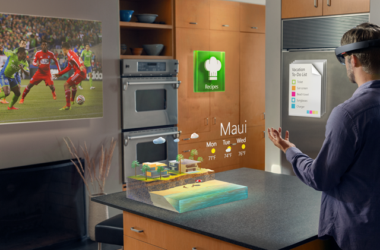
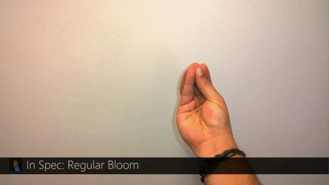

# Gestures

Hand gestures allow users take action in mixed reality. Interaction is built on **gaze** to target and **gesture** or **voice** to act upon whatever element has been targeted. Hand gestures do not provide a precise location in space, but the simplicity of putting on a HoloLens and immediately interacting with content allows users to get to work without any other accessories.

 

>[!VIDEO https://www.youtube.com/embed/kwn9Lh0E_vU]

## Device support

<table>
    <colgroup>
    <col width="25%" />
    <col width="25%" />
    <col width="25%" />
    <col width="25%" />
    </colgroup>
    <tr>
        <td><strong>Feature</strong></td>
        <td><a href="hololens-hardware-details.md"><strong>HoloLens (1st gen)</strong></a></td>
        <td><strong>HoloLens 2</strong></td>
        <td><a href="immersive-headset-hardware-details.md"><strong>Immersive headsets</strong></a></td>
    </tr>
     <tr>
        <td>Gestures</td>
        <td>✔️</td>
        <td>✔️</td>
        <td>❌</td>
    </tr>
     <tr>
        <td>Articulated hands</td>
        <td>❌</td>
        <td>✔️</td>
        <td>❌</td>
    </tr>
</table>

> [!NOTE]
> More guidance specific to HoloLens 2 [coming soon](index.md#news-and-notes).

## Gaze-and-commit

To take actions, hand gestures use [head gaze](gaze.md) as the targeting mechanism. The combination of **Gaze** and the **Air tap** gesture results in a **gaze-and-commit** interaction. An alternative to gaze-and-commit is **point-and-commit**, enabled by [motion controllers](motion-controllers.md). Apps that run on HoloLens only need to support gaze-and-commit since HoloLens does not support motion controllers. Apps that run on both HoloLens and immersive headsets should support both gaze-driven and pointing-driven interactions, to give users choice in what input device they use.

## The two core gestures of HoloLens

HoloLens currently recognizes two core component gestures - **Air tap** and **Bloom**. These two core interactions are the lowest level of spatial input data that a developer can access. They form the foundation for a variety of possible user actions.

### Air tap

Air tap is a tapping gesture with the hand held upright, similar to a mouse click or select. This is used in most HoloLens experiences for the equivalent of a "click" on a UI element after targeting it with [Gaze](gaze.md). It is a universal action that you learn once and then apply across all your apps. Other ways to perform select are by pressing the single button on a [HoloLens Clicker](hardware-accessories.md#hololens-clicker) or by speaking the voice command "Select".

 
*Ready state for Air tap on HoloLens.*

Air tap is a discrete gesture. A selection is either completed or it is not, an action is or is not taken within an experience. It is possible, though not recommended without some specific purpose, to create other discrete gestures from combinations of the main components (e.g. a double-tap gesture to mean something different than a single-tap).

 
*How to perform an Air tap: Raise your index finger to the ready position, press your finger down to tap or select and then back up to release.*

### Bloom

Bloom is the "home" gesture and is reserved for that alone. It is a special system action that is used to go back to the Start Menu. It is equivalent to pressing the Windows key on a keyboard or the Xbox button on an Xbox controller. The user can use either hand.

To do the bloom gesture on HoloLens, hold out your hand, palm up, with your fingertips together. Then open your hand. Note, you can also always return to Start by saying "Hey Cortana, Go Home". Apps cannot react specifically to a home action, as these are handled by the system.

 
*How to perform the bloom gesture on HoloLens.*

## Composite gestures

Apps can recognize more than just individual taps. By combining tap, hold and release with the movement of the hand, more complex composite gestures can be performed. These composite or high-level gestures build on the low-level spatial input data (from Air tap and Bloom) that developers have access to.

<table>
<tr>
<th> Composite gesture</th><th> How to apply</th>
</tr><tr>
<td>Air tap</td><td>The Air tap gesture (as well as the other gestures below) reacts only to a specific tap. To detect other taps, such as Menu or Grasp, your app must directly use the lower-level interactions described in two key component gestures section above.</td>
</tr><tr>
<td>Tap and hold</td><td>
Hold is simply maintaining the downward finger position of the air tap. The combination of air tap and hold allows for a variety of more complex &quot;click and drag&quot; interactions when combined with arm movement such as picking up an object instead of activating it or &quot;mousedown&quot; secondary interactions such as showing a context menu.

Caution should be used when designing for this gesture however, as users can be prone to relaxing their hand postures during the course of any extended gesture.
</td>
</tr><tr>
<td>Manipulation</td><td>
Manipulation gestures can be used to move, resize or rotate a hologram when you want the hologram to react 1:1 to the user&#39;s hand movements. One use for such 1:1 movements is to let the user draw or paint in the world.

The initial targeting for a manipulation gesture should be done by gaze or pointing. Once the tap and hold starts, any manipulation of the object is then handled by hand movements, freeing the user to look around while they manipulate.
</td>
</tr><tr>
<td>Navigation</td><td>
Navigation gestures operate like a virtual joystick, and can be used to navigate UI widgets, such as radial menus. You tap and hold to start the gesture and then move your hand within a normalized 3D cube, centered around the initial press. You can move your hand along the X, Y or Z axis from a value of -1 to 1, with 0 being the starting point.

Navigation can be used to build velocity-based continuous scrolling or zooming gestures, similar to scrolling a 2D UI by clicking the middle mouse button and then moving the mouse up and down.

Navigation with rails refers to the ability of recognizing movements in certain axis until certain threshold is reached on that axis. This is only useful, when movement in more than one axis is enabled in an application by the developer, e.g. if an application is configured to recognize navigation gestures across X, Y axis but also specified X axis with rails. In this case system will recognize hand movements across X axis as long as they remain within an imaginary rails (guide) on X axis, if hand movement also occurs Y axis.

Within 2D apps, users can use vertical navigation gestures to scroll, zoom, or drag inside the app. This injects virtual finger touches to the app to simulate touch gestures of the same type. Users can select which of these actions take place by toggling between the tools on the bar above the app, either by selecting the button or saying &#39;&lt;Scroll/Drag/Zoom&gt; Tool&#39;.
</td>
</tr>
</table>

### Gesture recognizers

One benefit of using gesture recognition is that you can configure a gesture recognizer just for the gestures the currently targeted hologram can accept. The platform will do only the disambiguation necessary to distinguish those particular supported gestures. That way, a hologram that just supports air tap can accept any length of time between press and release, while a hologram that supports both tap and hold can promote the tap to a hold after the hold time threshold.

## Hand recognition

HoloLens recognizes hand gestures by tracking the position of either or both hands that are visible to the device. HoloLens sees hands when they are in either the **ready state** (back of the hand facing you with index finger up) or the **pressed state** (back of the hand facing you with the index finger down). When hands are in other poses, the HoloLens will ignore them.

For each hand that HoloLens detects, you can access its position (without orientation) and its pressed state. As the hand nears the edge of the gesture frame, you're also provided with a direction vector, which you can show to the user so they know how to move their hand to get it back where HoloLens can see it.

## Gesture frame

For gestures on HoloLens, the hand must be within a “gesture frame”, in a range that the gesture-sensing cameras can see appropriately (very roughly from nose to waist, and between the shoulders). Users need to be trained on this area of recognition both for success of action and for their own comfort (many users will initially assume that the gesture frame must be within their view through HoloLens, and hold their arms up uncomfortably in order to interact). When using the HoloLens Clicker, your hands do not need to be within the gesture frame.

In the case of continuous gestures in particular, there is some risk of users moving their hands outside of the gesture frame while in mid-gesture (while moving some holographic object, for example), and losing their intended outcome.

There are three things that you should consider:
* User education on the gesture frame's existence and approximate boundaries (this is taught during HoloLens setup).
* Notifying users when their gestures are nearing/breaking the gesture frame boundaries within an application, to the degree that a lost gesture will lead to undesired outcomes. Research has shown the key qualities of such a notification system, and the HoloLens shell provides a good example of this type of notification (visual, on the central cursor, indicating the direction in which boundary crossing is taking place).
* Consequences of breaking the gesture frame boundaries should be minimized. In general, this means that the outcome of a gesture should be stopped at the boundary, but not reversed. For example, if a user is moving some holographic object across a room, movement should stop when the gesture frame is breached, but **not** be returned to the starting point. The user may experience some frustration then, but may more quickly understand the boundaries, and not have to restart their full intended actions each time.

## See also
* [Head-gaze and dwell](gaze-and-dwell.md)
* [Voice design](voice-design.md)
* [MR Input 211: Gesture](holograms-211.md)
* [Gestures and motion controllers in Unity](gestures-and-motion-controllers-in-unity.md)
* [Hands and motion controllers in DirectX](hands-and-motion-controllers-in-directx.md)
* [Motion controllers](motion-controllers.md)
