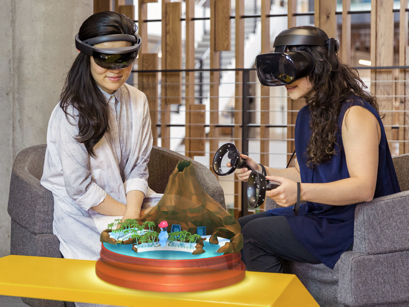
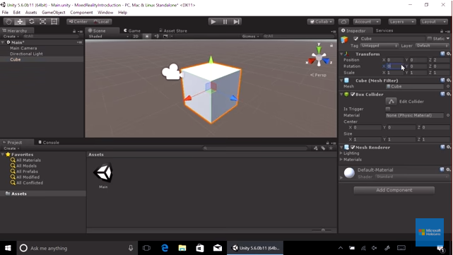

# Get started

Welcome to the world of mixed reality development! If you're new to MR, this guide will be your hub to get up and running as quickly as possible. We'll help you get your PC set up for development, get your device(s) ready, and install tools that will speed up the MR development process. 

## Intro to mixed reality

You may have some questions about what we mean by "mixed reality" and how it relates to augmented reality (AR) and virtual reality (VR). In short, mixed reality is the blending of the physical world with the digital world, so it's a spectrum that covers everything from augmented reality, where digital content is placed in the real world, to virtual reality, where your real world is almost entirely replaced by the digital. 

 
*Mixed reality apps can support both HoloLens and immersive (VR) headsets*

We created Windows Mixed Reality as a single development platform and set of tools that can cover the MR spectrum, and we currently support two device types that cover the same spectrum: [Microsoft HoloLens](https://www.microsoft.com/hololens), the world's first self-contained holographic headset, and [Windows Mixed Reality immersive headsets and motion controllers](https://www.microsoft.com/windows/windows-mixed-reality), which connect to a PC for powerful virtual reality experiences. You can check out our What is [mixed reality?]( article for a more thorough answer if you're interested.

## Choose your development path

The easiest way to develop a mixed reality app is using [Unity](https://unity3d.com), a powerful and popular middleware tool often used for game development. If you want to use a custom engine, you can also [build against DirectX](directx-development-overview.md), but most MR developers use Unity for their games and apps. With Unity you'll be able to create a mixed reality app that targets HoloLens, immersive (VR) headsets, or both!

## Prepare your PC and devices for development

Whether you're building a mixed reality app that targets HoloLens, immersive (VR) headsets, or both, you'll be using a common set of tools and APIs. You'll also want to make sure your PC is powerful enough for the development you'll be doing. 

>[!NOTE]
>You can find our recommendations on development PC specs, supported versions of each software tool, and relevant settings or configuration notes for each in the [Install the tools](install-the-tools.md) article. Please review that article before installing the tools below.

Tools to install:
* [Unity](https://store.unity.com/download)
* [Visual Studio (with Windows 10 SDK)](https://developer.microsoft.com/windows/downloads)
* [Mixed Reality Toolkit for Unity](https://github.com/Microsoft/MixedRealityToolkit-Unity/blob/htk_release/GettingStarted.md)

You'll also want to [put your target device into Developer mode and configure Visual Studio for deploying apps to the target device](using-visual-studio.md).

### A note about the Mixed Reality Toolkit for Unity

 

***YOYO PLEASE FLESH THIS OUT AND TELL EVERYONE WHY MRTK-UNITY IS SO AMAZING AND ALL THE COOL THINGS IT HAS INSIDE :)***

The Mixed Reality Toolkit is a collection of scripts and components intended to accelerate development of applications targeting Microsoft HoloLens and Windows Mixed Reality headsets. The project is aimed at reducing barriers to entry to create mixed reality applications and contribute back to the community as we all grow.

## Start your first MR project

Now that your PC and device(s) are set up, you're ready to create your first mixed reality project in Unity. Follow along with our first MR academy course, [MR Basics 100: Getting started with Unity](holograms-100.md), and by the end you'll have a cube up and running in a mixed reality headset.

 
*Your first mixed reality project in Unity - hello world!*

## Learn more and get help

Now that you've successfully created your first MR project, you're probably hungry for more! Here are some resources that should help:
* [Mixed reality developer documentation](mixed-reality.md) - you're already here, but there's so much more to check out, including technical documentation, design guidance, sample projects, and case studies.
* [Mixed reality tutorials](tutorials.md) - follow along with tutorials covering everything from setting up projects, to implementing core MR building blocks, to integrating Azure cloud services into your MR app.
* [Learn Unity](https://unity3d.com/learn) - Unity's website offers tutorials, projects, and live training sessions for creators at every stage of learning.

You can also get help from these great community resources:
* [Mixed reality developer forums](https://forums.hololens.com/) - the official forum for mixed reality developers to ask and answer questions, as well as read MR development news straight from Microsoft.
* [HoloDevelopers Slack channel](https://holodevelopersslack.azurewebsites.net/) - the most robust and resourceful external mixed reality-specific developer channel; the devs here are knowledgeable and helpful.
* [Unity forums](https://forum.unity3d.com/) - Unity's official forums.
