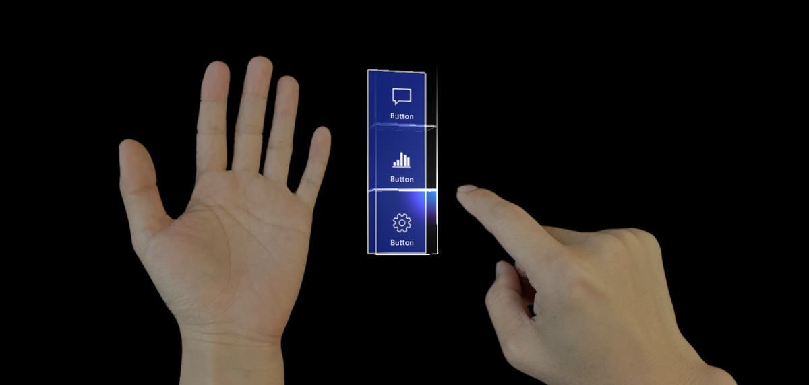
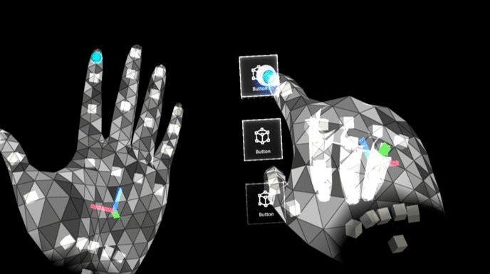

# Hand menu

Hand menus allow users to quickly bring up hand-attached UI for frequently used functions. 

Below are the best practices we have found for hand menus. You can also find an example scene demonstrating the hand menu in [MRTK](https://github.com/microsoft/MixedRealityToolkit-Unity/blob/mrtk_release/Assets/MixedRealityToolkit.Examples/Demos/HandTracking/Scenes/HandBasedMenuExample.unity).

## Behavior best practices
**A. Keep the number of buttons small:** 
Due to the close distance between a hand-locked menu and the eyes and also the user's tendency to focus on a relatively small visual area at any time (the attentional cone of vision is roughly 10 degrees), we recommend keeping the number of buttons small. Based on our exploration, one column with three buttons work well by keeping all the content within the field of view (FOV) even when users move their hands to the center of FOV. 

**B. Utilize hand menu for quick action:** 
Raising an arm and maintaining the position could easily cause arm fatigue. Use a hand-locked method for the menu requiring short interaction. If your menu is complex and requires extended interaction times, consider using world-lock or body-lock instead. 

**C. Button / Panel angle:**
Menus should billboard towards the opposite shoulder and middle of the head: This allows a natural hand move to interact with the menu with the opposite hand and avoids any awkward or uncomfortable hand positions when touching buttons. 

**D. Consider supporting one-handed or hands-free operation:**
Do not assume both of users' hands are always available. Consider a wide range of contexts when one or both hands are not available, and make sure you design accounts for those situations. To support a one-handed hand menu, you can try transitioning menu placement from hand-lock to world-lock when the hand flips (goes palm down). For hands-free scenarios, consider using a voice command to invoke the hand menu buttons.

**E. Two-step invocation:**
If you use just palm-up as an event to trigger hand menu, it may accidentally appear when you don't need it (false-positive), because people move their hands a lot both intentionally (for communication and object manipulation) and unintentionally. If you experience many false-positives in your app, consider adding additional step besides palm-up event to invoke hand menu such as fully opened fingers.

**F. Avoid adding buttons near the wrist (system home button):**
If hand menu buttons are placed too close to the home button, it may get accidentally triggered while interacting with hand menu.

**G. Test, test, test:**
People have different bodies, different positions of comfort and discomfort, etc.
Complex menu placement – anything that requires extended interaction times should be more persistent. Suggestions include body-locking or world-locking.

## Hand menu placement best practices

In human anatomy, the ulnar nerve is a nerve that runs near the ulna bone. The ulna is a long bone found in the forearm that stretches from the elbow to the smallest finger.

Below are 2 recommended placements based on our explorations:

**A. Ulnar inside palm:** This position is reliable because the hands do not overlap each other. This is critical for accurate hand detection and tracking.

 

**B. Ulnar above hand:**
The location is comfortable for users because it is not necessary to raise the user's arm too much to interact with the hand menu. We recommend placing menus 13cm above palm and align buttons inside Ulnar palm.

For technical reasons we recommend this location with one required implementation - the developer will need to freeze menus once a user gets close with their opposite hand to interact with the menu. This will avoid jitteriness from overlapping hands and also allows for fast targeting of buttons.

HoloLens 2 cameras identify hands accurately when they are separate from each other. Any overlapping hands can cause hand menus move away from the anchor location.

[Read more about the optimal button size](interactable-object.md)

## Menu positions that are not recommended
We have done user research with different menus layouts and locations, the following menu locations are **NOT recommended**, find the cons of each study below:

**Above the arm**
1. Difficult to maintain good hand tracking
2. Causes user fatigue due to unnatural position

 

**Above fingers**
1. Hand fatigue due to holding hand for long time
2. Hand tracking issues on index and middle finger

 

**Above-center palm**
1. Hand tracking issues due to overlapping hands
2. Hand fatigue due to holding hands for long time in order to interact with menus

 

**Top fingertip**
1. Hand tracking issues
2. Hand fatigue holding hand above normal posture
3. Issues pressing buttons with other fingers by accident due to limited space between fingers

 

**Back of the arm**
1. Can trigger home button by accident
2. Not a natural or comfortable position for users

## See also

* [Interactable object](interactable-object.md)
* [Direct manipulation with hands](direct-manipulation.md)
* [Hands and motion controllers](hands-and-tools.md)
