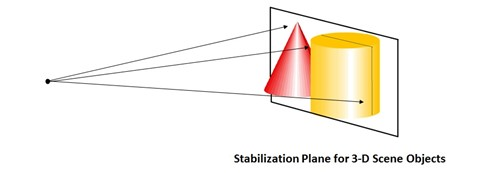

# Hologram stability

To achieve stable holograms, HoloLens has a built-in image stabilization pipeline. The stabilization pipeline works automatically in the background, so there are no extra steps required to enable it. However, developers should exercise techniques that improve hologram stability and avoid scenarios that reduce stability.

## Hologram quality terminology

The quality of holograms is a result of good environment and good app development. Apps that hit a constant 60 frames-per-second in an environment where HoloLens can track the surroundings will ensure the hologram and the matching coordinate system are in sync. From a user's perspective, holograms that are meant to be stationary will not move relative to the environment.

When environment issues, inconsistent or low rendering rates, or other app problems show up, the following terminology is helpful in identifying the problem.
* **Accuracy.** Once the hologram is world-locked and placed in the real world, it should stay where it was placed, relative to the surrounding environment, independent of user motion or small and sparse environment changes. If a hologram later appears in an unexpected location, it is an *accuracy* problem. Such scenarios can happen if two distinct rooms look identical.
* **Jitter.** Users observe this as high frequency shaking of a hologram. This can happen when tracking of the environment degrades. For users, the solution is running [sensor tuning](sensor-tuning.md).
* **Judder.** Low rendering frequencies result in uneven motion and double images of holograms. This is especially noticeable in holograms with motion. Developers need to maintain a [constant 60 FPS](hologram-stability.md#frame-rate).
* **Drift.** Users see this as hologram appears to move away from where it was originally placed. This happens when holograms are placed far away from [spatial anchors](spatial-anchors.md), particularly in parts of the environment that have not been fully mapped. Creating holograms close to spatial anchors lowers the likelihood of drift.
* **Jumpiness.** When a hologram "pops" or "jumps" away from it's location occasionally. This can occur as tracking adjusts holograms to match updated understanding of your environment.
* **Swim.** When a hologram appears to sway corresponding to the motion of the user's head. This occurs when holograms are not on the [stabilization plane](hologram-stability.md#stabilization-plane), and if the HoloLens is not [calibrated](calibration.md) for the current user. The user can rerun the [calibration](calibration.md) application to fix this. Developers can update the stabilization plane to further enhance stability.
* **Color separation.** The displays in HoloLens are a color sequential display, which flash color channels of red-green-blue-green at 60Hz (individual color fields are shown at 240Hz). Whenever a user tracks a moving hologram with his or her eyes, that hologram's leading and trailing edges separate in their constituent colors, producing a rainbow effect. The degree of separation is dependent upon the speed of the hologram. In some rarer cases, moving ones head rapidly while looking at a stationary hologram can also result in a rainbow effect. This is called *[color separation](hologram-stability.md#color-separation)*.

## Frame rate

Frame rate is the first pillar of hologram stability. For holograms to appear stable in the world, each image presented to the user must have the holograms drawn in the correct spot. The displays on HoloLens refresh 240 times a second, showing four separate color fields for each newly rendered image, resulting in a user experience of 60 FPS (frames per second). To provide the best experience possible, application developers must maintain 60 FPS, which translates to consistently providing a new image to the operating system every 16 milliseconds.

**60 FPS**
 To draw holograms to look like they're sitting in the real world, HoloLens needs to render images from the user's position. Since image rendering takes time, HoloLens predicts where a user's head will be when the images are shown in the displays. This prediction algorithm is an approximation. HoloLens has hardware that adjusts the rendered image to account for the discrepancy between the predicted head position and the actual head position. This makes the image the user sees appear as if it was rendered from the correct location, and holograms feel stable. The image updates work best with small changes, and it can't completely fix certain things in the rendered image like motion-parallax.

By rendering at 60 FPS, you are doing three things to help make stable holograms:
1. Minimizing the overall latency between rendering an image and that image being seen by the user. In an engine with a game thread and a render thread running in lockstep, running at 30FPS can add 33.3ms of extra latency. By reducing latency, this decreases prediction error, and increases hologram stability.
2. Making it so every image reaching the user's eyes have a consistent amount of latency. If you render at 30fps, the display still displays images at 60 FPS. This means the same image will be displayed twice in a row. The second frame will have 16.6ms more latency than the first frame and will have to correct a more pronounced amount of error. This inconsistency in error magnitude can cause unwanted 60hz judder.
3. Reducing the appearance of judder, which is characterized by uneven motion and double images. Faster hologram motion and lower render rates are associated with more pronounced judder. Therefore, striving to maintain 60 FPS at all times will help avoid judder for a given moving hologram.

**Frame-rate consistency**
 Frame rate consistency is as important as a high frames-per-second. Occasionally dropped frames are inevitable for any content-rich application, and the HoloLens implements some sophisticated algorithms to recover from occasional glitches. However, a constantly fluctuating framerate is a lot more noticeable to a user than running consistently at lower frame rates. For example, an application that renders smoothly for 5 frames (60 FPS for the duration of these 5 frames) and then drops every other frame for the next 10 frames (30 FPS for the duration of these 10 frames) will appear more unstable than an application that consistently renders at 30 FPS.

On a related note, the operating system will throttle applications down to 30 FPS when [mixed reality capture](mixed-reality-capture.md) is running.

**Performance analysis**
 There are a variety of tools that can be used to benchmark your application frame rate such as:
* GPUView
* Visual Studio Graphics Debugger
* Profilers built into 3D engines such as Unity

## Hologram render distances

>[!VIDEO https://www.youtube.com/embed/-606oZKLa_s]

The human visual system integrates multiple distance-dependent signals when it fixates and focuses on an object.
* [Accommodation](https://en.wikipedia.org/wiki/Accommodation_%28eye%29) - The focus of an individual eye.
* [Convergence](https://en.wikipedia.org/wiki/Convergence_(eye)) - Two eyes moving inward or outward to center on an object.
* [Binocular vision](https://en.wikipedia.org/wiki/Stereopsis) - Disparities between the left- and right-eye images that are dependent on an object's distance away from your fixation point.
* Shading, relative angular size, and other monocular (single eye) cues.

Convergence and accommodation are unique because they are extra-retinal cues related to how the eyes change to perceive objects at different distances. In natural viewing, convergence and accommodation are linked. When the eyes view something near (e.g. your nose) the eyes cross and accommodate to a near point. When the eyes view something at infinity the eyes become parallel and the eye accommodates to infinity. Users wearing HoloLens will always accommodate to 2.0m to maintain a clear image because the HoloLens displays are fixed at an optical distance approximately 2.0m away from the user. App developers control where users' eyes converge by placing content and holograms at various depths. When users accommodate and converge to different distances, the natural link between the two cues are broken and this can lead to visual discomfort or fatigue, especially when the magnitude of the conflict is large. Discomfort from the vergence-accommodation conflict can be avoided or minimized by keeping content that users converge to as close to 2.0m as possible (i.e. in a scene with lots of depth place the areas of interest near 2.0m when possible). When content cannot be placed near 2.0m discomfort from the vergence-accomodation conflict is greatest when user’s gaze back and forth between different distances. In other words, it is much more comfortable to look at a stationary hologram that stays 50cm away than to look at a hologram 50cm away that moves toward and away from you over time.

Placing content at 2.0m is also advantageous because the two displays are designed to fully overlap at this distance. For images placed off this plane, as they move off the side of the holographic frame they will disappear from one display while still being visible on the other. This binocular rivalry can be disruptive to the depth perception of the hologram.

**Optimal distance for placing holograms from the user**


**Clip Planes**
 For maximum comfort we recommend clipping render distance at 85cm with fadeout of content starting at 1m. In applications where holograms and users are both stationary holograms can be viewed comfortably as near as 50cm. In those cases, applications should place a clip plane no closer than 30cm and fade out should start at least 10cm away from the clip plane. Whenever content is closer than 85cm it is important to ensure that users do not frequently move closer or farther from holograms or that holograms do not frequently move closer to or farther from the user as these situations are most likely to cause discomfort from the vergence-accommodation conflict. Content should be designed to minimize the need for interaction closer than 85cm from the user, but when content must be rendered closer than 85cm a good rule of thumb for developers is to design scenarios where users and/or holograms do not move in depth more than 25% of the time.

**Best practices**
 When holograms cannot be placed at 2m and conflicts between convergence and accommodation cannot be avoided, the optimal zone for hologram placement is between 1.25m and 5m. In every case, designers should structure content to encourage users to interact 1+ m away (e.g. adjust content size and default placement parameters).

## Stabilization plane
> [!NOTE]
> For desktop immersive headsets, setting a stabilization plane is usually counter-productive, as it offers less visual quality than providing your app's depth buffer to the system to enable per-pixel depth-based reprojection. Unless running on a HoloLens, you should generally avoid setting the stabilization plane.

HoloLens performs a sophisticated hardware-assisted holographic stabilization technique. This is largely automatic and has to do with motion and change of the point of view (CameraPose) as the scene animates and the user moves their head. A single plane, called the stabilization plane, is chosen to maximize this stabilization. While all holograms in the scene receive some stabilization, holograms in the stabilization plane receive the maximum hardware stabilization.



The device will automatically attempt to choose this plane, but the application can assist in this process by selecting the focus point in the scene. Unity apps running on a HoloLens should choose the best focus point based on your scene and pass this into [SetFocusPoint()](focus-point-in-unity.md). An example of setting the focus point in DirectX is included in the default spinning cube template.

Note that when your Unity app runs on an immersive headset connected to a desktop PC, Unity will submit your depth buffer to Windows to enable per-pixel reprojection, which will usually provide even better image quality without explicit work by the app. If you provide a Focus Point, that will override the per-pixel reprojection, so you should only do so when your app is running on a HoloLens.


```cs
// SetFocusPoint informs the system about a specific point in your scene to
// prioritize for image stabilization. The focus point is set independently
// for each holographic camera.
// You should set the focus point near the content that the user is looking at.
// In this example, we put the focus point at the center of the sample hologram,
// since that is the only hologram available for the user to focus on.
// You can also set the relative velocity and facing of that content; the sample
// hologram is at a fixed point so we only need to indicate its position.
renderingParameters.SetFocusPoint(
    currentCoordinateSystem,
    spinningCubeRenderer.Position
    );
```

Placement of the focus point largely depends on the hologram is looking at. The app has the gaze vector for reference and the app designer knows what content they want the user to observe.

The single most important thing a developer can do to stabilize holograms is to render at 60 FPS. Dropping below 60 FPS will dramatically reduce hologram stability, regardless of the stabilization plane optimization.

**Best practices**
 There is no universal way to set up the stabilization plane and it is app-specific, so the main recommendation is to experiment and see what works best for your scenarios. However, try to align the stabilization plane with as much content as possible because all the content on this plane is perfectly stabilized.

For example:
* If you have only planar content (reading app, video playback app), align the stabilization plane with the plane that has your content.
* If there are 3 small spheres that are world-locked, make the stabilization plane "cut" though the centers of all the spheres that are currently in the user's view.
* If your scene has content at substantially different depths, favor further objects.
* Make sure to adjust the stabilization point every frame to coincide with the hologram the user is looking at

**Things to Avoid**
 The stabilization plane is a great tool to achieve stable holograms, but if misused it can result in severe image instability.
* Don't "fire and forget", since you can end up with the stabilization plane behind the user or attached to an object that is no longer in the user's view. Ensure the stabilization plane normal is set opposite camera-forward (e.g. -camera.forward)
* Don't rapidly change the stabilization plane back and forth between extremes
* Don't leave the stabilization plane set to a fixed distance/orientation
* Don't let the stabilization plane cut through the user
* Don't set the focus point when running on a desktop PC rather than a HoloLens, and instead rely on per-pixel depth-based reprojection.

## Color separation 

Due to the nature of HoloLens displays, an artifact called "color-separation" can sometimes be perceived. It manifests as the image separating into individual base colors - red, green and blue. The artifact can be especially visible when displaying white objects, since they have large amounts of red, green and blue. It is most pronounced when a user visually tracks a hologram that is moving across the holographic frame at high speed. Another way the artifact can manifest is warping/deformation of objects. If an object has high contrast and/or pure colors (red, green, blue), color-separation will be perceived as warping of different parts of the object.

**Example of what the color separation of a head-locked white round cursor could look like as a user rotates their head to the side:**


Though it's difficult to completely avoid color separation, there are several techniques available to mitigate it.

**Color-separation can be seen on:**
* Objects that are moving quickly, including head-locked objects such as the [cursor](cursors.md).
* Objects that are substantially far from the [stabilization plane](hologram-stability.md#stabilization-plane).

**To attenuate the effects of color-separation:**
* Make the object lag the user's gaze. It should appear as if it has some inertia and is attached to the gaze "on springs". This slows the cursor (reducing separation distance) and puts it behind the user's likely gaze point. So long as it quickly catches up when the user stops shifting their gaze it feels quite natural.
* If you do want to move a hologram, try to keep it's movement speed below 5 degrees/second if you anticipate that the user will follow it with their eyes.
* Use *light* instead of *geometry* for the cursor. A source of virtual illumination attached to the gaze will be perceived as an interactive pointer but will not cause color-separation.
* Adjust the stabilization plane to match the holograms the user is gazing at.
* Make the object red, green or blue.
* Switch to a blurred version of the content. For example, a round white cursor could be change to a slightly blurred line oriented in the direction of motion.

As before, rendering at 60 FPS and setting the stabilization plane are the most important techniques for hologram stability. If facing noticeable color separation, first make sure the frame rate meets expectations.

## See also
* [Understanding Performance for Mixed Reality](understanding-performance-for-mixed-reality.md)
* [Color, light and materials](color,-light-and-materials.md)
* [Instinctual interactions](interaction-fundamentals.md)