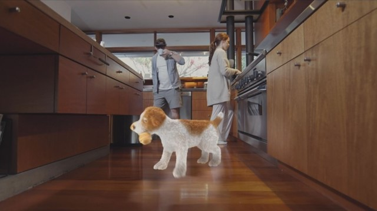
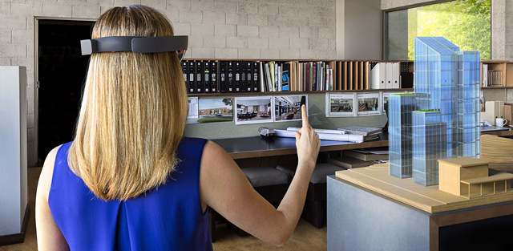
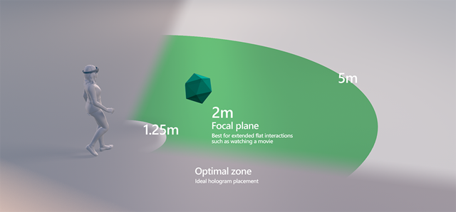
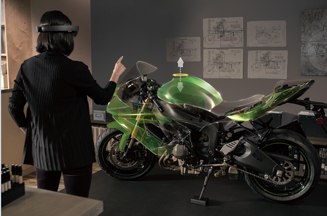
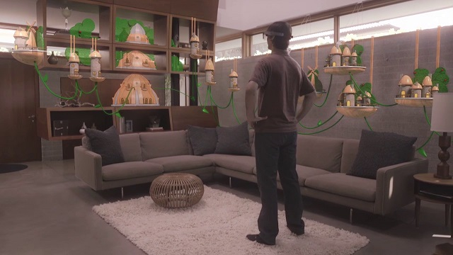

# What is a hologram?

HoloLens lets you create **holograms**, objects made of light and sound that appear in the world around you, just as if they were real objects. Holograms respond to your [gaze](gaze.md), [gestures](gestures.md) and [voice commands](voice-input.md), and can interact with [real-world surfaces](spatial-mapping.md) around you. With holograms, you can create digital objects that are part of your world.

 

>[!VIDEO https://www.youtube.com/embed/MVXH5V8MVQo]

## Device support

<table>
    <colgroup>
    <col width="25%" />
    <col width="25%" />
    <col width="25%" />
    <col width="25%" />
    </colgroup>
    <tr>
        <td><strong>Feature</strong></td>
        <td><a href="hololens-hardware-details.md"><strong>HoloLens (1st gen)</strong></a></td>
        <td><strong>HoloLens 2</strong></td>
        <td><a href="immersive-headset-hardware-details.md"><strong>Immersive headsets</strong></a></td>
    </tr>
     <tr>
        <td>Holograms</td>
        <td>✔️</td>
        <td>✔️</td>
        <td>❌</td>
    </tr>
</table>

## A hologram is made of light and sound

The holograms that HoloLens [renders](rendering.md) appear in the holographic frame directly in front of the user's eyes. Holograms add light to your world, which means that you see both the light from the display and the light from your surroundings. HoloLens doesn't remove light from your eyes, so holograms can't be rendered with the color black. Instead, black content appears as transparent.

Holograms can have many different appearances and behaviors. Some are realistic and solid, and others are cartoonish and ethereal. Holograms can highlight features in your surroundings, and they can be elements in your app's user interface.

Holograms can also make [sounds](spatial-sound.md), which will appear to come from a specific place in your surroundings. On HoloLens, sound comes from two speakers that are located directly above your ears, without covering them. Similar to the displays, the speakers are additive, introducing new sounds without blocking the sounds from your environment.

## A hologram can be placed in the world or tag along with you

When you have a particular location where you want a hologram, you can [place](coordinate-systems.md) it precisely there in the world. As you walk around that hologram, it will appear stable relative to the world around you. If you use a [spatial anchor](coordinate-systems.md#spatial-anchors) to pin that object firmly to the world, the system can even remember where you left it when you come back later.

Some holograms follow the user instead. These tag-along holograms position themselves relative to the user, no matter where they walk. You may even choose to bring a hologram with you for a while and then place it on the wall once you get to another room.

**Best practices**
* Some scenarios may demand that holograms remain easily discoverable or visible throughout the experience. There are two high-level approaches to this kind of positioning. Let's call them **"display-locked"** and **"body-locked"**.
   * Display-locked content is positionally "locked" to the device display. This is tricky for a number of reasons, including an unnatural feeling of "clingyness" that makes many users frustrated and wanting to "shake it off." In general, many designers have found it better to avoid display-locking content.
   * The body-locked approach is far more forgivable. Body-locking is when a hologram is tethered to the user's body or gaze vector, but is positioned in 3d space around the user. Many experiences have adopted a body-locking behavior where the hologram "follows" the users gaze, which allows the user to rotate their body and move through space without losing the hologram. Incorporating a delay helps the hologram movement feel more natural. For example, some core UI of the Windows Holographic OS uses a variation on body-locking that follows the user's gaze with a gentle, elastic-like delay while the user turns their head.
* Place the hologram at a comfortable viewing distance typically about 1-2 meters away from the head.
* Provide an amount of drift for elements that must be continually in the holographic frame, or consider animating your content to one side of the display when the user changes their point of view.

**Place holograms in the optimal zone - between 1.25m and 5m**

Two meters is the most optimal, and the experience will degrade the closer you get from one meter. At distances nearer than one meter, holograms that regularly move in depth are more likely to be problematic than stationary holograms. Consider gracefully clipping or fading out your content when it gets too close so as not to jar the user into an unexpected experience.

## A hologram interacts with you and your world

Holograms aren't only about light and sound; they're also an active part of your world. Gaze at a hologram and gesture with your hand, and a hologram can start to follow you. Give a voice command to a hologram, and it can reply.

Holograms enable personal interactions that aren't possible elsewhere. Because the HoloLens knows where it is in the world, a holographic character can look you directly in the eyes as you walk around the room.

A hologram can also interact with your surroundings. For example, you can place a holographic bouncing ball above a table. Then, with an [air tap](gestures.md#air-tap), watch the ball bounce and make sound when it hits the table.

Holograms can also be occluded by real-world objects. For example, a holographic character might walk through a door and behind a wall, out of your sight.

**Tips for integrating holograms and the real world**
* Aligning to gravitational rules makes holograms easier to relate to and more believable. eg: Place a holographic dog on the ground & a vase on the table rather than have them floating in space.
* Many designers have found that they can even more believably integrate holograms by creating a "negative shadow" on the surface that the hologram is sitting on. They do this by creating a soft glow on the ground around the hologram and then subtracting the "shadow" from the glow. The soft glow integrates with the light from the real world and the shadow grounds the hologram in the environment.

## A hologram is whatever you dream up

As a holographic developer, you have the power to break your creativity out of 2D screens and into the world around you. What will *you* build?

## See also
* [Spatial sound](spatial-sound.md)
* [Color, light and materials](color,-light-and-materials.md)
