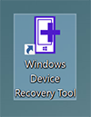
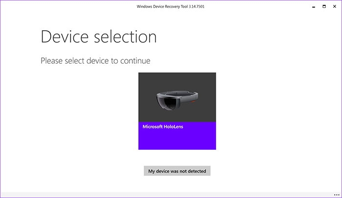
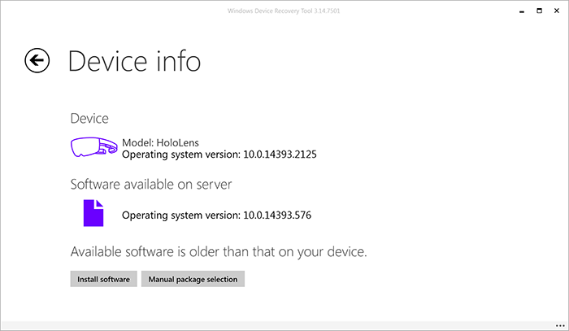
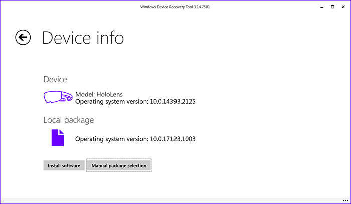
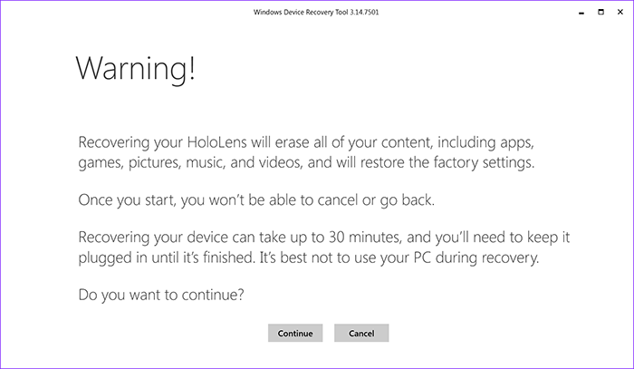
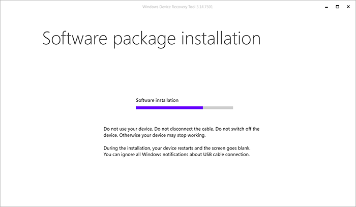
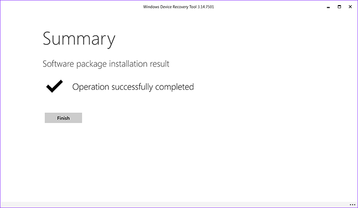
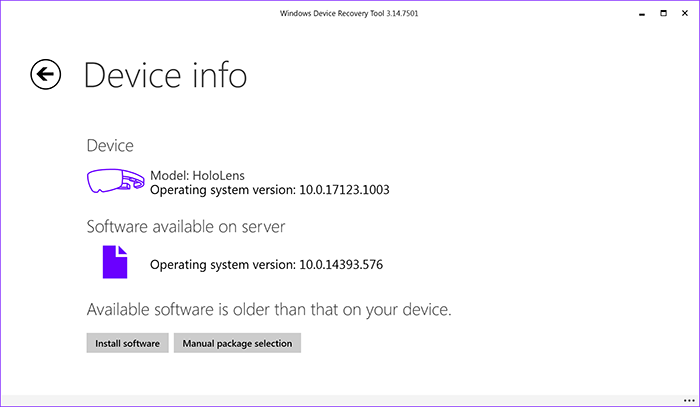
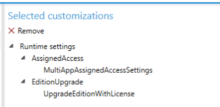

# HoloLens RS4 Preview

>[!IMPORTANT]
>By downloading *or* using the HoloLens RS4 preview builds, you are acknowledging and agreeing to the **HoloLens RS4 Preview – EULA (End User License Agreement)**, included in the preview program package.

In this article, you'll learn more about the HoloLens RS4 Preview, a preview of the Windows Holographic OS updates arriving alongside the next release of Windows 10 (RS4). Any HoloLens owner who is interested in trying the preview is invited to give it a try, however, please remember that this is a preview build (not final software) and all the warnings that come along with that. If that doesn't worry you, follow the instructions below to install the HoloLens RS4 Preview and read about the new features it includes.

## Downloading the HoloLens RS4 Preview package

You can download the setup package from [https://aka.ms/hololenspreviewdownload](https://aka.ms/hololenspreviewdownload).

## What's in the package?

| File | Description |
|------|------|
| rs4_release_svc_analog.retail.10.0.17123.1004.FFU | The HoloLens RS4 Preview image that you will flash to your device using the Windows Device Recovery Tool. |
| HoloLens RS4 Preview – EULA | HoloLens RS4 Preview - Evaluation Use Terms (End User License Agreement) |

## Installing the preview

1. On a retail HoloLens device (Windows Holographic 10.0.14393), opt-in to Insider Preview builds to prepare your device for the RS4 Preview:
   * Launch the **Settings** app -> **Update & Security** -> **Get Insider Preview builds** -> **Get started**.
   * Select Restart to restart the device to prepare to install Preview builds and wait until your device is once again booted.

>[!NOTE]
>If you need assistance getting your device back to a known state, refer to the [Reset & Recovery instructions](reset-or-recover-your-hololens.md).

2. Install an updated version of the **Windows Device Recovery Tool (WDRT)** from [https://aka.ms/wdrt](https://aka.ms/wdrt).

>[!NOTE]
>This preview requires WDRT version 3.14.07501 (or newer)

3. Flash the OS Preview Build using the Windows Device Recovery Tool:

   a. Launch Windows Device Recovery Tool from your Start menu or Desktop shortcut.
   
   
   
   b. Plug in your HoloLens device, and then select **Microsoft HoloLens** to continue.
   
   
   
   c. Select **Manual package selection** to select a custom OS image to use, then navigate to the .FFU file provided as part of the [Preview package](#downloading-the-hololens-rs4-preview-package).
   
   
   
   d. Confirm that the correct package is listed, and then select **Install software** to begin the OS installation.
   
   
   
   e. **WARNING:** this process will erase all the content on your HoloLens device; confirm by selecting **Continue**.
   
   
   
   f. The installation process will take a few minutes, during which a progress bar will be displayed on-screen.
   
   
   
   g. Once installation is complete, your device will reboot; select **Finish** to complete the process.
   
   
   
   h. You can confirm the new OS version on your device by selecting your device again in the tool, and verifying on the **Device info** page.
   
   

4. Go through the HoloLens on-device OOBE setup flow. Sign-in with your personal or work account to experience all the features of this Preview.

## New features in this preview

### For all users

<table>
  <tr>
    <th>Feature</th><th>Details</th><th>Instructions</th>
  </tr>
  <tr>
    <td>Auto-placement of 2D and 3D content on launch</td><td>A 2D app launcher or 2D UWP app auto-places in the world at an optimal size and distance when launched instead of requiring the user to place it. If an <a href="app-views.md">immersive app</a> uses a 2D app launcher instead of a <a href="3d-app-launcher-design-guidance.md">3D app launcher</a>, the immersive app will auto-launch from the 2D app launcher same as in RS1.  A 3D app launcher from the Start menu also auto-places in the world. Instead of auto-launching the app, users can then click on the launcher to launch the immersive app. 3D content opened from the Holograms app and from Edge also auto-places in the world.</td><td>When opening an app from the Start menu, you will no longer be asked to place it in the world.  If the 2D app/<a href="3d-app-launcher-design-guidance.md">3D app launcher</a> placement is not optimal, you can easily move them using new fluid app manipulations described below. You can also re-position the 2D app launcher/3D content by saying "Move this" and then using gaze to re-position the content.</td>
  </tr>
  <tr>
    <td>Fluid app manipulation</td><td>Move, resize, and rotate 2D and 3D content without having to enter "Adjust" mode.</td><td>To move a 2D UWP app or 2D app launcher, simply gaze at its app bar and then use the tap + hold + drag gesture. You can move 3D content by gazing anywhere on the object and then using tap + hold + drag.  To resize 2D content, gaze at its corner. The gaze cursor will turn into a resize cursor, and then you can tap + hold + drag to resize. You can also make 2D content taller or wider by looking at its edges and dragging.  To resize 3D content, lift up both your hands into gesture frame, fingers up in the ready position. You'll see the cursor turn into a state with 2 little hands. Do the tap and hold gesture with both your hands. Moving your hands closer or farther apart you will change the size of the object. Moving your hands forward and backward relative to each other will rotate the object. You can also resize/rotate 2D content this way.</td>
  </tr>
  <tr>
    <td>2D app horizontal resize with reflow</td><td>Make a 2D UWP app wider in aspect ratio to see more app content. For example, making the Mail app wide enough to show the Preview Pane.</td><td>Simply gaze at the left or right edge of the 2D UWP app to see the resize cursor, then use the tap + hold + drag gesture to resize.</td>
  </tr>
  <tr>
    <td>Expanded voice command support</td><td>You can do more simply using your voice.</td><td>Try these voice commands:<ul><li>"Go to Start" - Brings up the Start menu or exits an <a href="app-views.md">immersive app</a>.</li><li>"Move this" - Allows you to move an object.</li></ul></td>
  </tr>
  <tr>
    <td>Updated Holograms and Photos apps</td><td>Updated Holograms app with new holograms. Updated Photos app.</td><td>You will notice an updated look to the Holograms and Photos apps. The Holograms app includes several new Holograms and a label maker for easier creation of text.</td>
  </tr>
  <tr>
    <td>Improved mixed reality capture</td><td>Hardware shortcut start and end MRC video.</td><td>Hold Volume Up + Down for 3 seconds to start recording MRC video. Tap both again or use the bloom gesture to end.</td>
  </tr>
  <tr>
    <td>Improved audio immersion</td><td>You can now hear HoloLens better in noisy environments, and experience more lifelike sound from applications as their sound will be obscured by real walls detected by the device.</td><td>HoloLens finds your space automatically, and no longer requires you to manage or select spaces. If you have problems with holograms around you, you can go to <b>Settings > System > Holograms > Remove nearby holograms</b>. If needed, you can also select <b>Remove all holograms</b>.</td>
  </tr>
  <tr>
    <td>File Explorer</td><td>Move and delete files from within HoloLens.</td><td>You can use the <b>File Explorer</b> app to move and delete files from within HoloLens.  <b>Tip:</b> If you don’t see any files, the "Recent" filter may be active (clock icon is highlighted in left pane). To fix, select the <b>This Device</b> document icon in the left pane (beneath the clock icon), or open the menu and select <b>This Device</b>.
</td>
  </tr>
  <tr>
    <td>MTP (Media Transfer Protocol) support</td><td>Enables your desktop PC to access your libraries (photos, videos, documents) on HoloLens for easy transfer.</td><td>Similar to other mobile devices, connect your HoloLens to your PC to bring up <b>File Explorer</b> to access your HoloLens libraries (photos, videos, documents) for easy transfer.  <b>Tips:</b><ul><li>If you don't see any files, please ensure you sign in to your HoloLens to enable access to your data.</li><li>From <b>File Explorer</b> on your PC, you can select <b>Device properties</b> to see Windows Holographic OS version number (firmware version) and device serial number.</li></ul><b>Known issue:</b> Renaming HoloLens via <b>File Explorer</b> on your PC is not enabled.</td>
  </tr>
  <tr>
    <td>Captive portal network support during setup</td><td>You can now set up your HoloLens on a guest network at hotels, conference centers, retail shops, or businesses that use captive portal.</td><td>During setup, select the network, check connect automatically if desired, and enter the network information as prompted.</td>
  </tr>
</table>

### For developers

<table>
  <tr>
    <th>Feature</th><th>Details</th><th>Instructions</th>
  </tr>
  <tr>
    <td>Spatial mapping improvements</td><td>Quality, simplification, and performance improvements.</td><td>Spatial mapping mesh will appear cleaner – fewer triangles are required to represent the same level of detail. You may notice changes in triangle density in the scene.</td>
  </tr>
  <tr>
    <td>Automatic selection of focus point based on depth buffer</td><td>Submitting a depth buffer to Windows allows HoloLens to select a focus point automatically to optimize hologram stability.</td><td>In Unity, go to <b>Edit > Project Settings > Player > Universal Windows Platform tab > XR Settings</b>, expand the <b>Windows Mixed Reality SDK</b> item, and ensure <b>Enable Depth Buffer Sharing</b> is checked. This will be automatically checked for new projects.  For DirectX apps, ensure you call the <a href="https://docs.microsoft.com/en-us/uwp/api/windows.graphics.holographic.holographiccamerarenderingparameters.commitdirect3d11depthbuffer">CommitDirect3D11DepthBuffer </a> method on <b>HolographicRenderingParameters</b> each frame to supply the depth buffer to Windows.
</td>
  </tr>
  <tr>
    <td>Holographic reprojection modes</td><td>You can now disable positional reprojection on HoloLens to improve the hologram stability of rigidly body-locked content such as 360-degree video.</td><td>In Unity, set <a href="https://docs.unity3d.com/ScriptReference/XR.WSA.HolographicSettings.ReprojectionMode.html">HolographicSettings.ReprojectionMode</a> to <a href="https://docs.unity3d.com/ScriptReference/XR.WSA.HolographicSettings.HolographicReprojectionMode.html>HolographicReprojectionMode.OrientationOnly</a> when all content in view is rigidly body-locked.  For DirectX apps, set <a href="https://docs.microsoft.com/en-us/uwp/api/windows.graphics.holographic.holographiccamerarenderingparameters.reprojectionmode"> HolographicCameraRenderingParameters.ReprojectionMode</a> to <a href="https://docs.microsoft.com/en-us/uwp/api/windows.graphics.holographic.holographicreprojectionmode">HolographicReprojectionMode.OrientationOnly</a> when all content in view is rigidly body-locked.</td>
  </tr>
  <tr>
    <td>App tailoring APIs</td><td>Windows APIs know more about where your app is running, such as whether the device’s display is transparent (HoloLens) or opaque (immersive headset) and whether a UWP app’s 2D view is showing up in the holographic shell.</td><td>Unity had previously manually exposed <a href="https://docs.unity3d.com/ScriptReference/XR.WSA.HolographicSettings.IsDisplayOpaque.html">HolographicSettings.IsDisplayOpaque</a> in a way that worked even before this build.  For DirectX apps, you can now access existing APIs like <a href="https://docs.microsoft.com/en-us/uwp/api/windows.graphics.holographic.holographicdisplay.isopaque">HolographicDisplay.GetDefault().IsOpaque</a>, <a href="https://docs.microsoft.com/en-us/uwp/api/windows.applicationmodel.preview.holographic.holographicapplicationpreview.iscurrentviewpresentedonholographicdisplay">HolographicApplicationPreview</a>, and <a href="https://docs.microsoft.com/en-us/uwp/api/windows.applicationmodel.preview.holographic.holographicapplicationpreview.iscurrentviewpresentedonholographicdisplay">IsCurrentViewPresentedOnHolographicDisplay</a> on HoloLens as well.
</td>
  </tr>
  <tr>
    <td>Research mode</td><td><b>coming soon</b></td><td><b>coming soon</b></td>
  </tr>
</table>

### For commercial customers

<table>
  <tr>
    <th>Feature</th><th>Details</th><th>Instructions</th>
  </tr>
  <tr>
    <td>Use multiple AAD user accounts on a single device</td><td>Share a HoloLens with multiple AAD users, each with their own user settings and user data on device.</td><td><b>Initial setup:</b> During setup, you must sign in with an AAD account using the option "My work or school owns it". After setup, ensure that the "Windows Holographic for Business" edition update has been applied (<b>Settings >  System > About</b>), and that "Other People" appears in <b>Settings > Accounts</b>.  <b>Adding a user:</b><ol><li>Trigger sign in by pressing the power button once to go to standby, and again to return to the lock screen <b>or</b> by selecting the user tile on the upper right of the Start menu to sign out the current user.</li><li>In <b>Other user</b> to the right of the current user, enter email address and password as prompted.</li></ol><b>Subsequent sign-ins</b><ol><li>Trigger sign in by pressing the power button once to go to standby, and again to return to the lock screen <b>or</b> by selecting the user tile on the upper right of the Start menu to sign out the current user.</li><li>If you are the current user on the center panel, or previous user on the left panel, you can sign in with your password/PIN</li><li>If you do not appear on the left or center panel, you can sign in using <b>Other user</b> on the right panel by entering your email address and password as prompted.</li></ol><b>To see other user accounts on the device:</b> Go to <b>Settings > Accounts > Other users</b>.  <b>To remove a user from the device:</b> Go to <b>Settings > Accounts > Other users</b> and select <b>Remove</b> to remove the undesired user.  <b>Note:</b> Each subsequent user will need to perform calibration in order to set their correct IPD while signed in.</td>
  </tr>
  <tr>
    <td>Change Wi-Fi network on sign-in</td><td>Change Wi-Fi network before sign-in to enable another user to sign in with his or her AAD user account for the first time, allowing users to share devices at various locations and job sites.</td><td>On the sign-in screen, you can use the network icon below the password field to connect to a network. This is helpful when this is your first time signing into a device.</td>
  </tr>
  <tr>
    <td>Unified enrollment</td><td>It's now easy for a HoloLens user who set up the device with a personal Microsoft account to add a work account (AAD) and join the device to their MDM server.</td><td>If you originally signed in with a Microsoft account, you can now add a work account (AAD) via <b> Settings > Accounts > Access Work or School > Connect</b></td>
  </tr>
  <tr>
    <td>Mail Sync without MDM enrollment</td><td>Support for Exchange Active Sync (EAS) mail sync without requiring MDM enrollment.</td><td>You can now sync email without enrolling in MDM. You can set up the device with a Microsoft Account, download and install the Mail app, and add a work email account directly.</td>
  </tr>
</table>

### For IT pros

<table>
  <tr>
    <th>Feature</th><th>Details</th><th>Instructions</th>
  </tr>
  <tr>
    <td>New OS name when Commercial Suite features enabled: "Windows Holographic for Business"</td><td>Clear edition naming to reduce confusion on edition upgrade license application.</td><td>You can see what edition of Windows Holographic is running in <b>Settings > System > About</b>. "Windows Holographic for Business" will appear if an edition update has been applied to enable Commercial Suite features.</td>
  </tr>
  </tr>
  <tr>
    <td>Configurable setup (OOBE)</td><td>Hide calibration, gesture/gaze training, and Wi-Fi configuration screens during setup.</td><td>First, create and apply a provisioning package to do an <a href="https://docs.microsoft.com/en-us/hololens/hololens-upgrade-enterprise#edition-upgrade-using-a-provisioning-package">Edition upgrade using a provisioning package</a>. After applying the edition upgrade package, but before continuing in OOBE, also <a href="https://docs.microsoft.com/en-us/hololens/hololens-provisioning#apply-a-provisioning-package-to-hololens">apply the provided provisioning package</a> <b>HoloLensRS4PreviewSkipCalGGVWiFi.ppkg</b> to hide calibration, gesture/gaze training, and Wi-Fi configuration.  <b>New:</b> With MTP enabled by default, you can skip step 2 in the apply provisioning package instructions as you do not need to use the button combination to launch File Explorer.  <b>Note:</b> Use the updated Windows Configuration Designer (WCD) app to build your own provisioning package which includes edition update, settings to skip calibration, gesture/gaze training, Wi-Fi, and other configurations.</td>
  </tr>
  <tr>
  <td>Windows Configuration Designer (WCD)</td><td>Create and edit provisioning packages to configure HoloLens via updated WCD app. New simple HoloLens wizard for edition update, configurable OOBE, region/time zone, bulk AAD token, network, and developer CSP. Advanced editor filtered to HoloLens supported options, including new Assigned Access and Account Management CSPs.</td><td><b>Initial Setup of WCD preview on PC:</b><ol><li>Launch the <b>Settings</b> app and navigate to <b>Updates and Security > For Developers</b> and select <b>Sideload apps</b>.</li><li>Extract the contents of the <b>WCD_1000.15064.1.0_Test.zip</b> file to a folder on your Windows 10 desktop PC.</li><li>Navigate to that folder and right-click on <b>Add-AppDevPackage.ps1</b> and select <b>Run</b>.</li><li>Accept the prompt to apply the PowerShell policy to enable signed scripts.</li><li>When the PowerShell script prompts to elevate and install a certificate, accept that prompt as well.</li><li>After the script succeeds, it should display a message saying that the package was installed.</li><li>The app is available in your Start menu apps list as <b>Windows Configuration Designer</b> (or WCD).</li></ol><b>Create a provisioning package with WCD on PC:</b><ol><li>Launch WCD (Windows Configuration Designer)</li><li>Select <b>Provision HoloLens devices</b> tile.</li><li><b>Recommended:</b> Configure and create package in simple flow. Do NOT protect your package with password.</li><li><b>Optional:</b> You can switch to advanced editor for additional options.</li><li>When done, to create the provisioning package:<ol><li>In the app bar, select <b>Export</b>.</li><li>Choose the default values for the package name and version and select <b>Next</b>.</li><li>In the next dialog page, ensure Encrypt Package and Sign package are NOT selected. Select <b>Next</b>.</li><li>Select a path to save the provisioning package and select <b>Next</b>.</li><li>Select <b>Build</b> to build your provisioning package.</li><li>After building completes, your package will be available to apply.</li></ol></ol></td>
  </tr>
  <tr>
    <td>Bulk AAD token support</td><td>Pre-register device to AAD directory tenant for quicker user setup flow.</td><td><b>Create provisioning package with WCD:</b><ol><li>Select <b>Provision HoloLens devices</b> tile.</li><li>Ensure you include license file in <b>Set up device</b> if building single provisioning package to apply.</li><li>From <b>Add Accounts</b>, select <b>Enroll in Azure AD</b> and <b>Get Bulk Token</b>.</li><li>From <b>Finish</b>, select <b>Create</b>.</li></ol><a href="https://docs.microsoft.com/en-us/hololens/hololens-provisioning#apply-a-provisioning-package-to-hololens">Apply the provisioning package to HoloLens</a> (with MTP enabled by default, you can skip step 2 as you do not need to use the button combination to launch File Explorer).</td>
  </tr>
  <tr>
  <td>Developer CSP</td><td>Deploy profile to set up HoloLens in <b>Developer mode</b>. Useful for both development and demo devices.</td><td><b>Create provisioning package with WCD:</b><ol><li>Select <b>Provision HoloLens devices</b> tile.</li><li>Ensure you include license file in <b>Set up device</b> if building single provisioning package to apply.</li><li>From <b>Set up for developers</b>, set <b>Developer mode</b> to <b>On</b>.</li><li>If desired, set <b>Enable Device Portal</b> to <b>On</b> and set the username and password.</li><li>From <b>Finish</b>, select <b>Create</b>.</li></ol><a href="https://docs.microsoft.com/en-us/hololens/hololens-provisioning#apply-a-provisioning-package-to-hololens">Apply the provisioning package to HoloLens</a> (with MTP enabled by default, you can skip step 2 as you do not need to use the button combination to launch File Explorer).</td>
  </tr>
  <tr>
  <td>Assigned Access for Kiosk Mode</td><td>Windows assigned access for first-line workers or demos. Single or multi-app lockdown. No need to developer unlock.</td><td><b>Prepare XML file to configure Assigned Access on PC:</b><ol><li>In a text editor, open the provided file <b>AssignedAccessHoloLensConfigAzureAD.xml</b>.</li><li>Follow the instructions in the file to change the account name to one available in your Azure AD tenant. <b>Note:</b> The sample configures the following 4 apps: Skype, Learning, Feedback Hub, and Calibration.</li></ol><b>Create provisioning package with WCD:</b><ol><li>Select <b>Provision HoloLens devices</b> tile.</li><li>Ensure you include license file in <b>Set up device</b> if building single provisioning package to apply.</li><li>Select any other settings you would like to apply.</li><li>Select <b>Switch to Advanced Editor</b> (bottom left), and <b>Yes</b> at the warning prompt.</li><li>Expand the <b>Runtime settings</b> selection in the <b>Available Customizations panel</b> and select <b>MultiAppAssignedAccessSettings</b>.</li><li>In the middle panel, you should now see the setting displayed with documentation in the panel below.</li><li>Browse to the XML you modified for Assigned Access.</li><li>After both <b>AssignedAccess</b> and <b>EditionUpgrade</b> are configured, your selected customizations should include at least:</li><li>When done, to create the provisioning package:<ol><li>In the app bar, select <b>Export</b>.</li><li>Choose the default values for the package name and version and select <b>Next</b>.</li><li>In the next dialog page, ensure Encrypt Package and Sign package are NOT selected. Select <b>Next</b>.</li><li>Select a path to save the provisioning package and select <b>Next</b>.</li><li>Select <b>Build</b> to build your provisioning package.</li><li>After building completes, your package will be available to apply.</li></ol></ol><a href="https://docs.microsoft.com/en-us/hololens/hololens-provisioning#apply-a-provisioning-package-to-hololens">Apply the provisioning package to HoloLens</a> (with MTP enabled by default, you can skip step 2 as you do not need to use the button combination to launch File Explorer).  <b>Enable Assigned Access on HoloLens:</b><ol><li>After applying the provisioning package, during the account set up flow in OOBE, select <b>My Work or School owns this</b> to set up your device with an Azure AD account. <b>Note:</b> This must not be the same as the account chosen for Assigned Access.</li><li>After you're logged in, confirm the <b>Skype</b> app is installed either via your MDM environment or from the Microsoft Store.</li><li>After you've confirmed <b>Skype</b> is installed, sign out.</li><li>On the sign-in screen, select <b>Other user</b> and sign in with the Azure AD account email address chosen for Assigned Access</li><li>You should now see this user with only the apps configured in the Assigned Access profile.</li></ol></td>
  </tr>
  <tr>
    <td>Set up (OOBE) diagnostics</td><td>Get diagnostic logs from HoloLens so you can troubleshoot AAD sign-in failures (before Feedback Hub is available to the user whose sign-in failed).</td><td>Diagnostic logs are now available in some cases if you have problems adding your work account during initial device setup. When available, select <b>Collect info</b>. You can connect your HoloLens to a desktop PC and copy the diagnostic files to use for troubleshooting the issue.</td>
  </tr>
  <tr>
    <td>Local account indefinite password expiry</td><td>Remove disruption of device reset when local account password expires.</td><td>When provisioning a local account, you no longer need to change the password every 42 days in <b>Settings</b>, as the account password no longer expires.</td>
  </tr>
  <tr>
    <td>MDM sync status and details</td><td>Standard Windows functionality to understand MDM sync status and details from within HoloLens.</td><td>To check mobile device management (MDM) sync state for your account, you can go to <b>Settings > Accounts > Access Work or School</b>, and select <b>Info</b> for the work account of interest. You will see the <b>Device Sync Status</b> section, with an option to trigger an MDM sync using the <b>Sync</b> button. You can also see areas managed by MDM (Policies, Apps, etc.) and other MDM sync information, including the ability to <b>Create</b> and <b>Export</b> an Advanced Diagnostics Report for MDM (you can connect your HoloLens to a PC to copy over the report).</td>
  </tr>
</table>

## Known issues in this preview

* Some users have reported an issue with Windows Insider Program settings on this build. If you encounter problems, please file a bug in Feedback Hub, and re-flash your device.

## Note for developers

You are welcome to try developing your applications using this build of HoloLens. Continue using the Windows Mixed Reality developer documentation to guide your development, as these apply to this latest build of HoloLens as well. You can use the same builds of [Unity and Visual Studio](install-the-tools.md) that you're already using for HoloLens development.

Reference the [new features list above](#new-features-in-this-preview) for capabilities specific to the HoloLens RS4 Preview.

## Provide feedback and report issues

Please use the [Feedback Hub app on HoloLens](give-us-feedback.md#feedback-for-hololens) to provide feedback and report issues. Using Feedback Hub ensures that all necessary diagnostics information is included to help our engineers quickly debug and resolve the problem.

>[!IMPORTANT]
>Be sure to accept the prompt that asks whether you’d like Feedback Hub to access your Documents folder (select **Yes** when prompted).

## Questions and support

You can ask questions and engage with our support team in a new section of the [HoloLens developer forums](https://aka.ms/hololenspreviewhelp).
