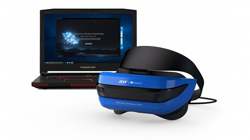
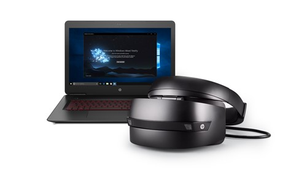

---
title: Immersive headset hardware details
description: 
author: 
ms.author: mazeller
ms.date: 2/28/2018
ms.topic: article
keywords: 
---

# Immersive headset hardware details

**Big news: Windows Mixed Reality immersive headsets and motion controllers [will launch alongside the Windows 10 Fall Creators Update](https://blogs.windows.com/windowsexperience/2017/09/01/create-and-play-this-holiday-with-the-windows-10-fall-creators-update-coming-oct-17) on October 17, 2017!**

A limited number of Windows Mixed Reality immersive headset dev kits are available for developers to order through the [online Microsoft Store](https://www.microsoft.com/en-us/store/collections/VRandMixedrealityheadsets?cat0=devices&icid=VRMR-Cat-HLG03-Windows_Mixed_Reality-08022017-en_US). These immersive headsets deliver built-in inside-out tracking, meaning there is no need to purchase or install external trackers or place sensors on the wall. There's no complicated setup, just plug and play.

## Acer Windows Mixed Reality Development Edition

[Order at Microsoft Store](https://www.microsoft.com/en-us/store/d/acer-windows-mixed-reality-headset-developer-edition/8pb4twx13m2n/7zt9)

### Device Specifications
* Two high-resolution liquid crystal displays at 1440 x 1440
* Display refresh rate up to 90 Hz (native)
* Front hinged display, so you can flip the headset up while working
* Built-in audio out and microphone support through 3.5mm jack
* Single cable with HDMI 2.0 (display) and USB 3.0 (data) for connectivity
* Inside-out tracking
* 4.0 meter cable

### Input support
* [Motion controllers](motion-controllers.md)
* Gamepads supported by UWP
* Mouse and keyboard
* [Voice](voice-input.md) (via connected headset or microphone)

## HP Windows Mixed Reality Development Edition

[Order at Microsoft Store](https://www.microsoft.com/en-us/store/d/hp-windows-mixed-reality-headset-developer-edition/91thzqtvgspf/lpmq)

### Device Specifications
* Two high-resolution liquid crystal displays at 1440 x 1440
* Display refresh rate up to 90 Hz (native)
* Front hinged display, so you can flip the headset up while working
* Built-in audio out and microphone support through 3.5mm jack
* Single cable with HDMI 2.0 (display) and USB 3.0 (data) for connectivity
* Inside-out tracking
* 4.0 meter/0.6 meter removable cable

### Input support
* [Motion controllers](motion-controllers.md)
* Gamepads supported by UWP
* Mouse and keyboard
* [Voice](voice-input.md) (via connected headset or microphone)

## See also
* [Install the tools](install-the-tools.md)