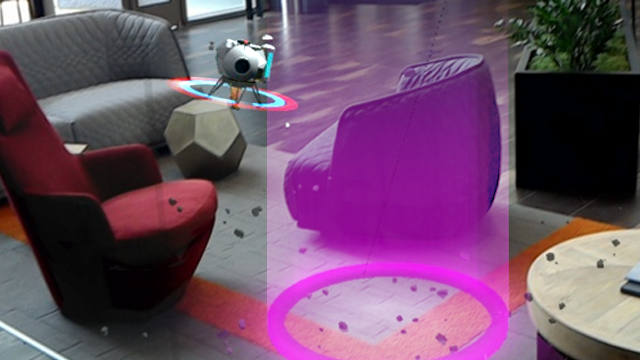
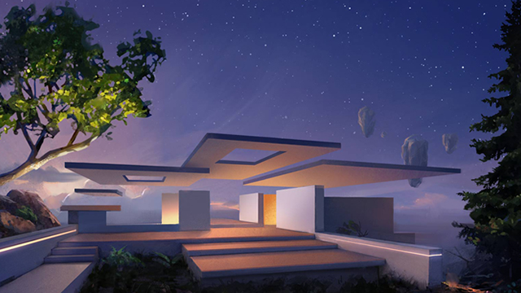

# Windows Mixed Reality documentation

Mixed reality blends real-world and virtual content into hybrid environments where physical and digital objects coexist and interact. Learn to build mixed reality experiences for Microsoft HoloLens and Windows Mixed Reality immersive headsets (VR).

 

<ul id="cardtypes-W" class="cardsW panelContent" style="display: flex; margin-top: 0px;">
                            <li>
                              <a href="mixed-reality.md" title="What is mixed reality?" data-linktype="absolute-path">
                                    

                                        

                                            

                                                

                                                    

                                                        
                                                    

                                                

                                                

                                                    <h3 class="x-hidden-focus">Fundamentals</h3>
                                                  
Get started with mixed reality key concepts, core building blocks, and app paradigms.

                                                

                                            

                                        

                                    

                            </li>
                            <li>
                              <a href="academy.md" title="Academy landing" data-linktype="absolute-path">
                                    

                                        

                                            

                                                

                                                    

                                                        
                                                    

                                                

                                                

                                                    <h3 class="x-hidden-focus">Academy</h3>
                                                  
See code examples, do a coding tutorial and watch guest lectures.

                                                

                                            

                                        

                                    

                            </li>
                            <li>
                                  <a href="design.md" title="Design landing" data-linktype="absolute-path">
                                    

                                        

                                            

                                                

                                                    

                                                        
                                                    

                                                

                                                

                                                    <h3>Design</h3>
                                                    
Get design guidance, build user interface and learn interaction and input.

                                                

                                            

                                        

                                    

                               </a>
                            </li>
                            <li>
                             <a href="development.md" title="Development landing" data-linktype="absolute-path">
                              

                                  

                                      

                                          

                                              

                                                  
                                              

                                          

                                          

                                              <h3>Development</h3>
                                              
Get development guides, learn the technology and understand the science.

                                          

                                      

                                  

                              

                            </li>
 </ul>

<h2>Resources</h2>

<ul id="cardtypes-W" class="cardsW panelContent" style="display: flex; margin-top: 0px;">
                            <li>
                              <a href="open-source-projects.md" title="Open source projects" data-linktype="absolute-path">
                                    

                                        

                                            

                                                

                                                    

                                                        
                                                    

                                                

                                                

                                                    <h3 class="x-hidden-focus">Open source projects</h3>
                                                  
These open source projects, sample apps, and toolkits should help you accelerate development of applications targeting Microsoft HoloLens and Windows Mixed Reality immersive headsets. Leverage anything you find here and please contribute back as you learn - our whole community will benefit!

                                                

                                            

                                        

                                    

                            </li>
                            <li>
                                  <a href="https://docs.microsoft.com/windows/mixed-reality/enthusiast-guide/" title="Enthusiast's Guide" data-linktype="absolute-path">
                                    

                                        

                                            

                                                

                                                    

                                                        
                                                    

                                                

                                                

                                                    <h3>Immersive headset Enthusiast's Guide</h3>
                                                    
We know you might be looking to dive deeper on Windows Mixed Reality and learn how to get the most of your new headset and motion controllers, so we created the Enthusiast's Guide to provide you with exclusive information and answer the top questions people have about Windows Mixed Reality before and after they buy.

                                                

                                            

                                        

                                    

                               </a>
                            </li>
</ul>

>[!IMPORTANT]
>All Windows Mixed Reality development materials are provided on this site for your reference only. Your app, its usage, and its effect on end users is your sole responsibility as the app developer, including ensuring that your app does not cause discomfort, injury or any other harm to an end user, and including appropriate warnings and disclaimers. You need to at all times take the appropriate steps in the development and publishing of your app to ensure that your app is safe and you meet all obligations in your [App Developer Agreement with Microsoft](https://docs.microsoft.com/legal/windows/agreements/app-developer-agreement). 
