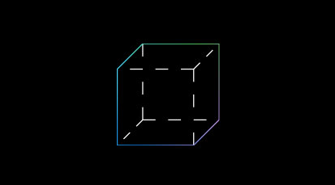
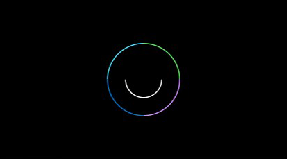
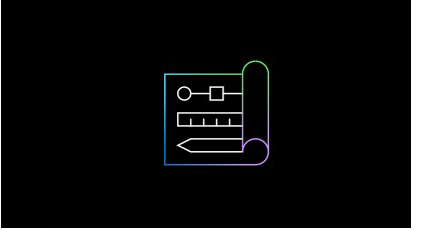
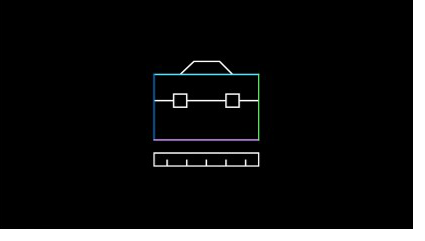
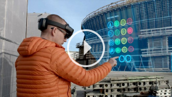
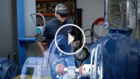
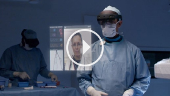
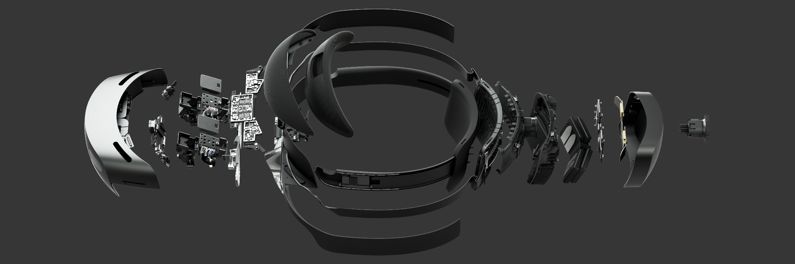

# Get started with Mixed Reality

## Choose your track

<ul id="cardtypes-D" class="cardsD panelContent" style="display: flex; margin-top: 0px;">
                            <li>
                            <a href="index.md#understand-the-basics" title="Understand the basics" data-linktype="absolute-path">
                                    

                                        

                                            

                                                

                                                    

                                                        
                                                    

                                                

                                                

                                                    <h3 class="x-hidden-focus">I'm new to mixed reality</h3>
                                                    
Understand the basics

                                                

                                            

                                        

                                    

                                    </a>
                            </li>
                            <li>
                              <a href="design.md" title="Start designing and prototyping" data-linktype="absolute-path">
                                    

                                        

                                            

                                                

                                                    

                                                        
                                                    

                                                

                                                

                                                    <h3 class="x-hidden-focus">I want to create something</h3>
                                                    
Start designing and prototyping

                                                

                                            

                                        

                                    

                                    </a>
                            </li>
                            <li>
                              <a href="development.md" title="Understanding the tools, languages and architecture" data-linktype="absolute-path">
                                    

                                        

                                            

                                                

                                                    

                                                        
                                                    

                                                

                                                

                                                    <h3 class="x-hidden-focus">I'm a developer</h3>
                                                    
Learn the tools and architecture

                                                

                                            

                                        

                                    

                                    </a>
                            </li>
                             <li>
                              <a href="https://microsoft.github.io/MixedRealityToolkit-Unity/Documentation/GettingStartedWithTheMRTK.html" target="_blank" title="Jump in with Unity and MRTK" data-linktype="absolute-path">
                                    

                                        

                                            

                                                

                                                    

                                                        
                                                    

                                                

                                                

                                                    <h3 class="x-hidden-focus">I'm ready to build stuff</h3>
                                                    
Jump in with Unity and MRTK

                                                

                                            

                                        

                                    

                                    </a>
                            </li>
</ul>

---

 

# Understand the basics

I’m brand new to mixed reality. I would like to learn about what it is and understand its capabilities.

## What is mixed reality?

### [Mixed reality is a spectrum](mixed-reality.md)

Mixed reality is the result of blending the physical world with the digital world. Mixed reality is the next evolution in human, computer, and environment interaction and unlocks possibilities that before now were restricted to our imaginations.

### [What is a hologram?](hologram.md)

HoloLens lets you create holograms, objects made of light and sound that appear in the world around you, just as if they were real objects. Holograms respond to your gaze, gestures and voice commands, and can interact with real-world surfaces around you. With holograms, you can create digital objects that are part of your world.

 

---

## What can you do with mixed reality?

### [A new vision for work](https://dynamics.microsoft.com/en-us/mixed-reality/overview/)

Internally at Microsoft we are creating mixed reality applications to empower employees and optimize operations. The Dynamics 365 team has worked on a range of projects that demonstrate the possibilities: Remote Assist, Layout and Guides.

### [The pursuit of more personal computing](case-study-the-pursuit-of-more-personal-computing.md)
Tomorrow’s opportunities are uncovered by building products today. The solutions these products provide reveal what’s necessary to advance the future. With mixed reality this is especially true: Meaningful insight comes from getting hands-on with real work — real devices, real customers, real problems.

 

## See how industry partners are using mixed reality

<table>
<colgroup>
    <col width="25%" />
    <col width="75%" />
<tr>
     <td></td>
     <td><h3><a href=https://binged.it/31AR3kP>Bentley's digital construction software that enables viewing complex construction projects</a></h3>Synchro is digital construction software that enables viewing complex construction projects in mixed reality. Their 4D digital construction platform combines traditional Gantt chart CPM scheduling with integrated 4D visualization capabilities in real time.</td>
</tr>
<tr>
     <td></td>
     <td><h3><a href=https://binged.it/31ARrjh>PTC's Vuforia Studio is an mixed reality authoring solution</a></h3>Vuforia Studio's efficient mixed reality authoring solution promotes workforce productivity and safety by delivering information when and where workers need it most: in the real-world context of their daily work environment.</td>
</tr>
<tr>
     <td></td>
     <td><h3><a href=https://binged.it/31B1RiR>Philips is piloting HoloLens in the domain of image-guided minimally invasive procedures</a></h3>Philips is piloting HoloLens in the domain of image-guided minimally invasive procedures, during which physicians rely on live X-ray, ultrasound and other sources of information to "see" inside the patient and guide their actions.</td>
</tr>
</table>

 

---

## What are the capabilities of HoloLens?

### [Immersive, ergonomic, instinctual and untethered](https://www.microsoft.com/en-us/hololens/hardware)

HoloLens 2 offers the most comfortable and immersive mixed reality experience available, with industry-leading solutions that deliver value in minutes—all enhanced by the reliability, security, and scalability of cloud and AI services from Microsoft.

 

---

## What are the core building blocks of an experience?

### [What is the user looking at? - (Gaze)](gaze.md)
Gaze is the first form of input and is a primary form of targeting within mixed reality. Gaze tells you where the user is looking in the world and lets you determine their intent

### [Taking action in mixed reality - (Gestures)](gestures.md)
Hand gestures allow users take action in mixed reality. Interaction is built on gaze to target and gesture or voice to act upon whatever element has been targeted.

### [Keep the user comfortable - (Comfort)](comfort.md)
To ensure maximum comfort on head-mounted displays, it’s important for designers and developers to create and present content in a way that mimics how these cues operate in the natural world.

### [How the user sees the world - (Holographic frame)](holographic-frame.md)
Users see the world of mixed reality through a rectangular viewport powered by their headset. On the HoloLens, this rectangular area is called the holographic frame and allows users to see digital content overlaid onto the real world around them.

### [Making holographic objects feel real - (Spatial mapping)](spatial-mapping.md)
Spatial mapping makes it possible to place objects on real surfaces. This helps anchor objects in the user's world and takes advantage of real world depth cues.

### [Suggesting the scale of an object - (Scale)](scale.md)
A key to displaying content that looks realistic in holographic form is to mimic the visual statistics of the real world as closely as possible. This means incorporating as many of the visual cues as we can that help us (in the real world) understand where objects are, how big they are, and what they’re made of.

 

---

## What would you like to do next?

:::row:::
    :::column:::
        
        ### [Try out mixed reality for yourself](https://www.microsoft.com/en-us/windows/windows-mixed-reality?icid=SSM_Search_Promo_XCat_WindowsMixedReality_CTA1#storelocator)
        Get a demo of Mixed Reality and HoloLens at your local Microsoft Store. 
    :::column-end:::
    :::column:::
         
         ### [Become a creator](quick-start-creating.md)
        Learn the basic concepts you need to begin designing and prototyping.
    :::column-end:::
    :::column:::
         
         ### [Come to a design or development event](sf-academy-events.md)
        See the hardware and get a hands-on tutorial to make your first HoloLens 2 application.
    :::column-end:::
    :::column:::
         
         ### [Start developing](quick-start-developer.md)
        Choose a development path based on your skill level, work style. or platform interest.
    :::column-end:::
:::row-end:::

>[!IMPORTANT]
>All mixed reality development materials are provided on this site for your reference only. Your application, its usage, and its effect on end users is your sole responsibility as the application developer, including ensuring that your app does not cause discomfort, injury, or any other harm to the end user, and including appropriate warnings and disclaimers. You need to at all times take the appropriate steps in the development and publishing of your application to ensure that your application is safe, and that you meet all obligations in your [App Developer Agreement with Microsoft](https://docs.microsoft.com/legal/windows/agreements/app-developer-agreement). 
