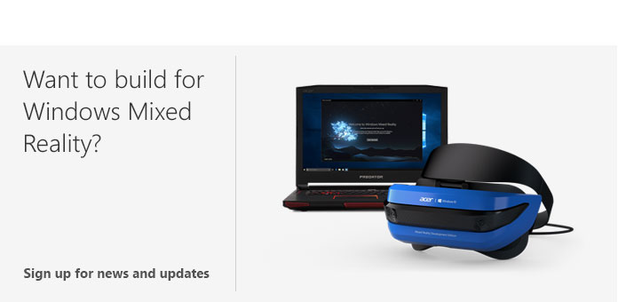

# Index

## What do you want to do?

<a class="mainpage-sitepage-link" href="Academy.md"><h3>
Academy
</h3>

<ul>
<li>See code examples</li><li>Do a coding tutorial</li><li>Watch guest lectures</li>
</ul>

</a>

<a class="mainpage-sitepage-link" href="Design.md"><h3>
Design
</h3>

<ul>
<li>Get design guides</li><li>Build user interface</li><li>Learn interactions and input</li>
</ul>

</a>

<a class="mainpage-sitepage-link" href="Development.md"><h3>
Development
</h3>

<ul>
<li>Get development guides</li><li>Learn the technology</li><li>Understand the science</li>
</ul>

</a>

<a class="mainpage-sitepage-link" href="Community.md"><h3>
Community and Support
</h3>

<ul>
<li>Join open source projects</li><li>Ask questions on forums</li><li>Attend events and meetups</li>
</ul>

</a>

## Check out the Enthusiast's Guide

 We know you might be looking to dive deeper on Windows Mixed Reality and learn how to get the most of your new headset and motion controllers, so we created the <a href="https://docs.microsoft.com/en-us/windows/mixed-reality/enthusiast-guide/">Enthusiast&#39;s Guide</a> to provide you with exclusive information and answer the top questions people have about Windows Mixed Reality before and after they buy.

 

<h2>
Recent news
</h2><table>
<tr>
<th> Date</th><th> News</th>
</tr><tr>
<td> 10.03.2017</td><td><a href="https://blogs.windows.com/windowsexperience/2017/10/03/the-era-of-windows-mixed-reality-begins-october-17/">New Samsung headset announced, SteamVR and AltSpaceVR come to Windows Mixed Reality, and pre-orders begin</a></td>
</tr><tr>
<td> 09.01.2017</td><td> <a href="https://blogs.windows.com/windowsexperience/2017/09/01/create-and-play-this-holiday-with-the-windows-10-fall-creators-update-coming-oct-17/">Windows Mixed Reality immersive headsets and Windows 10 Fall Creators Update arrive October 17!</a></td>
</tr><tr>
<td> 08.28.2017</td><td> <a href="https://blogs.windows.com/windowsexperience/2017/08/28/windows-mixed-reality-holiday-update/">Windows Mixed Reality immersive headsets holiday update</a></td>
</tr><tr>
<td> 08.16.2017</td><td> <a href="https://blogs.windows.com/windowsexperience/2017/08/16/making-mixed-reality-a-conversation-with-lucas-rizzotto/">Making mixed reality developer profile (Lucas Rizzotto)</a></td>
</tr><tr>
<td> 05.31.2017</td><td> <a href="https://blogs.windows.com/windowsexperience/2017/05/31/microsoft-shows-partner-innovation-always-connected-pcs-mr-iot-computex-2017/">New Windows Mixed Reality immersive headsets announced</a></td>
</tr>
</table>
<a href="news-archive.md">Archive of previous news</a>

## Index of topics

* [All pages](category/all-pages.md)
* [App patterns](category/app-patterns.md)
* [Case studies](category/case-studies.md)
* [Controls](category/controls.md)
* [Design tools and resources](category/design-tools-and-resources.md)
* [Get started with design](category/get-started-with-design.md)
* [Interaction design](category/interaction-design.md)
* [Sample apps](category/sample-apps.md)
* [Style](category/style.md)
* [Unity](category/unity.md)

\
\
Important note: All HoloLens development materials are provided on this site for your reference only. Your App, its usage, and its effect on end users is your sole responsibility as the App developer, including ensuring that your App does not cause discomfort, injury or any other harm to an end user, and including appropriate warnings and disclaimers. You need to at all times take the appropriate steps in the development and publishing of your App to ensure that your App is safe and you meet all obligations in your [App Developer Agreement with Microsoft](https://msdn.microsoft.com/en-us/library/windows/apps/hh694058.aspx).