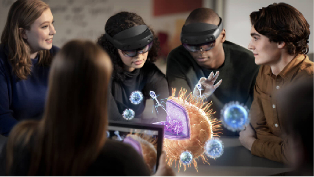

# Mixed Reality documentation

Mixed reality blends real-world and virtual content into hybrid environments where physical and digital objects coexist and interact. Learn to build mixed reality experiences for Microsoft HoloLens and Windows Mixed Reality immersive headsets (VR).

 

<ul id="cardtypes-W" class="cardsW panelContent" style="display: flex; margin-top: 0px;">
                            <li>
                            <a href="design.md" title="Design landing" data-linktype="absolute-path">
                                    

                                        

                                            

                                                

                                                    

                                                        
                                                    

                                                

                                                

                                                    <h3>Design</h3>
                                                    
Get design guidance, build user interface and learn interaction and input.

                                                

                                            

                                        

                                    

                               </a>
                            </li>
                            <li>
                             <a href="development.md" title="Development landing" data-linktype="absolute-path">
                              

                                  

                                      

                                          

                                              

                                                  
                                              

                                          

                                          

                                              <h3>Develop</h3>
                                              
Get development guides, learn the technology and understand the science.

                                          

                                      

                                  

                              

                               </a>
                            </li>
                             <li>
                              <a href="implementing-3d-app-launchers.md" title="Distribute" data-linktype="absolute-path">
                                    

                                        

                                            

                                                

                                                    

                                                        
                                                    

                                                

                                                

                                                    <h3 class="x-hidden-focus">Distribute</h3>
                                                  
Get your app ready for others and consider creating a 3D launcher.

                                                

                                            

                                        

                                    

                                </a>
                            </li>
 </ul>

<h2>Services</h2>

<ul id="cardtypes-W" class="cardsW panelContent" style="display: flex; margin-top: 0px;">
                            <li>
                              <a href="https://docs.microsoft.com/azure/spatial-anchors" target="_blank" title="Azure Spatial Anchors" data-linktype="absolute-path">
                                    

                                        

                                            

                                                

                                                    

                                                        
                                                    

                                                

                                                

                                                    <h3 class="x-hidden-focus">Azure Spatial Anchors</h3>
                                                  
Spatial Anchors is a cross-platform developer service that allows you to create Mixed Reality experiences using objects that persist their location across devices over time.

                                                

                                            

                                        

                                    

                                    </a>
                            </li>
                            <li>
                              <a href="https://docs.microsoft.com/azure/cognitive-services/speech-service/" target="_blank" title="Speech Services" data-linktype="absolute-path">
                                    

                                        

                                            

                                                

                                                    

                                                        
                                                    

                                                

                                                

                                                    <h3 class="x-hidden-focus">Speech Services</h3>
                                                  
Discover and integrate Azure powered speech capabilities like speech to text, speaker recognition or speech translation into your application.

                                                

                                            

                                        

                                    

                                    </a>
                            </li>
                             <li>
                              <a href="https://docs.microsoft.com/azure/cognitive-services/computer-vision/" target="_blank" title="Vision Services" data-linktype="absolute-path">
                                    

                                        

                                            

                                                

                                                    

                                                        
                                                    

                                                

                                                

                                                    <h3 class="x-hidden-focus">Vision Services</h3>
                                                  
Identify and analyze your image or video content using Vision Services like computer vision, face detection, emotion recognition or video indexer.

                                                

                                            

                                        

                                    

                                    </a>
                            </li>
</ul>

<h2>Introducing HoloLens 2</h2>

[HoloLens 2](https://www.microsoft.com/hololens/hardware) offers the most comfortable and immersive mixed reality experience available, with industry-leading solutions that deliver value in minutes- all backed by the reliability, security, and scalability of cloud and AI services from Microsoft. The [HoloLens 2 Development Edition](https://www.microsoft.com/en-us/hololens/developers) helps you jump-start your mixed reality plans with an offer that combines HoloLens 2 with free trials of Unity software and Azure credits for cloud services.

<h2>News and notes</h2>

<h3>April 2019</h3>

As promised, we are excited to share more mixed reality goodness with you! We’re looking forward to hearing your feedback and would like to invite you to [join the conversation](https://holodevelopersslack.azurewebsites.net/) around topics you’d like to see from us, people you would like to hear from, tutorials or how-to’s that you would need… You can also reach out to us via [Twitter](https://twitter.com/MxdRealityDev), and [join our developer program](https://aka.ms/iwantmr) for direct updates on new docs, tools, events and more. Stay tuned, there's more to come!

<table>
<tr>
<th style="width: 400px; text-align:left;">Content</th><th style="width: 125px; text-align:left;">Delivery</th><th style="width: 125px; text-align:left;">NOW LIVE!</th>
</tr> 
<tr>
<td><b>Porting Guides</b>  1. HoloToolKit (HTK)/Mixed Reality Toolkit (MRTK) to MRTK Version 2
 2. HoloLens (1st gen) to HoloLens 2 (x86 to ARM, interaction and design recommendations)
</td></td><td>March - May 2019</td><td> <ul><li><a href=https://docs.microsoft.com/en-us/windows/mixed-reality/mrtk-porting-guide>Getting your existing app ready for HoloLens 2</a><li><a href=https://microsoft.github.io/MixedRealityToolkit-Unity/Documentation/HTKToMRTKPortingGuide.html>HoloToolKit to MRTK APIs</a></td>
</tr>
<tr>
<td>Monthly open source developer modules (Tutorials/Sample apps)</td><td>March - June 2019</td><td> <ul><li><a href=https://docs.microsoft.com/en-us/windows/mixed-reality/mrlearning-base-ch1>MR learning base module</a></td>
</tr>
<tr>
<td>Preview new capabilities in MRTK for HoloLens 2</td><td>April 2019</td><td> <ul><li><a href=https://microsoft.github.io/MixedRealityToolkit-Unity/Documentation/GettingStartedWithTheMRTK.html>MRTK docs</a><li><a href=https://docs.microsoft.com/en-us/windows/mixed-reality/mrtk-getting-started>Getting started with MRTK v2</a></td>
</tr>
<tr>
<td>Design and development guidance for HoloLens 2</td><td>April 2019</td><td> <ul><li><a href=https://docs.microsoft.com/en-us/windows/mixed-reality/install-the-tools>Install the tools</a><li><a href=https://docs.microsoft.com/en-us/windows/mixed-reality/using-the-hololens-emulator>HoloLens 2 emulator</a><li><a href=https://docs.microsoft.com/en-us/windows/mixed-reality/interaction-fundamentals>Instinctual interactions design guidance</a></td>
</tr>
<tr>
  <td>More information on Unreal</td><td>May 2019</td><td> <ul><li><a href=https://www.unrealengine.com/en-US/blog/unreal-engine-4-support-for-hololens-2-released-in-early-access>Unreal Engine 4 early access</a></td>
</tr>
</table>

 

>[!IMPORTANT]
>All Mixed Reality development materials are provided on this site for your reference only. Your app, its usage, and its effect on end users is your sole responsibility as the app developer, including ensuring that your app does not cause discomfort, injury or any other harm to an end user, and including appropriate warnings and disclaimers. You need to at all times take the appropriate steps in the development and publishing of your app to ensure that your app is safe and you meet all obligations in your [App Developer Agreement with Microsoft](https://docs.microsoft.com/legal/windows/agreements/app-developer-agreement). 
