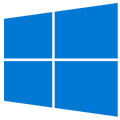

# Install the tools

Get the tools you need to build apps for Microsoft HoloLens and Windows Mixed Reality immersive (VR) headsets. There is no separate SDK for Windows Mixed Reality development; you'll use Visual Studio with the Windows 10 SDK.

Don't have a mixed reality device? You can install the [HoloLens emulator](using-the-hololens-emulator.md) to test some functionality of mixed reality apps without a HoloLens. You can also use the [Windows Mixed Reality simulator](using-the-windows-mixed-reality-simulator.md) to test your mixed reality apps for immersive headsets.

We recommend installing the Unity game engine as the easiest way to get started creating mixed reality apps, however, you can also build against DirectX if you'd like to use a custom engine.

>[!TIP]
>Bookmark this page and check it regularly to keep up-to-date on the most recent version of each tool recommended for mixed reality development.

 

>[!VIDEO https://www.youtube.com/embed/3l20TWhw4S8]

## Installation checklist

| Tool | Description | Notes |
|---------|---------|---------|
|   [**Windows 10** (Manual install link)](https://www.microsoft.com/en-us/software-download/windows10) | Install the most recent version of Windows 10 so your PC's operating system matches the platform for which you're building mixed reality apps. | **Installing Windows 10**   <ul><li>You can install the most recent version of Windows 10 via Windows Update in Settings or by creating installation media (using the link in the left column).<li>See [current release notes](release-notes-october-2018.md) for information about the newest mixed reality features available with each release of Windows 10.</ul> **Enable developer mode on your PC** at Settings > Update & Security > For developers.    **Note for enterprise and corporate-managed PCs:** if your PC is managed by an your organization's IT department, you may need to contact them in order to update.    **'N' versions of Windows:** Windows Mixed Reality immersive (VR) headsets are not supported on 'N' versions of Windows. |
|   [**Visual Studio 2017** (Install link)](https://visualstudio.microsoft.com/downloads/) | Fully-featured integrated development environment (IDE) for Windows and more. You'll use Visual Studio to write code, debug, test, and deploy. | **Additional workloads to install:** <ul><li>Universal Windows Platform development</ul>**Note about Unity:** unless you're intentionally trying to install a newer (non-LTS) version of Unity for a specific purpose, we recommend *not* installing the Unity workload as part of Visual Studio installation, and instead installing the LTS stream of Unity as noted below. |
|   [**Windows 10 SDK** (Manual install link)](https://developer.microsoft.com/en-US/windows/downloads/windows-10-sdk) | Provides the latest headers, libraries, metadata, and tools for building Windows 10 apps. | The Windows 10 SDK is included when you install Visual Studio. You can also download and install the latest version of the SDK using the link in the left column. |
|   [**Unity long term support (LTS) version** (Install link)](https://unity3d.com/unity/qa/lts-releases) | The Unity game engine is the easiest way to create mixed reality experiences, with built-in support for Windows Mixed Reality features. | We recommend the Unity LTS stream as the best version with which to start new projects, and migrate forward to, in order to pick up the latest stability fixes. It is also the version the current Mixed Reality Toolkit (MRTK) supports.     Some developers may want to use a different version of Unity for specific reasons (like using a preview version of MRTK). For those cases, Unity supports side-by-side installs of different versions. |
|   [**Mixed Reality Toolkit (MRTK) for Unity** (GitHub repo link)](https://github.com/Microsoft/MixedRealityToolkit-Unity/blob/master/README.md) | The MRTK is a collection of scripts and components intended to accelerate development of applications targeting Microsoft HoloLens and Windows Mixed Reality immersive (VR) headsets. The project is aimed at reducing barriers to entry to create mixed reality applications and contribute back to the community as we all grow. | Visit the MRTK GitHub repo (link in the left column) to learn more. |

## Mixed Reality Toolkit

The Mixed Reality Toolkit is a collection of scripts and components intended to accelerate development of applications targeting Microsoft HoloLens and Windows Mixed Reality headsets. The project is aimed at reducing barriers to entry to create mixed reality applications and contribute back to the community as we all grow.
* [MixedRealityToolkit](https://github.com/Microsoft/MixedRealityToolkit)
* [MixedRealityToolkit-Unity](https://github.com/Microsoft/MixedRealityToolkit-Unity) - uses code from the base toolkit and makes it easier to consume in Unity.
* [MixedRealityCompanionKit](https://github.com/Microsoft/MixedRealityCompanionKit) - code bits and components that may not run directly on HoloLens or immersive (VR) headsets, but instead pair with them to build experiences targeting Windows Mixed Reality.

## Setting up your PC for mixed reality development

The Windows 10 SDK works best on the Windows 10 operating system. This SDK is also supported on Windows 8.1, Windows 8, Windows 7, Windows Server 2012, Windows Server 2008 R2. Note that not all tools are supported on older operating systems. 

### For HoloLens development

When setting up your development PC for HoloLens development, please make sure it meets the system requirements for both [Unity](https://unity3d.com/unity/system-requirements) and [Visual Studio](https://www.visualstudio.com/en-us/productinfo/vs2017-system-requirements-vs). If you plan to use the HoloLens emulator, you'll want to make sure your PC meets the [HoloLens emulator system requirements](using-the-hololens-emulator.md#hololens-emulator-system-requirements) as well.

If you plan to develop for both HoloLens and Windows Mixed Reality immersive (VR) headsets, please use the system recommendations and requirements in the section below.

### For immersive (VR) headset development

>[!NOTE]
>The following guidelines are the current minimum and recommended specs for your immersive (VR) headset *development PC*, and may be updated regularly.

>[!WARNING]
>Do not confuse this with the [minimum PC hardware compatibility guidelines](https://docs.microsoft.com/windows/mixed-reality/enthusiast-guide/windows-mixed-reality-minimum-pc-hardware-compatibility-guidelines), which outlines the *consumer PC specs* to which you should target your immersive (VR) headset app or game.

If your immersive headset development PC does not have full-sized HDMI and/or USB 3.0 ports, you'll need [adapters](https://docs.microsoft.com/windows/mixed-reality/enthusiast-guide/recommended-adapters-for-windows-mixed-reality-capable-pcs) to connect your headset.

There are currently [known issues](https://docs.microsoft.com/windows/mixed-reality/enthusiast-guide/troubleshooting-windows-mixed-reality) with some hardware configurations, particularly with notebooks that have hybrid graphics.

<table>
<tr>
<th></th><th> Minimum</th><th> Recommended</th>
</tr><tr>
<td> Processor</td><td> <b>Notebook:</b> Intel Mobile Core i5 7th generation CPU, Dual-Core with Hyper Threading <b>Desktop:</b> Intel Desktop i5 6th generation CPU, Dual-Core with Hyper Threading <b>OR</b> AMD FX4350 4.2Ghz Quad-Core equivalent</td><td> <b>Desktop:</b> Intel Desktop i7 6th generation (6 Core) <b>OR</b> AMD Ryzen 5 1600 (6 Core, 12 threads)</td>
</tr><tr>
<td> GPU</td><td> <b>Notebook:</b> NVIDIA GTX 965M, AMD RX 460M (2GB) equivalent or greater DX12 capable GPU <b>Desktop:</b> NVIDIA GTX 960/1050, AMD Radeon RX 460 (2GB) equivalent or greater DX12 capable GPU</td><td><b>Desktop:</b> NVIDIA GTX 980/1060, AMD Radeon RX 480 (2GB) equivalent or greater DX12 capable GPU</td>
</tr><tr>
<td> GPU driver WDDM version</td><td colspan="2"> WDDM 2.2 driver</td>
</tr><tr>
<td> Thermal Design Power</td><td colspan="2"> 15W or greater</td>
</tr><tr>
<td> Graphics display ports</td><td colspan="2"> 1x available graphics display port for&#160;headset (HDMI 1.4 or DisplayPort 1.2 for 60Hz headsets, HDMI 2.0 or DisplayPort 1.2 for 90Hz headsets)</td>
</tr><tr>
<td> Display resolution</td><td colspan="2"> Resolution: SVGA (800x600) or greater Bit depth: 32 bits of color per pixel</td>
</tr><tr>
<td> Memory</td><td> 8&#160;GB of RAM or greater</td><td> 16 GB of RAM or greater</td>
</tr><tr>
<td> Storage</td><td colspan="2"> &gt;10 GB additional free space</td>
</tr><tr>
<td> USB Ports</td><td colspan="2"> 1x available USB port for headset (USB 3.0 Type-A) <b>Note: USB must supply a minimum of 900mA</b></td>
</tr><tr>
<td> Bluetooth</td><td colspan="2"> Bluetooth 4.0 (for accessory connectivity)</td>
</tr>
</table>

## See also

* [Development overview](development-overview.md)
* [Using the HoloLens emulator](using-the-hololens-emulator.md)
* [Using the Windows Mixed Reality simulator](using-the-windows-mixed-reality-simulator.md)
* [Unity development overview](unity-development-overview.md)
* [DirectX development overview](directx-development-overview.md)
* [HoloLens emulator archive](hololens-emulator-archive.md)
