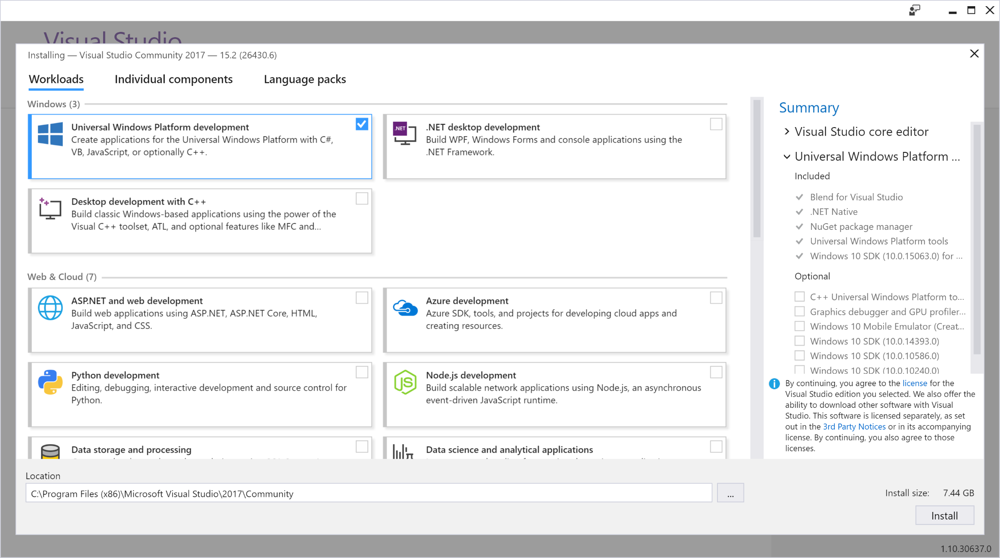
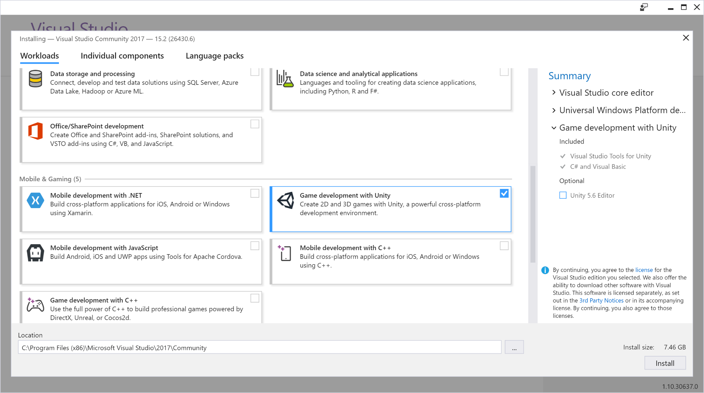
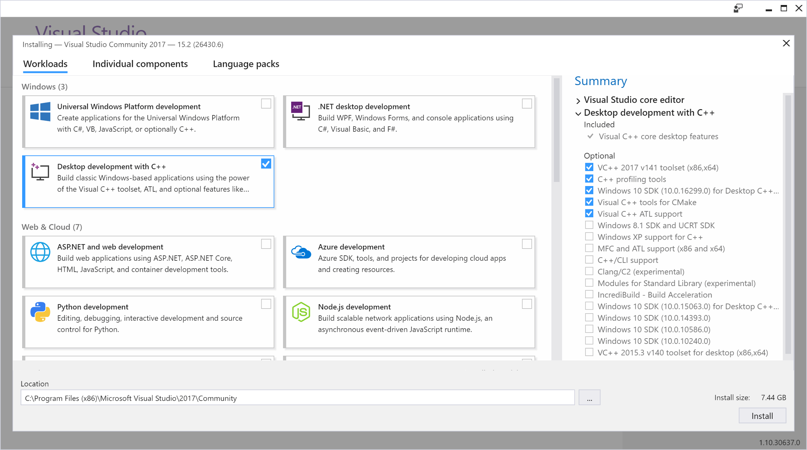

# Install the tools

Get the tools you need to build apps for Microsoft HoloLens and Windows Mixed Reality immersive headsets. There is no separate SDK for Windows Mixed Reality development; you'll use Visual Studio with the Windows 10 SDK. 

Don't have a mixed reality device? You can install the [HoloLens emulator](using-the-hololens-emulator.md) to build mixed reality apps without a HoloLens. You can also use the [Windows Mixed Reality simulator](using-the-windows-mixed-reality-simulator.md) to test your mixed reality apps for immersive headsets. 

We recommend installing the Unity game engine as an easy way to get started creating mixed reality apps.

>[!TIP]
>Bookmark this page and check it regularly to keep up-to-date on the most recent version of each tool recommended for mixed reality development.

 

>[!VIDEO https://www.youtube.com/embed/3l20TWhw4S8]

## Installation checklist for HoloLens

<table>
<tr>
<th width="150"> Download and Install</th><th> Notes</th>
</tr><tr>
<td> <a href="http://dev.windows.com/downloads">Visual Studio 2017</a></td><td><ul>
<li>Select the <b>Universal Windows Platform development</b> workload</li><li>Select the <b>Game Development with Unity</b> workload<ul>
<li>You may deselect the Unity Editor optional component since you&#39;ll be installing a newer version of Unity from the instructions below.</li>
</ul></li>
</ul>
All editions of Visual Studio 2017 are supported (including Community). While Visual Studio 2015 Update 3 is still supported, we recommend Visual Studio 2017 for the best experience.
</td>
</tr><tr>
<td> HoloLens emulator and holographic templates:  
 <a href="https://go.microsoft.com/fwlink/?linkid=874531">Windows 10 April 2018 Update</a>  
 <a href="https://go.microsoft.com/fwlink/?linkid=852626">Previous build (10.0.14393.1358)</a></td><td>The emulator allows you to run Windows Holographic apps in a virtual machine without a physical HoloLens. It includes a virtual HoloLens image that runs the latest version of the Windows Holographic OS. You can install multiple builds of the emulator side-by-side. This package also includes holographic DirectX project templates for Visual Studio. If desired, you can select to install only the templates without the emulator.

<b>Your system must support Hyper-V</b> for the Emulator installation to succeed. Please reference the <a href="#hololens-emulator">system requirements</a> section below for details.</td>
</tr><tr>
<td> <a href="https://store.unity.com/download">Unity 2017.4</a></td><td><b>Last known release</b>: 2017.4.1f1 issued April 6th, 2018
 The Unity engine is an easy way to <a href="unity-development-overview.md">get started building a holographic app</a>.&#160;
<ul>
<li>2017.4 is the <a href="https://unity3d.com/unity/qa/lts-releases?version=2017.4"> LTS (Long Term Support) stream </a>, and it is the best version to start new projects in, and to migrate forward to in order to pick up the latest stability fixes.  The specific builds currently available, the support policy, issues fixed, outstanding known issues, and release notes can all be viewed <a href="https://unity3d.com/unity/qa/lts-releases?version=2017.4"> here. </a></li> <li>When installing, make sure to select the Windows Store .NET Scripting Backend (you may install the docs as well). </li>
</ul></td>
</tr><tr>
<td> <a href="https://developer.vuforia.com/downloads/sdk">Vuforia</a></td><td> <b>Last known release</b>: 6.1 issued November 16th, 2016 Vuforia enables you to create holographic apps that can recognize specific things in the environment and attach experiences to them. Review the <a href="vuforia-development-overview.md">getting started guide</a> to learn how easy it is to extend the capabilities of your holographic apps with the Vuforia Engine. You can get a <a href="https://developer.vuforia.com/pricing">free development license</a> at <a href="https://developer.vuforia.com/">developer.vuforia.com</a>.</td>
</tr>
</table>

## Installation checklist for immersive headsets

<table>
<tr>
<th> Download and Install</th><th> Notes</th>
</tr><tr>
<td> <a href="https://www.microsoft.com/en-us/software-download/windows10">Windows 10 April 2018 Update</a></td><td><b>Install the Windows 10 April 2018 Update</b><ul><li>Install this update via Windows Update or by creating installation media (using the link in the left column)</li><li>Learn more about <a href="release-notes.md">new Windows Mixed Reality features in this update</a></li></ul>
<b>Enable Developer mode</b>: go to <b>Settings > Update & Security > For developers</b>

<b>Enterprise and corporate managed PCs</b>
<ul>
<li>If your PC is tightly managed by an IT organization, you may need to contact them in order to update</li><li>More information on Creators Update for Enterprise is in this <a href="https://techcommunity.microsoft.com/t5/Windows-IT-Pro-Blog/What-s-new-for-IT-pros-in-Windows-10-version-1803/">blog entry</a></li>
</ul>

<b>'N' versions of Windows</b>: immersive (VR) headsets are not supported on 'N' versions of Windows</td>
</tr><tr>
<td> <a href="https://developer.microsoft.com/en-us/windows/downloads">Visual Studio 2017</a></td><td>
 <b>Install Visual Studio 2017 with the Windows 10 April 2018 Update SDK</b>
<ul>
<li>Select the <b>Universal Windows Platform development</b> workload</li>
</ul>
&nbsp;&nbsp;&nbsp;&nbsp;&nbsp;&nbsp;&nbsp;&nbsp;&nbsp;
<ul>
<li>If developing with Unity, select the <b>Game Development with Unity</b> workload<ul>
<li>You may deselect the Unity Editor optional component since you'll be installing a newer version of Unity.</li>
</ul></li>
</ul>
&nbsp;&nbsp;&nbsp;&nbsp;&nbsp;&nbsp;&nbsp;&nbsp;&nbsp;
<ul>
<li>If using IL2CPP in Unity, select the <b>Desktop development with C++</b> workload</li>
</ul>
&nbsp;&nbsp;&nbsp;&nbsp;&nbsp;&nbsp;&nbsp;&nbsp;&nbsp;

All editions of Visual Studio 2017 are supported (including Community).
</td>
</tr><tr>
<td> <a href="https://developer.microsoft.com/en-US/windows/downloads/windows-10-sdk">Windows 10 April 2018 Update SDK</a></td><td> <b>Install the Windows 10 April 2018 Update SDK</b> The Windows 10 April 2018 Update SDK is included in the latest version of <a href="https://developer.microsoft.com/en-us/windows/downloads">Visual Studio 2017</a>. You can also download and install the .EXE or .ISO for the SDK using the link in the column to the left.</td>
</tr><tr>
<td> <a href="https://store.unity.com/download">Unity 2017.4</a></td><td><b>Last known release</b>: 2017.4.1f1 issued April 6th, 2018
 The Unity engine is an easy way to <a href="unity-development-overview.md">get started building a mixed reality app</a>.&#160;
<ul>
<li>2017.4 is the <a href="https://unity3d.com/unity/qa/lts-releases?version=2017.4"> LTS (Long Term Support) stream </a>, and it is the best version to start new projects in, and to migrate forward to in order to pick up the latest stability fixes.  The specific builds currently available, the support policy, issues fixed, outstanding known issues, and release notes can all be viewed <a href="https://unity3d.com/unity/qa/lts-releases?version=2017.4"> here. </a></li> <li>When installing, make sure to select the Windows Store .NET Scripting Backend (you may install the docs as well). </li>
</ul></td>
</tr><tr>
<td> <i>For DirectX development:</i> <a href="https://go.microsoft.com/fwlink/?linkid=874531">Holographic templates</a> (Windows 10 April 2018 Update)</td><td> If you are doing DirectX development, you can install this package, which includes holographic DirectX project templates for Visual Studio. If desired, you can select to install only the templates without the HoloLens emulator.</td>
</tr><tr>
<td> <a href="https://docs.microsoft.com/en-us/windows/mixed-reality/enthusiast-guide/troubleshooting-windows-mixed-reality#graphics-drivers">Update graphics drivers</a></td><td><b>Check Windows Update for new driver updates</b>
You may also want to check your video card manufacturer's website for the most up-to-date graphics drivers</td>
</tr>
</table>

## Mixed Reality Toolkit

The Mixed Reality Toolkit is a collection of scripts and components intended to accelerate development of applications targeting Microsoft HoloLens and Windows Mixed Reality headsets. The project is aimed at reducing barriers to entry to create mixed reality applications and contribute back to the community as we all grow. 
* [MixedRealityToolkit](https://github.com/Microsoft/MixedRealityToolkit)
* [MixedRealityToolkit-Unity](https://github.com/Microsoft/MixedRealityToolkit-Unity) - uses code from the base toolkit and makes it easier to consume in Unity.
* [MixedRealityCompanionKit](https://github.com/Microsoft/MixedRealityCompanionKit) - code bits and components that may not run directly on HoloLens or immersive headsets, but instead pair with them to build experiences targeting Windows Mixed Reality.

## System requirements

The Windows 10 SDK works best on the Windows 10 operating system. This SDK is also supported on Windows 8.1, Windows 8, Windows 7, Windows Server 2012, Windows Server 2008 R2. Note that not all tools are supported on older operating systems. Visual Studio also has [system requirements](https://www.visualstudio.com/en-us/productinfo/vs2017-system-requirements-vs).

### HoloLens Emulator

The HoloLens emulator is based on Hyper-V and uses RemoteFx for hardware accelerated graphics. To use the emulator, make sure your PC meets these hardware requirements:
* 64-bit Windows 10 Pro, Enterprise, or Education (**Note: the Home edition does not support Hyper-V or the HoloLens emulator**)
* 64-bit CPU
* CPU with 4 cores (or multiple CPU's with a total of 4 cores)
* 8 GB of RAM or more
* In the BIOS, the following features must be [supported and enabled](http://blogs.technet.com/b/iftekhar/archive/2010/08/09/enable-hardware-settings-in-bios-to-run-hyper-v.aspx):
  * Hardware-assisted virtualization
  * Second Level Address Translation (SLAT)
  * Hardware-based Data Execution Prevention (DEP)
* GPU (The emulator might work with an unsupported GPU, but will be significantly slower)
  * DirectX 11.0 or later
  * WDDM 1.2 driver or later

If your system meets the above requirements, **please ensure that the "Hyper-V" feature has been enabled on your system** through Control Panel -> Programs -> Programs and Features -> Turn Windows Features on or off -> ensure that "Hyper-V" is selected for the Emulator installation to be successful.

### Immersive headset development

>[!NOTE]
>The following guidelines are the current minimum and recommended specs for your immersive headset *development PC*, and may be updated regularly.

>[!WARNING]
>Do not confuse this with the [minimum PC hardware compatibility guidelines](https://docs.microsoft.com/en-us/windows/mixed-reality/enthusiast-guide/windows-mixed-reality-minimum-pc-hardware-compatibility-guidelines), which outlines the *consumer PC specs* to which you should target your immersive headset app or game.

If your immersive headset development PC does not have full-sized HDMI and/or USB 3.0 ports, you'll need [adapters](https://docs.microsoft.com/en-us/windows/mixed-reality/enthusiast-guide/recommended-adapters-for-windows-mixed-reality-capable-pcs) to connect your headset.

There are currently [known issues](https://docs.microsoft.com/en-us/windows/mixed-reality/enthusiast-guide/troubleshooting-windows-mixed-reality) with some hardware configurations, particularly with notebooks that have hybrid graphics.

<table>
<tr>
<th></th><th> Minimum</th><th> Recommended</th>
</tr><tr>
<td> Processor</td><td> <b>Notebook:</b> Intel Mobile Core i5 7th generation CPU, Dual-Core with Hyper Threading <b>Desktop:</b> Intel Desktop i5 6th generation CPU, Dual-Core with Hyper Threading <b>OR</b> AMD FX4350 4.2Ghz Quad-Core equivalent</td><td> <b>Desktop:</b> Intel Desktop i7 6th generation (6 Core) <b>OR</b> AMD Ryzen 5 1600 (6 Core, 12 threads)</td>
</tr><tr>
<td> GPU</td><td> <b>Notebook:</b> NVIDIA GTX 965M, AMD RX 460M (2GB) equivalent or greater DX12 capable GPU <b>Desktop:</b> NVIDIA GTX 960/1050, AMD Radeon RX 460 (2GB) equivalent or greater DX12 capable GPU</td><td><b>Desktop:</b> NVIDIA GTX 980/1060, AMD Radeon RX 480 (2GB) equivalent or greater DX12 capable GPU</td>
</tr><tr>
<td> GPU driver WDDM version</td><td colspan="2"> WDDM 2.2 driver</td>
</tr><tr>
<td> Thermal Design Power</td><td colspan="2"> 15W or greater</td>
</tr><tr>
<td> Graphics display ports</td><td colspan="2"> 1x available graphics display port for&#160;headset (HDMI 1.4 or DisplayPort 1.2 for 60Hz headsets, HDMI 2.0 or DisplayPort 1.2 for 90Hz headsets)</td>
</tr><tr>
<td> Display resolution</td><td colspan="2"> Resolution: SVGA (800x600) or greater Bit depth: 32 bits of color per pixel</td>
</tr><tr>
<td> Memory</td><td> 8&#160;GB of RAM or greater</td><td> 16 GB of RAM or greater</td>
</tr><tr>
<td> Storage</td><td colspan="2"> &gt;10 GB additional free space</td>
</tr><tr>
<td> USB Ports</td><td colspan="2"> 1x available USB port for headset (USB 3.0 Type-A) <b>Note: USB must supply a minimum of 900mA</b></td>
</tr><tr>
<td> Bluetooth</td><td colspan="2"> Bluetooth 4.0 (for accessory connectivity)</td>
</tr>
</table>

## Troubleshooting

You may see an error while installing the emulator that you need *"Visual Studio 2015 Update 1 and UWP tools version 1.2"*. There are three possible causes of this error:
* You do not have a recent enough version of Visual Studio (Visual Studio 2017 or Visual Studio 2015 Update 1 or later) Follow the instructions above to install the latest release of Visual Studio.
* You have a recent enough version of Visual Studio, but you do not have the Universal Windows Platform (UWP) tools installed. This is an optional feature for Visual Studio.

You may also see an error installing the emulator on a non-PRO/Enterprise/Education SKU of Windows or if you do not have Hyper-V feature enabled.
* Please read the 'System Requirements' section above for a complete set of requirements
* Please also ensure that Hyper-V feature has been enabled on your system.

## See also
* [Development overview](development-overview.md)
* [Using the HoloLens emulator](using-the-hololens-emulator.md)
* [Using the Windows Mixed Reality simulator](using-the-windows-mixed-reality-simulator.md)
* [Unity development overview](unity-development-overview.md)
* [DirectX development overview](directx-development-overview.md)
* [HoloLens emulator archive](hololens-emulator-archive.md)
