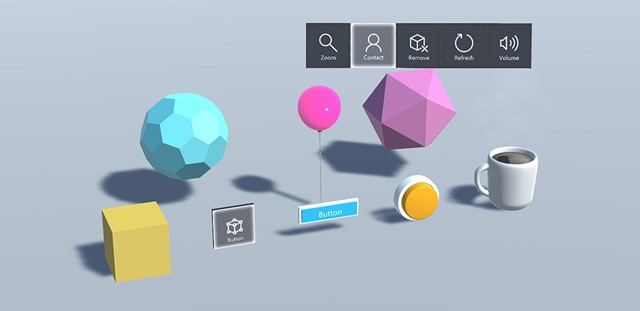
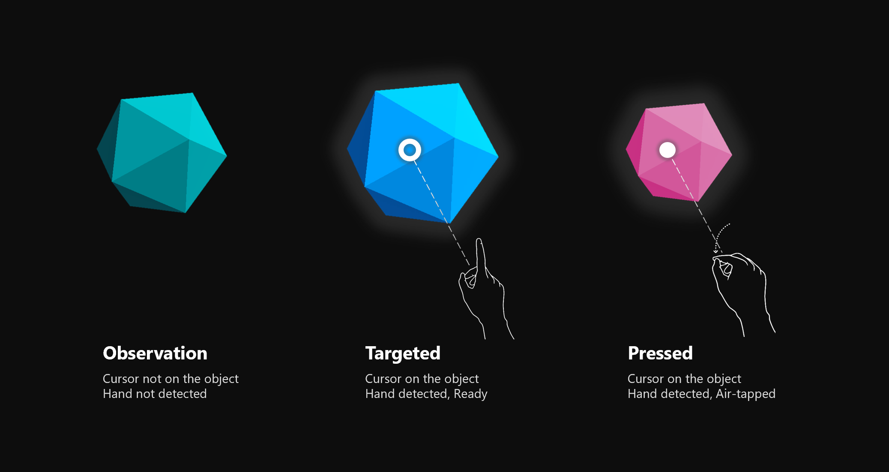
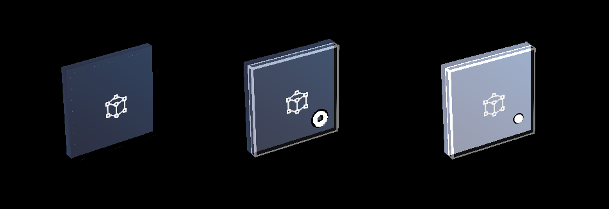
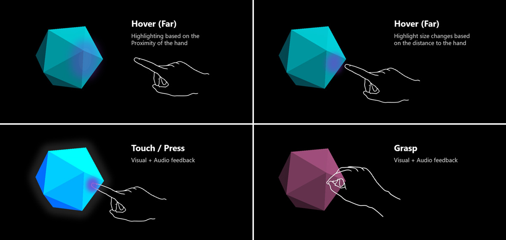
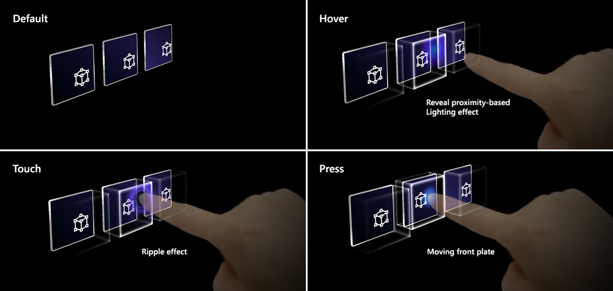
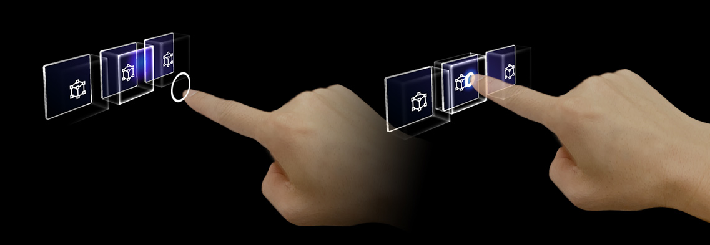
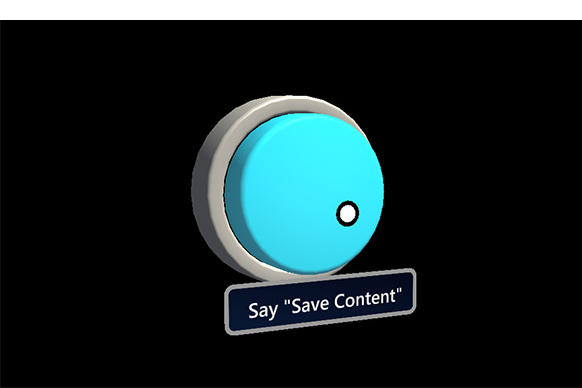

# Interactable object

A button has long been a metaphor used for triggering an event in the 2D abstract world. In the three-dimensional mixed reality world, we don’t have to be confined to this world of abstraction anymore. Anything can be an **interactable object** that triggers an event. An interactable object can be represented as anything from a coffee cup on the table to a balloon floating in the air. We still do make use of traditional buttons in certain situation such as in dialog UI. The visual representation of the button depends on the context.

## Important properties of the interactable object

### Visual cue

Visual cues are sensory cues received by the eye in the form of light and processed by the visual system during visual perception. Since the visual system is dominant in many species, especially humans, visual cues are a large source of information in how the world is perceived.

In mixed reality, since the holographic objects are mixed with the real-world environment, it could be difficult to understand which objects are interactable. For any interactable objects in your experience, it is important to provide differentiated visual cue for each input state. This helps the user understand which part of your experience is interactable and makes the user confident with consistent interaction method.

#### Far interactions

For any objects that user can interact with gaze, hand ray, and motion controller's ray, we recommend to have different visual cue for these three input states:
* **Default (Observation)**: Default idle state of the object.
* **Targeted (Hover)**: When the object is targeted with gaze cursor, finger proximity or motion controller's pointer.
* **Pressed**: When the object is pressed with air-tap gesture, finger press or motion controller's select button.

You can use techniques such as highlighting or scaling to provide visual cue to the user’s input states. In Windows Mixed Reality, you can find the examples of visualizing different input states on Start menu and App Bar buttons. 

 
*Example of visualizing observation state, targeted state, and pressed state*

 
*Observation state, targeted state, and pressed state on holographic button*

#### Near(direct) interactions

HoloLens 2 supports articulated hand tracking input which allows you to interact with objects. Without haptic feedback and perfect depth perception sometimes it can be hard to tell how far away your hand is from an object, or whether you are touching. It is important to provide enough visual cues to communicate the state of the object and in particular of your hands in relation to holograms.

Use visual feedback to communicate the following:
* **Default (Observation)**: Default idle state of the object.
* **Hover**: When hand is near a hologram, change visuals to communicate that hand is targeting hologram. 
* **Distance and point of interaction**: As hand approaches hologram, design feedback to communicate the projected point of interaction, as well as how far from the object the finger is
* **Contact Begin**: Change visuals (light, color) to communicate that touch has occured
* **Grasped**: Change visuals (light, color) when the object is grasped.
* **Contact End**: Change visuals (light, color) when touch has ended.

 
*Example of visualizing near interaction states*

The [Button in HoloLens 2](https://microsoft.github.io/MixedRealityToolkit-Unity/Documentation/README_Button.html) shows the example of visualizing different input interaction states.

 
*Example of pressable button in HoloLens 2*

In HoloLens 2, there is an additional visual cue which improves the user's confidence on the depth perception. The ring on the fingertip shows up and scales down as the fingertip gets closer to the object. The ring eventually converges into a dot on press state. This visual affordance helps the user understand the distance from the object.

 
*Fingertip ring visualization in HoloLens 2*

 
*Example of visual feedback based on the proximity - Bounding Box*

### Audio cue
For the direct hand interactions, proper audio feedback can dramatically improve the user experience. Use audio feedback to communicate the following:
* **Contact begin**: Play sound when touch begins
* **Contact end**: Play sound on touch end
* **Grab begin**: Play sound when grab starts
* **Grab end**: Play sound on grab end

### Voice command
For any interactable objects, it is important to support alternative interaction options. In default, it is recommended to support voice command for any objects that are interactable. To improve the discoverability, you can provide tooltip on hover state.

 *Tooltip for the voice command*

## Creating interactable object with Mixed Reality Toolkit (MRTK)

In the **[Mixed Reality Toolkit](https://github.com/Microsoft/MixedRealityToolkit-Unity)**, you can find the series of Unity scripts and prefabs that will help you create interactable objects. You can use these to make objects respond to various types of input interaction states.

* **[Interactable](https://microsoft.github.io/MixedRealityToolkit-Unity/Documentation/README_Interactable.html)**
* **[Button](https://microsoft.github.io/MixedRealityToolkit-Unity/Documentation/README_Button.html)**
* **[Hand Interaction Examples Scene](https://github.com/microsoft/MixedRealityToolkit-Unity/blob/mrtk_release/Documentation/README_HandInteractionExamples.md)**

MixedRealityToolkit's Standard shader provides various options such as **proximity light** that helps you create visual and audio cues.
* **[MRTK Standard Shader](https://github.com/microsoft/MixedRealityToolkit-Unity/blob/mrtk_development/Documentation/README_MRTKStandardShader.md)**

## See also

* **[Bounding Box](app-bar-and-bounding-box.md)**
* **[Object collection](object-collection.md)**
* **[Billboarding and tag-along](billboarding-and-tag-along.md)**
