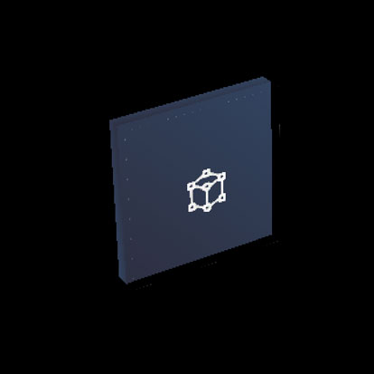
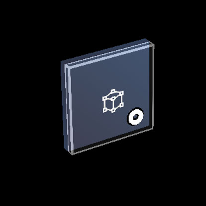
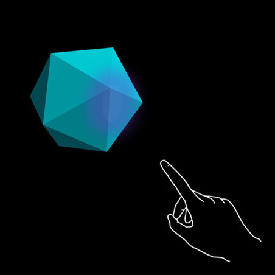
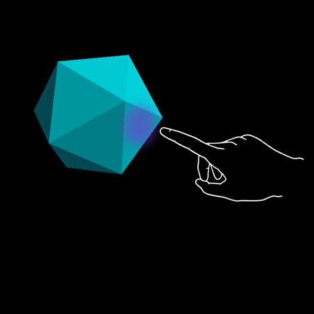
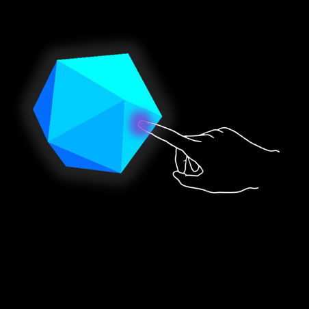
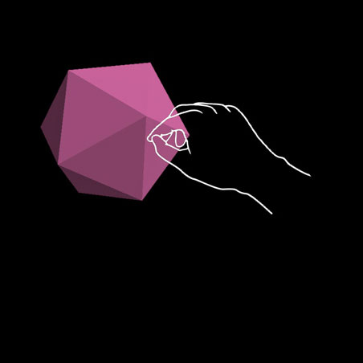
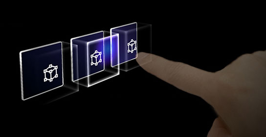
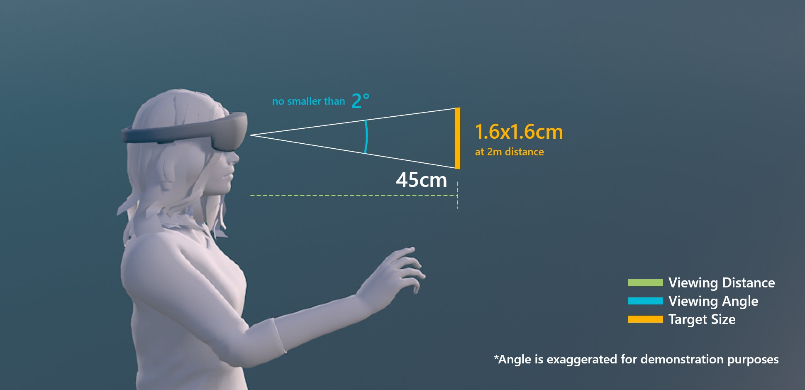
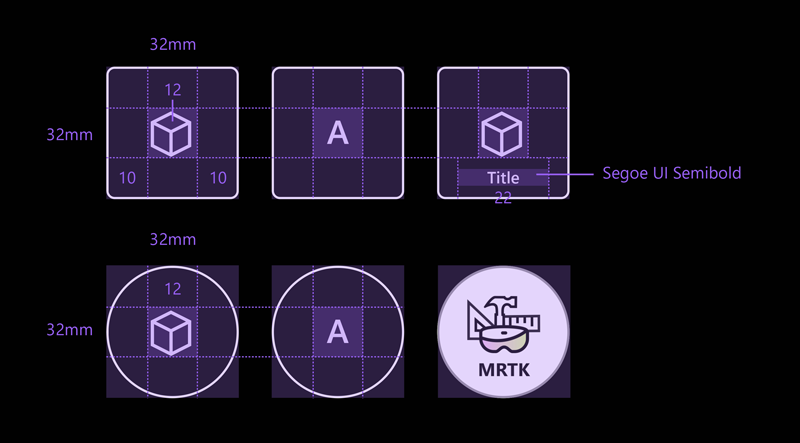
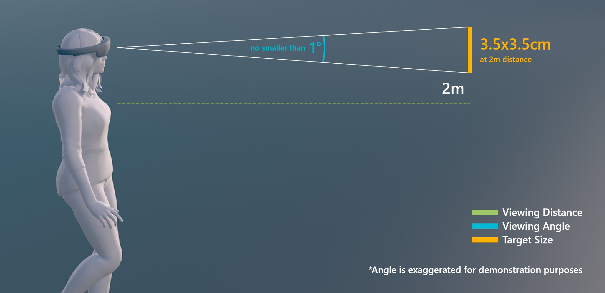

# Interactable object

A button has long been a metaphor used for triggering an event in the 2D abstract world. In the three-dimensional mixed reality world, we don’t have to be confined to this world of abstraction anymore. Anything can be an **interactable object** that triggers an event. An interactable object can be represented as anything from a coffee cup on the table to a balloon floating in the air. We still do make use of traditional buttons in certain situation such as in dialog UI. The visual representation of the button depends on the context.

## Important properties of the interactable object

### Visual cues

Visual cues are sensory cues received by the eye in the form of light and processed by the visual system during visual perception. Since the visual system is dominant in many species, especially humans, visual cues are a large source of information in how the world is perceived.

Since the holographic objects are blended with the real-world environment in mixed reality, it could be difficult to understand which objects you can interact with. For any interactable objects in your experience, it is important to provide differentiated visual cues for each input state. This helps the user understand which part of your experience is interactable and makes the user confident by using a consistent interaction method.

 

---

### Far interactions

For any objects that user can interact with gaze, hand ray, and motion controller's ray, we recommend to have different visual cue for these three input states:

:::row:::
    :::column:::
        
       **Default (Observation) state** 
        Default idle state of the object.
       The cursor is not on the object. Hand is not detected.
    :::column-end:::
    :::column:::
        
        **Targeted (Hover) state** 
        When the object is targeted with gaze cursor, finger proximity or motion controller's pointer.
        The cursor is on the object. Hand is detected, ready.
    :::column-end:::
    :::column:::
        
       **Pressed state** 
        When the object is pressed with an air tap gesture, finger press or motion controller's select button.
        The cursor is on the object. Hand is detected, air tapped.
    :::column-end:::
:::row-end:::

 

---

You can use techniques such as highlighting or scaling to provide visual cues for the user’s input state. In mixed reality, you can find the examples of visualizing different input states on the Start menu and with app bar buttons. 

Here is what these states look like on a **holographic button**:

:::row:::
    :::column:::
        
       **Default (Observation) state** 
    :::column-end:::
    :::column:::
        
        **Targeted (Hover) state** 
    :::column-end:::
    :::column:::
        
       **Pressed state** 
    :::column-end:::
:::row-end:::

 

---

### Near interactions (direct) 

HoloLens 2 supports articulated hand tracking input which allows you to interact with objects. Without haptic feedback and perfect depth perception sometimes it can be hard to tell how far away your hand is from an object, or whether you are touching. It is important to provide enough visual cues to communicate the state of the object and in particular of your hands in relation to holograms.

Use visual feedback to communicate the following:
* **Default (Observation)**: Default idle state of the object.
* **Hover**: When a hand is near a hologram, change visuals to communicate that hand is targeting hologram. 
* **Distance and point of interaction**: As the hand approaches a hologram, design feedback to communicate the projected point of interaction, as well as how far from the object the finger is
* **Contact begins**: Change visuals (light, color) to communicate that a touch has occurred
* **Grasped**: Change visuals (light, color) when the object is grasped
* **Contact ends**: Change visuals (light, color) when touch has ended

 

---

:::row:::
    :::column:::
         
        **Hover (Far)** 
        Highlighting based on the proximity of the hand.
    :::column-end:::
    :::column:::
         
        **Hover (Near)** 
        Highlight size changes based on the distance to the hand.
    :::column-end:::
:::row-end:::

:::row:::
    :::column:::
         
        **Touch / press** 
        Visual plus audio feedback.
    :::column-end:::
    :::column:::
         
        **Grasp** 
        Visual plus audio feedback.
    :::column-end:::
:::row-end:::

 

---

A [button on HoloLens 2](https://microsoft.github.io/MixedRealityToolkit-Unity/Documentation/README_Button.html) is an example of visualizing different input interaction states:

 

---

:::row:::
    :::column:::
         
        **Default** 
    :::column-end:::
    :::column:::
         
        **Hover** 
        Reveal a proximity-based lighting effect.
    :::column-end:::
:::row-end:::

:::row:::
    :::column:::
         
        **Touch** 
        Show ripple effect.
    :::column-end:::
    :::column:::
         
        **Press** 
        Moving front plate.
    :::column-end:::
:::row-end:::

 

---

:::row:::
    :::column:::
        ### An additional visual cue on HoloLens 2 
        On HoloLens 2, there is an additional visual cue which can help the user's perception of depth. A ring near their fingertip shows up and scales down as the fingertip gets closer to the object. The ring eventually converges into a dot when the pressed state is reached. This visual affordance helps the user understand how far they are from the object. 
         
        *Animation: Example of visual feedback based on the proximity - Bounding box**
    :::column-end:::
        :::column:::
         
        
    :::column-end:::
:::row-end:::

 

---

### Audio cues

For direct hand interactions, proper audio feedback can dramatically improve the user experience. Use audio feedback to communicate the following:
* **Contact begins**: Play sound when touch begins
* **Contact ends**: Play sound on touch end
* **Grab begins**: Play sound when grab starts
* **Grab ends**: Play sound when grab ends

 

---

:::row:::
    :::column:::
        ### Voice commanding 
        For any interactable objects, it is important to support alternative interaction options. By default, we recommend that [voice commanding](voice-design.md) be supported for any objects that are interactable. To improve discoverability, you can also provide a tooltip during the hover state. 
         
        *Image: Tooltip for the voice command*
    :::column-end:::
        :::column:::
        
    :::column-end:::
:::row-end:::

 

---

## Sizing recommendations 

To ensure that all interactable objects can easily be touched by users, we recommend that you make sure the interactable meets a minimum size (the visual angle often measured in degrees of visual arc) based on the distance it is placed from the user. Visual angle is based on the distance between the user's eyes and the object and stays constant, while the physical size of the target may change as the distance from the user changes. To determine the necessary physical size of an object based on the distance from the user, try using a visual angle calculator such as [this one](http://elvers.us/perception/visualAngle/).

Below are the recommendations for minimum sizes of interactable content.

### Target size for direct hand interaction
| Distance | Viewing angle | Size |
|---------|---------|---------|
| 45cm  | no smaller than 2° | 1.6 x 1.6 cm |

 
*Target size for direct hand interaction*

When creating buttons for direct interaction, we recommend a larger minimum size of 3.2 x 3.2 cm to ensure that there is enough space to contain an icon and potentially some text**

| Distance | Minimum size |
|---------|---------|
| 45cm  | 3.2 x 3.2 cm |

 
*Target size for the buttons*

### Target size for hand ray or gaze interaction
| Distance | Viewing angle | Size |
|---------|---------|---------|
| 2m  | no smaller than 1° | 3.5 x 3.5 cm |

 
*Target size for hand ray or gaze interaction*

## Creating interactable object with Mixed Reality Toolkit (MRTK)

In the **[Mixed Reality Toolkit](https://github.com/Microsoft/MixedRealityToolkit-Unity)**, you can find the series of Unity scripts and prefabs that will help you create interactable objects. You can use these to make objects respond to various types of input interaction states.

* [Interactable](https://microsoft.github.io/MixedRealityToolkit-Unity/Documentation/README_Interactable.html)
* [Button](https://microsoft.github.io/MixedRealityToolkit-Unity/Documentation/README_Button.html)
* [Hand interaction examples scene](https://github.com/microsoft/MixedRealityToolkit-Unity/blob/mrtk_release/Documentation/README_HandInteractionExamples.md)

MixedRealityToolkit's Standard shader provides various options such as **proximity light** that helps you create visual and audio cues.
* [MRTK Standard Shader](https://github.com/microsoft/MixedRealityToolkit-Unity/blob/mrtk_development/Documentation/README_MRTKStandardShader.md)

## See also

* [Bounding box](app-bar-and-bounding-box.md)
* [Object collection](object-collection.md)
* [Billboarding and tag-along](billboarding-and-tag-along.md)
* [Voice input](voice-input.md)
