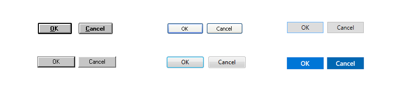
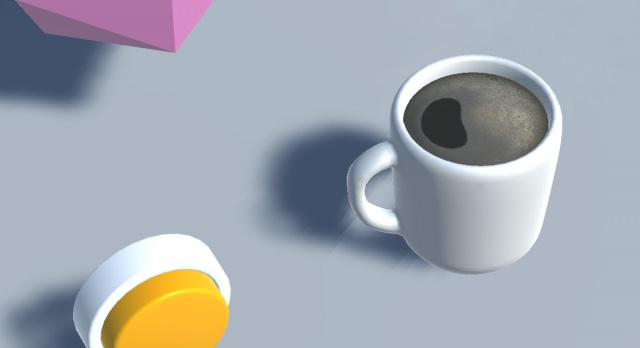
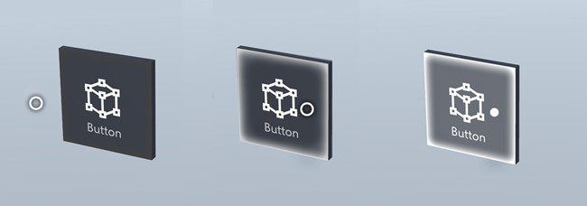
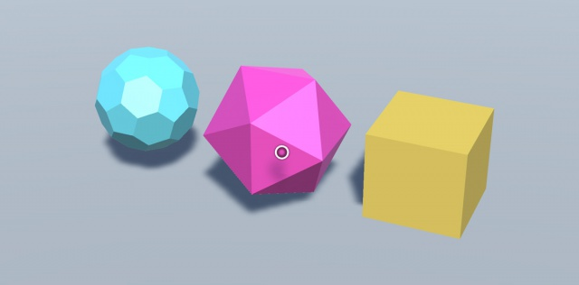
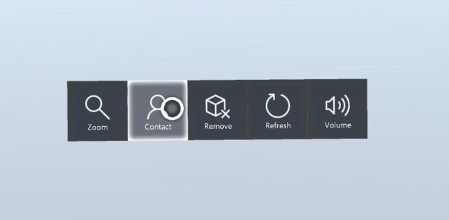
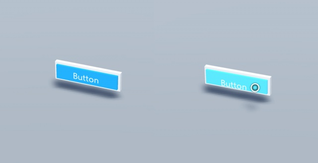
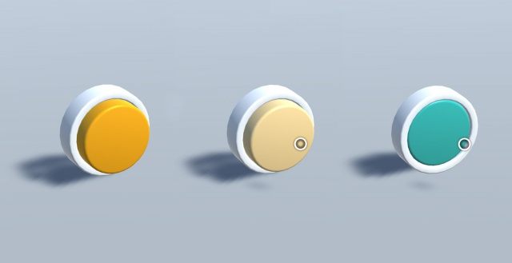
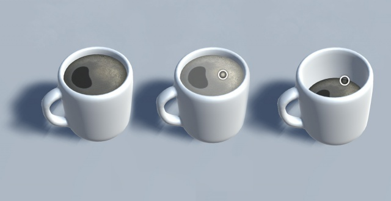

# Interactable object

A button has long been a metaphor used for triggering an event in the 2D abstract world. In the three-dimensional mixed reality world, we don’t have to be confined to this world of abstraction anymore. Anything can be an **Interactable object** that triggers an event. An interactable object can be represented as anything from a coffee cup on the table to a balloon floating in the air. We still do make use of traditional buttons in certain situation such as in dialog UI. The visual representation of the button depends on the context.

## What is a button?

In the two-dimensional world, a button control is commonly used to trigger an event or action. Typically, it's presented as a rectangular shape with different visuals for each interaction state such as idle, hover and pressed. To reinforce this affordance, buttons sometimes include additional visual cues such as shadow or bevel - this was typical in the early days of UI design. Buttons have gradually become flat and more abstract with modern design trends.

 
*The evolution of button design in the two-dimensional world*

In the **[Mixed Reality Toolkit](https://github.com/Microsoft/MixedRealityToolkit-Unity/blob/master/Assets/HoloToolkit-Examples/UX/Readme/README_InteractableObjectExample.md)**, we have created a series of Unity scripts and prefabs that will help you create Interactable objects. You can use these to create any type of object that the user can interact with, using these standard interaction states: observation, targeted and pressed. You can easily customize the visual design with your own assets. Detailed animations can be customized by either creating and assigning corresponding animation clips for the interaction states in the Unity's animation controller or using offset and scale. You can find various examples in the **[InteractableObjectExample scene](https://github.com/Microsoft/MixedRealityToolkit-Unity/blob/master/Assets/HoloToolkit-Examples/UX/Scenes/InteractableObjectExample.unity)**.

 
*Any type of object can now be a button*

## Visual feedback for the different input interaction states

In mixed reality, since the holographic objects are mixed with the real-world environment, it could be difficult to understand which objects are interactable. For any interactable objects in your experience, it is important to provide differentiated visual feedback for each input state. This helps the user understand which part of your experience is interactable and makes the user confident with consistent interaction method.

For any objects that user can interact with, we recommended to have different visual feedback for these three input states:
* **Observation**: Default idle state of the object.
* **Targeted**: When the object is targeted with gaze cursor or motion controller's pointer.
* **Pressed**: When the object is pressed with air-tap gesture or motion controller's select button.

 
*Observation state, targeted state, and pressed state*

In Windows Mixed Reality, you can find the examples of visualizing different input states on Start menu and App Bar buttons. You can use techniques such as highlighting or scaling to provide visual feedback to the user’s input states.

## Interactable object samples

### Mesh button

These are examples using primitives and imported 3D meshes as Interactable objects. You can easily assign different scale, offset and color values to respond to each input interaction state.

### Toolbar

A toolbar is a widely used pattern in mixed reality experiences. It is a simple collection of buttons with additional behaviors such as [Billboarding and tag-along](billboarding-and-tag-along.md). This example uses a Billboarding and tag-along script from the MixedRealityToolkit. You can control detailed behaviors including distance, moving speed and threshold values.

### Traditional button

This example shows a traditional 2D style button. Each input state has a slightly different depth and animation property.

### Other examples

 
*Push button*
 
 
*Real life object*

With HoloLens, you can leverage physical space. Imagine a holographic push button on a physical wall. Or how about a coffee cup on a real table? Using 3D models imported from modeling software, we can create an Interactable object that resembles real life object. Since it's a digital object, we can add magical interactions to it.

## Interactable object in Unity
You can find the [examples of Interactable object in Mixed Reality Toolkit](https://github.com/Microsoft/MixedRealityToolkit-Unity/blob/master/Assets/HoloToolkit-Examples/UX/Readme/README_InteractableObjectExample.md)

## See also
* [Object collection](object-collection.md)
* [Billboarding and tag-along](billboarding-and-tag-along.md)
