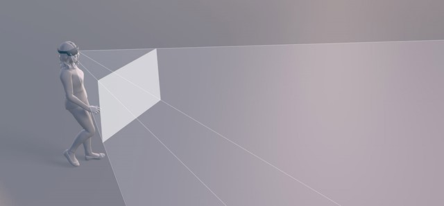

# Interaction fundamentals

As we've built experiences across HoloLens and immersive headsets, we've started writing down some things we found useful to share. Think of these as the fundamental building blocks for mixed reality interaction design.

## Device support

Here's an outline of the available Interaction design articles and which device type or types they apply to.
 

<table>
<tr>
<th style="width:175px">Input</th><th style="width:125px; text-align: center;"> <a href="hololens-hardware-details.md">HoloLens (1st gen)</a></th><th style="width:125px; text-align: center;">HoloLens 2</th><th style="width:125px; text-align: center;"> <a href="immersive-headset-hardware-details.md">Immersive headsets</a></th>
</tr><tr>
<td> <a href="gestures.md">Articulated hands</a></td><td style="text-align: center;"></td><td style="text-align: center;">✔️</td><td style="text-align: center;"></td>
</tr><tr>
<td> <a href="gaze-targeting.md">Eye targeting</a></td><td style="text-align: center;"></td><td style="text-align: center;">✔️</td><td style="text-align: center;"></td>
</tr><tr>
<td> <a href="gaze-targeting.md">Gaze targeting</a></td><td style="text-align: center;">✔️</td><td style="text-align: center;">✔️</td><td style="text-align: center;">✔️</td>
</tr><tr>
<td> <a href="gestures.md">Gestures</a></td><td style="text-align: center;">✔️</td><td style="text-align: center;">✔️</td><td></td>
</tr><tr>
<td> <a href="voice-design.md">Voice design</a></td><td style="text-align: center;">✔️</td><td style="text-align: center;">✔️</td><td style="text-align: center;">✔️</td>
</tr><tr>
<td> Gamepad</td><td style="text-align: center;">✔️</td><td style="text-align: center;">✔️</td><td style="text-align: center;">✔️</td>
</tr><tr>
<td> <a href="motion-controllers.md">Motion controllers</a></td><td></td><td style="text-align: center;"></td><td style="text-align: center;">✔️</td>
</tr><tr>
<th style="width:175px">Perception and spatial features</th><th style="width:125px; text-align: center;"> <a href="hololens-hardware-details.md">HoloLens (1st gen)</a></th><th style="width:125px; text-align: center;">HoloLens 2</th><th style="width:125px; text-align: center;"> <a href="immersive-headset-hardware-details.md">Immersive headsets</a></th>
</tr><tr>
<td> <a href="spatial-sound-design.md">Spatial sound design</a></td><td style="text-align: center;">✔️</td><td style="text-align: center;">✔️</td><td style="text-align: center;">✔️</td>
</tr><tr>
<td> <a href="spatial-mapping-design.md">Spatial mapping design</a></td><td style="text-align: center;">✔️</td><td style="text-align: center;">✔️</td><td></td>
</tr><tr>
<td> <a href="hologram.md">Holograms</a></td><td style="text-align: center;">✔️</td><td style="text-align: center;">✔️</td><td></td>
</tr>
</table>

## The user is the camera

Always think about design for your user's point of view as they move about their real and virtual worlds.

**Some questions to ask**
* Is the user sitting, reclining, standing, or walking while using your experience?
* How does your content adjust to different positions?
* Can the user adjust it?
* Will the user be comfortable using your app?

**Best practices**
* The user is the camera and they control the movement. Let them drive.
* If you need to virtually transport the user, be sensitive to issues around vestibular discomfort.
* Use shorter animations
* Animate from down/left/right or fade in instead of Z
* Slow down timing
* Allow user to see the world in the background

**What to avoid**
* Don't shake the camera or purposely lock it to 3DOF (only orientation, no translation), it can make users feel uncomfortable.
* No abrupt movement. If you need to bring content to or from the user, move it slowly and smoothly toward them for maximum comfort. Users will react to large menus coming at them.
* Don't accelerate or turn the user's camera. Users are sensitive to acceleration (both angular and translational).

## Leverage the user's perspective

Users see the world of mixed reality through displays on immersive and holographic devices. On the HoloLens, this display is called the [holographic frame](holographic-frame.md).

In 2D development, frequently accessed content and settings may be placed in the corners of a screen to make them easily accessible. However, in holographic apps, content in the corners of the user's view may be uncomfortable to access. In this case, the center of the holographic frame is the prime location for content.

The user may need to be guided to help locate important events or objects beyond their immediate view. You can use arrows, light trails, character head movement, thought bubbles, pointers, spatial sound, and voice prompts to help guide the user to important content in your app.

It is recommended to not lock content to the screen for the user's comfort. If you need to keep content in view, place it in the world and make the content "tag-along" like the Start menu. Content that gets pulled along with the user's perspective will feel more natural in the environment.

 
*The Start menu follows the user's view when it reaches the edge of the frame*

On HoloLens, holograms feel real when they fit within the holographic frame since they don't get cut off. Users will move in order to see the bounds of a hologram within the frame. On HoloLens, it's important to simplify your UI to fit within the user's view and keep your focus on the main action. For immersive headsets, it's important to maintain the illusion of a persistent virtual world within the device's field of view.

## User comfort

To ensure maximum [comfort](comfort.md) on head-mounted displays, it’s important for designers and developers to create and present content in a way that mimics how humans interpret 3D shapes and the relative position of objects in the natural world. From a physical perspective, it is also important to design content that does not require fatiguing motions of the neck or arms.

Whether developing for HoloLens or immersive headsets, it is important to render visuals for both eyes. Rendering a heads-up display in one eye only can make an interface hard to understand, as well as causing uneasiness to the user's eye and brain.

## Share your experience

Using [mixed reality capture](mixed-reality-capture.md), users can capture a photo or video of their experience at any time. Consider experiences in your app where you may want to encourage snapshots or videos.

## Leverage basic UI elements of the Windows Mixed Reality home

Just like the Windows PC experience starts with the desktop, Windows Mixed Reality starts with the home. The [Windows Mixed Reality home](navigating-the-windows-mixed-reality-home.md) leverages our innate ability to understand and navigate 3D places. With HoloLens, your home is your physical space. With immersive headsets, your home is a virtual place.

Your home is also where you’ll use the Start menu to open and place apps and content. You can fill your home with mixed reality content and multitask by using multiple apps at the same time. The things you place in your home stay there, even if you restart your device.

## See also
* [Gaze targeting](gaze-targeting.md)
* [Gestures](gestures.md)
* [Voice design](voice-design.md)
* [Motion controllers](motion-controllers.md)
* [Spatial sound design](spatial-sound-design.md)
* [Spatial mapping design](spatial-mapping-design.md)
* [Comfort](comfort.md)
* [Navigating the Windows Mixed Reality home](navigating-the-windows-mixed-reality-home.md)
