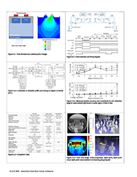

# Depth camera whitepaper - ISSCC 2018

**Title:** 1Mpixel 65nm BSI 320MHz Demodulated TOF Image Sensor with 3.5μm Global Shutter Pixels and Analog Binning

**Contributors:** Cyrus S Bamji, Swati Mehta, Barry Thompson, Tamer Elkhatib, Stefan Wurster, Onur Akkaya, Andrew Payne, John Godbaz, Mike Fenton, Vijay Rajasekaran, Larry Prather, Satya Nagaraja, Vishali Mogallapu, Dane Snow, Rich McCauley, Mustansir Mukadam, Iskender Agi, Shaun McCarthy, Zhanping Xu, Travis Perry, William Qian, Vei-Han Chan, Prabhu Adepu, Gazi Ali, Muneeb Ahmed, Aditya Mukherjee, Sheethal Nayak, Dave Gampell, Sunil Acharya, Lou Kordus, Pat O'Connor

**Presented at ISSCC 2018 and published in ISSCC Deg. Tech. Papers, Feb 2018.**

C. Bamji et al., “1Mpixel 65nm BSI 320MHz Demodulated TOF Image Sensor with 3.5μm Global Shutter Pixels and Analog Binning,” ISSCC Deg. Tech. Papers, pp. 94-95, Feb 2018. IEEE Explore Link: https://ieeexplore.ieee.org/document/8310200/

© 2018 IEEE. Personal use of this material is permitted. Permission from IEEE must be obtained for all other uses, in any current or future media, including reprinting/republishing this material for advertising or promotional purposes, creating new collective works, for resale or redistribution to servers or lists, or reuse of any copyrighted component of this work in other works.

**Whitepaper:** 
 
[Download depth camera whitepaper](images/Depth-Camera-ISSCC-2018.pdf)
