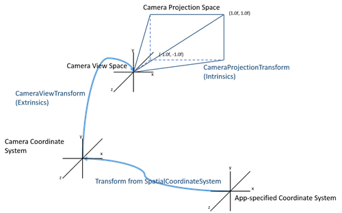

# Locatable camera

HoloLens includes a world-facing camera mounted on the front of the device which enables apps to see what the user sees. Developers have access to and control of the camera just as they would for color cameras on smartphones, portables, or desktops. The same universal windows [media capture](https://msdn.microsoft.com/library/windows/apps/windows.media.capture.mediacapture.aspx) and windows media foundation APIs that work on mobile and desktop work on HoloLens. Unity [has also wrapped these windows APIs](locatable-camera-in-unity.md) to abstract simple usage of the camera on HoloLens for tasks such as taking regular photos and videos (with or without holograms) and locating the camera's position in and perspective on the scene.

## Device Camera Information
* Fixed focus with auto white balance and auto exposure and full image processing pipe
* A white Privacy LED facing the world will illuminate whenever the camera is active
* The camera supports the following modes (all modes are 16:9 aspect ratio) at 30, 24, 20, 15, and 5 fps:

|  Video  |  Preview  |  Still  |  Horizontal Field of View (H-FOV) |  Suggested usage | 
|----------|----------|----------|----------|----------|
|  1280x720 |  1280x720 |  1280x720 |  45deg  |  (default mode) | 
|  N/A |  N/A |  2048x1152 |  67deg |  Highest resolution still image | 
|  1408x792 |  1408x792 |  1408x792 |  48deg |  Overscan (padding) resolution for video stabilization | 
|  1344x756 |  1344x756 |  1344x756 |  67deg |  Large FOV video mode with overscan | 
|  896x504 |  896x504 |  896x504 |  48deg |  Low power / Low resolution mode for image processing tasks | 

## Locating the Device Camera in the World

When HoloLens takes photos and videos, the captured frames include the location of the camera in the world, as well as the perspective projection of the camera. This allows applications to reason about the position of the camera in the real world for augmented imaging scenarios. Developers can creatively roll their own scenarios using their favorite image processing or custom computer vision libraries.

"Camera" elsewhere in HoloLens documentation may refer to the "virtual game camera" (the frustum the app renders to). Unless denoted otherwise, "camera" on this page refers to the real-world RGB color camera.

The details on this page cover [Media Foundation Attributes](https://msdn.microsoft.com/library/windows/desktop/mt740395(v=vs.85).aspx), however there are also APIs to pull camera intrinsics using [WinRT APIs](https://msdn.microsoft.com/library/windows/apps/windows.media.devices.core.cameraintrinsics).  

### Images with Coordinate Systems

Each image frame (whether photo or video) includes a coordinate system, as well as two important transforms. The "view" transform maps from the provided coordinate system to the camera, and the "projection" maps from the camera to pixels in the image. Together, these transforms define for each pixel a ray in 3D space representing the path taken by the photons that produced the pixel. These rays can be related to other content in the app by obtaining the transform from the frame's coordinate system to some other coordinate system (e.g. from a [stationary frame of reference](coordinate-systems.md#stationary-frame-of-reference)). To summarize, each image frame provides the following:
* Pixel Data (in RGB/NV12/JPEG/etc. format)
* 3 pieces of metadata (stored as [IMFAttributes](https://msdn.microsoft.com/library/windows/desktop/ms704598(v=vs.85).aspx)) that make each frame "locatable":

|  Attribute name  |  Type  |  GUID  |  Description | 
|----------|----------|----------|----------|
|  MFSampleExtension_Spatial_CameraCoordinateSystem  |  IUnknown ([SpatialCoordinateSystem](https://msdn.microsoft.com/library/windows/apps/windows.perception.spatial.spatialcoordinatesystem.aspx))  |  {9D13C82F-2199-4E67-91CD-D1A4181F2534}  |  Stores the [coordinate system](coordinate-systems-in-directx.md) of the captured frame | 
|  MFSampleExtension_Spatial_CameraViewTransform  |  Blob ([Matrix4x4](https://msdn.microsoft.com/library/windows/apps/windows.foundation.numerics.matrix4x4.aspx))  |  {4E251FA4-830F-4770-859A-4B8D99AA809B}  |  Stores the camera's extrinsic transform in the coordinate system | 
|  MFSampleExtension_Spatial_CameraProjectionTransform  |  Blob ([Matrix4x4](https://msdn.microsoft.com/library/windows/apps/windows.foundation.numerics.matrix4x4.aspx))  |  {47F9FCB5-2A02-4F26-A477-792FDF95886A}  |  Stores the camera's projection transform | 

The projection transform represents the intrinsic properties (focal length, center of projection, skew) of the lens mapped onto an image plane that extends from -1 to +1 in both the X and Y axis.

```
Matrix4x4 format          Terms
   m11 m12 m13 m14      fx    0   0   0
   m21 m22 m23 m24     skew  fy   0   0
   m31 m32 m33 m34      cx   cy   A  -1
   m41 m42 m43 m44       0    0   B   0
```

Different applications will have different coordinate systems. Here's an overview of the flow to locate a camera pixel for a single application:



### Camera to Application-specified Coordinate System

To go from the 'CameraView' and 'CameraCoordinateSystem' to your application/world coordinate system, you'll need the following:

[Locatable camera in Unity](locatable-camera-in-unity.md): CameraToWorldMatrix is automatically provided by PhotoCaptureFrame class(so you don't need to worry about the CameraCoordinateSystem transforms).

[Locatable camera in DirectX](locatable-camera-in-directx.md): Shows the fairly straightforward way to query for the transform between the camera's coordinate system and your own application coordinate system(s).

### Application-specified Coordinate System to Pixel Coordinates

Let's say you wanted to find or draw at a specific 3d location on a camera image:

The view and projection transforms, while both 4x4 matrices, need to be utilized slightly differently. Namely after performing the Projection, one would 'normalize by w', this extra step in the projection simulates how multiple different 3d locations can end up as the same 2d location on a screen (i.e. anything along a certain ray will show up on the same pixel). So key points (in shader code):

```
// Usual 3d math:
 float4x4 WorldToCamera = inverse( CameraToWorld );
 float4 CameraSpacePos = mul( WorldToCamera, float4( WorldSpacePos.xyz, 1 ) ); // use 1 as the W component
 // Projection math:
 float4 ImagePosUnnormalized = mul( CameraProjection, float4( CameraSpacePos.xyz, 1 ) ); // use 1 as the W component
 float2 ImagePosProjected = ImagePosUnnormalized.xy / ImagePosUnnormalized.w; // normalize by W, gives -1 to 1 space
 float2 ImagePosZeroToOne = ( ImagePosProjected * 0.5 ) + float2( 0.5, 0.5 ); // good for GPU textures
 int2 PixelPos = int2( ImagePosZeroToOne.x * ImageWidth, ( 1 - ImagePosZeroToOne.y ) * ImageHeight ); // good for CPU textures
```

### Pixel to Application-specified Coordinate System

Going from pixel to world coordinates is a little trickier:

```
float2 ImagePosZeroToOne = float2( PixelPos.x / ImageWidth, 1.0 - (PixelPos.y / ImageHeight ) );
 float2 ImagePosProjected = ( ( ImagePosZeroToOne * 2.0 ) - float2(1,1) ); // -1 to 1 space
 float3 CameraSpacePos = UnProjectVector( Projection, float3( ImagePosProjected, 1) );
 float3 WorldSpaceRayPoint1 = mul( CameraToWorld, float4(0,0,0,1) ); // camera location in world space
 float3 WorldSpaceRayPoint2 = mul( CameraToWorld, CameraSpacePos ); // ray point in world space
```

Where we define UnProject as:

```
public static Vector3 UnProjectVector(Matrix4x4 proj, Vector3 to)
 {
   Vector3 from = new Vector3(0, 0, 0);
   var axsX = proj.GetRow(0);
   var axsY = proj.GetRow(1);
   var axsZ = proj.GetRow(2);
   from.z = to.z / axsZ.z;
   from.y = (to.y - (from.z * axsY.z)) / axsY.y;
   from.x = (to.x - (from.z * axsX.z)) / axsX.x;
   return from;
 }
```

To find the actual world location of a point, you'll need either: two world rays and find their intersection, or a known size of the points.

### Distortion Error

On HoloLens, the video and still image streams are undistorted in the system's image processing pipeline before the frames are made available to the application (the preview stream contains the original distorted frames). Because only the projection matrix is made available, applications must assume image frames represent a perfect pinhole camera, however the undistortion function in the image processor may still leave an error of up to 10 pixels when using the projection matrix in the frame metadata. In many use cases, this error will not matter, but if you are aligning holograms to real world posters/markers, for example, and you notice a <10px offset (roughly 11mm for holograms positioned 2 meters away) this distortion error could be the cause.

## Locatable Camera Usage Scenarios

### Show a photo or video in the world where it was captured

The Device Camera frames come with a "Camera To World" transform, that can be used to show exactly where the device was when the image was taken. For example you could position a small holographic icon at this location (CameraToWorld.MultiplyPoint(Vector3.zero)) and even draw a little arrow in the direction that the camera was facing (CameraToWorld.MultiplyVector(Vector3.forward)).

### Painting the world using a camera shader

In this section we'll create a material 'shader' that colors the world based on where it showed up in a device camera's view. Effectively what we'll do is that every vertex will figure out its location relative to the camera, and then every pixel will utilize the 'projection matrix' to figure out which image texel it is associated with. Lastly, and optionally, we'll fade out the corners of the image to make it appear more as a dream-like memory:

```
// In the vertex shader:
 float4 worldSpace = mul( ObjectToWorld, float4( vertexPos.xyz, 1));
 float4 cameraSpace = mul( CameraWorldToLocal, float4(worldSpace.xyz, 1));

 // In the pixel shader:
 float4 unprojectedTex = mul( CameraProjection, float4( cameraSpace .xyz, 1));
 float2 projectedTex = (unprojectedTex.xy / unprojectedTex.w);
 float2 unitTexcoord = ((projectedTex * 0.5) + float4(0.5, 0.5, 0, 0));
 float4 cameraTextureColor = tex2D(_CameraTex, unitTexcoord);
 // Fade out edges for better look:
 float pctInView = saturate((1.0 - length(projectedTex.xy)) * 3.0);
 float4 finalColor = float4( cameraTextureColor.rgb, pctInView );
```

### Tag / Pattern / Poster / Object Tracking

Many mixed reality applications use a recognizable image or visual pattern to create a trackable point in space. This is then used to render objects relative to that point or create a known location. Some uses for HoloLens include finding a real world object tagged with fiducials (e.g. a TV monitor with a QR code), placing holograms over fiducials, and visually pairing with non-HoloLens devices like tablets that have been setup to communicate with HoloLens via Wi-Fi.

To recognize a visual pattern, and then place that object in the applications world space, you'll need a few things:
1. An image pattern recognition toolkit, such as QR code, AR tags, face finder, circle trackers, OCR etc.
2. Collect image frames at runtime, and pass them to the recognition layer
3. Unproject their image locations back into world positions, or likely world rays. See
4. Position your virtual models over these world locations

Some important image processing links:
* [OpenCV](http://opencv.org/)
* [QR Tags](https://en.wikipedia.org/wiki/QR_code)
* [FaceSDK](http://research.microsoft.com/en-us/projects/facesdk/)
* [Microsoft Translator](https://www.microsoft.com/en-us/translator/products.aspx)

Keeping an interactive application frame-rate is critical, especially when dealing with long-running image recognition algorithms. For this reason we commonly use the following pattern:
1. Main Thread: manages the camera object
2. Main Thread: requests new frames (async)
3. Main Thread: pass new frames to tracking thread
4. Tracking Thread: processes image to collect key points
5. Main Thread: moves virtual model to match found key points
6. Main Thread: repeat from step 2

Some image marker systems only provide a single pixel location (others provide the full transform in which case this section will not be needed), which equates to a ray of possible locations. To get to a single 3d location we can then leverage multiple rays and find the final result by their approximate intersection. To do this you'll need to:
1. Get a loop going collecting multiple camera images
2. Find the [associated feature points](#pixel-to-application-specified-coordinate-system), and their world rays
3. When you have a dictionary of features, each with multiple world rays, you can use the following code to solve for the intersection of those rays:

```
public static Vector3 ClosestPointBetweenRays(
   Vector3 point1, Vector3 normalizedDirection1,
   Vector3 point2, Vector3 normalizedDirection2) {
   float directionProjection = Vector3.Dot(normalizedDirection1, normalizedDirection2);
   if (directionProjection == 1) {
     return point1; // parallel lines
   }
   float projection1 = Vector3.Dot(point2 - point1, normalizedDirection1);
   float projection2 = Vector3.Dot(point2 - point1, normalizedDirection2);
   float distanceAlongLine1 = (projection1 - directionProjection * projection2) / (1 - directionProjection * directionProjection);
   float distanceAlongLine2 = (projection2 - directionProjection * projection1) / (directionProjection * directionProjection - 1);
   Vector3 pointOnLine1 = point1 + distanceAlongLine1 * normalizedDirection1;
   Vector3 pointOnLine2 = point2 + distanceAlongLine2 * normalizedDirection2;
   return Vector3.Lerp(pointOnLine2, pointOnLine1, 0.5f);
 }
```

Given two or more tracked tag locations, you can position a modelled scene to fit the users current scenario. If you can't assume gravity, then you'll need three tag locations. In many cases we use a simple color scheme where white spheres represent real-time tracked tag locations, and blue spheres represent modelled tag locations, this allows the user to visually gauge the alignment quality. We assume the following setup in all our applications:
* Two or more modelled tag locations
* One 'calibration space' which in the scene is the parent of the tags
* Camera feature identifier
* Behavior which moves the calibration space to align the modelled tags with the real-time tags (we are careful to move the parent space, not the modelled markers themselves, because other connect is positions relative to them).

```
// In the two tags case:
 Vector3 idealDelta = (realTags[1].EstimatedWorldPos - realTags[0].EstimatedWorldPos);
 Vector3 curDelta = (modelledTags[1].transform.position - modelledTags[0].transform.position);
 if (IsAssumeGravity) {
   idealDelta.y = 0;
   curDelta.y = 0;
 }
 Quaternion deltaRot = Quaternion.FromToRotation(curDelta, idealDelta);
 trans.rotation = Quaternion.LookRotation(deltaRot * trans.forward, trans.up);
 trans.position += realTags[0].EstimatedWorldPos - modelledTags[0].transform.position;
```

### Render holograms from the Camera's position

Note: If you are trying to create your own [Mixed reality capture (MRC)](mixed-reality-capture.md), which blends holograms with the Camera stream, you can use the [MRC effects](mixed-reality-capture-for-developers.md) or enable the showHolograms property in [Locatable camera in Unity](locatable-camera-in-unity.md).

If you'd like to do a special render directly on the RGB Camera stream, it's possible to render holograms in space from the Camera's position in sync with a video feed in order to provide a custom hologram recording/live preview.

In Skype, we do this to show the remote client what the HoloLens user is seeing and allow them to interact with the same holograms. Before sending over each video frame through the Skype service, we grab each frame's corresponding camera data. We then package the camera's extrinsic and intrinsic metadata with the video frame and then send it over the Skype service.

On the receiving side, using Unity, we've already synced all of the holograms in the HoloLens user's space using the same coordinate system. This allows us to use the camera's extrinsic metadata to place the Unity camera in the exact place in the world (relative to the rest of the holograms) that the HoloLens user was standing when that video frame was captured, and use the camera intrinsic information to ensure the view is the same.

Once we have the camera set up properly, we combine what holograms the camera sees onto the frame we received from Skype, creating a mixed reality view of what the HoloLens user sees using Graphics.Blit.

```cs
private void OnFrameReceived(Texture frameTexture, Vector3 cameraPosition, Quaternion cameraRotation, Matrix4x4 cameraProjectionMatrix)
{
    //set material that will be blitted onto the RenderTexture
    this.compositeMaterial.SetTexture(CompositeRenderer.CameraTextureMaterialProperty, frameTexture);
    //set the camera to be that of the HoloLens's device camera
    this.Camera.transform.position = cameraPosition;
    this.Camera.transform.rotation = cameraRotation;
    this.Camera.projectionMatrix = cameraProjectionMatrix;
    //trigger the Graphics's Blit now that the frame and camera are set up
    this.TextureReady = false;
}
private void OnRenderImage(RenderTexture source, RenderTexture destination)
{
    if (!this.TextureReady)
    {
        Graphics.Blit(source, destination, this.compositeMaterial);
        this.TextureReady = true;
    }
}
```

### Track or Identify Tagged Stationary or Moving real-world objects/faces using LEDs or other recognizer libraries

Examples:
* Industrial robots with LEDs (or QR codes for slower moving objects)
* Identify and recognize objects in the room
* Identify and recognize people in the room (e.g. place holographic contact cards over faces)

## See also
* [Locatable camera in DirectX](locatable-camera-in-directx.md)
* [Locatable camera in Unity](locatable-camera-in-unity.md)
* [Mixed reality capture](mixed-reality-capture.md)
* [Mixed reality capture for developers](mixed-reality-capture-for-developers.md)
* [Media capture introduction](https://msdn.microsoft.com/library/windows/apps/mt243896.aspx)
