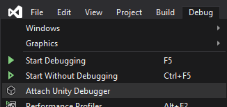

# Managed debugging with Unity IL2CPP

Follow these steps to attach a managed debugger to your Unity IL2CPP UWP build. This guide was originally developed for HoloLens and HoloLens 2.

1. Ensure that **InternetClientServer** and **PrivateNetworkClientServer** are checked in Unity under the UWP Publishing Settings Capabilities.

    

1. Configure the Unity UWP build settings:
    - Development Build
    - Script Debugging
    - Wait for Managed Debugger (optional)

    

1. Build in Unity.
1. Build and deploy from the Visual Studio solution to your device. You should build with the **Debug** or **Release** configurations. The **Master** configuration disables the Unity profiler and can prevent optimal debugging. Optionally, verify **Internet (Client & Server)** and **Private Networks (Client & Server)** in the capabilities list in Package.appxmanifest in the solution.
1. Start the app on your device. Make sure your device is connected to the same network as your PC.
1. Make sure the device **is not** connected to your PC via USB.
1. Go to the Visual Studio solution that's created when you double click a script in Unity, where you can view and edit your C# scripts.
1. Debug -> Attach Unity Debugger.

    

1. Select your device in the list and click "OK" to attach.

    
