# Meet the evangelists

 Hello! You'll see our developer evangelist team active at events around the world, so we wanted to take a minute and say hi.

 

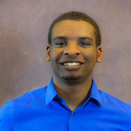

<h3 class="text-title spacer-12-bottom" style="margin-top:15px;">

Gavin Bauman,   Boston, MA, USA

</h3>

Gavin Bauman works for Microsoft as a Technical Evangelist in the Boston area. He’s given numerous technical talks at local events such as Boston Code Camp and national events like PAX East on game, mobile, and cloud app development. When he’s not punishing filthy plebians in Mortal Kombat, he spends his time working on cool HoloLens projects and quirky mobile apps. You can contact him through <a href="https://twitter.com/gavination2">twitter</a>, or check out his <a href="https://github.com/gavination">GitHub</a> repo.

 

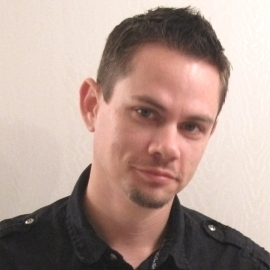

<h3 class="text-title spacer-12-bottom" style="margin-top:15px;">

Jared Bienz,   Houston, TX, USA

</h3>

Jared is a software architect and public speaker with more than twenty years in the industry. As a Technical Evangelist he helps companies bring their visions to life in Mixed Reality and on HoloLens. Jared always enjoys helping partners build amazing things through education, software libraries and sample code. Contact him through <a href="mailto:jbienz@microsoft.com">email</a>, <a href="http://twitter.com/jbienz">twitter</a>, or check out his GitHub repos <a href="https://github.com/jbienzms">here</a> and <a href="https://github.com/jbienz">here</a>.

 

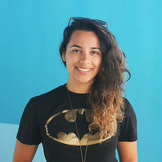

<h3 class="text-title spacer-12-bottom" style="margin-top:15px;">

Kat Harris,   Los Angeles, USA

</h3>

 Kat is a Technical Evangelist with expertise in game, AR/VR/MR development based out of Los Angeles. She is the co-host of ImagineThis, a web series for students to learn about the tech industry, and The Game Dev Show on MSDN’s Channel9 network. Kat was the first woman in the world to become a Unity Certified developer, and has been developing games since college. You can contact her through <a href="https://twitter.com/katvharris">twitter</a> and check out her <a href="http://katvharris.com/blog">blog</a>.

 

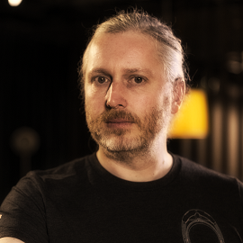

<h3 class="text-title spacer-12-bottom" style="margin-top:15px;">

Peter Daukintis,   London, UK

</h3>

Pete is a Technical Evangelist who started his software engineering career in 3D Graphics programming having worked extensively in games, video editing &amp; effects and audio. He has since made a return to this field of software coincident with the resurgence of the various alternative &#39;realities&#39;. You can contact him through <a href="https://twitter.com/peted70">twitter</a>, <a href="mailto:pdaukin@microsoft.com">email</a>, read his <a href="http://peted.azurewebsites.net/">blog</a> or check out his <a href="https://github.com/peted70">GitHub</a> repo.

 

<h3 class="text-title spacer-12-bottom" style="margin-top:15px;">

Xinyu Liu,   Beijing, China

</h3>

Xinyu Liu, Technical Evangelist with product design and user experience background. Focus on more personal computing, AI, AR/VR/MR, web design and development. Have rich experience on cross-platform app design. Lead local ISVs and developer to adopt the latest technologies for high quality product experience. One of the author for book Windows10 Development Fundamental with China NO.1 Tsinghua Press. You can contact her through <a href="mailto:xinli@microsoft.com">email</a>, <a href="https://twitter.com/XY_Xinyu">twitter</a>, or <a href="http://weibo.com/5040795254/profile?topnav=1&amp;wvr=6">Weibo</a>.

 

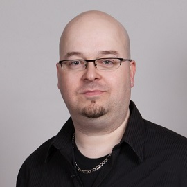

<h3 class="text-title spacer-12-bottom" style="margin-top:15px;">

Nick Landry,   New York City, USA

</h3>

Nick is a mobility pioneer specializing in cross-platform mobile app &amp; game development for Windows, iOS &amp; Android devices. Nick is also a game developer and design enthusiast at heart, working with a wide range of 3D &amp; gaming technologies like Unity, HoloLens, VR, MonoGame, GameMaker, Kinect, Azure and others. He is a frequent speaker at conferences worldwide, was a 10-year Microsoft MVP, and a Nokia Developer Ambassador &amp; Champion. You can contact him through <a href="https://twitter.com/ActiveNick">twitter</a>, <a href="mailto:activenick@microsoft.com">email</a> or check out his <a href="https://github.com/ActiveNick">GitHub</a> repo.

 

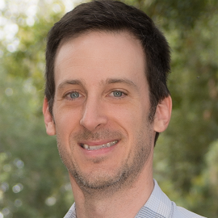

<h3 class="text-title spacer-12-bottom" style="margin-top:15px;">

Adam Tuliper,   Los Angeles, CA, USA

</h3>

Adam is a Principal Software Engineer for Microsoft who started assembly programming as a young lad and now you can’t pry him away from C#. He’s heavily involved in the game and app dev community and co-runs the Orange County Unity meetup. Adam works with many local companies, partners, startups, students, and communities helping them to realize their technical vision across mixed reality, web, cloud, gaming, mobile, and conversation as a platform based applications. You can find some of his technical presentations <a href="https://channel9.msdn.com/Events/Speakers/adam-tuliper">here</a> and <a href="https://channel9.msdn.com/Niners/adamtuliper">here</a> and articles for MSDN Magazine <a href="https://msdn.microsoft.com/en-us/magazine/mt149362?author=adam+tuliper">here</a>. Contact him via <a href="mailto:adamt@microsoft.com">email</a> or <a href="https://twitter.com/AdamTuliper">Twitter</a>.

 

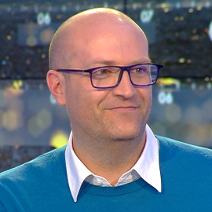

<h3 class="text-title spacer-12-bottom" style="margin-top:15px;">

Benoit Le Pichon,   Paris, France

</h3>

Benoit is a Technical Evangelist at Microsoft France, helping developers, startups and ISVs understand and adopt the innovations available on the Microsoft platforms in order to create high-quality applications, with a special focus on Windows Mixed Reality and Microsoft Azure PaaS platform. Passionate about technology, gaming, and startups, Benoit has designed solutions for a wide range of partners and clients in consumer and business scenarios. Contact him via <a href="https://twitter.com/benoitlp">twitter</a>.

 

<h3 class="text-title spacer-12-bottom" style="margin-top:15px;">

Shahed Chowdhuri,   Washington DC, USA

</h3>

Shahed is a Technical Evangelist for Microsoft, a published author and a public speaker in the DC Metro area. He focuses on app/game/web development, HoloLens, Bots and Azure cloud events for startups, independent developers, enterprise developers and students. You can contact him through <a href="mailto:shahed.chowdhuri@microsoft.com">email</a>, <a href="http://twitter.com/shahedC">twitter</a>, read his <a href="http://wakeupandcode.com">blog</a> or check out his <a href="http://github.com/shahedc">GitHub</a> repo.

 

<h3 class="text-title spacer-12-bottom" style="margin-top:15px;">

Ryan Mesches,   Limerick &amp; Dublin, Ireland

</h3>

Ryan is a Technical Evangelist working for Microsoft across the island of Ireland. With a master’s in Computer Engineering, Ryan partners with tech startups to help them scale their business leveraging the power of Azure. He also works with customers looking to build next generation mixed reality experiences using HoloLens. You can contact him through <a href="https://twitter.com/mesch13">twitter</a> and read his <a href="http://ryanmesch.es/">blog</a>.

 

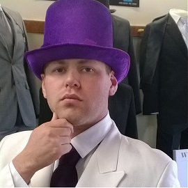

<h3 class="text-title spacer-12-bottom" style="margin-top:15px;">

Hannes Nel,   Auckland, New Zealand

</h3>

Hannes is a Technical Evangelist at Microsoft, focused on supporting tech ISV’s. His interests includes building great user experiences in UWP apps. Hannes has had a varied career developing software for a number of systems integration companies and a government department. He is passionate about creating great user experiences, that really makes the underlying software shine. Outside of his job, he enjoys mountain biking and snowboarding. You can contact him through <a href="https://twitter.com/HannesN">twitter</a> or <a href="mailto:Hannes.nel@microsoft.com">email</a>.

 

<h3 class="text-title spacer-12-bottom" style="margin-top:15px;">

Amanda Lange,   Philadelphia, PA, USA

</h3>

Amanda is a Technical Evangelist at Microsoft in the Philadelphia area. Her interests include the Internet of Things, game development, mixed reality development, AI and Cognitive Services. She works with startups and local businesses as well as promoting the work of students. She has done academic research on games and psychology, and has worked on games for fun, health, and science. You can contact her through <a href="mailto:amlange@microsoft.com">email</a>, read her <a href="http://secondtruth.com">blog</a> and check out her <a href="https://github.com/ajlange/">GitHub</a> repo.

 

<h3 class="text-title spacer-12-bottom" style="margin-top:15px;">

Sarah Sexton,   Chicago, IL, USA

</h3>

Sarah is a Technical Evangelist, an advocate for indie game developers, creator of SheBuildsGames.com, and Co-Founder of the Voxelles: Chicago’s Women in Game Development. She is committed to highlighting strengths and seeing more women &amp; minorities in STEM fields. She helps developers find success on Windows platforms through meetups, conferences, university workshops, and game jams. You can contact her through <a href="http://twitter.com/Saelia">twitter</a> and check out her <a href="https://github.com/SarahSexton">GitHub</a> repo.

 

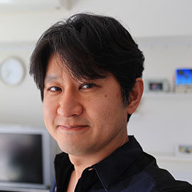

<h3 class="text-title spacer-12-bottom" style="margin-top:15px;">

Shinobu Takahashi,   Shinagawa, Tokyo, Japan

</h3>

 Since joining Microsoft in 2001, after working as a development support and consultant, Shinobu is currently working as a Technical Evangelist. He mainly focuses on technologies such as client application development and UI / UX as Windows and Windows Phone Champ. Currently he evangelizes developers as a HoloLens Evangelist.You can contact him through <a href="https://twitter.com/shinoblogavi">twitter</a> and check out his <a href="https://github.com/shinoblogavi/">GitHub</a> repo.

 

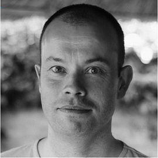

<h3 class="text-title spacer-12-bottom" style="margin-top:15px;">

Mike Taulty,   Manchester, UK

</h3>

Mike is a Technical Evangelist based in the UK who focuses on the Windows 10 Universal Windows Platform in C# and .NET across various device families including HoloLens development in Unity. Contact him through <a href="mailto:mtaulty@microsoft.com">email</a>, <a href="http://twitter.com/mtaulty">twitter</a>, or read his <a href="http://mtaulty.com">blog</a>.

 

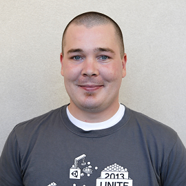

<h3 class="text-title spacer-12-bottom" style="margin-top:15px;">

Mickey MacDonald,   Mississauga, Canada

</h3>

Mickey is a Technical Evangelist and part time game developer who has a focus on Mixed Reality development. With shipped titles on major platforms, including an AR based mobile title in 2011, Mickey is a well-seasoned game dev. A lot of his time is spent working with other developer teams and sharing his experiences and the lessons he’s learned with the community. You can contact him through <a href="https://twitter.com/ScruffyFurn">twitter</a>.

 

<h3 class="text-title spacer-12-bottom" style="margin-top:15px;">

Tobiah Zarlez,   San Jose, California, USA

</h3>

Tobiah is a Technical Evangelist at Microsoft and an independent game developer from the San Francisco Bay Area. As an Evangelist, it is his job is to help developers learn what they need to make their projects more successful. Ask him about HoloLens, Unity, Azure, DevOps, Git, Conversation as a Platform, game design or anything else that relates to game development. You can contact him through <a href="https://twitter.com/TobiahZarlez">twitter</a>, read his <a href="http://www.tobiahz.com/">blog</a> or check out his <a href="https://github.com/TobiahZ/">GitHub</a> repo.

 

<h3 class="text-title spacer-12-bottom" style="margin-top:15px;">

Steve Seow,   Seattle, WA, USA

</h3>

Steve has been with Microsoft since 2005 and currently works with startups across the U.S. as a Technical Evangelist. His passion is diverse – from client/game app development (almost 100 apps published at one point) to cloud-based architectures to web development – but it is his daily experience working with startups that he finds especially rewarding. You can contact him through <a href="https://twitter.com/SteveSeow">twitter</a>.

