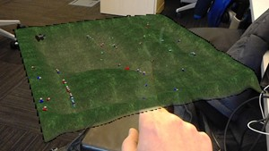
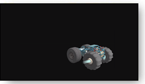
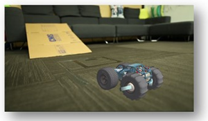

# Mixed reality capture for developers

Since a user could take a [mixed reality capture](mixed-reality-capture.md) (MRC) at any time, there are a few things that you should keep in mind when developing your application. This includes best practices for MRC visual quality and being responsive to system changes while MRCs are being captured.

## Why a good mixed reality capture experience is important

Mixed reality captured photos and videos are likely the first exposure a user will have of your app. Whether as holographic screenshots on your Windows Store page or from other users sharing MRCs on social networks. You can use MRC to demo your app, educate users, encourage users to share their mixed world interactions, and for user research and problem solving.

### Enabling mixed reality capture

By default, an app does not have to do anything to enable users to take mixed reality captures.

### Disabling mixed reality capture

When a 2D app uses [DXGI_PRESENT_RESTRICT_TO_OUTPUT](https://msdn.microsoft.com/en-us/library/windows/desktop/bb509554(v=vs.85).aspx) or [DXGI_SWAP_CHAIN_FLAG_HW_PROTECTED](https://msdn.microsoft.com/en-us/library/windows/desktop/bb173076(v=vs.85).aspx) to show protected content with a properly-configured swap chain, the app's visual content will be automatically obscured while mixed reality capture is running.

### Knowing when mixed reality capture is active

The [AppCapture](https://msdn.microsoft.com/en-us/library/windows/apps/windows.media.capture.appcapture.aspx) class can be used by an app to know when system mixed reality capture is running (for either audio or video).

**Note:** AppCapture's [GetForCurrentView](https://msdn.microsoft.com/en-us/library/windows/apps/windows.media.capture.appcapture.getforcurrentview.aspx) API can return null if mixed reality capture isn't available on the device. It's also important to de-register the CapturingChanged event when your app is suspended, otherwise MRC can get into a blocked state.

## Best Practices to ensure a great MRC experience for your users

MRC is expected to work without additional work from developers, but there are a few things to be aware of to provide the best mixed reality capture experience of your app.

**MRC uses the hologram’s alpha channel to blend with the [camera](locatable-camera.md) imagery**

The most important step is to make sure your app is clearing to transparent black instead of clearing to opaque black. In Unity, this is done by default with the MixedRealityToolkit but if you are developing in non-Unity, you may need to make a one line change.

Here are some of the artifacts you might see in MRC if your app is not clearing to transparent black:

**Example Failures**: Black edges around the content

|    |  |   | 

**Example Failures**: The entire background scene of the hologram appears black 

**Expected Result**: Holograms appear properly blended with the real-world

**Solution**:
* Change any content that is showing up as opaque black to have an alpha value of 0.
* Ensure that the app is clearing to transparent black.
* Unity defaults to clear to clear automatically with the MixedRealityToolkit, but if it’s a non-Unity app you should modify the color used with ID3D11DeiceContext::ClearRenderTargetView(). You want to ensure you clear to transparent black (0,0,0,0) instead of opaque black (0,0,0,1).

You can now tune the alpha values of your assets if you’d like, but typically don’t need to. Most of the time, MRCs will look good out of the box. MRC assumes pre-multiplied alpha. The alpha values will only affect the MRC capture.

## MRC and the HoloLens Emulator

The HoloLens Emulator does not have a photo video camera, so the real world is replaced by black. As a result, an MRC taken in the emulator won't expose the rendering issues mentioned above.

**Recommendations**:
* Take a [mixed reality capture](mixed-reality-capture.md) using Cortana voice commands, while within your app, on a HoloLens to ensure users can take quality MRCs.
* Use mixed reality captures, from a HoloLens, when making screenshots for your app's Windows Store page.

## Mixed reality capture and the Windows Device Portal

The mixed reality capture page of the [Windows Device Portal](using-the-windows-device-portal.md#mixed-reality-capture) has support for:
* Taking new MRC photos and videos
* Viewing a MRC live preview from the device
* Retrieving MRC photos and videos already taken on the device

## Creating a custom Mixed Reality Capture (MRC) recorder

While the user can always trigger a photo or video using the system MRC capture service, an application may want to build a custom camera app but include holograms in the camera stream just like MRC. This allows the application to kick off captures on behalf of the user, build custom recording UI, or customize MRC settings to name a few examples.

Unity Applications should see [Locatable_camera_in_Unity](locatable-camera-in-unity.md) for the property to enable holograms.

Other applications can do this by using the [Windows Media Capture APIs](https://msdn.microsoft.com/en-us/library/windows/apps/windows.media.capture.mediacapture.aspx) to control the Camera and add an MRC Video and Audio effect to include virtual holograms and application audio in stills and videos.

Applications have two options to add the effect:
* The older API: [Windows.Media.Capture.MediaCapture.AddEffectAsync()](https://msdn.microsoft.com/en-us/library/windows/apps/br211961.aspx)
* The new Microsoft recommended API (returns an object, making it possible to manipulate dynamic properties): [Windows.Media.Capture.MediaCapture.AddVideoEffectAsync()](https://msdn.microsoft.com/en-us/library/windows/apps/windows.media.capture.mediacapture.addvideoeffectasync.aspx) / [Windows.Media.Capture.MediaCapture.AddAudioEffectAsync()](https://msdn.microsoft.com/en-us/library/windows/apps/windows.media.capture.mediacapture.addaudioeffectasync.aspx) which require the app create its own implementation of [IVideoEffectDefinition](https://msdn.microsoft.com/en-us/library/windows/apps/windows.media.effects.ivideoeffectdefinition.aspx) and [IAudioEffectDefinition](https://msdn.microsoft.com/en-us/library/windows/apps/windows.media.effects.iaudioeffectdefinition.aspx). Please see the MRC effect sample for sample usage.

(Note that these namespaces will not be recognized by Visual Studio, but the strings are still valid)

MRC Video Effect (**Windows.Media.MixedRealityCapture.MixedRealityCaptureVideoEffect**)

|  Property Name  |  Type  |  Default Value  |  Description | 
|----------|----------|----------|----------|
|  StreamType  |  UINT32 ([MediaStreamType](https://msdn.microsoft.com/en-us/library/windows/apps/windows.media.capture.mediastreamtype.aspx))  |  1 (VideoRecord)  |  Describe which capture stream this effect is used for. \
 Audio is not available. | 
|  HologramCompositionEnabled  |  boolean  |  TRUE  |  Flag to enable or disable holograms in video capture. | 
|  RecordingIndicatorEnabled  |  boolean  |  TRUE  |  Flag to enable or disable recording indicator on screen during hologram capturing. | 
|  VideoStabilizationEnabled  |  boolean  |  FALSE  |  Flag to enable or disable video stabilization powered by the HoloLens tracker. | 
|  VideoStabilizationBufferLength  |  UINT32  |  0  |  Set how many historical frames are used for video stabilization. \
 0 is 0-latency and nearly "free" from a power and performance perspective. 15 is recommended for highest quality (at the cost of 15 frames of latency and memory). | 
|  GlobalOpacityCoefficient  |  float  |  0.9  |  Set global opacity coefficient of hologram in range from 0.0 (fully transparent) to 1.0 (fully opaque). | 

MRC Audio Effect (**Windows.Media.MixedRealityCapture.MixedRealityCaptureAudioEffect**)

|  Property Name  |  Type  |  Default Value  |  Description | 
|----------|----------|----------|----------|
|  MixerMode  |  UINT32  |  2  |  0 : Mic audio only \
 1 : System audio only \
 2 : Mic and System audio | 

## Simultaneous MRC Limitations

There are certain limitations around multiple apps accessing MRC at the same time.

### Photo/video camera access

The photo/video camera can only be accessed by a single process at a time. While a process is recording video or taking a photo any other process will fail to acquire the photo/video camera. (this applies to both Mixed Reality Capture and standard photo/video capture)

### MRC access

An app's custom MRC recorder is mutually exclusive with system MRC (capturing photos, capturing videos, or streaming from the Windows Device Portal).

## What to expect when MRC is enabled / Known Issues

When MRC is enabled:
* The system will throttle the application to 30Hz rendering. This creates some headroom for MRC to run so the app doesn’t need to keep a constant budget reserve and also matches the MRC video record framerate of 30fps
* Hologram content in the right eye of the device may appear to “sparkle” when recording/streaming MRC: text may become more difficult to read and hologram edges may appear more jaggy
* MRC photos and videos will respect the application’s [focus point](focus-point-in-unity.md) if the application has enabled it, which will help ensure holograms are accurately positioned. For videos, the Focus Point is smoothed so holograms may appear to slowly drift into place if the Focus Point depth changes significantly. Holograms that are at different depths from the focus point may appear offset from the real world (see example below where Focus Point is set at 2 meters but hologram is positioned at 1 meter).

## See also
* [Mixed reality capture](mixed-reality-capture.md)
* [Spectator view](spectator-view.md)
