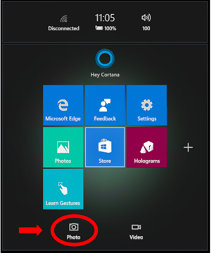

# Mixed reality capture

HoloLens gives users the experience of mixing the real world with the digital world. Mixed reality capture (MRC) let you capture that experience as either a photograph or a video. This lets you share the experience with others by allowing them to see the holograms as you see them. Such videos and photos are from a first-person point of view. For a third-person point of view, use [spectator view](spectator-view.md).

Use cases for mixed reality capture go beyond sharing videos amongst a social circle. Videos can be used to instruct others on how to use an app. Developers can use videos or stills to improve repro steps and debug app experiences.

## Live streaming from HoloLens

The [Windows 10 October 2018 Update](release-notes-october-2018.md) adds Miracast support to HoloLens. Select the **Connect** button at the bottom of the Start menu to bring up a picker for Miracast-enabled devices and adapters. Select the device to which you want to begin streaming. When done, select the **Disconnect** button at the bottom of the Start menu.  **Connect** and **Disconnect** are also available on the quick actions menu.

The [Windows Device Portal](using-the-windows-device-portal.md) and [Microsoft HoloLens companion app](https://www.microsoft.com/store/productId/9NBLGGH4QWNX) expose live streaming options for devices that are in Developer mode.

[Dynamics 365 Remote Assist](https://dynamics.microsoft.com/en-us/mixed-reality/remote-assist) supports live streaming from HoloLens to employees in remote locations.

## Taking mixed reality captures

 
*Click the camera icon at the bottom of the Start menu*

There are multiple ways to initiate a mixed reality capture:
* Cortana can be used at all times regardless of the app currently running. Just say, "Hey Cortana, take a picture" or "Hey Cortana, start recording." To stop a video, say "Hey Cortana, stop recording."
* On the Start menu, select either **Camera** or **Video**. Use [air-tap](gestures.md#air-tap) to open the built-in MRC camera UI.
* On the quick actions menu, select either **Camera** or **Video** to open the built-in MRC camera UI.
* Apps are able to expose their own UI for mixed reality capture using custom or, as of the [Windows 10 October 2018 Update](release-notes-october-2018.md), [built-in MRC camera UI](mixed-reality-capture-for-developers.md).
* Unique to HoloLens: 
    * [Windows Device Portal](using-the-windows-device-portal.md) has a mixed reality capture page that can be used to take photos, videos, live stream, and view captures.
    * Press both the **volume up** and **volume down** buttons simultaneously to take a picture, regardless of the app currently running.
    * Hold the **volume up** and **volume down** buttons for three seconds to start recording a video. To stop a video, tap both **volume up** and **volume down** buttons simultaneously.
* Unique to immersive headsets: 
    * Using a motion controller, hold the **Windows** button and then tap the **trigger** to take a picture. 
    * Using a motion controller, hold the **Windows** button and then tap the **menu** button to start recording video. Hold the **Windows** button and then tap the **trigger** to stop recording video.
    
>[!NOTE]
>The [Windows 10 October 2018 Update](release-notes-october-2018.md) changes how bloom and Windows button behave. Before the update, the bloom gesture or Windows button would stop recording. After the update, the bloom gesture or the Windows button opens the Start menu (or the quick actions menu if you are in an app). In the menu, select **Stop video** to stop recording.

### Limitations of mixed reality capture

On HoloLens, the system will throttle the render rate to 30Hz. This creates some headroom for MRC to run so the app doesn’t need to keep a constant budget reserve, and also matches the MRC video record framerate of (up to) 30fps.

Videos have a maximum length of five minutes.

The built-in MRC camera UI only supports a single MRC operation at a time (taking a picture is mutually exclusive from recording a video).

### File formats

Mixed reality captures from Cortana voice commands and Start Menu tools create files in the following formats:

|  Type  |  Format  |  Extension  |  Resolution  |  Audio | 
|----------|----------|----------|----------|----------|
|  Photo  |  [JPEG](https://en.wikipedia.org/wiki/JPEG)  |  .jpg  |  3904x2196px (HoloLens 2)  1408x792px (HoloLens)  1920x1080px (Immersive headsets) |  N/A | 
|  Video  |  [MPEG-4](https://en.wikipedia.org/wiki/MPEG-4)  |  .mp4  |  1920x1080px at 30fps (HoloLens 2)  1216x684px at 24fps (HoloLens)  1632x918px at 30fps (Immersive headsets) |  48kHz Stereo | 

>[!NOTE]
>The resolution of photos and videos can be smaller if the photo/video camera is already in use by another application, while live streaming, or when system resources are low.

### Video stabilization

By default:
* Zero-latency video stabilization is applied when live streaming over Miracast.
* Long-latency video stabilization is applied to videos captured using the built-in MRC camera UI, Cortana voice commands, and Windows Device Portal.

## Viewing mixed reality captures

Mixed reality capture photos and videos are saved to the device's "Camera roll" folder. These can be accessed via the [Photos app](see-your-photos.md#photos-app) or File Explorer.

On a PC connected to HoloLens, you can also use [Windows Device Portal](using-the-windows-device-portal.md#mixed-reality-capture) or your PC's File Explorer ([via MTP](release-notes-april-2018.md#new-features-for-hololens)).

If you install the [OneDrive app](https://www.microsoft.com/p/onedrive/9wzdncrfj1p3), you can turn on **Camera upload,** and your MRC photos and videos will sync to OneDrive and your other devices using OneDrive.

>[!NOTE]
>As of the Windows 10 April 2018 Update, the Photos app will no longer upload your photos and videos to OneDrive.

## See also
* [Spectator view](spectator-view.md)
* [Locatable camera](locatable-camera.md)
* [Mixed reality capture for developers](mixed-reality-capture-for-developers.md)
* [See your photos](see-your-photos.md)
* [Using the Windows Device Portal](using-the-windows-device-portal.md)
