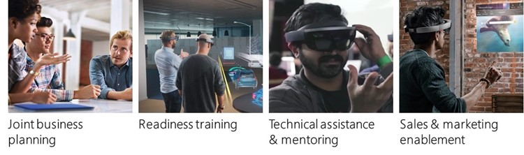
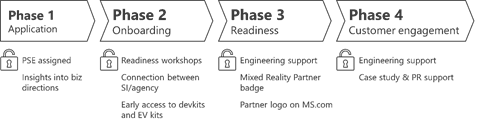
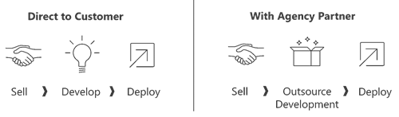

# Mixed Reality Partner Program

The Mixed Reality Partner Program is an integrated business program focused on enabling and supporting digital agencies, systems integrators, and solution providers who are committed to building mixed reality solutions. It is a performance-based program that offers incentives to partners as they help customers successfully pilot and deploy commercial mixed reality solutions.

The goal of the Mixed Reality Partner Program is to enable Microsoft partners to collaborate and build enterprise commercial mixed reality solutions that improve communications, streamline operations, drive worker productivity, and create amazing customer experiences. The ultimate business outcome of the program is a customer engagement that leads to enterprise deployment.

## Mixed Reality Partner Program Overview (MRPP)

Shortly after announcing HoloLens in 2015, Microsoft invited digital and creative agencies to develop mixed reality solutions as part of the HoloLens Agency Readiness Program. In return, we provided partners with technical readiness training to help them deliver compelling mixed reality solutions across multiple industries.

With agencies around the globe now skilled in mixed reality development, including those in Australia, Ireland, France, Germany, New Zealand, the United Kingdom, the Agency Readiness Program partners have produced tangible results, such as POCs, pilots, and deployments of world-class mixed reality solutions. Microsoft partners are now leading the digital transformation of enterprise solutions for customers including Stryker Communications, PGA Tour, Paccar, Helsinki Airport, SITA, Grundfos Group, and many more. The Mixed Reality Partner Program expands on the early success of the Agency Readiness Program by inviting agencies, system integrators, and solution partners from around the globe to join us on this exciting mixed reality journey.

### Partner types

This program is for system integrators and agencies that meet the [requirements](mixed-reality-partner-program.md#minimum-application-requirements) for our target markets.

### Target industries and scenarios

The Mixed Reality Partner Program is focused primarily on six industries: manufacturing, public sector/government, education, healthcare, architecture/engineering/construction, and retail.

There are several commercial use cases that span our target industries:
* Creation & design
* Assembly/manufacturing
* Training & development
* Communications
* Entertainment
* Frontline worker scenarios (technician, support, customer service)

### Program framework summary

The program is a four-phased program with incentives (benefits) that are earned as the partner achieves key milestones, such as the successful completion of business planning, technical training, or implementation of a POC, pilot, or deployment.

The four phases of the program are:
1. [Intake application](#phase-1-intake-application)
2. [Onboarding](#phase-2-onboarding)
3. [Readiness training](#phase-3-readiness-training)
4. [Customer engagement](#phase-4-customer-engagement)

### Partner benefits summary

The four categories of incentives of the program are:
1. Joint business planning
2. Technical readiness training
3. Technical assistance
4. Sales and marketing enablement

For details on how to qualify for these incentives, see [Partner incentives](mixed-reality-partner-program.md#partner-incentives).

 
*The four categories of program incentives*

Joint business planning
* Connection to partner community (SIs and agencies)
* Insights into business directions, new features, events, speaking opportunities, etc

Technical readiness training
* Envisioning workshop & readiness program (multi-week) led by the product team
* Mentorship and quality reviews

Technical assistance
* Engineering support for pilots and deployments (up to 20 hours)
* Enablement Services direct from engineering team available for purchase

Sales and marketing enablement
* Sales and marketing readiness workshop and access to content
* Permission to use Mixed Reality Partner Program badge
* Business support via Partner Sales Executive
* Case study development support; PR support

Partners who meet the program requirements, apply, agree to the terms of the program, and are admitted into the program and successfully complete the milestones in each phase, will be connected to a Microsoft partner sales executive in their geography, trained on how to build mixed reality solutions, supported by the product marketing and field marketing organizations, and assisted directly by the Microsoft Mixed Reality engineering team in POCs, pilots, and deployments.

### Partner commitments

There are three categories of commitments partners make when they join the program:

Readiness
* Complete the mixed reality technical readiness program
* Attend annual sales and marketing training webinar

Investment
* Minimum purchase of 3 HoloLens units
* MR development team consisting of at least 2 engineer and 1 designer
* MR sales/marketing lead

Business performance
* 2 POCs/yr
* 1 mixed reality pilot in the first year (SIs)
* 1 deployment within 18 months
* 1 case study within 18 months
* Abide by program and reporting requirements, which includes Quarterly Business Reviews (QBRs) and pipeline tracking

### Minimum application requirements

Acceptance into the program is based on an [application](#phase-1-intake-application) and interview. Partners must meet these minimum requirements to qualify for the Mixed Reality Partner Program. Meeting the minimum requirement is not a guarantee of entry.

Systems integrator and solution provider minimum requirements:
* Minimum of 25 full time employees
* Minimum of $15M total annual revenue
* Relationships with a client who is prepared to go through a POC (the client should be aligned with one Windows Mixed Reality target industries)
* Deep expertise in custom development and enterprise integration (with referenceable customers)

Digital agency minimum requirements:
* Minimum of 5 full time employees
* Have designed a POC using HoloLens, holographic computing, or AR/VR technology (or have an immediate opportunity in the pipeline)
* Developers and designers have a strong understanding of 3D development and performance tuning (experience with Unity, DirectX or building 3D assets)
* Active in developer communities

## Program framework

The MRPP program consist of four phases starting with an application:

-750px.png) 
*The four phases of the MRPP program: intake, onboarding, training, and engagement*

### Phase 1: Intake application

The intake application phase is when you communicate to us your interest in becoming a Windows Mixed Reality partner. The journey starts by completing an intake application form. On the form you will be asked a variety of business and technical questions to help us evaluate your initial fit to the program. If you meet the initial requirements, the next step will be a phone interview. Following the phone interview, we will make a decision about your application. In general, you should expect the process, including notification of our decision and entry into the program, to take between 60 and 90 days.

The [intake application form](https://www.surveygizmo.com/s3/3383267/HoloLens-Solution-Provider-Candidate-Profile-Survey) will take some time, but the completeness of the application is an important step in our decision making process. We value your time and effort to share your business and interest in Windows Mixed Reality.

Once we receive your application, we will review it for fit within the program. If you are not selected, you will receive an email informing you of our decision. There are three possible reasons why an application would not be selected:
1. The application was not complete or did not provide enough details to make a decision.
2. The application did not align with our current needs such as target industries, skills, or location.
3. The program is full. We will keep you application on record for another 90 days.

If the application looks promising, one of our regional partner managers (RPMs) will reach out to schedule a phone interview with you. The interview will be scheduled for one hour. We ask that you have both a business and technical leader from your company on the call. Usually one of these roles will also be your company's sponsor of the partnership, but if not, please have the internal sponsor on the call as well. During the interview, we will ask some deeper questions pertaining to the answers on your application, including:
* Business opportunities related to Windows Mixed Reality
* How you approach envisioning and design
* Team makeup and location
* 3D asset experience
* Integration and deployment experience
* What you hope to get out of the program

We will also provide details around commitments and next steps, and you will have an opportunity to ask us questions. Following the interview, we will inform you of our decision, usually within one week of the call. Should you be accepted into the program, the next step will be to onboard you into the program.

### Phase 2: Onboarding

Coming out of a successful interview call there are two possible paths:
1. You've already completed a project with a client and we want to fast-track you into the program.
2. You have not completed a project with a client, or the project doesn't quite meet our expectations, and we decide you would benefit from readiness training.

Given these two possible paths, the primary purpose of onboarding is to set mutual expectations and agree to move forward in the program. There will be two onboarding calls:
* Welcome to the program to take care of administrative items and go over the structure and expectations.
* Business and technical planning discussion to align around your client opportunity and training needs.

The calls will be led by a Microsoft Regional Partner Manager (RPM). A template and agenda will be provided for each call. Agenda topics will include:
* Overview of the process, dates, and resource needs from your company
* Identify administrative needs like NDA, system onboarding, and contact information for the participants
* POC/client selection for the program
* What happens at the end of the program
* Development of a one page partner profile

### Phase 3: Readiness training

The purpose of the Readiness phase is to demonstrate your company's ability to create and deliver compelling mixed reality experiences. To this end, we will ask you to complete a HoloLens app for a customer in one of our [target industries](mixed-reality-partner-program.md#target-industries-and-scenarios). The application must demonstrate a mastery of creating compelling user experiences coupled with high quality assets. Further the application must flex the unique features of HoloLens and demonstrate end value to your customer.

Please reference [Why HoloLens](https://www.microsoft.com/en-us/hololens/why-hololens) for more information on the unique features and value of HoloLens. Your team must be composed of both developers and designers that have a strong understanding of 3D development and performance tuning.

The exit criteria for the readiness step includes:
1. Deliver to a customer a HoloLens app meets our [app quality criteria](app-quality-criteria.md). There are basically two ways to complete this criteria:
   * Fast-track: show us a finished HoloLens project you completed for a customer
   * Readiness training: we will provide training and mentorship through the process of you completing a HoloLens project for a customer
2. Complete our sales and marketing readiness training
3. Complete a business plan with us that includes a view into your MR opportunity pipeline

**Fast-track**

If you have already completed a HoloLens project for a customer, then fast-track may be the quickest way into the program. The exit criteria defined above still applies, but going through a three-month training program is not necessary. During fast-track you must:
* Be willing to show us your project in device. We will evaluate the project against our [app quality criteria](app-quality-criteria.md).
* You must take our sales and marketing training, or share with us your customer-facing MR sales and marketing plans. The material will be evaluated by our marketing team.
* If the above deliverables pass our quality bar, then we will work with you to develop a business plan that must include a view into your MR opportunity pipeline.

If you don’t pass our quality bar, we will provide you details as to why. You will have 90 days to make improvements and try again.

**Fast-track alternative for System Integrators**

System Integrators can partner with one of our [recommended digital agencies](https://www.microsoft.com/en-us/hololens/commercial-build#agency-buckets) rather than building the project directly. Since the agency is already qualified, we can assume the HoloLens experience will meet our standards. You will need to continue to work with a recommended digital agency for future projects. This requirement will be removed once your company is able to demonstrate a proficiency in building HoloLens experiences based on our [app quality criteria](app-quality-criteria.md).

**Readiness training**

Our readiness training program is designed to help your company deliver quality MR experiences on HoloLens. The program typically takes three to four months depending on the nature of your project. The project must be for a customer and meet our expectations regarding [target markets](mixed-reality-partner-program.md#target-industries-and-scenarios) and scenarios. We are constantly evolving the program to meet the needs of our partners, but at a minimum you should expect:
* A week long immersive training at a Microsoft site typically in Redmond Washington, or London UK. This training is held the first week of the program:
* Sales and marketing training either onsite or via a webinar
* Regular calls with a Microsoft team member to review progress, provide feedback, and unblock problems
* A storyboard check-point review for the POC
* A mid-term POC check-point review
* A final POC review and pass/no-pass grade
* Any variation to this format will be discuss during the [onboarding call](#phase-2-onboarding)

The final POC must pass our quality bar. If you don’t pass our quality bar, we will provide you details as to why. You will have 30 days to make improvements and try again. If you don't pass the second time, you must enter through the fast-track program.

Upon successful completion of the Readiness phase, you qualify for all program benefits.

### Phase 4: Customer engagement

Once you graduate from the Readiness phase, your journey as a Mixed Reality Partner is just beginning. This is the time you will be helping us grow this market through POCs, pilots, and deployments of HoloLens and Windows Mixed Reality devices. During our partnership, we will set mutual expectations and evaluate them regularly. From our perspective, there are a few things we are looking for from our partners:
* **Execute account plans that drive device sales.** We will be looking at the number units sold through your efforts including POC, pilots, and large deployments. As a part of this, we will want to understand your MR opportunity pipeline. This will help us better understand market trends, product needs, and (in general) where we should be putting our outbound efforts and resources.
* **Deliver light-up scenarios.** We've only scratched the surface of how MR will benefit businesses and consumers. Compelling demos and applications show people what's possible and spawn new ideas. We value partners that are contributing to the Windows Mixed Reality Store. There are also opportunity to showcase your work at our Microsoft Technology Centers and other high-profile locations and events.
* **Contribute to the MR community.** Windows Mixed Reality is a growing and active community, and being a part of it means learning from each other. We value partners who contribute to our forums and open source projects. Blog, speaking opportunities, hackathons, and other events are all great ways to get involved.
* **Establish a deep partnership with us.** We encourage you to get to know us and stay in contact. Let us know about exciting new developments and opportunities. Contribute to our events and summits. Occasionally we may offer early access to information or hardware, so engage and give us feedback. By helping us, we can better help you.

All of the above represents elements of a business plan. You should expect your Microsoft team to review during our quarterly business updates. It is important to understand that graduation from the readiness program is not a long-term guarantee of staying in the program.

## Partner incentives

The Mixed Reality Partner Program includes a rich set of partner incentives that are received (“unlocked”) by partners as they move through the program. The graphic below illustrates just some of the incentives that are unlocked in each phase.

 
*The incentives of the program for each phase*

### Joint business planning

Planning between a partner and the Microsoft team begins in earnest in Phase 3 (Readiness) once the partner is on a path towards graduation. Several incentives associated with joint business planning are described in this section.

**Account management**

During the late stages of readiness, partners are assigned a Partner Sales Executive (PSE) as a primary sales contact. The PSE is primarily responsible for helping the partner drive sales. To achieve this, a PSE is accountable to help partners in four areas:
* Business planning—assist partners as they build their business plan, which should include strategies for account-based targeting, marketing, and selling
* Sales engagements—ensure partners have the content, evidence, and tools they need to pursue opportunities, and assist with sales engagements
* Field connections—connect partners with local Microsoft field marketers and sellers to drive joint go-to-market efforts, including events, campaigns, and joint selling.
* Engineering services—connect partners with the Microsoft engineering team to provide guidance, or to assist with technical aspects of customer engagements in POC, Pilot, or Deployment mode.

**Insights into business directions and new features**

Partners will receive regular updates from the Microsoft team that include confidential material covered under the program’s Non-Disclosure Agreement:
* the state of the business
* industry trends and data
* new areas of investment
* new product capabilities and features
* upcoming product announcements

Most of these insights will be communicated during Quarterly Business Updates, which will be coordinated by your regional partner manager (RPM).

**Partner connections**

The Microsoft team will help make connections between partners in the program to optimize their ability to move a customer from POC to deployment. One of the most important business planning topics we cover in the Onboarding phase is whether a partner will drive a customer engagement from POC to pilot to deployment with or without assistance from another partner. 

 
*Work directly with a customer or outsource development to an MRPP agency partner*

While some partners will have the capabilities to drive a project end to end, we’ve learned through experience that projects are often most successful when the SI partners with a digital agency on the mixed reality creative development work. Likewise, we find that digital agencies are most successful when they partner with an SI to help drive deployment and backend IT integration (security, MDM, etc.).

**Industry and account targeting**

The Microsoft team will develop with partners strategies to build awareness, interest, and POC opportunities at specific accounts in the enterprise customer segment. Microsoft will also share recommendations on tools and tactics that help optimize account-based selling and marketing.

**Customer and industry events and promotional opportunities**

Due to the high levels of interest industry-wide in mixed reality technologies, the Microsoft team is in a constant state of planning for customer and industry events. Partners will have numerous opportunities to coordinate their presence at these events, which may include:
* presenting in an event keynote, breakout, or working session
* being featured in videos and keynotes
* showing a demo or having a presence on the event floor
* sharing their successes with the press

**Establish a joint rhythm of the business (ROB)**

During Onboarding, the Microsoft team and partner will plan a business meeting cadence to stay connected, informed, and aligned. This cadence will include scheduling Quarterly Business Updates, technical readiness training, and a sales and marketing workshop, and any other connection meetings that are needed.

The team will also identify key contacts and roles and responsibilities.

### Readiness training

Partners receive deep technical training as well as sales and marketing training in Phase 3 of the Mixed Reality Partner Program. The incentives associated with readiness training are described in this section.

**Envisioning + readiness**

As described in the Readiness training section, partners participate in a week long immersive training program at a Microsoft location, typically in Redmond, Washington or London, UK. Over the course of a week, expert-level engineers and technical program managers work closely with partners to help them ramp on mixed reality technologies. During the envisioning and readiness training week, the Microsoft team delivers the following:
* Coaching on how to use envisioning as a process to help customers identify opportunities to use mixed reality to deliver value to their business
* The fundamentals of building mixed reality solutions
* Technical guidance on tools and techniques
* Hands-on labs to help familiarize your team with mixed reality environments
* Instruction on how to deliver a compelling POC
* How to access resources and get assistance with customer engagements

While there is T&E expense for partners, the entire readiness curriculum—the classroom experience and webinars—are free to partners.

**Sales & marketing workshop**

As part of readiness training, the Microsoft team provides partners sales and marketing training via a webinar (so that the partner’s marketing and sales team members can attend). During the webinar, partners will hear from Microsoft marketers and sellers on several topics:
* Market opportunity
* Competitive landscape
* Positioning and messaging
* How to work with the Microsoft field marketing team
* Account-based marketing strategies that work
* Selling 101
* Generating demand with digital marketing

Partners that complete the sales and marketing workshop receive access to a marketing and sales bill of materials that contains content and tools to support partner-led sales and marketing. 

**Customer POC**

To “graduate” from the Readiness training phase, partners must conduct a successful customer proof of concept. To help partners meet this requirement, the Microsoft team will assist with the following:
* Help the partner scope potential target accounts
* Provide a POC framework
* Provide templates to support the project management of the POC
* Participate in updates with the partner team
* Engage with customers as needed

### Technical assistance

Mixed reality is a new paradigm, and the skills needed to design, develop, and deploy a mixed reality solution are new. By providing technical assistance and mentoring to our partners as they conduct POCs, pilots, and deployments, we pass along the technical know-how so that our partners can drive successful POCs, pilots, and deployments. Several incentives associated with technical assistance and mentoring are described in this section.

**Engineering assistance for pilot and deployment opportunities**

Partners that complete Phase 3 (Readiness) qualify for 20 hours of (free) technical assistance from the Microsoft mixed reality engineering team to help with pilot and deployment opportunities. A qualified opportunity is past the lead stage and is a customer project with a high likelihood of moving into a pilot or full-scale deployment.

An opportunity that would not qualify for engineering assistance would include a POC, such as a marketing demo with no opportunity to grow into a pilot project, or a project that is aimed at selling devices to consumers. Your Partner Sales Executive (PSE) and Regional Partner Manager (RPM) can help qualify opportunities that are eligible for engineering assistance.

**Enablement Services hours for purchase**

If a partner wants additional assistance directly from the Microsoft engineering team, additional hours are available for purchase via our Enablement Services program. Your Partner Sales Executive (PSE) and Regional Partner Manager (RPM) can provide details and facilitate this transaction.

**Deployment assistance**

Once a POC and pilot have completed (by meeting the requirements for advancement) and the customer is ready to deploy a mixed reality solution, our team offers deployment assistance for qualified opportunities. They will provide the following services:
* Evaluate deployment plan
* Assess solution architecture and technology stack
* Identify integration plans (IT security, MDM, etc.)
* Provide implementation guidance
* Provide limited escalation support

Your Partner Sales Executive (PSE) and Regional Partner Manager (RPM) can help qualify opportunities that are eligible for deployment assistance, and help scope the hours, people, and processes the engineering team will use to provide the support.

**Pre-sales escalation support**

The Microsoft team is available to provide technical assistance with pre-sales customer presentations and meetings. Your Partner Sales Executive (PSE) can help coordinate this support.

### Sales and marketing enablement

An important aim of the Mixed Reality Partner Program is to help our partners market and sell their solutions and services. When accepted into the program, partners get access to content, tools, and a variety of sales and marketing support services. 

**Partner-led sales and marketing** 

Microsoft provides assistance via market intelligence, content, tools, joint go-to-market execution (including PR and case study support), and a range of incentives; however, partners are expected to lead their own sales and marketing efforts.

There are four key principles of partner-led sales and marketing of mixed reality solutions:
* **Differentiated.** Partners lead with their own differentiated services/product offering, and they should have or develop advanced marketing skills and a differentiated value proposition.
* **Performance-based.** As part of business planning, partners agree to specific, measurable performance metrics, and demonstrate measurable return on marketing investment in order to receive additional investment and incentives via the program.
* **Digital first.** Partners should prioritize digital marketing and sales strategies. They should collaborate with and learn from digital marketing agencies (if needed) to plan and execute cost-effective digital marketing and social selling strategies across all their customer engagement channels.
* **Intelligent.** Partners should leverage market data insights, account data, analyst report, Microsoft customer data and guidance to tune sales and marketing strategies, and to execute account-based marketing campaigns.

**Sales and marketing content**

Partners will be provided access to a sales and marketing bill of materials to facilitate their customer marketing efforts. The marketing content (pitch deck, data sheet, email template, etc.) are customizable so that you can present them with your logo.

In addition, all program partners are welcome to join the MPN program, Microsoft’s global partner program, and get access to an extensive library of sales and marketing guidance and tools.

**Mixed Reality Partner badge**

The Mixed Reality partner badge helps customers identify Microsoft partners who have achieved a high level of competency on the Windows Mixed Reality platform. Partners who attain and display this badge stand out as having been endorsed by Microsoft, differentiate themselves from competitors, and increase their credibility in the market. For an overview of the badge usage guidance, see the Mixed Reality Partner Program Badge Usage Guide.

**Case study development**

Partners receive assistance with building case studies after successful customer deployments. Microsoft provides templates, guidance, and (for qualified opportunities) will even provide resources to interview the customer, create case study content, and publish the case study on Microsoft.com.

**PR support**

Partners receive PR assistance for news-worthy events, customer wins, and large deployments. In addition, partners may be invited to participate in press briefings, speaking engagements, and other opportunities to drive press for their company.

**Web presence** 

Partners get placement of company logo and short description on HoloLens.com/partners site, the Microsoft Partner Center, and the soon-to-be-published Mixed Reality web site. In addition, company contact info will be included in auto-locator on HoloLens web site.

**Microsoft Technology Centers** 

Program partners are welcome to use Microsoft MTCs (with over 40 locations around the globe) to engage customers, empower employees, optimize operations, and reinvent products and business models. The MTC staff and local Microsoft account teams will help you position your offering to customers, conduct envisioning workshops with your customers, and demo your solutions on Microsoft technologies. Our goal is to move your customer closer to deployment.

## See also
* [App quality criteria](app-quality-criteria.md)
* [Development resources](development.md)
* [Design resources](design.md)
* [Mixed Reality Academy](academy.md)
* [Microsoft Technology Centers](https://www.microsoft.com/en-us/mtc/default.aspx)
