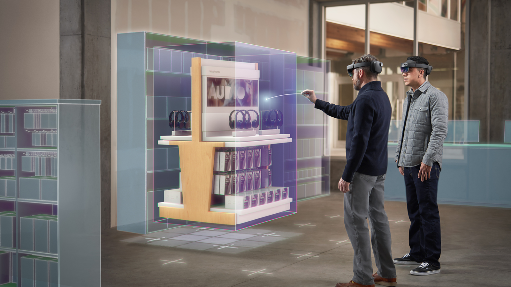
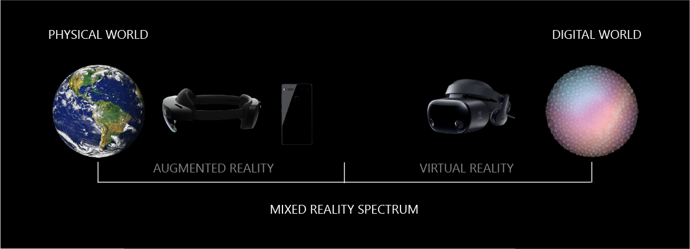

# What is mixed reality?

Mixed reality is the result of blending the physical world with the digital world. Mixed reality is the next evolution in human, computer, and environment interaction and unlocks possibilities that before now were restricted to our imaginations. It is made possible by advancements in computer vision, graphical processing power, display technology, and input systems. The term *mixed reality* was originally introduced in a 1994 paper by Paul Milgram and Fumio Kishino, "[A Taxonomy of Mixed Reality Visual Displays](https://etclab.mie.utoronto.ca/people/paul_dir/IEICE94/ieice.html)." Their paper introduced the concept of the *virtuality continuum*, and focused on how the categorization of taxonomy applied to displays. Since then, the application of mixed reality goes beyond displays. It also includes environmental input, spatial sound, and location.

 
*Image: Mixed reality is the result of blending the physical world with the digital world.*

 

---

## Environmental input and perception

Over the past several decades, the relationship between human and computer input has been well explored. It even has a widely studied discipline known as *human computer interaction* or HCI. Human input happens through a variety of means, including keyboards, mice, touch, ink, voice, and even Kinect skeletal tracking.

Advancements in sensors and processing are giving rise to a new area of computer input from environments. The interaction between computers and environments is effectively environmental understanding or *perception*. Hence the API names in Windows that reveal environmental information are called the [perception APIs](https://docs.microsoft.com/uwp/api/Windows.Perception). Environmental input captures things like a person's position in the world (e.g. [head tracking](coordinate-systems.md)), surfaces and boundaries (e.g. [spatial mapping](spatial-mapping.md) and [scene understanding](scene-understanding.md)), ambient lighting, environmental sound, object recognition, and location.

 

  
*Image: The interactions between between computers, humans and environments.*

 

Now, the combination of all three--**computer processing, human input, and environmental input**--sets the opportunity to create true mixed reality experiences. Movement through the physical world can translate to movement in the digital world. Boundaries in the physical world can influence application experiences, such as game play, in the digital world. Without environmental input, experiences cannot blend between physical and digital realities. 

 

---

## The mixed reality spectrum

Since mixed reality blends both physical and digital worlds, these two realities define the polar ends of a spectrum known as the virtuality continuum. For simplicity, we refer to this as the *mixed reality spectrum*. On the left-hand side we have physical reality in which we, humans, exist; on the right-hand side we have the corresponding digital reality.

 

<iframe width="940" height="530" src="https://www.youtube.com/embed/_xpI0JosYUk" frameborder="0" allow="accelerometer; autoplay; encrypted-media; gyroscope; picture-in-picture" allowfullscreen></iframe>

 

### Augmented vs. virtual reality

Most mobile phones on the market today have little to no environmental understanding capabilities. Thus the experiences they offer cannot mix between physical and digital realities. The experiences that overlay graphics on video streams of the physical world are *augmented reality*. The experiences that occlude your view to present a digital experience are *virtual reality*. As you can see, the experiences enabled between these two extremes is *mixed reality*:
* Starting with the physical world, placing a digital object, such as a hologram, as if it was really there.
* Starting with the physical world, a digital representation of another person--an avatar--shows the location where they were standing when leaving notes. In other words, experiences that represent asynchronous collaboration at different points in time.
* Starting with a digital world, physical boundaries from the physical world, such as walls and furniture, appear digitally within the experience to help users avoid physical objects.

 

 
*Image: The mixed reality spectrum*

 

Most augmented reality and virtual reality offerings available today represent a very small part of this spectrum. They are, however, subsets of the larger mixed reality spectrum. Windows 10 is built with the entire spectrum in mind, and allows blending digital representations of people, places, and things with the real world.

## Devices and experiences

There are two main types of devices that deliver Windows Mixed Reality experiences:
1. **Holographic devices.** These are characterized by the device's ability to place digital content in the real world as if it were really there.
2. **Immersive devices.** These are characterized by the device's ability to create a sense of "presence"--hiding the physical world, and replacing it with a digital experience.

<table>
<tr>
<th width="30%"> Characteristic</th><th width="35%"> Holographic devices</th><th width="35%"> Immersive devices</th>
</tr><tr>
<td><strong>Example device</strong></td><td> Microsoft HoloLens   </td><td> Samsung HMD Odyssey+   </td>
</tr><tr>
<td><strong>Display</strong></td><td> See-through display. Allows user to see the physical environment while wearing the headset.</td><td> Opaque display. Blocks out the physical environment while wearing the headset.</td>
</tr><tr>
<td><strong>Movement</strong></td><td> Full six-degrees-of-freedom movement, both rotation and translation.</td><td> Full six-degrees-of-freedom movement, both rotation and translation.</td>
</tr>
</table>

Note, whether a device is connected to or tethered to a separate PC (via USB cable or Wi-Fi) or self-contained (untethered) does not reflect whether a device is holographic or immersive. Certainly, features that improve mobility lead to better experiences, and both holographic and immersive devices could be tethered or untethered.

Technological advancement is what has enabled mixed reality experiences. There are no devices today that can run experiences across the entire spectrum. However, Windows 10 provides a common mixed reality platform for both device manufacturers and developers. Devices today can support a specific range within the mixed reality spectrum. Over time, new devices will expand that range. In the future, holographic devices will become more immersive, and immersive devices will become more holographic.

 

 
*Image: Where devices exist on the mixed reality spectrum*

Often, it is best to think what type of experience an application or game developer wants to create. The experiences will typically target a specific point or part on the spectrum. Then, developers should consider the capabilities of devices they want to target. For example, experiences that rely on the physical world will run best on HoloLens.
* **Towards the left (near physical reality).** Users remain present in their physical environment and are never made to believe they have left that environment.
* **In the middle (fully mixed reality).** These experiences blend the real world and the digital world. Viewers who have seen the movie [Jumanji](https://en.wikipedia.org/wiki/Jumanji) can reconcile how the physical structure of the house where the story took place was blended with a jungle environment.
* **Towards the right (near digital reality).** Users experience a completely digital environment, and are unaware of what occurs in the physical environment around them.

## See also

* [What is a hologram?](hologram.md)
* [Understand the basics of mixed reality](index.yml)
* [Start creating and prototyping](design.md)
* [Learn the tools and architecture](development.md)

