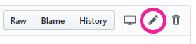
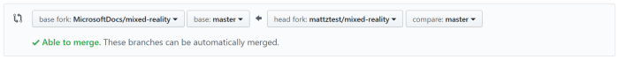

# Contributing to Mixed Reality developer documentation

Welcome to the [public repo for Mixed Reality developer documentation](https://github.com/MicrosoftDocs/mixed-reality/tree/master/mixed-reality-docs)! Any articles you create or edit in this repo **will be visible to the public.** 

The Mixed Reality docs are now on the docs.microsoft.com platform, which uses GitHub-flavored Markdown with Markdig features. The content you edit in this repo gets formatted into stylized pages that show up at </windows/mixed-reality>. 

This page covers the basic steps and guidelines for contributing and links to Markdown basics. Thank you for your contribution!

## Available repos

| Repository name | URL |
| --- | --- |
| AltspaceVR | [MicrosoftDocs/altspace-vr](https://github.com/MicrosoftDocs/altspace-vr) |
| Azure Object Anchors | [MicrosoftDocs/azure-docs/articles/object-anchors](https://github.com/MicrosoftDocs/azure-docs/tree/master/articles/object-anchors)
| Azure Remote Rendering | [MicrosoftDocs/azure-docs/articles/remote-rendering](https://github.com/MicrosoftDocs/azure-docs/tree/master/articles/remote-rendering) |
| Azure Spatial Anchors | [MicrosoftDocs/azure-docs/articles/spatial-anchors](https://github.com/MicrosoftDocs/azure-docs/tree/master/articles/spatial-anchors) |
| HoloLens | [MicrosoftDocs/HoloLens](https://github.com/MicrosoftDocs/Hololens) |
| Mixed Reality | [MicrosoftDocs/mixed-reality](https://github.com/MicrosoftDocs/mixed-reality) |
| VR Enthusiasts Guide | [MicrosoftDocs/mixed-reality/enthusiast-guide](https://github.com/MicrosoftDocs/mixed-reality/tree/docs/enthusiast-guide) |

## Before you start

If you don't already have one, you'll need to [create a GitHub account](https://github.com/join).

>[!NOTE]
>If you're a Microsoft employee, link your GitHub account to your Microsoft alias on the [Microsoft Open Source portal](https://repos.opensource.microsoft.com/). Join the **"Microsoft"** and **"MicrosoftDocs"** organizations.

When setting up your GitHub account, we also recommend these security precautions:
- Create a [strong password for your Github account](https://github.com/settings/admin).
- Enable [two-factor authentication](https://github.com/settings/two_factor_authentication/configure).
- Save your [recovery codes](https://github.com/settings/auth/recovery-codes) in a safe place.
- Update your [public profile settings](https://github.com/settings/profile).
   - Set your name, and consider setting your *Public email* to *Don't show my email address*.
   - We recommend you upload a profile picture because a thumbnail is shown on docs pages you contribute to.
- If you plan to use the command line, consider setting up [Git Credential Manager for Windows](https://github.com/Microsoft/Git-Credential-Manager-for-Windows/releases/latest). That way, you won't have to enter your password every time you make a contribution.

The publishing system is tied to GitHub, so these steps are important. You'll be listed as either author or contributor to each article using your GitHub alias.

## Editing an existing article

Use the following workflow to make updates to *an existing article* via GitHub in a web browser:

1. Navigate to the article you wish to edit in the "mixed-reality-docs" folder.
2. Select the edit button (pencil icon) in the top right, which will automatically fork a disposable branch off the 'master' branch.

   
3. Edit the content of the article according to the ["Markdown basics"](#markdown-basics).
4. Update metadata at the top of each article:
   * **title**: Page title that appears in the browser tab when the article is being viewed. Page titles are used for SEO and indexing, so don't change the title unless necessary (though this is less critical before documentation goes public).
   * **description**: Write a brief description of the article's content, which boosts SEO and discovery.
   * **author**: If you're the primary owner of the page, add your GitHub alias here.
   * **ms.author**: If you're the primary owner of the page, add your Microsoft alias here (you don't need @microsoft.com, just the alias).
   * **ms.date**: Update the date if you're adding major content to the page, but not for fixes like clarification, formatting, grammar, or spelling.
   * **keywords**: Keywords aid in SEO (search engine optimization). Add keywords, separated by a comma and a space, that are specific to your article, but no punctuation after the last keyword in your list. You don't need to add global keywords that apply to all articles, as those are managed elsewhere. 
5. When you've completed your article edits, scroll down and select **Propose file change**.
6. On the next page, select **Create pull request** to merge your automatically created branch into 'master.'
7. Repeat the steps above for the next article you want to edit.

## Renaming or deleting an existing article

If your change will rename or delete an existing article, be sure to add a redirect. That way, anyone with a link to the existing article will still end up in the right place. Redirects are managed by the .openpublishing.redirection.json file in the root of the repo.

To add a redirect to .openpublishing.redirection.json, add an entry to the `redirections` array:

```json
{
    "redirections": [
        {
            "source_path": "mixed-reality-docs/old-article.md",
            "redirect_url": "new-article#section-about-old-topic",
            "redirect_document_id": false
        },
```

- The `source_path` is the relative repository path to the old article that you're removing. Be sure the path starts with `mixed-reality-docs` and ends with `.md`.
- The `redirect_url` is the relative public URL from the old article to the new article. Be sure that this URL **doesn't** contain `mixed-reality-docs` or `.md`, as it refers to the public URL and not the repository path. Linking to a section within the new article using `#section` is allowed. You can also use an absolute path to another site here, if necessary.
- `redirect_document_id` indicates whether you would like to keep the document ID from the previous file. The default is `false`. Use `true` if you want to preserve the `ms.documentid` attribute value from the redirected article. If you preserve the document ID, data, such as page views and rankings, will be transferred to the target article. Do this if the redirect is primarily a rename, and not a pointer to different article that only covers some of the same content.

If you add a redirect, be sure to delete the old file as well.

## Creating a new article

Use the following workflow to *create new articles* in the documentation repo via GitHub in a web browser:

1. Create a fork off the MicrosoftDocs/mixed-reality 'master' branch (using the **Fork** button in the top right).

   
2. In the "mixed-reality-docs" folder, select **Create new file** in the top right.
3. Create a page name for the article (use hyphens instead of spaces and don't use punctuation or apostrophes) and append ".md"

   
   
   >[!IMPORTANT]
   >Make sure you create the new article from within the "mixed-reality-docs" folder. You can confirm this by checking for "/mixed-reality-docs/" in the new file name line.

4. At the top of your new page, add the following metadata block:

   ```md
   ---
   title:
   description:
   author:
   ms.author:
   ms.date:
   ms.topic: article
   keywords:
   ---
   ```

5. Fill in the relevant metadata fields per the instructions in the [section above](#editing-an-existing-article).
6. Write article content using [Markdown basics](#markdown-basics).
7. Add a `## See also` section at the bottom of the article with links to other relevant articles.
8. When finished, select **Commit new file**.
9. Select **New pull request** and merge your fork's 'master' branch into MicrosoftDocs/mixed-reality 'master' (make sure the arrow is pointing the correct way).

   

## Markdown basics

The following resources will help you learn how to edit documentation using the Markdown language:

- [Markdown basics](https://help.github.com/articles/basic-writing-and-formatting-syntax/)
- [Markdown-at-a-glance reference poster](images/MarkdownPoster.pdf)
- [Additional resources for writing Markdown for docs.microsoft.com](/contribute/how-to-write-use-markdown)

### Adding tables

Because of the way docs.microsoft.com styles tables, they won’t have borders or custom styles, even if you try inline CSS. It will appear to work for a short period of time, but eventually the platform will strip the styling out of the table. So plan ahead and keep your tables simple. [Here’s a site that makes Markdown tables easy](https://www.tablesgenerator.com/markdown_tables).

The [Docs Markdown Extension for Visual Studio Code](/teamblog/docs-extension) also makes table generation easy if you're using [Visual Studio Code (see below)](#using-visual-studio-code) to edit the documentation.

### Adding images

You’ll need to upload your images to the "mixed-reality-docs/images" folder in the repo, and then reference them appropriately in the article. Images will automatically show up at full-size, which means large images will fill the entire width of the article. We recommend pre-sizing your images before uploading them. The recommended width is between 600 and 700 pixels, though you should size up or down if it’s a dense screenshot or a fraction of a screenshot, respectively.

>[!IMPORTANT]
>You can only upload images to your forked repo before merging. So, if you plan on adding images to an article, you'll need to [use Visual Studio Code](#using-visual-studio-code) to add the images to your fork's "images" folder first or make sure you've done the following in a web browser:
>
>1. Forked the MicrosoftDocs/mixed-reality repo.
>2. Edited the article in your fork.
>3. Uploaded the images you're referencing in your article to the "mixed-reality-docs/images" folder in your fork.
>4. Created a **pull request** to merge your fork into the MicrosoftDocs/mixed-reality 'master' branch.
>
>To learn how to set up your own forked repo, follow the instructions for [creating a new article](#creating-a-new-article).

## Previewing your work

While editing in GitHub via a web browser, you can select the **Preview** tab near the top of the page to preview your work before committing. 

>[!NOTE]
>Previewing your changes on review.docs.microsoft.com is only available to Microsoft employees

Microsoft employees: once your contributions have been merged into the 'main' branch, you can review the content before it goes public at /windows/mixed-reality?branch=main. Find your article using the table of contents in the left column.

## Editing in the browser vs. editing with a desktop client

Editing in the browser is the easiest way to make quick changes, however, there are a few disadvantages:

- You don't get spell-check.
- You don't get any smart-linking to other articles (you have to manually type the article's filename).
- It can be a hassle to upload and reference images.

If you'd rather not deal with these issues, use a desktop client like [Visual Studio Code](https://code.visualstudio.com/) with a couple [helpful extensions](#useful-extensions) when contributing.

## Using Visual Studio Code

For the reasons listed [above](#editing-in-the-browser-vs-editing-with-a-desktop-client), you may prefer using a desktop client to edit documentation instead of a web browser. We recommend using [Visual Studio Code](https://code.visualstudio.com/).

### Setup

Follow these steps to configure Visual Studio Code to work with this repo:

1. In a web browser:
    1. Install [Git for your PC](https://git-scm.com/downloads).
    2. Install [Visual Studio Code](https://code.visualstudio.com/).
    3. [Fork MicrosoftDocs/mixed-reality](#creating-a-new-article) if you haven't already.
    4. In your fork, select **Clone or download** and copy the URL.
2. Create a local clone of your fork in Visual Studio Code:
    1. From the **View** menu, select **Command Palette**.
    2. Type "Git: Clone."
    3. Paste the URL you copied.
    4. Choose where to save the clone on your PC.
    5. Select **Open repo** in the pop-up.

### Editing documentation

Use the following workflow to make changes to the documentation with Visual Studio Code:

>[!NOTE]
>All the guidance for [editing](#editing-an-existing-article) and [creating](#creating-a-new-article) articles, and the [basics of editing Markdown](#markdown-basics), from above applies when using Visual Studio Code as well.

1. Make sure your cloned fork is up to date with the official repo.
   1. In a web browser, create a pull request to sync recent changes from other contributors in MicrosoftDocs/mixed-reality 'master' to your fork (make sure the arrow is pointing the right way).
      
      
   2. In Visual Studio Code, select the sync button to sync your freshly updated fork to the local clone.
      
      
2. Create or edit articles in your cloned repo using Visual Studio Code.
   1. Edit one or more articles (add images to “images” folder if necessary).
   2. **Save** changes in **Explorer**.
      
      
   3. **Commit all** changes in **Source Control** (write commit message when prompted).
      
      
   4. Select the **sync** button to sync your changes back to origin (your fork on GitHub).
      
      
3. In a web browser, create a pull request to sync new changes in your fork back to MicrosoftDocs/mixed-reality 'master' (make sure the arrow is pointing the correct way).

   

### Useful extensions

The following Visual Studio Code extensions are useful when editing documentation:

- [Docs Markdown Extension for Visual Studio Code](https://marketplace.visualstudio.com/items?itemName=docsmsft.docs-authoring-pack) - Use **Alt+M** to bring up a menu of docs authoring options like:
   - Search and reference images you've uploaded.
   - Add formatting like lists, tables, and docs-specific call-outs like `>[!NOTE]`.
   - Search and reference internal links and bookmarks (links to specific sections within a page).
   - Formatting errors are highlighted (hover your mouse over the error to learn more).
- [Code Spell Checker](https://marketplace.visualstudio.com/items?itemName=streetsidesoftware.code-spell-checker) - misspelled words will be underlined; right-click on a misspelled word to change it or save it to the dictionary.