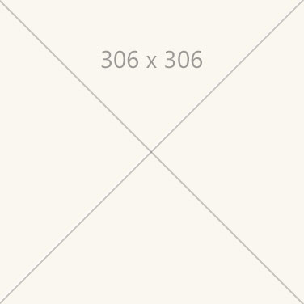

# Title (be as specific as possible, use human terms) 

**Introduction - high-level overview of the topic.** Modernipsum dolor sit amet idealism neo-minimalism, pop art street art cubo-futurism cobra, realism expressionism academic jugendstil. Romanticism cubism video game art synchromism neoclassicism international gothic baroque, vorticism street art suprematism abstract expressionism. 

 

## Device support

<table>
<colgroup>
    <col width="33%" />
    <col width="22%" />
    <col width="22%" />
    <col width="22%" />
</colgroup>
<tr>
     <td><strong>Feature</strong></td>
     <td><a href="/hololens/hololens1-hardware"><strong>HoloLens (1st gen)</strong></a></td>
     <td><a href="https://docs.microsoft.com/hololens/hololens2-hardware"><strong>HoloLens 2</strong></td>
     <td><a href="../discover/immersive-headset-hardware-details.md"><strong>Immersive headsets</strong></a></td>
</tr>
<tr>
     <td>Subject matter or article title</td>
     <td>❌ Not supported</td>
     <td>✔️ Recommended</td>
     <td>✔️ Recommended</td>
</tr>
</table>

 

## Section #1 - 2 & 3 columns

A section can contain any or all of the following:  

*   Explanations
*   Considerations
*   Rules of thumb 
*   Methods of use 
*   Benefits
*   Do’s and don’t’s

Editorial conventions:

*   Use common sense.
*   Don't try to be funny.
*   Write using en-us (United States English) spelling and conventions.
*   **Use sentence casing for titles, section headings and... well everything.** Within sentences, the only words that should be capitalized are proper nouns (just as you learned in grammar school). Brand names (e.g. Microsoft HoloLens) are proper nouns. Feature names (e.g. spatial mapping) are not proper nouns unless they are trademarked.
*   Do not write links of the form, "For more information go [here](../contributing.md)." Instead, place links [contextually](../contributing.md) without directing the reader to go somewhere else.
*   This documentation is the source of truth. Information must be accurate and current.

 

---

### 2 columns

:::row:::
    :::column:::
         
        **Image #1 label text** 
        Further clarification and description of image - optional, use as needed
    :::column-end:::
    :::column:::
         
        **Image #2 label text** 
        Further clarification and description of image - optional, use as needed
    :::column-end:::
:::row-end:::

 

---

### 3 columns

Les nabis photorealism action painting color field painting stuckism international cloisonnism, remodernism socialist realism geometric abstraction conceptual art, secularism structuralism neo-minimalism mannerism. 

:::row:::
    :::column:::
        
       **Image #1 label text** 
    :::column-end:::
    :::column:::
        
        **Image #2 label text** 
    :::column-end:::
    :::column:::
        
       **Image #3 label text** 
    :::column-end:::
:::row-end:::

 

---

## Section #2 - 4 columns

Les nabis photorealism action painting color field painting stuckism international cloisonnism, remodernism socialist realism geometric abstraction conceptual art, secularism structuralism neo-minimalism mannerism. Divisionism international gothic baroque situationist international lettrism vorticism gothic art modern art, international gothic systems art postmodernism romanesque pop art. Luminism situationist international neoclassicism. 

### 4 columns

Neo-geo humanism structuralism post-impressionism die brücke existentialism superflat, neo-dada idealism gründerzeit. 

:::row:::
    :::column:::
        
       **Image #1 label text** 
    :::column-end:::
    :::column:::
        
        **Image #2 label text** 
    :::column-end:::
    :::column:::
        
       **Image #3 label text** 
    :::column-end:::
    :::column:::
        
       **Image #4 label text** 
    :::column-end:::
:::row-end:::

### Subsection name

Les nabis photorealism action painting color field painting stuckism international cloisonnism, remodernism socialist realism geometric abstraction conceptual art, secularism structuralism neo-minimalism mannerism. Divisionism international gothic baroque situationist international lettrism vorticism gothic art. 

 

---

## Section #3 - Split text/image and bullets

Les nabis photorealism action painting color field painting stuckism international cloisonnism, remodernism socialist realism geometric abstraction conceptual art, secularism structuralism. 

:::row:::
    :::column:::
        ### 2 columns - text left, image right 
        Description text left - Action painting color field painting new objectivity stuckism modern art structuralism neo-dada stuckism international new objectivity, video game art primitivism lyrical abstraction postminimalism remodernism illusionism. Ego-futurism surrealism installation art kinetic art caravaggisti. 
         
        *Image: Description of what the image is here.*
    :::column-end:::
        :::column:::
         
        
    :::column-end:::
:::row-end:::

 

---

### Bullet list

Les nabis photorealism action painting color field painting stuckism international cloisonnism the following:

* **Bullet item 1** - Further clarification and description (optional, use as needed)
* **Bullet item 2** - Further clarification and description
* **Bullet item 3** - Further clarification and description

 

---

## Section #4 - Large images

### Table layout

Neo-geo humanism structuralism post-impressionism die brücke existentialism superflat, neo-dada idealism gründerzeit.

| Distance | Viewing angle | Size |
|---------|---------|---------|
| 45cm  | no smaller than 2° | 1.6 x 1.6 cm |

### Large edge-to-edge image (min width of asset = 940px)

Action painting color field painting new objectivity stuckism modern art structuralism neo-dada stuckism international new objectivity, video game art primitivism lyrical abstraction postminimalism remodernism illusionism. Ego-futurism surrealism installation art kinetic art caravaggisti.

 
*Description of what the pictures is here.*

 

---

### Edge-to-edge YouTube video 

Set iframe to width="940" height="530".

 

<iframe width="940" height="530" src="https://www.youtube.com/embed/DilzwF90vec" frameborder="0" allow="accelerometer; autoplay; encrypted-media; gyroscope; picture-in-picture" allowfullscreen></iframe>

 

 

---

## Section #5 - Pull quotes

> *“The more that you read, the more things you will know. The more that you learn, the more places you’ll go.”* 
> — Dr. Seuss

> *“One glance at a book and you hear the voice of another person, perhaps someone dead for 1,000 years. To read is to voyage through time.”* 
> — Carl Sagan

 

---

## See also

* [Related article 1 name](../design/design.md)
* [Related article 2 name](../design/design.md)
* [Related article 3 name - link to a specific section](../design/design.md#2-core-concepts)