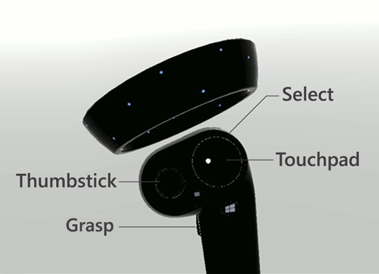
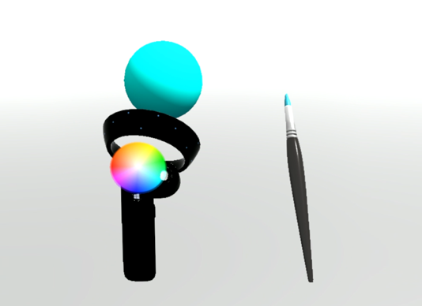
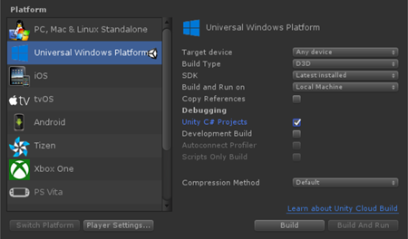
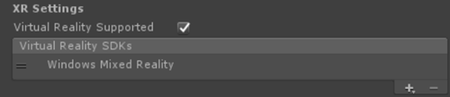
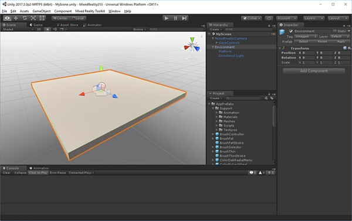
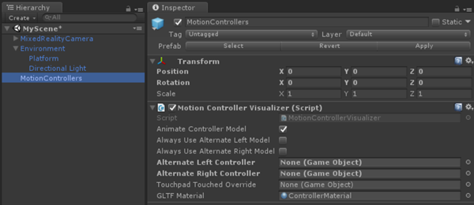
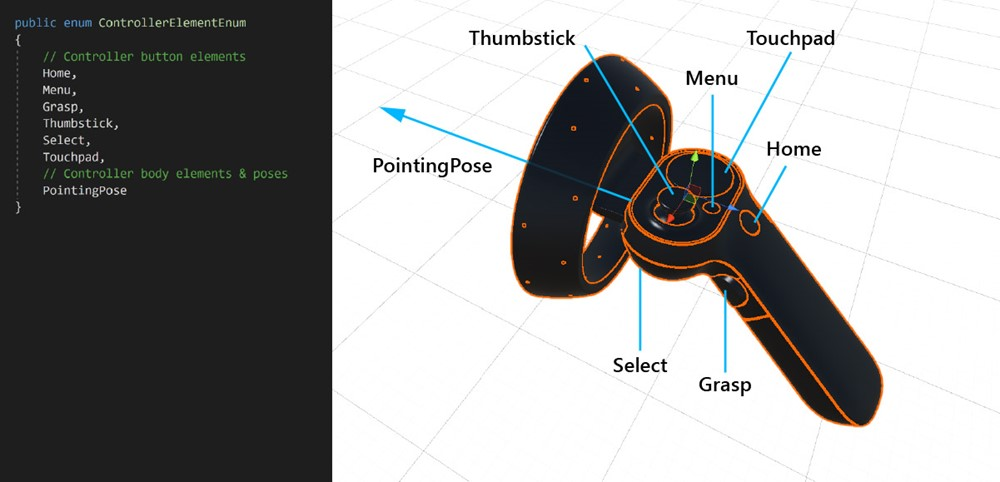
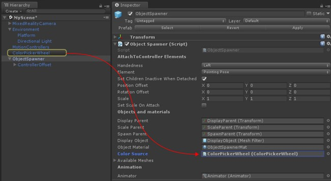
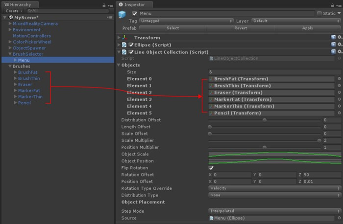

# MR Input 213: Motion controllers

>[!NOTE]
>The Mixed Reality Academy tutorials were designed with HoloLens (1st gen) and Mixed Reality Immersive Headsets in mind.  As such, we feel it is important to leave these tutorials in place for developers who are still looking for guidance in developing for those devices.  These tutorials will **_not_** be updated with the latest toolsets or interactions being used for HoloLens 2.  They will be maintained to continue working on the supported devices. [A new series of tutorials](/learn/paths/beginner-hololens-2-tutorials/) has been posted for HoloLens 2.

Motion controllers in the mixed reality world add another level of interactivity. With [motion controllers](../design/motion-controllers.md), we can directly interact with objects in a more natural way, similar to our physical interactions in real life, increasing immersion and delight in your app experience.

In MR Input 213, we will explore the motion controller's input events by creating a simple spatial painting experience. With this app, users can paint in three-dimensional space with various types of brushes and colors.

## Topics covered in this tutorial

||||
| :--- | :--- | :--- |
|**Controller visualization**|**Controller input events**|**Custom controller and UI**|
|Learn how to render motion controller models in Unity's game mode and runtime.|Understand different types of button events and their applications.|Learn how to overlay UI elements on top of the controller or fully customize it.|

## Device support

<table>
<tr>
<th>Course</th><th style="width:150px"> <a href="/hololens/hololens1-hardware">HoloLens</a></th><th style="width:150px"> <a href="/windows/mixed-reality/enthusiast-guide/immersive-headset-hardware-details">Immersive headsets</a></th>
</tr><tr>
<td>MR Input 213: Motion controllers</td><td style="text-align: center;"> </td><td style="text-align: center;"> ✔️</td>
</tr>
</table>

## Before you start

### Prerequisites

See the installation checklist for immersive headsets on [this page](../develop/install-the-tools.md).

* This tutorial requires [Unity 2017.2.1p2](https://beta.unity3d.com/download/1dc514532f08/UnityDownloadAssistant-2017.2.1p2.exe)

### Project files

* [Download the files](https://github.com/Microsoft/MixedReality213/archive/master.zip) required by the project and extract the files to the Desktop.

>[!NOTE]
>If you want to look through the source code before downloading, it's [available on GitHub](https://github.com/Microsoft/MixedReality213).

## Unity setup

>[!VIDEO https://www.youtube.com/embed/cBAOALaHys4]

### Objectives

* Optimize Unity for Windows Mixed Reality development
* Setup Mixed Reality Camera
* Setup environment

### Instructions

* Start Unity.
* Select **Open**.
* Navigate to your Desktop and find the **MixedReality213-master** folder you previously unarchived.
* Click **Select Folder**.
* Once Unity finishes loading project files, you will be able to see Unity editor.
* In Unity, select **File > Build Settings**.

    

* Select **Universal Windows Platform** in the **Platform** list and click the **Switch Platform** button.
* Set Target Device to **Any device**
* Set Build Type to **D3D**
* Set SDK to **Latest Installed**
* Check **Unity C# Projects**
    * This allows you modify script files in the Visual Studio project without rebuilding Unity project.
* Click **Player Settings**.
* In the **Inspector** panel, scroll down to the bottom
* In XR Settings, check **Virtual Reality Supported**
* Under Virtual Reality SDKs, select **Windows Mixed Reality**

    

* Close **Build Settings** window.

### Project structure

This tutorial uses **[Mixed Reality Toolkit - Unity](https://github.com/Microsoft/MixedRealityToolkit-Unity)**. You can find the releases on [this page](https://github.com/Microsoft/MixedRealityToolkit-Unity/releases).


**Completed scenes for your reference**

* You will find two completed Unity scenes under **Scenes** folder.
    * **MixedReality213**: Completed scene with single brush
    * **MixedReality213Advanced**: Completed scene for advanced design with multiple brushes

**New Scene setup for the tutorial**

* In Unity, click **File > New Scene**
* Delete **Main Camera** and **Directional Light**
* From the **Project panel**, search and drag the following prefabs into the **Hierarchy** panel:
    * Assets/HoloToolkit/Input/Prefabs/**MixedRealityCamera**
    * Assets/AppPrefabs/**Environment**

    

* There are two camera prefabs in Mixed Reality Toolkit:
    * **MixedRealityCamera.prefab**: Camera only
    * **MixedRealityCameraParent.prefab**: Camera + Teleportation + Boundary
    * In this tutorial, we will use **MixedRealityCamera** without teleportation feature. Because of this, we added simple **Environment** prefab which contains a basic floor to make the user feel grounded.
    * To learn more about the teleportation with **MixedRealityCameraParent**, see [Advanced design - Teleportation and locomotion](#advanced-design---teleportation-and-locomotion)

**Skybox setup**

* Click **Window > Lighting > Settings**
* Click the circle on the right side of the **Skybox Material field**
* Type in ‘gray’ and select **SkyboxGray** (Assets/AppPrefabs/Support/Materials/SkyboxGray.mat)

    

* Check **Skybox** option to be able to see assigned gray gradient skybox

    

* The scene with MixedRealityCamera, Environment and gray skybox will look like this.

    

* Click **File > Save Scene as**
* **Save** your scene under Scenes folder with any name

## Chapter 1 - Controller visualization

>[!VIDEO https://www.youtube.com/embed/Kw0bf5NqyRg]

### Objectives

* Learn how to render motion controller models in Unity's game mode and at runtime.

Windows Mixed Reality provides an animated controller model for controller visualization. There are several approaches you can take for controller visualization in your app:

* Default - Using default controller without modification
* Hybrid - Using default controller, but customizing some of its elements or overlaying UI components
* Replacement - Using your own customized 3D model for the controller

In this chapter, we will learn about the examples of these controller customizations.

### Instructions

* In the **Project** panel, type **MotionControllers** in the search box . You can also find it under Assets/HoloToolkit/Input/Prefabs/.
* Drag the **MotionControllers** prefab into the **Hierarchy** panel.
* Click on the **MotionControllers** prefab in the **Hierarchy** panel.

**MotionControllers prefab**

**MotionControllers** prefab has a **MotionControllerVisualizer** script which provides the slots for alternate controller models. If you assign your own custom 3D models such as a hand or a sword and check 'Always Use Alternate Left/Right Model', you will see them instead of the default model. We will use this slot in Chapter 4 to replace the controller model with a brush.



**Instructions**

* In the **Inspector** panel, double click **MotionControllerVisualizer** script to see the code in the Visual Studio

**MotionControllerVisualizer script**

The **MotionControllerVisualizer** and **MotionControllerInfo** classes provide the means to access & modify the default controller models. **MotionControllerVisualizer** subscribes to Unity's **InteractionSourceDetected** event and automatically instantiates controller models when they are found.

```cs
protected override void Awake()
{
    ...
    InteractionManager.InteractionSourceDetected += InteractionManager_InteractionSourceDetected;
    InteractionManager.InteractionSourceLost += InteractionManager_InteractionSourceLost;
    ...
}
```

The controller models are delivered according to [the glTF specification](https://github.com/KhronosGroup/glTF). This format has been created to provide a common format, while improving the process behind transmitting and unpacking 3D assets. In this case, we need to retrieve and load the controller models at runtime, as we want to make the user's experience as seamless as possible, and it's not guaranteed which version of the motion controllers the user might be using. This course, via the Mixed Reality Toolkit, uses a version of the Khronos Group's [UnityGLTF project](https://github.com/KhronosGroup/UnityGLTF).

Once the controller has been delivered, scripts can use **MotionControllerInfo** to find the transforms for specific controller elements so they can correctly position themselves.

In a later chapter, we will learn how to use these scripts to attach UI elements to the controllers.

*In some scripts, you will find code blocks with **#if !UNITY_EDITOR** or **UNITY_WSA**. These code blocks run only on the UWP runtime when you deploy to Windows. This is because the set of APIs used by the Unity editor and the UWP app runtime are different.*

* **Save** the scene and click the **play** button.

You will be able to see the scene with motion controllers in your headset. You can see detailed animations for button clicks, thumbstick movement, and touchpad touch highlighting.


## Chapter 2 - Attaching UI elements to the controller

>[!VIDEO https://www.youtube.com/embed/e-mLlwmTzJo]

### Objectives

* Learn about the elements of the motion controllers
* Learn how to attach objects to specific parts of the controllers

In this chapter, you will learn how to add user interface elements to the controller which the user can easily access and manipulate at anytime. You will also learn how to add a simple color picker UI using the touchpad input.

### Instructions

* In the **Project** panel, search **MotionControllerInfo** script.
* From the search result, double click **MotionControllerInfo** script to see the code in Visual Studio.

**MotionControllerInfo script**

The first step is to choose which element of the controller you want the UI to attach to. These elements are defined in **ControllerElementEnum** in **MotionControllerInfo.cs**.



* **Home**
* **Menu**
* **Grasp**
* **Thumbstick**
* **Select**
* **Touchpad**
* **Pointing pose** – this element represents the tip of the controller pointing forward direction.

**Instructions**

* In the **Project** panel, search **AttachToController** script.
* From the search result, double click **AttachToController** script to see the code in Visual Studio.

**AttachToController script**

The **AttachToController** script provides a simple way to attach any objects to a specified controller handedness and element.

In **AttachElementToController()**,

* Check handedness using **MotionControllerInfo.Handedness**
* Get specific element of the controller using **MotionControllerInfo.TryGetElement()**
* After retrieving the element's transform from the controller model, parent the object under it and set object's local position & rotation to zero.

```cs
public MotionControllerInfo.ControllerElementEnum Element { get { return element; } }

private void AttachElementToController(MotionControllerInfo newController)
{
     if (!IsAttached && newController.Handedness == handedness)
     {
          if (!newController.TryGetElement(element, out elementTransform))
          {
               Debug.LogError("Unable to find element of type " + element + " under controller " + newController.ControllerParent.name + "; not attaching.");
               return;
          }

          controller = newController;

          SetChildrenActive(true);

          // Parent ourselves under the element and set our offsets
          transform.parent = elementTransform;
          transform.localPosition = positionOffset;
          transform.localEulerAngles = rotationOffset;
          if (setScaleOnAttach)
          {
               transform.localScale = scale;
          }

          // Announce that we're attached
          OnAttachToController();
          IsAttached = true;
     }
}
```

The simplest way to use **AttachToController** script is to inherit from it, as we've done in the case of **ColorPickerWheel.** Simply override the **OnAttachToController** and **OnDetachFromController** functions to perform your setup / breakdown when the controller is detected / disconnected.

**Instructions**

* In the **Project** panel, type in the search box **ColorPickerWheel**. You can also find it under Assets/AppPrefabs/.
* Drag **ColorPickerWheel** prefab into the **Hierarchy** panel.
* Click the **ColorPickerWheel** prefab in the **Hierarchy** panel.
* In the **Inspector** panel, double click **ColorPickerWheel** Script to see the code in Visual Studio.


**ColorPickerWheel script**

Since **ColorPickerWheel** inherits **AttachToController**, it shows **Handedness** and **Element** in the **Inspector** panel. We'll be attaching the UI to the Touchpad element on the left controller.


**ColorPickerWheel** overrides the **OnAttachToController** and **OnDetachFromController** to subscribe to the input event which will be used in next chapter for color selection with touchpad input.

```cs
public class ColorPickerWheel : AttachToController, IPointerTarget
{
    protected override void OnAttachToController()
    {
        // Subscribe to input now that we're parented under the controller
        InteractionManager.InteractionSourceUpdated += InteractionSourceUpdated;
    }

    protected override void OnDetachFromController()
    {
        Visible = false;

        // Unsubscribe from input now that we've detached from the controller
        InteractionManager.InteractionSourceUpdated -= InteractionSourceUpdated;
    }
    ...
}
```

* **Save** the scene and click the **play** button.

**Alternative method for attaching objects to the controllers**

We recommend that your scripts inherit from **AttachToController** and override **OnAttachToController**. However, this may not always be possible. An alternative is using it as a standalone component. This can be useful when you want to attach an existing prefab to a controller without refactoring your scripts. Simply have your class wait for IsAttached to be set to true before performing any setup. The simplest way to do this is by using a coroutine for 'Start.'

```cs
private IEnumerator Start() {
    AttachToController attach = gameObject.GetComponent<AttachToController>();

    while (!attach.IsAttached) {
        yield return null;
    }

    // Perform setup here
}
```

## Chapter 3 - Working with touchpad input

>[!VIDEO https://www.youtube.com/embed/SUyw0kxZPFw]

### Objectives

* Learn how to get touchpad input data events
* Learn how to use touchpad axis position information for your app experience

### Instructions

* In the **Hierarchy** panel, click **ColorPickerWheel**
* In the **Inspector** panel, under **Animator**, double click **ColorPickerWheelController**
* You will be able to see **Animator** tab opened

**Showing/hiding UI with Unity's Animation controller**

To show and hide the **ColorPickerWheel** UI with animation, we are using [Unity's animation system](https://docs.unity3d.com/Manual/AnimationOverview.html). Setting the **ColorPickerWheel**'s **Visible** property to true or false triggers **Show** and **Hide** animation triggers. **Show** and **Hide** parameters are defined in the **ColorPickerWheelController** animation controller.


**Instructions**

* In the **Hierarchy** panel, select **ColorPickerWheel** prefab
* In the **Inspector** panel, double click **ColorPickerWheel** script to see the code in the Visual Studio

**ColorPickerWheel script**

**ColorPickerWheel** subscribes to Unity's **InteractionSourceUpdated** event to listen for touchpad events.

In **InteractionSourceUpdated()**, the script first checks to ensure that it:

* is actually a touchpad event (obj.state.**touchpadTouched**)
* originates from the left controller (obj.state.source.**handedness**)

If both are true, the touchpad position (obj.state.**touchpadPosition**) is assigned to **selectorPosition**.

```cs
private void InteractionSourceUpdated(InteractionSourceUpdatedEventArgs obj)
{
    if (obj.state.source.handedness == handedness && obj.state.touchpadTouched)
    {
        Visible = true;
        selectorPosition = obj.state.touchpadPosition;
    }
}
```

In **Update()**, based on **visible** property, it triggers Show and Hide animation triggers in the color picker's animator component

```cs
if (visible != visibleLastFrame)
{
    if (visible)
    {
        animator.SetTrigger("Show");
    }
    else
    {
        animator.SetTrigger("Hide");
    }
}
```

In **Update()**, **selectorPosition** is used to cast a ray at the color wheel's mesh collider, which returns a UV position. This position can then be used to find the pixel coordinate and color value of the color wheel's texture. This value is accessible to other scripts via the **SelectedColor** property.


```cs
...
    // Clamp selector position to a radius of 1
    Vector3 localPosition = new Vector3(selectorPosition.x * inputScale, 0.15f, selectorPosition.y * inputScale);
    if (localPosition.magnitude > 1)
    {
        localPosition = localPosition.normalized;
    }
    selectorTransform.localPosition = localPosition;

    // Raycast the wheel mesh and get its UV coordinates
    Vector3 raycastStart = selectorTransform.position + selectorTransform.up * 0.15f;
    RaycastHit hit;
    Debug.DrawLine(raycastStart, raycastStart - (selectorTransform.up * 0.25f));

    if (Physics.Raycast(raycastStart, -selectorTransform.up, out hit, 0.25f, 1 << colorWheelObject.layer, QueryTriggerInteraction.Ignore))
    {
        // Get pixel from the color wheel texture using UV coordinates
        Vector2 uv = hit.textureCoord;
        int pixelX = Mathf.FloorToInt(colorWheelTexture.width * uv.x);
        int pixelY = Mathf.FloorToInt(colorWheelTexture.height * uv.y);
        selectedColor = colorWheelTexture.GetPixel(pixelX, pixelY);
        selectedColor.a = 1f;
    }
    // Set the selector's color and blend it with white to make it visible on top of the wheel
    selectorRenderer.material.color = Color.Lerp (selectedColor, Color.white, 0.5f);
}
```

## Chapter 4 - Overriding controller model

>[!VIDEO https://www.youtube.com/embed/8gBFqA_DZ_U]

### Objectives

* Learn how to override the controller model with a custom 3D model.


### Instructions

* Click **MotionControllers** in the **Hierarchy** panel.
* Click the circle on the right side of the **Alternate Right Controller** field.
* Type in **'BrushController**' and select the prefab from the result. You can find it under Assets/AppPrefabs/**BrushController**.
* Check **Always Use Alternate Right Model**


The **BrushController** prefab does not have to be included in the **Hierarchy** panel. However, to check out its child components:

* In the **Project** panel, type in **BrushController** and drag **BrushController** prefab into the **Hierarchy** panel.


You will find the **Tip** component in **BrushController**. We will use its transform to start/stop drawing lines.

* Delete the **BrushController** from the **Hierarchy** panel.
* **Save** the scene and click the **play** button. You will be able to see the brush model replaced the right-hand motion controller.

## Chapter 5 - Painting with Select input

>[!VIDEO https://www.youtube.com/embed/QTrYaMHIs7w]

### Objectives

* Learn how to use the Select button event to start and stop a line drawing

### Instructions

* Search **BrushController** prefab in the **Project** panel.
* In the **Inspector** panel, double click **BrushController** Script to see the code in Visual Studio

**BrushController script**

**BrushController** subscribes to the InteractionManager's **InteractionSourcePressed** and **InteractionSourceReleased** events. When **InteractionSourcePressed** event is triggered, the brush's **Draw** property is set to true; when **InteractionSourceReleased** event is triggered, the brush's **Draw** property is set to false.

```cs
private void InteractionSourcePressed(InteractionSourcePressedEventArgs obj)
{
    if (obj.state.source.handedness == InteractionSourceHandedness.Right && obj.pressType == InteractionSourcePressType.Select)
    {
        Draw = true;
    }
}

private void InteractionSourceReleased(InteractionSourceReleasedEventArgs obj)
{
    if (obj.state.source.handedness == InteractionSourceHandedness.Right && obj.pressType == InteractionSourcePressType.Select)
    {
        Draw = false;
    }
}
```

While **Draw** is set to true, the brush will generate points in an instantiated Unity **LineRenderer**. A reference to this prefab is kept in the brush's **Stroke Prefab** field.

```cs
private IEnumerator DrawOverTime()
{
    // Get the position of the tip
    Vector3 lastPointPosition = tip.position;

    ...

    // Create a new brush stroke
    GameObject newStroke = Instantiate(strokePrefab);
    LineRenderer line = newStroke.GetComponent<LineRenderer>();
    newStroke.transform.position = startPosition;
    line.SetPosition(0, tip.position);
    float initialWidth = line.widthMultiplier;

    // Generate points in an instantiated Unity LineRenderer
    while (draw)
    {
        // Move the last point to the draw point position
        line.SetPosition(line.positionCount - 1, tip.position);
        line.material.color = colorPicker.SelectedColor;
        brushRenderer.material.color = colorPicker.SelectedColor;
        lastPointAddedTime = Time.unscaledTime;
        // Adjust the width between 1x and 2x width based on strength of trigger pull
        line.widthMultiplier = Mathf.Lerp(initialWidth, initialWidth * 2, width);

        if (Vector3.Distance(lastPointPosition, tip.position) > minPositionDelta || Time.unscaledTime > lastPointAddedTime + maxTimeDelta)
        {
            // Spawn a new point
            lastPointAddedTime = Time.unscaledTime;
            lastPointPosition = tip.position;
            line.positionCount += 1;
            line.SetPosition(line.positionCount - 1, lastPointPosition);
        }
        yield return null;
    }
}
```

To use the currently selected color from the color picker wheel UI, **BrushController** needs to have a reference to the **ColorPickerWheel** object. Because the **BrushController** prefab is instantiated at runtime as a replacement controller, any references to objects in the scene will have to be set at runtime. In this case we use **GameObject.FindObjectOfType** to locate the **ColorPickerWheel**:

```cs
private void OnEnable()
{
    // Locate the ColorPickerWheel
    colorPicker = FindObjectOfType<ColorPickerWheel>();

    // Assign currently selected color to the brush’s material color
    brushRenderer.material.color = colorPicker.SelectedColor;
    ...
}
```

* **Save** the scene and click the **play** button. You will be able to draw the lines and paint using the select button on the right-hand controller.

## Chapter 6 - Object spawning with Select input

>[!VIDEO https://www.youtube.com/embed/z4IxyzFHP0U]

### Objectives

* Learn how to use Select and Grasp button input events
* Learn how to instantiate objects

### Instructions

* In the **Project** panel, type **ObjectSpawner** in the search box. You can also find it under Assets/AppPrefabs/
* Drag the **ObjectSpawner** prefab into the **Hierarchy** panel.
* Click **ObjectSpawner** in the **Hierarchy** panel.
* **ObjectSpawner** has a field named **Color Source**.
* From the **Hierarchy** panel, drag the **ColorPickerWheel** reference into this field.

    

* Click the **ObjectSpawner** prefab in the **Hierarchy** panel.
* In the **Inspector** panel, double click **ObjectSpawner** Script to see the code in Visual Studio.

**ObjectSpawner script**

The **ObjectSpawner** instantiates copies of a primitive mesh (cube, sphere, cylinder) into the space. When a **InteractionSourcePressed** is detected it checks the handedness and if it's an **InteractionSourcePressType.Grasp** or **InteractionSourcePressType.Select** event.

For a **Grasp** event, it increments the index of current mesh type (sphere, cube, cylinder)

```cs
private void InteractionSourcePressed(InteractionSourcePressedEventArgs obj)
{
    // Check handedness, see if it is left controller
    if (obj.state.source.handedness == handedness)
    {
        switch (obj.pressType)
        {
            // If it is Select button event, spawn object
            case InteractionSourcePressType.Select:
                if (state == StateEnum.Idle)
                {
                    // We've pressed the grasp - enter spawning state
                    state = StateEnum.Spawning;
                    SpawnObject();
                }
                break;

            // If it is Grasp button event
            case InteractionSourcePressType.Grasp:

                // Increment the index of current mesh type (sphere, cube, cylinder)
                meshIndex++;
                if (meshIndex >= NumAvailableMeshes)
                {
                    meshIndex = 0;
                }
                break;

            default:
                break;
        }
    }
}
```

For a **Select** event, in **SpawnObject()**, a new object is instantiated, un-parented and released into the world.

```cs
private void SpawnObject()
{
    // Instantiate the spawned object
    GameObject newObject = Instantiate(displayObject.gameObject, spawnParent);
    // Detach the newly spawned object
    newObject.transform.parent = null;
    // Reset the scale transform to 1
    scaleParent.localScale = Vector3.one;
    // Set its material color so its material gets instantiated
    newObject.GetComponent<Renderer>().material.color = colorSource.SelectedColor;
}
```

The **ObjectSpawner** uses the **ColorPickerWheel** to set the color of the display object's material. Spawned objects are given an instance of this material so they will retain their color.

* **Save** the scene and click the **play** button.

You will be able to change the objects with the Grasp button and spawn objects with the Select button.

## Build and deploy app to Mixed Reality Portal

* In Unity, select **File > Build Settings**.
* Click **Add Open Scenes** to add current scene to the **Scenes In Build**.
* Click **Build**.
* Create a **New Folder** named "App".
* Single click the **App** folder.
* Click **Select Folder**.
* When Unity is done, a File Explorer window will appear.
* Open the **App** folder.
* Double click **YourSceneName.sln** Visual Studio Solution file.
* Using the top toolbar in Visual Studio, change the target from Debug to **Release** and from ARM to **X64**.
* Click on the drop-down arrow next to the Device button, and select **Local Machine**.
* Click **Debug -> Start Without debugging** in the menu or press **Ctrl + F5**.

Now the app is built and installed in Mixed Reality Portal. You can launch it again through Start menu in Mixed Reality Portal.

## Advanced design - Brush tools with radial layout


In this chapter, you will learn how to replace the default motion controller model with a custom brush tool collection. For your reference, you can find the completed scene **MixedReality213Advanced** under **Scenes** folder.

### Instructions

* In the **Project** panel, type **BrushSelector** in the search box . You can also find it under Assets/AppPrefabs/
* Drag the **BrushSelector** prefab into the **Hierarchy** panel.
* For organization, create an empty GameObject called **Brushes**
* Drag following prefabs from the **Project** panel into **Brushes**
    * Assets/AppPrefabs/**BrushFat**
    * Assets/AppPrefabs/**BrushThin**
    * Assets/AppPrefabs/**Eraser**
    * Assets/AppPrefabs/**MarkerFat**
    * Assets/AppPrefabs/**MarkerThin**
    * Assets/AppPrefabs/**Pencil**

    

* Click **MotionControllers** prefab in the **Hierarchy** panel.
* In the **Inspector** panel, uncheck **Always Use Alternate Right Model** on the **Motion Controller Visualizer**
* In the **Hierarchy** panel, click **BrushSelector**
* **BrushSelector** has a field named **ColorPicker**
* From the **Hierarchy** panel, drag the **ColorPickerWheel** into **ColorPicker** field in the **Inspector** panel.

    

* In the **Hierarchy** panel, under **BrushSelector** prefab, select the **Menu** object.
* In the **Inspector** panel, under the **LineObjectCollection** component, open the **Objects** array dropdown. You will see 6 empty slots.
* From the **Hierarchy** panel, drag each of the prefabs parented under the **Brushes** GameObject into these slots in any order. (Make sure you're dragging the prefabs from the scene, not the prefabs in the project folder.)



**BrushSelector prefab**

Since the **BrushSelector** inherits **AttachToController**, it shows **Handedness** and **Element** options in the **Inspector** panel. We selected **Right** and **Pointing Pose** to attach brush tools to the right hand controller with forward direction.

The **BrushSelector** makes use of two utilities:

* **Ellipse**: used to generate points in space along an ellipse shape.
* **LineObjectCollection**: distributes objects using the points generated by any Line class (eg, Ellipse). This is what we'll be using to place our brushes along the Ellipse shape.

When combined, these utilities can be used to create a radial menu.

**LineObjectCollection script**

**LineObjectCollection** has controls for the size, position and rotation of objects distributed along its line. This is useful for creating radial menus like the brush selector. To create the appearance of brushes that scale up from nothing as they approach the center selected position, the **ObjectScale** curve peaks in the center and tapers off at the edges.

**BrushSelector script**

In the case of the **BrushSelector**, we've chosen to use procedural animation. First, brush models are distributed in an ellipse by the **LineObjectCollection** script. Then, each brush is responsible for maintaining its position in the user's hand based on its **DisplayMode** value, which changes based on the selection. We chose a procedural approach because of the high probability of brush position transitions being interrupted as the user selects brushes. Mecanim animations can handle interruptions gracefully, but it tends to be more complicated than a simple Lerp operation.

**BrushSelector** uses a combination of both. When touchpad input is detected, brush options become visible and scale up along the radial menu. After a timeout period (which indicates that the user has made a selection) the brush options scale down again, leaving only the selected brush.

**Visualizing touchpad input**

Even in cases where the controller model has been completely replaced, it can be helpful to show input on the original model inputs. This helps to ground the user's actions in reality. For the **BrushSelector** we've chosen to make the touchpad briefly visible when the input is received. This was done by retrieving the Touchpad element from the controller, replacing its material with a custom material, then applying a gradient to that material's color based on the last time touchpad input was received.

```cs
protected override void OnAttachToController()
{
    // Turn off the default controller's renderers
    controller.SetRenderersVisible(false);

    // Get the touchpad and assign our custom material to it
    Transform touchpad;
    if (controller.TryGetElement(MotionControllerInfo.ControllerElementEnum.Touchpad, out touchpad))
    {
        touchpadRenderer = touchpad.GetComponentInChildren<MeshRenderer>();
        originalTouchpadMaterial = touchpadRenderer.material;
        touchpadRenderer.material = touchpadMaterial;
        touchpadRenderer.enabled = true;
    }

    // Subscribe to input now that we're parented under the controller
    InteractionManager.InteractionSourceUpdated += InteractionSourceUpdated;
}

private void Update()
{
    ...
    // Update our touchpad material
    Color glowColor = touchpadColor.Evaluate((Time.unscaledTime - touchpadTouchTime) / touchpadGlowLossTime);
    touchpadMaterial.SetColor("_EmissionColor", glowColor);
    touchpadMaterial.SetColor("_Color", glowColor);
    ...
}
```

**Brush tool selection with touchpad input**

When the brush selector detects touchpad's pressed input, it checks the position of the input to determine if it was to the left or right.

**Stroke thickness with selectPressedAmount**

Instead of the **InteractionSourcePressType.Select** event in the **InteractionSourcePressed()**, you can get the analog value of the pressed amount through **selectPressedAmount**. This value can be retrieved in **InteractionSourceUpdated()**.

```cs
private void InteractionSourceUpdated(InteractionSourceUpdatedEventArgs obj)
{
    if (obj.state.source.handedness == handedness)
    {
        if (obj.state.touchpadPressed)
        {
            // Check which side we clicked
            if (obj.state.touchpadPosition.x < 0)
            {
                currentAction = SwipeEnum.Left;
            }
            else
            {
                currentAction = SwipeEnum.Right;
            }

            // Ping the touchpad material so it gets bright
            touchpadTouchTime = Time.unscaledTime;
        }

        if (activeBrush != null)
        {
            // If the pressed amount is greater than our threshold, draw
            if (obj.state.selectPressedAmount >= selectPressedDrawThreshold)
            {
                activeBrush.Draw = true;
                activeBrush.Width = ProcessSelectPressedAmount(obj.state.selectPressedAmount);
            }
            else
            {
                // Otherwise, stop drawing
                activeBrush.Draw = false;
                selectPressedSmooth = 0f;
            }
        }
    }
}
```

**Eraser script**

**Eraser** is a special type of brush that overrides the base **Brush**'s **DrawOverTime()** function. While Draw is true, the eraser checks to see if its tip intersects with any existing brush strokes. If it does, they are added to a queue to be shrunk down and deleted.

## Advanced design - Teleportation and locomotion

If you want to allow the user to move around the scene with teleportation using thumbstick, use **MixedRealityCameraParent** instead of **MixedRealityCamera**. You also need to add **InputManager** and **DefaultCursor**. Since **MixedRealityCameraParent** already includes **MotionControllers** and **Boundary** as child components, you should remove existing **MotionControllers** and **Environment** prefab.

### Instructions

* In the **Hierarchy** panel, delete **MixedRealityCamera**, **Environment** and **MotionControllers**
* From the **Project panel**, search and drag the following prefabs into the **Hierarchy** panel:
    * Assets/AppPrefabs/Input/Prefabs/**MixedRealityCameraParent**
    * Assets/AppPrefabs/Input/Prefabs/**InputManager**
    * Assets/AppPrefabs/Input/Prefabs/Cursor/**DefaultCursor**

    

* In the **Hierarchy** panel, click **Input Manager**
* In the **Inspector** panel, scroll down to the **Simple Single Pointer Selector** section
* From the **Hierarchy** panel, drag **DefaultCursor** into **Cursor** field

    

* **Save** the scene and click the **play** button. You will be able to use the thumbstick to rotate left/right or teleport.

## The end

And that's the end of this tutorial! You learned:

* How to work with motion controller models in Unity's game mode and runtime.
* How to use different types of button events and their applications.
* How to overlay UI elements on top of the controller or fully customize it.

You are now ready to start creating your own immersive experience with motion controllers!

## Completed scenes

* In Unity's **Project** panel click on the **Scenes** folder.
* You will find two Unity scenes **MixedReality213** and **MixedReality213Advanced**.
    * **MixedReality213**: Completed scene with single brush
    * **MixedReality213Advanced**: Completed scene with multiple brush with select button's press amount example

## See also

* [MR Input 213 project files](https://github.com/Microsoft/MixedReality213)
* [Mixed Reality Toolkit - Motion Controller Test scene](https://github.com/Microsoft/MixedRealityToolkit-Unity/tree/htk_release/Assets/HoloToolkit-Examples/Input/Scenes)
* [Mixed Reality Toolkit - Grab Mechanics](https://github.com/Microsoft/MixedRealityToolkit-Unity/tree/htk_release/Assets/HoloToolkit-Examples/MotionControllers-GrabMechanics)
* [Motion controller development guidelines](../design/motion-controllers.md)