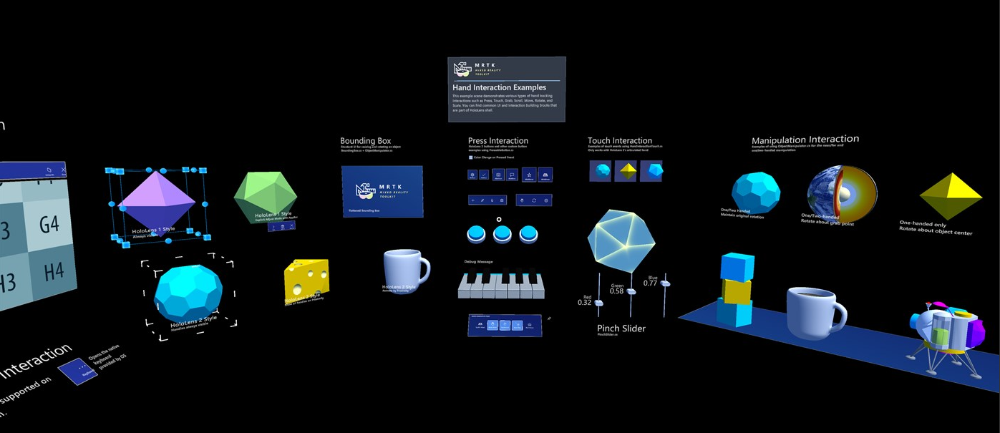

# Working with 3D models

If you’re developing for the [HoloLens](https://www.microsoft.com/en-us/hololens) or immersive headsets such as the [HP Reverb 2](https://www.hp.com/us-en/vr/reverb-g2-vr-headset.html), there’s a good chance that you’ll need to have 3D models in your app. Thankfully, you don’t have to be a 3D artist, or have one on your team, to assemble the assets you need to realize your vision. There are a number of ways to obtain pre-made models free, or at a reasonable cost. We’ll take a look at some of these below. We’ll also discuss how you can get started if you're interested in creating your own 3D models.

## Optimize and convert 3D models

We recommend that you use the [Dynamics 365 optimizing guide](/dynamics365/mixed-reality/import-tool/optimize-models).

If you're looking for other tools to post-process 3D models, you can optimize any glTF 2.0 model using the [Windows Mixed Reality Asset Converter](https://github.com/microsoft/glTF-Toolkit) available on GitHub. This toolkit includes a command line tool that uses these steps in sequence in order to convert a glTF 2.0 core asset for use in the Windows Mixed Reality home.

For general best practices, see our [real-time 3D model conversion and optimization guide](/dynamics365/mixed-reality/import-tool/best-practices).

## Check your 3D models

To check your 3D models, we recommend that you use the [Babylon.js](https://www.babylonjs.com) 3D viewer tool in the scene explorer.

## For Unity Developers: Mixed Reality Toolkit and Asset Store

If you’re a Unity developer and need objects that you can use for spatial interaction and UI, you don’t have to go far. If you're using our Mixed Reality Toolkit (MRTK) in your project, you already have a wide range of built-in objects including bounding boxes, pressable buttons, hand menus, slates, sliders and more.

If you’re new to MRTK, [download the MRTK Examples Hub app](https://www.microsoft.com/en-us/p/mrtk-examples-hub/9mv8c39l2sj4?activetab=pivot:overviewtab) and have a look around.

The [Unity Asset Store](https://assetstore.unity.com/3d) is a great place to find assets that you can quickly integrate into your project. Their inventory is massive and they claim to have over 11,000 five-star assets so there’s a good chance you can find what you need or something close. It’s worth taking a look, especially when you consider that many of the assets are free.

## Pre-made Assets

There are numerous Web sites that offer pre-made 3D and CAD (Computer-Aided Design) models and animations at reasonable or no cost. Some of the more popular ones are:

[Sketchfab](https://sketchfab.com/tags/hololens)

[CAD Models HoloLens in the Microsoft store](https://www.microsoft.com/en-us/p/cad-models-hololens/9pb4ddf8fxzs?activetab=pivot:overviewtab)

[Turbo Squid](https://www.turbosquid.com/Search/3D-Models/hololens)

[CGTrader](https://www.cgtrader.com/3d-models/hololens)

[Mixamo](https://www.mixamo.com/#/) (models and animations)

[Blender Market](https://www.blendermarket.com/) (Learn more about the Blender modeling tool below)

[3DExport](https://3dexport.com/)

## Make your own 3D Models

If you can't find pre-made 3D models that fulfill your needs, it may be worth your while to develop some 3D modeling skills or have someone on your team do so. At its highest level, 3D modeling is a vast, complex skill that encompasses numerous subdisciplines:

- Rigging and animating
- Shaders
- Particles
- Materials
- Game optimization
- UV mapping
- Scripting
- Lighting

As you can imagine, it requires considerable time and effort to become a highly proficient 3D modeler. The good news is that you don’t have to become an expert to reap some benefits; just having a few basic skills in your toolbox, such as the ability to change materials on a model or convert a high-poly model to a low-poly one, can result in significant improvements to your apps.

Here are some of the more popular 3D modeling programs.

[Autodesk Maya](https://www.autodesk.com/products/maya/overview?term=1-YEAR&tab=subscription)

[Blender](https://www.blender.org/)

Blender is a popular choice partly because these kinds of tools tend to be expensive and Blender is free. In past years, Blender was viewed as less capable than the high-end tools in this category. However, it has undergone substantial improvements in the last few versions and is now considered by many to be a fully professional-level tool.

[3ds Max](https://www.autodesk.com/products/3ds-max/overview?term=1-YEAR&tab=subscription)

[Houdini](https://www.sidefx.com/)

[ZBrush](http://pixologic.com/features/about-zbrush.php)

**CAD (Computer-Aided Design)**

CAD programs also let you build 3D models and may offer you advanced domain-specific features that you won’t get in one of the programs listed above. For example, if your app targets infrastructure, buildings, circuits, telecommunications networks, thermodynamics, mechanical parts, medical devices, or manufacturing, then a CAD program may be the best choice for you. You can create models in the CAD program and then convert them into a format that can be used for mixed reality apps.

Here are some of the more popular CAD programs. 

[AutoCAD](https://www.autodesk.com/products/autocad/overview?term=1-YEAR&tab=subscription)

[Autodesk Inventor](https://www.autodesk.com/products/inventor/overview?term=1-YEAR&tab=subscription)

[Siemens NX](https://www.plm.automation.siemens.com/global/en/products/nx/)

[Catia](https://www.3ds.com/products-services/catia/?wockw=card_content_cta_1_url%3A%22https%3A%2F%2Fblogs.3ds.com%2Fcatia%2F%22)

[SolidWorks](https://my.solidworks.com/try-solidworks?mktid=13825&utm_campaign=202007_nam_sw_BINGSWOPT_en_XOP2062_rise_brand_nam_us_exact&utm_medium=cpc&utm_source=bing&utm_content=search&utm_term=1970a52062131481b383c4a1cb107268&gclid=1970a52062131481b383c4a1cb107268&gclsrc=3p.ds&msclkid=1970a52062131481b383c4a1cb107268)

## Learning Resources

The best place to start looking for tutorials, videos, and other  learning resources is on the Web site of your chosen tool. Large streaming video sites like Youtube have many tutorials about 3D modeling, but since anyone can post a video, the quality can vary widely. Some tools have dedicated Youtube channels--two examples are [Blender](https://www.youtube.com/user/BlenderFoundation) and [Maya](https://www.youtube.com/c/MayaHowTos).

Another free, worthwhile resource may be your local public library. Many libraries offer streaming eLearning videos on their Web sites, and there tend to be many computer topics from high-quality sources. For example, the San Francisco public library offers [videos from LinkedIn Learning](https://www.linkedin.com/learning-login/go/sfpl).

If you’re willing to pay, here are some of the more popular video tutorial sites:

[Udemy](https://www.udemy.com).

[Udacity](https://www.udacity.com/)

[Coursera](https://www.coursera.org/)

[edX](https://www.edx.org/)

## Using 3D Viewer on HoloLens 2 and HoloLens (1st gen)

HoloLens 2 and HoloLens (1st gen) both ship with a version of the 3D Viewer application. The 3D Viewer on HoloLens 2 is designed to serve a very different purpose than 3D Viewer for the desktop or Model Viewer from HoloLens (1st gen). 3D Viewer for HoloLens 2 is more of a "Decorate your space" app. You'll notice that holograms persist in place and remain visible even while other 2D apps are running. This means that models loaded into 3D Viewer for HoloLens 2 must closely align to the requirements for [3D App Launchers](../distribute/implementing-3d-app-launchers.md).

### HoloLens (1st gen) Beta version 

The 3D Viewer Beta application is only available on HoloLens (1st gen) devices. The beta version can handle showing higher-complexity models, while the original 3D Viewer doesn't. However, if you're working with lots of complex models, you might find [Azure Remote Rendering](/azure/remote-rendering/) to be a better long-term option. 

Check out our [3D Viewer Beta on HoloLens (1st gen)](/hololens/holographic-3d-viewer-beta) documentation for a list of supported files, features, use-cases, and troubleshooting details.

> [!CAUTION]
> The 3D Viewer Beta applications only runs on x86 and x64 architecture, and won't work with ARM for HoloLens 2 devices.

### Resources

* [Download glTF Viewer](https://www.microsoft.com/p/gltf-viewer/9mwmgknx8fkh)
* [Download mixpace](https://www.microsoft.com/p/mixpace/9ph50tf4jvlv)
* [Download droppar.io](https://www.microsoft.com/p/droppario/9nf4hq5gr82d)
* [Download SketchUp Viewer](https://www.microsoft.com/p/sketchup-viewer/9ngf868jkvm3)
* [Download 3skeng AR](https://www.microsoft.com/p/3skeng-ar/9mvmq3dz3p71)
