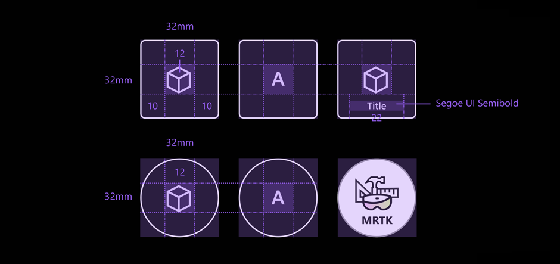
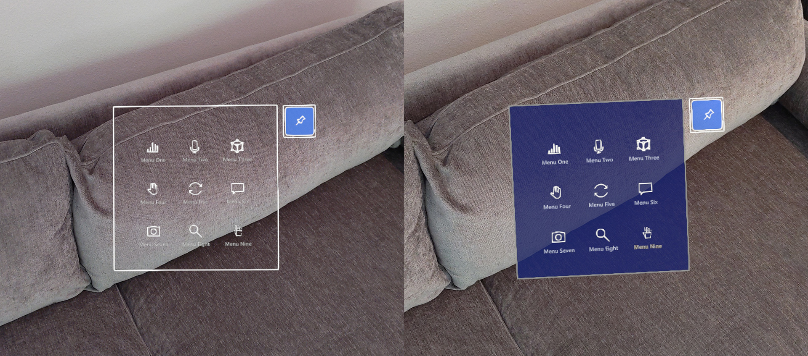

# Button

A button is one of the most foundational and crucial UI elements in mixed reality. It lets your users trigger immediate actions. Since there is no physical feedback in mixed reality, it is crucial to provide enough visual and audio feedback to increase the user's interaction confidence. 

In HoloLens 2 button design, based on many design iterations, prototypings, and user research studies, we integrated multiple visual affordances and audio cues that help the user's depth perception and interaction in empty space. 

## Visual affordances

>[!VIDEO https://www.microsoft.com/en-us/videoplayer/embed/RWJHgW]

:::row:::
    :::column:::
        
       **Proximity light** 
    :::column-end:::
    :::column:::
        
        **Focus highlight** 
    :::column-end:::
:::row-end:::

:::row:::
    :::column:::
        
       **Compressing cage** 
    :::column-end:::
    :::column:::
        
        **Pulse on trigger** 
    :::column-end:::
:::row-end:::

 

## Audio cues

Proper audio feedback can dramatically improve the user experience. HoloLens 2's button provides audio feedback to communicate the following cues:
* **Contact begins**: Play sound when touch begins (near interaction)
* **Contact ends**: Play sound on touch end (near interaction)
* **Pinch begins**: Play sound on pinch select (far interaction with gaze or rays)
* **Pinch ends**: Play sound on pinch release (far interaction with gaze or rays)

 

---

:::row:::
    :::column:::
        ## Voice commanding 
        For any buttons in mixed reality, it's important to support alternative interaction options. By default, we recommend that voice commanding be supported for any buttons. In HoloLens 2's button design, we provide a tooltip during the hover state to improve discoverability.
    :::column-end:::
        :::column:::
        
        *Image: Tooltip for the voice command*
    :::column-end:::
:::row-end:::

 

---

## Sizing recommendations

To ensure all interactable objects can easily be touched, we recommend making sure the interactable meets a minimum size based on the distance it's placed from the user. The visual angle is often measured in degrees of visual arc. Visual angle is based on the distance between the user's eyes and the object and stays constant, while the physical size of the target may change as the distance from the user changes. To determine the necessary physical size of an object based on the distance from the user, try using a visual angle calculator such as [this one](https://elvers.us/perception/visualAngle/).

Below are the recommendations for minimum sizes of interactable content.

### Target size for direct hand interaction

| Distance | Viewing angle | Size |
|---------|---------|---------|
| 45 cm  | no smaller than 2° | 1.6 x 1.6 cm |

 
*Target size for direct hand interaction*

 

### Target size for buttons

When creating buttons for direct interaction, we recommend a larger minimum size of 3.2 x 3.2 cm to ensure that there's enough space to contain an icon and potentially some text.

| Distance | Minimum size |
|---------|---------|
| 45 cm  | 3.2 x 3.2 cm |

 
*Target size for the buttons*

 

### Target size for hand ray or gaze interaction
| Distance | Viewing angle | Size |
|---------|---------|---------|
| 2 m  | no smaller than 1° | 3.5 x 3.5 cm |

 
*Target size for hand ray or gaze interaction*

 

---

## Design guidelines

### Avoid transparent backplate
When designing menu UI with buttons, it is recommended to use opaque backplate. Transparent backplates are not recommended for the following reasons:
* Hard to interact with because it is difficult to understand how deep the button has to be pressed to trigger event
* Legibility issue on complex physical environment
* Holograms displayed through the transparent plate can show swimming effect issue when used with Depth LSR stabilization technology.

See [Designing content for holographic display](designing-content-for-holographic-display.md) for more details on color choices and guidelines for holographic display.

*Examples of transparent UI backplate*

 

### Use shared backplate
For multiple buttons, it is recommended to use shared backplate instead of individual button's backplate.

* Reduce the visual noise and complexity
* Clear grouping  

*Examples of shared UI backplate*

 

---

## Button in MRTK (Mixed Reality Toolkit)
**[MRTK for Unity](/windows/mixed-reality/mrtk-unity/)** and **[MRTK for Unreal](/windows/mixed-reality/develop/unreal/unreal-mrtk-introduction)** provide various types of button prefabs, including HoloLens 2 style buttons. The HoloLens 2 button component contains all visual feedback and interaction details that were introduced in this page. By using it, you can leverage the result from many design iterations and user researches that our designers, developers, researchers had conducted.

Check out the [MRTK - Button](/windows/mixed-reality/mrtk-unity/features/ux-building-blocks/button) for more instructions and customized examples.

 

---

## See also

* [Cursors](cursors.md)
* [Hand ray](point-and-commit.md)
* [Button](button.md)
* [Interactable object](interactable-object.md)
* [Bounding box and App bar](app-bar-and-bounding-box.md)
* [Manipulation](direct-manipulation.md)
* [Hand menu](hand-menu.md)
* [Near menu](near-menu.md)
* [Object collection](object-collection.md)
* [Voice command](voice-input.md)
* [Keyboard](keyboard.md)
* [Tooltip](tooltip.md)
* [Slate](slate.md)
* [Slider](slider.md)
* [Shader](shader.md)
* [Billboarding and tag-along](billboarding-and-tag-along.md)
* [Displaying progress](progress.md)
* [Surface magnetism](surface-magnetism.md)