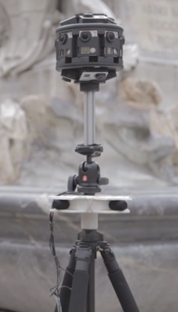

# Case study: Spatial sound design for HoloTour

Panoramic videos and holographic scenery are only part of the formula for an immersive Microsoft HoloLens tour. This article describes how sound was used to make you feel like you're actually in each HoloTour location.

## The tech

The beautiful imagery and holographic scenes that you see in HoloTour are only one part of a believable mixed-reality experience. While holograms only appear in front of a user, HoloLens can deliver [spatial sound](spatial-sound.md) from all directions, which provides a more-complete sensory experience.

Spatial sound provides cues to indicate a direction the user should turn or to let the user know there are more holograms to see within their space. We can also attach a sound directly to a hologram and continually update the direction and distance that the hologram is from the user. This technique makes it seem as if the sound is coming directly from that object.

For HoloTour, we wanted to take advantage of the spatial sound capabilities of HoloLens, so we created a 360-degree ambient environment that's synchronized with the video to reveal the sonic highlights of specific locations.

## Behind the scenes

We created HoloTour experiences of two different locations: Rome and Machu Picchu. To make these tours feel authentic and compelling, we wanted to capture audio from the locations where we filmed instead of using generic sounds.

### Capturing the audio

In our [case study about capturing the visual content for HoloTour](../out-of-scope/case-study-capturing-and-creating-content-for-holotour.md), we talk about the design of our camera rig. It consisted of 14 GoPro cameras in a 3D-printed housing that was designed to fit the tripod. To capture audio, we added a quad-microphone array below the cameras. The sound feeds into a compact four-channel recording unit at the base of the tripod. We chose microphones that did well but were small enough to avoid interfering with the cameras.

 
*Custom camera and microphone rig*

This setup captures sound in four directions. We recorded enough information to re-create a 3D aural panorama of spatial sound, which we could later synchronize to the 360-degree video.

One challenge of the camera-array audio is that you're at the mercy of off-camera sounds, such as sirens, airplanes, or high winds. To make sure we had all the sound elements we needed, we used stereo and mono mobile recorders to capture asynchronous, ambient sound at specific points of interest in each location. These recordings give the sound designer clean content to add interest and improve directionality in post-production.

Every capture day generates many files. So it was important to develop a system to track which files correspond to a particular location or camera shot. Our recording unit was set up to automatically name files by date and "take" number. We backed up files to external drives at the end of each day. We also found it important to verbally slate the beginning of the audio recordings. This precaution allows easy contextual identification of the content in case file-name problems occur. It was also important to visually slate the camera rig capture, because the video and audio were recorded as separate media and had to be synchronized during post-production.

### Editing the audio

Back at the studio after the capture trip, the first step in assembling a directional and immersive aural experience is to review all the captured audio for a location. We pick the best takes and identify highlights that can be applied during integration. The audio is then edited and cleaned up. For example, a car horn blast that lasts a second or so and repeats a few times might be replaced with quieter ambient audio from the same capture session.

After the video edit for a location is set, the sound designer can synchronize the corresponding audio. At this point, we assess both the camera-rig and mobile sound captures to decide which elements would build the best immersive audio scene. We found it useful to put all the sound elements into an audio editor and build quick linear mock-ups to experiment with different mix ideas. This step gave us better-formed ideas for when it came time to build the actual HoloTour scenes.

### Assembling the scene

The first step to building a 3D ambient scene is to create a bed of general background ambient looping sounds that will support other features and interactive sound elements in a scene. We take a holistic approach to implementation as determined by the design criteria for any particular scene. Some scenes might index toward using the synchronized camera capture. More "cinematic" moments might require a curated approach that relies on discretely placed sounds, interactive elements, and music.

When we indexed on the camera-capture audio, we placed spatial sound-enabled ambient audio emitters that corresponded to the directional orientation of the cameras. The north camera view plays audio from the north microphone, and likewise for the other cardinal directions. These emitters are world-locked, which means the sound changes when users turn their heads. This technique effectively models the sound of standing at that location. Listen to Piazza Navona or The Pantheon for examples of scenes that use a good mix of camera-captured audio.

In a different approach, we sometimes play looping stereo ambience with spatial sound emitters that are placed around the scene. These emitters play one-off sounds of randomized volume, pitch, and trigger frequency. This technique creates ambience that has an enhanced sense of directionality. In Aguas Alienates, for example, you can hear how each quadrant of the panorama has specific emitters that highlight specific areas of the geography but work together to create an overall immersive ambience.

## Tips and tricks

There are other ways to highlight directionality and improve immersion to make full use of the spatial sound capabilities of HoloLens. We've provided a list here. Listen for these effects the next time that you try HoloTour.
* **Look targets:** These sounds are triggered when you look at a specific object or area of the holographic frame. For example, look toward the street-side café in Rome's Piazza Navona to subtly trigger busy-restaurant sounds.
* **Local vision:** The journey though HoloTour contains certain "beats" where your tour guide, aided by holograms, explores a topic in-depth. For instance, as the façade of the Pantheon dissolves to reveal the oculus, reverberating audio that was placed as a 3D emitter from inside the Pantheon encourages the user to explore the interior.
* **Enhanced directionality:** Within many scenes, we placed sounds in various ways to add to directionality. In the Pantheon scene, for example, the sound of the fountain was placed as a separate emitter close enough to the user that they could get a sense of "sonic parallax" as they walk around the play space. In Peru's Salinas de Maras scene, the sounds of individual little streams were placed as separate emitters to build a more immersive ambient environment, surrounding the user with the authentic sounds of that location.
* **Spline emitter:** These emitters move in 3D space based on the visual position of the object that they're attached to. An example is the train in Machu Picchu, where we used a spline emitter to give a distinct sense of directionality and movement.
* **Music and SFX:** Certain aspects of HoloTour that represent a more stylized or cinematic approach use music and sound effects to heighten emotional impact. For example, the gladiator battle at the end of the Rome tour uses special effects like whooshes and stingers to strengthen the effect of labels that appear in the scenes.

## See also

* [Spatial sound](spatial-sound.md)
* [Spatial sound design](spatial-sound-design.md)
* [Spatial sound in Unity](../develop/unity/spatial-sound-in-unity.md)
* [Video: Microsoft HoloLens: HoloTour](https://www.youtube.com/watch?v=pLd9WPlaMpY)
