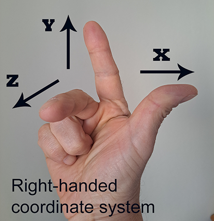
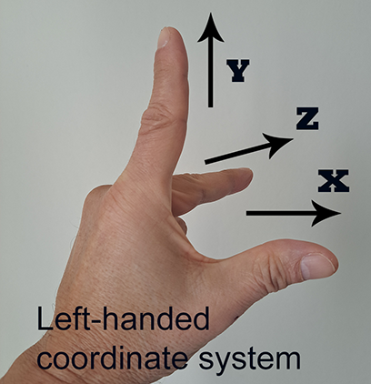

# Coordinate systems

At their core, mixed reality apps place [holograms](../discover/hologram.md) in your world that look like and sound real objects. This involves precisely positioning and orienting those holograms at meaningful places in the world, whether the world is their physical room or a virtual realm you've created. Windows provides various real-world coordinate systems for expressing geometry--these are known as **spatial coordinate systems**. You can use these systems to reason about hologram position, orientation, [gaze](gaze-and-commit.md) ray, or [hand positions](hands-and-tools.md).

>[!VIDEO https://www.youtube.com/embed/TneGSeqVAXQ]

## Device support

<table>
    <colgroup>
    <col width="40%" />
    <col width="20%" />
    <col width="20%" />
    <col width="20%" />
    </colgroup>
    <tr>
        <td><strong>Feature</strong></td>
        <td><a href="/hololens/hololens1-hardware"><strong>HoloLens (1st gen)</strong></a></td>
        <td><a href="/hololens/hololens2-hardware"><strong>HoloLens 2</strong></td>
        <td><a href="/windows/mixed-reality/immersive-headset-hardware-details"><strong>Immersive headsets</strong></a></td>
    </tr>
     <tr>
        <td><a href="coordinate-systems.md#stationary-frame-of-reference">Stationary frame of reference</a></td>
        <td>✔️</td>
        <td>✔️</td>
        <td>✔️</td>
    </tr>
    <tr>
        <td><a href="coordinate-systems.md#attached-frame-of-reference">Attached frame of reference</a></td>
        <td>✔️</td>
        <td>✔️</td>
        <td>✔️</td>
    </tr>
    <tr>
        <td><a href="coordinate-systems.md#stage-frame-of-reference">Stage frame of reference</a></td>
        <td>Not supported yet</td>
        <td>Not supported yet</td>
        <td>✔️</td>
    </tr>
    <tr>
        <td><a href="coordinate-systems.md#spatial-anchors">Spatial anchors</a></td>
        <td>✔️</td>
        <td>✔️</td>
        <td>✔️</td>
    </tr>
    <tr>
        <td><a href="spatial-mapping.md">Spatial mapping</a></td>
        <td>✔️</td>
        <td>✔️</td>
        <td>❌</td>
    </tr>
    <tr>
        <td><a href="scene-understanding.md">Scene understanding</a></td>
        <td>❌</td>
        <td>✔️</td>
        <td>❌</td>
    </tr>
</table>

## Mixed reality experience scales

You can design Mixed reality apps for a broad range of user experiences, from 360-degree video viewers using headset orientation to full world-scale apps and games using spatial mapping and spatial anchors:

 

| Experience scale | Requirements | Example experience | 
|----------|----------|----------|
|  **Orientation-only** |  **Headset orientation** (gravity-aligned) |  360° video viewer | 
|  **Seated-scale** |  Above plus **headset position** based on zero position |  Racing game or space simulator | 
|  **Standing-scale** |  Above plus **stage floor origin** |  Action game where you duck and dodge in place  | 
|  **Room-scale** |  Above plus **stage bounds polygon** |  Puzzle game where you walk around the puzzle | 
|  **World-scale** |  **Spatial anchors** (and typically [spatial mapping](spatial-mapping.md)) |  Game with enemies coming from your real walls, such as [RoboRaid](https://www.microsoft.com/p/roboraid/9nblggh5fv3j) | 

The experience scales above follow a "nesting dolls" model. The key design principle for Windows Mixed Reality is this: *a given headset supports apps built for a target experience scale and all lesser scales.*

 

| 6DOF tracking | Floor defined | 360° tracking | Bounds defined | Spatial anchors | Max experience | 
|----------|----------|----------|----------|----------|----------|
|  No |  - |  - |  - |  - |  **Orientation-only** | 
|  **Yes** |  No |  - |  - |  - |  **Seated** | 
|  **Yes** |  **Yes** |  No |  - |  - |  **Standing - Forward** | 
|  **Yes** |  **Yes** |  **Yes** |  No |  - |  **Standing - 360°** | 
|  **Yes** |  **Yes** |  **Yes** |  **Yes** |  No |  **Room** | 
|  **Yes** |  **Yes** |  **Yes** |  **Yes** |  **Yes** |  **World** | 

The Stage frame of reference isn't yet supported on HoloLens. A room-scale app on HoloLens currently needs to use [spatial mapping](spatial-mapping.md) or [scene understanding](scene-understanding.md) to find the user's floor and walls.

## Spatial coordinate systems

All 3D graphics applications use [Cartesian coordinate systems](/windows/uwp/graphics-concepts/coordinate-systems) to reason about the positions and orientations of virtual objects. These coordinate systems establish three perpendicular axes: X, Y, and Z. Each object you add to a scene will have an XYZ position in its coordinate system. Windows calls a coordinate system that has real meaning in the physical world a *spatial* coordinate system, which expresses its coordinate values in meters. This means that objects placed two units apart on either the X, Y, or Z axis will appear two meters apart from one another when rendered in mixed reality. Knowing this, you can easily render objects and environments at real-world scale.

In general, Cartesian coordinate systems are referred to as "right-handed" or "left-handed" because you can use hand positions to indicate the directions of the XYZ axes. In both coordinate systems, the positive X axis points to the right and the positive Y axis points up. The difference between the two is that in the right-handed coordinate system, the Z axis points *towards* you, while in the left-handed coordinate system, the Z axis points *away* from you.

Spatial coordinate systems on Windows (and therefore, Windows Mixed Reality) are always right-handed.

> [!NOTES]
> - Unity and Unreal use the left-handed coordinate system.
> - Although left-handed and right-handed coordinates are the most common systems, there are other coordinate systems used in 3D software. For example, it's not unusual for 3D modeling applications to use a coordinate system in which the Y axis points toward or away from the viewer and the Z axis points up.

## Building an orientation-only or seated-scale experience

The key to holographic [rendering](../develop/advanced-concepts/rendering-overview.md) is changing your app's view of its holograms each frame as the user moves around, to match their predicted head motion. You can build **seated-scale experiences** that respect changes to the user's head position and head orientation using a **stationary frame of reference**.

Some content must ignore head position updates, staying fixed at a chosen heading and distance from the user always. The primary example is 360-degree video: because the video is captured from a single fixed perspective, it would ruin the illusion for the view position to move based on the content, even though the view orientation changes as the user looks around. You can build such **orientation-only experiences** using an **attached frame of reference**.

### Stationary frame of reference

The coordinate system provided by a stationary frame of reference works to keep the positions of objects near the user as stable as possible based on the world, while respecting changes in the user's head position.

For seated-scale experiences in a game engine such as [Unity](https://unity3d.com/), a stationary frame of reference is what defines the engine's "world origin." Objects that are placed at a specific world coordinate use the stationary frame of reference to define their position in the real-world using those same coordinates. Content that stays put in the world, even as the user walks around, is known as **world-locked** content.

An app will typically create one stationary frame of reference on startup and use its coordinate system throughout the app's lifetime. As an app developer in Unity, you can just start placing content based on the origin, which will be at the user's initial head position and orientation. If the user moves to a new place and wants to continue their seated-scale experience, you can recenter the world origin at that location.

Over time, as the system learns more about the user's environment, it may determine that distances between various points in the real-world are shorter or longer than the system previously believed. If you render holograms in a stationary frame of reference for an app on HoloLens where users wander beyond an area about 5 meters wide, your app may observe drift in the observed location of those holograms. If your experience has users wandering beyond 5 meters, you're building a [world-scale experience](#building-a-world-scale-experience), which will require other techniques to keep holograms stable, as described below.

### Attached frame of reference

An attached frame of reference moves with the user as they walk around, with a fixed heading defined when the app first creates the frame. This lets the user comfortably look around at content placed within that frame of reference. Content rendered in this user-relative way is called **body-locked** content.

When the headset can't figure out where it is in the world, an attached frame of reference provides the only coordinate system, which can be used to render holograms. This makes it ideal for displaying fallback UI to tell the user that their device can't find them in the world. Apps that are seated-scale or higher should include an orientation-only fallback to help the user get going again, with UI similar to that shown in the [Mixed Reality home](../discover/navigating-the-windows-mixed-reality-home.md).

## Building a standing-scale or room-scale experience

To go beyond seated-scale on an immersive headset and build a **standing-scale experience**, you can use the **stage frame of reference**.

To provide a **room-scale experience**, letting users walk around within the 5-meter boundary they pre-defined, you can check for **stage bounds** as well.

### Stage frame of reference

When first setting up an immersive headset, the user defines a **stage**, which represents the room in which they'll experience mixed reality. The stage minimally defines a **stage origin**, a spatial coordinate system centered at the user's chosen floor position and forward orientation where they intend to use the device. By placing content in this stage coordinate system at the Y=0 floor plane, you can ensure your holograms appear comfortably on the floor when the user is standing, providing users with a **standing-scale experience**.

### Stage bounds

The user may also optionally define **stage bounds**, an area within the room that they've cleared out to move around in mixed reality. If so, the app can build a **room-scale experience**, using these bounds to ensure that holograms are always placed where the user can reach them.

Because the stage frame of reference provides a single fixed coordinate system within which to place floor-relative content, it's the easiest path for porting standing-scale and room-scale applications developed for virtual reality headsets. However, as with those VR platforms, a single coordinate system can only stabilize content in about a 5 meters (16 foot) diameter, before lever-arm effects cause content far from the center to shift noticeably as the system adjusts. To go beyond 5 meters, spatial anchors are needed.

## Building a world-scale experience

HoloLens allows for true **world-scale experiences** that let users wander beyond 5 meters. To build a world-scale app, you'll need new techniques beyond those used for room-scale experiences.

### Why a single rigid coordinate system cannot be used beyond 5 meters

Today, when writing games, data visualization apps, or virtual reality apps, the typical approach is to establish one absolute world coordinate system that all other coordinates can reliably map back to. In that environment, you can always find a stable transform that defines a relationship between any two objects in that world. If you didn't move those objects, their relative transforms would always remain the same. This kind of global coordinate system works well when rendering a purely virtual world where you know all of the geometry in advance. Room-scale VR apps today typically establish this kind of absolute room-scale coordinate system with its origin on the floor.

In contrast, an untethered mixed reality device such as HoloLens has a dynamic sensor-driven understanding of the world, continuously adjusting its knowledge over time of the user's surroundings as they walk many meters across an entire floor of a building. In a world-scale experience, if you placed all your holograms in a single rigid coordinate system, those holograms would necessarily drift over time, either based on the world or to each other.

For example, the headset may currently believe two locations in the world to be 4 meters apart, and then later refine that understanding, learning that the locations are in fact 3.9 meters apart. If those holograms had initially been placed 4 meters apart in a single rigid coordinate system, one of them would then always appear 0.1 meters off from the real world.

### Spatial anchors

Windows Mixed Reality solves the issue described in the previous section by letting you create [spatial anchors](spatial-anchors.md) to mark important points in the world where the user has placed holograms. A spatial anchor represents an important point in the world that the system should keep track of over time.

As the device learns about the world, these spatial anchors can adjust their position based on one another as needed to ensure each anchor stays precisely where it was placed based on the real-world. By placing a spatial anchor at the location where the user places a hologram and then positioning that hologram based on its spatial anchor, you can ensure the hologram maintains optimal stability, even as the user roams across tens of meters.

This continuous adjustment of spatial anchors based on one another is the key difference between coordinate systems from spatial anchors and stationary frames of reference:

* Holograms placed in the stationary frame of reference all keep a rigid relationship to one another. However, as the user walks long distances, that frame's coordinate system may drift based on the world to ensure that holograms next to the user appear stable.

* Holograms placed in the stage frame of reference also keep a rigid relationship to one another. In contrast to the stationary frame, the stage frame always remains fixed in place based on its defined physical origin. However, content rendered in the stage's coordinate system beyond its 5-meter boundary will only appear stable while the user is standing within that boundary.

* Holograms placed using one spatial anchor may drift based on holograms placed using another spatial anchor. This allows Windows to improve its understanding of the position of each spatial anchor, even if, for example, one anchor needs to adjust itself left and another anchor needs to adjust right.

In contrast to a stationary frame of reference, which always optimizes for stability near the user, the stage frame of reference and spatial anchors ensure stability near their origins. This helps those holograms stay precisely in place over time, but it also means that holograms rendered too far away from their coordinate system's origin will experience increasingly severe lever-arm effects. This is because small adjustments to the position and orientation of the stage or anchor are magnified proportional to the distance from that anchor. 

A good rule of thumb is to ensure that anything you render based on a distant spatial anchor's coordinate system is within about 3 meters of its origin. For a nearby stage origin, rendering distant content is OK, as any increased positional error will affect only small holograms that won't shift much in the user's view.

### Spatial anchor persistence

Spatial anchors can also allow your app to remember an important location even after your app suspends or the device is shut down.

You can save to disk the spatial anchors your app creates, and then load them back again later, by persisting them to your app's **spatial anchor store**. When saving or loading an anchor, you provide a string key that is meaningful to your app, to identify the anchor later. Think of this key as the filename for your anchor. If you want to associate other data with that anchor, such as a 3D model that the user placed at that location, save that to your app's local storage and associate it with the key you chose.

By persisting anchors to the store, your users can place individual holograms or place a workspace around which an app will place its various holograms, and then find those holograms later where they expect them, over many uses of your app.

You can also use <a href="/azure/spatial-anchors/overview" target="_blank">Azure Spatial Anchors</a> for asynchronous hologram persistence across HoloLens, iOS, and Android devices.  By sharing a durable cloud spatial anchor, multiple devices can observe the same persisted hologram over time, even if those devices aren't present together at the same time.

### Spatial anchor sharing

Your app can also share a spatial anchor in real time with other devices, allowing for real-time shared experiences.

By using <a href="/azure/spatial-anchors/overview" target="_blank">Azure Spatial Anchors</a>, your app can share a spatial anchor across multiple HoloLens, iOS, and Android devices. By having each device render a hologram using the same spatial anchor, all users will see the hologram appear at the same place in the real world.

## Avoid head-locked content

We strongly discourage rendering head-locked content, which stays at a fixed spot in the display (such as a HUD). In general, head-locked content is uncomfortable for users and doesn't feel like a natural part of their world.

Head-locked content should usually be replaced with holograms that are attached to the user or placed in the world itself. For example, [cursors](cursors.md) should generally be pushed out into the world, scaling naturally to reflect the position and distance of the object under the user's gaze.

## Handling tracking errors

In some environments such as dark hallways, it may not be possible for a headset using inside-out tracking to locate itself correctly in the world. This can lead holograms to either not show up or appear at incorrect places if handled incorrectly. We now discuss the conditions in which this can happen, its impact on user experience, and tips to best handle this situation.

### Headset can't track due to insufficient sensor data

Sometimes, the headset's sensors aren't able to figure out where the headset is. This can happen if:

* The room is dark
* If the sensors are covered by hair or hands
* If the surroundings don't have enough texture.

When this happens, the headset will be unable to track its position with enough accuracy to render world-locked holograms. You can't figure out where a spatial anchor, stationary frame, or stage frame is based on the device. However, you can still render body-locked content in the attached frame of reference.

Your app should tell the user how to get positional tracking back, rendering some fallback body-locked content that describes some tips, such as uncovering the sensors and turning on more lights.

### Headset tracks incorrectly due to dynamic changes in the environment

The device can't track properly if there are lots of dynamic changes in the environment, such as many people walking around in the room. In this case, the holograms may seem to jump or drift as the device tries to track itself in this dynamic environment. We recommend using the device in a less dynamic environment if you hit this scenario.

### Headset tracks incorrectly because the environment has changed significantly over time

When you start using a headset in an environment where furniture, wall hangings, and so on, has been moved, it's possible that some holograms may appear shifted from their original locations. The earlier holograms may also jump around as the user moves in the new space because the system's understanding of your space is no longer true. The system then tries to remap the environment while also trying to reconcile the features of the room. In this scenario, it's advised to encourage users to replace holograms they pinned in the world if they aren't appearing where expected.

### Headset tracks incorrectly due to identical spaces in an environment

Sometimes, a home or other space may have two identical areas. For example, two identical conference rooms, two identical corner areas, two large identical posters that cover the device's field of view. In such scenarios, the device may, at times, get confused between the identical parts and mark them as the same in its internal representation. This may cause the holograms from some areas to appear in other locations. The device may start to lose tracking often since its internal representation of the environment has been corrupted. In this case, it's advised to reset the system's environmental understanding. Resetting the map leads to loss of all spatial anchor placements. This will cause the headset to track well in the unique areas of the environment. However, the problem may reoccur if the device gets confused between the identical areas again.

## See also
* [Coordinate systems in Unity](../develop/unity/coordinate-systems-in-unity.md)
* [Coordinate systems in DirectX](../develop/native/coordinate-systems-in-directx.md)
* [Spatial anchors](spatial-anchors.md)
* [Shared experiences in mixed reality](shared-experiences-in-mixed-reality.md)
* <a href="/azure/spatial-anchors" target="_blank">Azure Spatial Anchors</a>
* [Case study - Looking through holes in your reality](../out-of-scope/case-study-looking-through-holes-in-your-reality.md)
