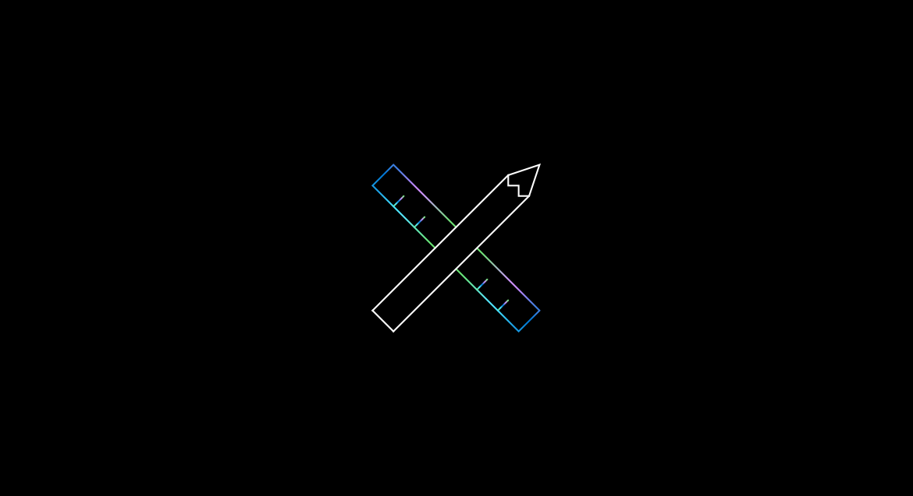
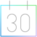
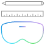

# Start designing and prototyping

Mixed Reality applications are unlike anything else in the world today, and designing them is hard work. Not only do you have to account for the new combinations of real and virtual worlds you're creating, but also the new user experiences they afford. Since Mixed Reality is a big place, we've selected important points along its design spectrum and laid them out below as a series of checkpoints. These are meant to be sequential, but if you've already dipped your feet in feel free to jump to any of the following sections. 

Take a look at our design overview video to get started:

>[!VIDEO https://www.microsoft.com/en-us/videoplayer/embed/RE4LhlW]

## Design checkpoints

Use the following checkpoints to bring your application ideas and concepts into the world of mixed reality.

### 1. Getting started

Like all journeys, your adventure into designing Mixed Reality applications starts with the basics. We recommend familiarizing yourself with the [What is Mixed Reality](../discover/mixed-reality.md) and [What is a hologram?](../discover/hologram.md) articles to get your mind primed for immersive design. Once you've completed your read-through, you'll be ready to start your Mixed Reality design journey!

|  Checkpoint  |  Outcome  |
| --- | --- |
| [Expand your design process](../discover/case-study-expanding-the-design-process-for-mixed-reality.md) | Get a first-hand look at design process for Mixed Reality, gathered from designers inside and outside of Microsoft |
| [Types of Mixed Reality apps](../discover/types-of-mixed-reality-apps.md) | Decide where your app experience will live on the Mixed Reality spectrum |
| [Designing Holograms app](https://www.microsoft.com/p/designing-holograms/9nxwnjklrzwd) | Learn the fundamentals of Mixed Reality UX Design by experiencing with behaviors, tips, and recommendations for creating amazing HoloLens apps (available for download from Microsoft Store in HoloLens 2) |
| [MRTK Examples Hub](https://www.microsoft.com/en-us/p/mrtk-examples-hub/9mv8c39l2sj4) | Experience common spatial interactions and UX building blocks for Mixed Reality (available for download from Microsoft Store in HoloLens 2) |
| **Optional** [Download the Figma Toolkit](figma-toolkit.md) | The Figma Toolkit provides assets for you to use for sketching and laying out UI based on the components available in MRTK |

### 2. Core concepts

Whether you're developing for VR or AR, there are several core concepts that apply to designing fluid immersive experiences. Understanding the users point of view, positioning objects, and ensuring everyone is comfortable and safe are your top priorities at this stage of your journey. By the end of this section you'll have a solid foundation to carry through into interaction design.

|  Concept  |  Outcome  |
| --- | --- |
| [Holographic frame](holographic-frame.md) | Understand how users see your content overlaid onto the real world when wearing their headsets |
| [Coordinate systems](coordinate-systems.md) | Learn how to position holograms in meaningful places in the world, whether it's their physical room or a virtual realm you've created |
| [Spatial mapping](spatial-mapping.md) | Anchor objects in the user's world and take advantage of real world's physical surfaces |
| [Comfort considerations](comfort.md) | Ensure user comfort and safety by creating and presenting immersive content in a way that mimics the natural world |

### 3. Interaction design

No matter how beautiful and immersive a virtual experience is, it's useless without interaction. This section will walk you through basic interaction models, hand and motion controllers, voice input, and gathering eye tracking data from your users. By the end of this section you'll be ready to tackle the last big topic on your design journey: user experience.

|  Concept  |  Outcome  |
| --- | --- |
| [Interaction models](interaction-fundamentals.md) | Provide your users with instinctual interactions through hand, eye, and voice input |
| [Hands and motion controllers](hands-and-tools.md) | Learn how to interact with holograms at close range with a user' hands or at long range with precise interactions |
| [Voice input](voice-input.md) | Use voice commands as input in your immersive apps to control surrounding holograms and environments  |
| [Eye Tracking](eye-tracking.md) | Add a new level of context and human understanding in a holographic experience by using information about what your users are looking at |

### 4. User experience elements

Now that you've mastered basic interactions, you can focus on the finer points of user experience elements and how to adapt them for Mixed Reality's unique environments. You'll cover common behaviors, asset design, object scaling, and typography, while making the experience intuitive for your users. This section marks the end of the official Mixed Reality design journey, but there are more resources in the [What's next?](#whats-next) section to keep you going.

|  Concept  |  Outcome  |
| --- | --- |
| [Common controls and behaviors](app-patterns-landingpage.md) | Learn about frequently used spatial interactions and UI building blocks |
| [Color, light, and materials](color-light-and-materials.md) | Design quality assets for Mixed Reality that take color, lighting, and materials into account |
| [Object scale](scale.md) | Incorporate as many real-world visual cues as possible to us help your users understand where objects are, how big they are, and what they’re made of |
| [Typography](typography.md) | Use clear, readable text in three-dimensional space to give your users the important information they need |

## What's next?

A designer's job is never done, especially when learning to create immersive experiences in a new paradigm. The following sections will take you beyond the beginner level design material you've already completed and into the world of Mixed Reality development. These topics and resources aren't in any sequential order, so feel free to explore!

### Choose a prototyping option  

:::row:::	
    :::column:::	
         
        **[Figma Toolkit](figma-toolkit.md)** 	
        Figma Toolkit provides the assets that can be used for sketching and laying out UI. All UI controls are based on the components available in MRTK.
    :::column-end:::		
    :::column:::	
        
        **[Learn Unity](https://learn.unity.com/)** 
        Learn how to create interactive experiences with Unity. Learn by doing, from start to finish.
    :::column-end:::	
    :::column:::	
         
        **[Mixed Reality Toolkit (MRTK)](/windows/mixed-reality/mrtk-unity/)** 	
        With spatial interaction and UI building blocks, jump-start your mixed reality design and development with Unity.	
    :::column-end:::
    :::column:::	
         
        **[Microsoft Maquette](https://www.maquette.ms/)** 	
        Design for VR. Microsoft Maquette makes spatial prototyping easy, quick, and immersive.	
    :::column-end:::	
:::row-end:::

 

---

### Other resources

:::row:::
    :::column:::
        
        **[Understand the basics](../discover/get-started-with-mr.md#understand-the-basics)** 
        Get a better understanding of what defines mixed reality and how it’s being used.
    :::column-end:::
    :::column:::
         
         **[Come to an event](../whats-new/sf-academy-events.md)** 
        See the hardware and get a hands-on tutorial to make your first HoloLens 2 application.
    :::column-end:::
    :::column:::
         
         **[Install the tools](../develop/install-the-tools.md)** 
        Use the installation checklist to get the tools you need to build apps for HoloLens and mixed reality.
    :::column-end:::
    :::column:::
         
        **[Start developing](../develop/development.md)** 
        Choose a development path based on your skill level, work style, or platform interest.
    :::column-end:::
:::row-end:::

 

 
