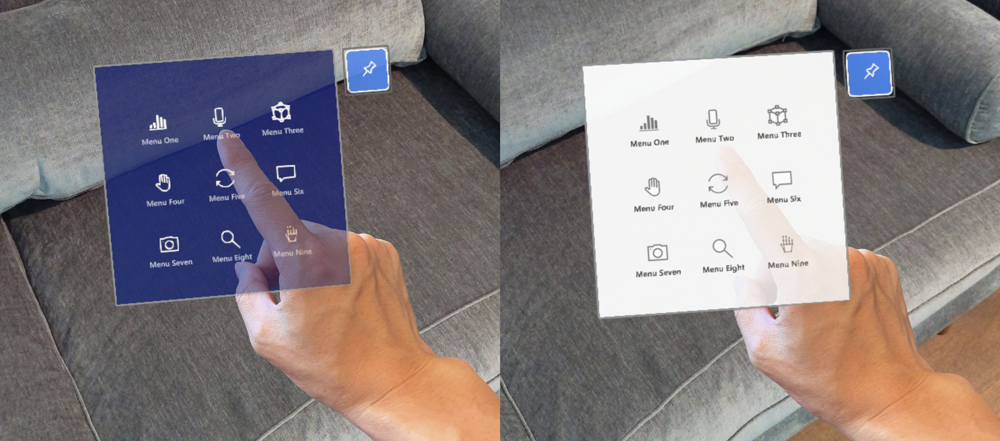
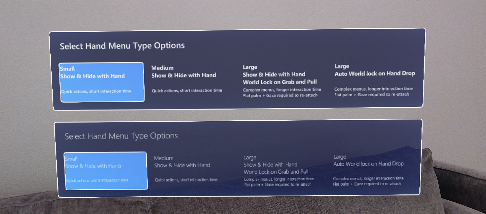

# Designing content for holographic display

When designing content for holographic displays, there are several elements that you need to consider for achieving the best experience. We've listed some of our recommendations below and you can learn more about the characteristics of holographic displays at [Color, light and materials](color-light-and-materials.md) page.

 

## Challenges with bright color on a large surface 

Based on our HoloLens experience research and testing, we found that using bright colors in a large area of the display can cause several issues: 

**Eye fatigue** 

Since holographic display is additive, holograms with bright colors use more light. Bright, solid color in a large area of the display can easily cause eye fatigue for the user. 

**Hand occlusion** 

Bright color makes it difficult for the user to see their hands when directly interacting with objects. Since the user can't see their hands, it becomes difficult to perceive the depth/distance between the hand/finger to the target surface. The Finger Cursor helps compensate for this issue, but it can still be challenging on a bright white surface. 

*Difficult to see the hand on the bright colored content backplate*

**Color uniformity**

Because of the characteristics of holographic displays, a large bright area on the display can become blotchy. By using dark color schemes, you can minimize this issue. 

## Design guidelines for color choices

**Use dark color for the UI background**

By using the dark color scheme, you can minimize eye fatigue and improve the confidence on direct hand interactions. 

*Examples of dark color used for the content background*

**Use semibold or bold font weight**

HoloLens allows your experience to show beautiful high-resolution text. However, it's recommended that you avoid thin font weights such as light or semi-light because the vertical strokes can jitter in small font size. 

*Bold or semi-bold font weight (upper panel) improves the legibility*

**Use MRTK’s HolographicBackplate material**

The HolographicBackplate material is applied to several UI panels in the HoloLens shell. One of its features is an iridescence effect that is visible to users as they shift their position based on the panel. The backplate color shifts subtly across a predefined spectrum, creating an engaging and dynamic visual effect without interfering with content readability. This subtle shift in color also serves to compensate for any minor color irregularities. 

## Challenges with transparent or translucent UI backplate 

*Examples of transparent UI backplate*

**Visual complexity and accessibility**

Since holographic objects blend with the physical environment, content or UI legibility on transparent or translucent windows could be degraded. Additionally, when transparent holographic objects are overlaid on top of each other, it could make it difficult for the user to interact because of the confusing depth.

**Performance**

For transparent or translucent objects to render correctly they must be sorted and blended with any objects, which exist in the background. Sorting of transparent objects has a modest CPU cost, blending has considerable GPU cost because it doesn't allow the GPU to do hidden surface removal via z-culling (i.e depth testing). Not allowing hidden surface removal increases the number of operations needed for the final rendered pixel. This puts on more pressure fill rate constraints.

**Hologram stability issue with Depth LSR technology**

To improve holographic reprojection, or hologram stability, an application can submit a depth buffer to the system for every rendered frame. When using the depth buffer for reprojection, you need to write a depth buffer for every color rendered pixel a corresponding depth. Any pixel with a depth value should also have color value. If the above guidance isn't followed, areas of the rendered image that lack valid depth information may be reprojected in a way that produces artifacts, which are often visible as a wave-like distortion.

## Design guidelines for transparent elements

**Use opaque UI background**

By default, transparent or translucent objects don't write depth to allow for proper blending. Ways to mitigate this issue include, using opaque objects, ensuring translucent objects appear close to opaque objects (such as a translucent button in front of an opaque backplate), forcing translucent objects to write depth (not applicable in all scenarios), or rendering proxy objects, which only contribute depth values at the end of the frame.

Solutions within MRTK-Unity: /windows/mixed-reality/mrtk-unity/performance/hologram-stabilization#depth-buffer-sharing-in-unity  

By using a solid and opaque backplate, we can secure legibility and interaction confidence.

**Minimize the number of pixels affected**

If your project must use transparent objects, try to minimize the number of pixels affected. For example, if an object is only visible under certain conditions (like an additive glow effect), disable the object when it's fully invisible (instead of setting the additive color to black). For simple 2D shapes created using a quad with an alpha mask, consider creating a mesh representation of the shape with an opaque shader instead. 

 

---

 

## Dark UI examples in MRTK (Mixed Reality Toolkit) for Unity

**[MRTK](https://github.com/Microsoft/MixedRealityToolkit-Unity)** provides many UI building block examples based on the dark color schemes.

* [Near Menu](/windows/mixed-reality/mrtk-unity/features/ux-building-blocks/near-menu)
* [Dialog](/windows/mixed-reality/mrtk-unity/features/ux-building-blocks/dialog)
* [Hand Menu](/windows/mixed-reality/mrtk-unity/features/ux-building-blocks/hand-menu)

 

---

## See also

* [Color, light, and materials](color-light-and-materials.md)
* [Cursors](cursors.md)
* [Hand ray](point-and-commit.md)
* [Button](button.md)
* [Interactable object](interactable-object.md)
* [Bounding box and App bar](app-bar-and-bounding-box.md)
* [Manipulation](direct-manipulation.md)
* [Hand menu](hand-menu.md)
* [Near menu](near-menu.md)
* [Object collection](object-collection.md)
* [Voice command](voice-input.md)
* [Keyboard](keyboard.md)
* [Tooltip](tooltip.md)
* [Slate](slate.md)
* [Slider](slider.md)
* [Shader](shader.md)
* [Billboarding and tag-along](billboarding-and-tag-along.md)
* [Displaying progress](progress.md)
* [Surface magnetism](surface-magnetism.md)