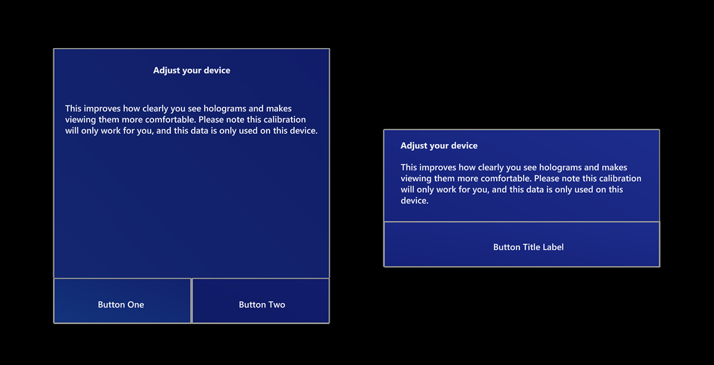

# Dialog

Dialog controls are UI overlays that provide contextual app information, often requesting a user action. Use dialogs to give users important information and request confirmation or extra information before an action can be completed.

 

---

## Dialog in MRTK (Mixed Reality Toolkit) for Unity
MRTK provides dialog control in three sizes with one or two button options. You can also specify the placement distance for near or far interaction range. 

- DialogSmall_192x96.prefab: 192x96mm
- DialogMedium_192x128.prefab: 192x128mm
- DialogLarge_192x192.prefab: 192x192mm

* For more information, see [MRTK - Dialog](/windows/mixed-reality/mrtk-unity/features/ux-building-blocks/dialog).

 

---

## See also

* [Cursors](cursors.md)
* [Hand ray](point-and-commit.md)
* [Button](button.md)
* [Interactable object](interactable-object.md)
* [Bounding box and App bar](app-bar-and-bounding-box.md)
* [Manipulation](direct-manipulation.md)
* [Hand menu](hand-menu.md)
* [Near menu](near-menu.md)
* [Object collection](object-collection.md)
* [Voice command](voice-input.md)
* [Keyboard](keyboard.md)
* [Tooltip](tooltip.md)
* [Slate](slate.md)
* [Slider](slider.md)
* [Shader](shader.md)
* [Billboarding and tag-along](billboarding-and-tag-along.md)
* [Displaying progress](progress.md)
* [Surface magnetism](surface-magnetism.md)