# Direct manipulation with hands

Direct manipulation is an input model that involves touching holograms directly with your hands. The idea behind this concept is that objects behave just as they would in the real world. Buttons can be activated simply by pressing them, objects can be picked up by grabbing them, and 2D content behaves like a virtual touchscreen. Direct manipulation is affordance-based, meaning it's user-friendly. There are no symbolic gestures to teach users. All interactions are built around a visual element that you can touch or grab. It's considered a "near" input model in that it's best used for interacting with content within arms reach.

## Device support

<table>
<colgroup>
    <col width="33%" />
    <col width="22%" />
    <col width="22%" />
    <col width="22%" />
</colgroup>
<tr>
     <td><strong>Input model</strong></td>
     <td><a href="/hololens/hololens1-hardware"><strong>HoloLens (1st gen)</strong></a></td>
     <td><a href="/hololens/hololens2-hardware"><strong>HoloLens 2</strong></a></td>
     <td><a href="/windows/mixed-reality/immersive-headset-hardware-details"><strong>Immersive headsets</strong></a></td>
</tr>
<tr>
     <td>Direct manipulation with hands</td>
     <td>❌ Not supported</td>
     <td>✔️ Recommended</td>
     <td>➕ Supported.  For UI, we recommend <a href="point-and-commit.md">point and commit with hands</a> instead.</td>
    
</tr>
</table>

Direct manipulation is a primary input model on HoloLens 2, which uses the new articulated hand-tracking system. The input model is also available on immersive headsets by using motion controllers, but isn't recommended as a primary means of interaction outside of object manipulation. Direct manipulation isn't available on HoloLens (1st gen).

 

---

## Collidable fingertip

On HoloLens 2, the user's hands are recognized and interpreted as left and right-hand skeletal models. To implement the idea of touching holograms directly with hands, ideally, five colliders could be attached to the five fingertips of each hand skeletal model. However, because of the lack of tactile feedback, 10 collidable fingertips can cause unexpected and unpredictable collisions with holograms. 

We suggest only putting a collider on each index finger. The collidable index fingertips can still serve as active touch points for diverse touch gestures involving other fingers. Touch gestures include One-finger press, One-finger tap, Two-finger press, and Five-finger press, as shown below:

:::row:::
    :::column:::
       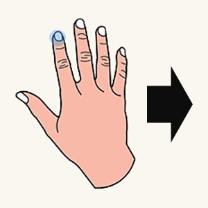 
       **Collidable fingertip** 
    :::column-end:::
    :::column:::
       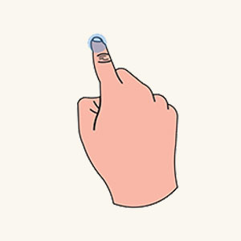 
        **One-finger press** 
    :::column-end:::
    :::column:::
        
       **One-finger tap** 
    :::column-end:::
    :::column:::
       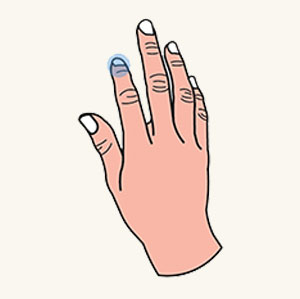 
       **Five-finger press** 
    :::column-end:::
:::row-end:::

 

---

### Sphere collider

Instead of using a random generic shape, we suggest you use a sphere collider. Then you can visually render it to provide better cues for near targeting. The sphere's diameter should match the thickness of the index finger to increase touch accuracy. It's easier to retrieve the variable of finger thickness by calling the hand API.

### Fingertip cursor

In addition to rendering a collidable sphere on the index fingertip, we've created an advanced fingertip cursor to achieve a better near-targeting experience. It's a donut-shaped cursor attached to the index fingertip. According to proximity, it dynamically reacts to a target for orientation and size as detailed below:

* When an index finger moves toward a hologram, the cursor is always parallel to the hologram's surface and gradually shrinks its size.
* As soon as the finger touches the surface, the cursor shrinks into a dot and emits a touch event.

With interactive feedback, users can achieve high precision near-targeting tasks, such as triggering a hyperlink or pressing a button as shown below. 

:::row:::
    :::column:::
       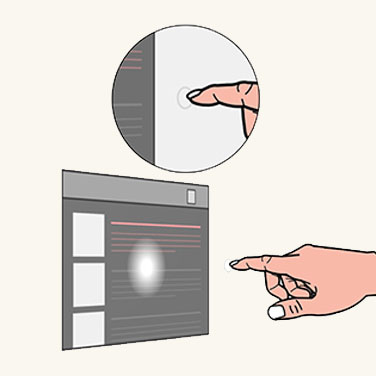 
       **Fingertip cursor far** 
    :::column-end:::
    :::column:::
        
        **Fingertip cursor near** 
    :::column-end:::
    :::column:::
        
       **Fingertip cursor contact** 
    :::column-end:::
:::row-end:::

 

## Bounding box with proximity shader

The hologram itself also requires the ability to provide both visual and audio feedback to compensate the lack of tactile feedback. For that, we generate the concept of a bounding box with a proximity shader. A bounding box is a minimum volumetric area that encloses a 3D object. The bounding box has an interactive rendering mechanism called a proximity shader. The proximity shader behaves:

:::row:::
    :::column:::
        
       **Hover (far)** 
       When the index finger is within a range, a fingertip spotlight is cast on the surface of the bounding box.
    :::column-end:::
    :::column:::
        
        **Hover (near)** 
        When the fingertip gets closer to the surface, the spotlight shrinks.
    :::column-end:::
    :::column:::
        
       **Contact begins** 
       As soon as the fingertip touches the surface, the entire bounding box changes color or generates visual effects to reflect the touch state.
    :::column-end:::
    :::column:::
       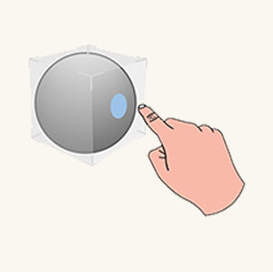 
       **Contact ends** 
       A sound effect can also be activated to enhance the visual touch feedback.
    :::column-end:::
:::row-end:::

 

---

## Pressable button

With a collidable fingertip, users are now ready to interact with a fundamental holographic UI component, such as a pressable button. A pressable button is a holographic button tailored for a direct finger press. Again, because of the lack of tactile feedback, a pressable button equips a couple mechanisms to tackle tactile feedback-related issues.

* The first mechanism is a bounding box with a proximity shader, which is detailed in the previous section. It gives users a better sense of proximity when they approach and make contact with a button.
* The second mechanism is depression. Depression creates a sense of pressing down after a fingertip contacts a button. The mechanism ensures that the button tightly moves with the fingertip along the depth axis. The button can be triggered when it reaches a chosen depth (on press) or leaves the depth (on release) after passing through it.
* The sound effect should be added to enhance feedback when the button is triggered.

:::row:::
    :::column:::
        
       **Finger is far away** 
    :::column-end:::
    :::column:::
       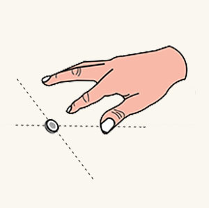 
        **Finger approaches** 
    :::column-end:::
    :::column:::
        
       **Contact begins** 
    :::column-end:::
    :::column:::
        
       **Press down** 
    :::column-end:::
:::row-end:::

 

---

## 2D slate interaction

A 2D [slate](slate.md) is a holographic container used to host 2D app content, such as a web browser. The design concept for interacting with a 2D slate via direct manipulation is the same as interacting with a physical touch screen.

### To interact with the slate contact

:::row:::
    :::column:::
        
       **Touch** 
       Use an index finger to press a hyperlink or a button.
    :::column-end:::
    :::column:::
       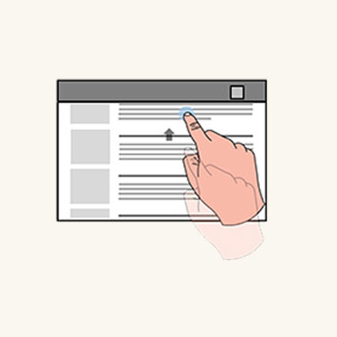 
        **Scroll** 
        Use an index finger to scroll a slate content up and down.
    :::column-end:::
    :::column:::
        
       **Zoom** 
       The user's two index fingers are used to zoom in and out of the slate content, according to the relative motion of the fingers.
    :::column-end:::
:::row-end:::

### For manipulating the 2D slate itself

:::row:::
    :::column:::
        
       **Move** 
       Move your hands toward corners and edges to reveal the closest manipulation affordances. Grab the Holobar at the top of the 2D slate, which lets you move the whole slate.
    :::column-end:::
    :::column:::
       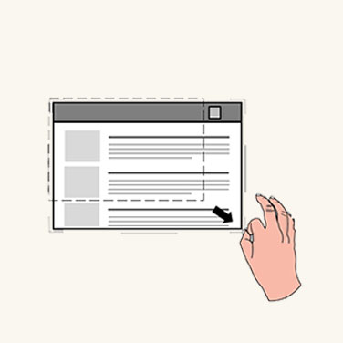 
        **Scale** 
        Grab the manipulation affordances and do uniform scaling through the corner affordances.
    :::column-end:::
    :::column:::
       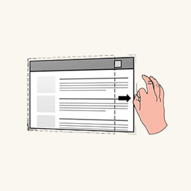 
       **Reflow** 
       Grab the manipulation affordances and do reflow via the edge affordances.
    :::column-end:::
:::row-end:::

 

---

## 3D object manipulation

HoloLens 2 lets users enable their hands to direct and manipulate 3D holographic objects by applying a bounding box to each 3D object. The bounding box provides better depth perception through its proximity shader. With the bounding box, there are two design approaches for 3D object manipulation.

### Affordance-based manipulation

Affordance-base manipulation lets you manipulate the 3D object through a bounding box along with the manipulation affordances around it. 

:::row:::
    :::column:::
       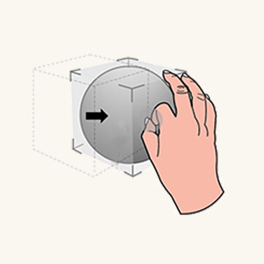 
       **Move** 
       As soon as a user's hand is close to a 3D object, the bounding box, and the nearest affordance are revealed. Users can grab the bounding box to move the whole object.
    :::column-end:::
    :::column:::
        
        **Rotate** 
        Users can grab the edge affordances to rotate.
    :::column-end:::
    :::column:::
        
       **Scale** 
       Users can grab the corner affordances to scale uniformly.
    :::column-end:::
:::row-end:::

 

### Non-affordance-based manipulation

Non-affordance-based manipulation doesn't attach affordance to the bounding box. Users can only reveal the bounding box, then directly interact with it. If the bounding box is grabbed with one hand, the translation and rotation of the object are associated to motion and orientation of the hand. When the object is grabbed with two hands, users can translate, scale, and rotate it according to relative motions of two hands.

Specific manipulation requires precision. We recommend that you use **affordance-based manipulation** because it provides a high level of granularity. For flexible manipulation, we recommend you use **non-affordance manipulation** as it allows for instant and playful experiences.

 

---

## Instinctual gestures

With HoloLens (1st gen), we taught users a couple of predefined gestures, such as bloom and air tap. For HoloLens 2, we don't ask users to memorize any symbolic gestures. All required user gestures, where users need to interact with holograms and content, are instinctual. The way to achieve instinctual gestures is to help users perform gestures through the design of UI affordances.

For example, if we encourage the user to grab an object or a control point with a two finger pinch, the object or the control point should be small. If we want the user to do a five finger grab, the object or the control point should be relatively large. Similar to buttons, a tiny button would limit users to press it with a single finger. A large button would encourage users to press it with their palms.

:::row:::
    :::column:::
       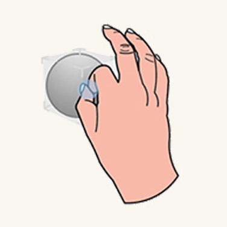 
       **Small object** 
    :::column-end:::
    :::column:::
        
        **Medium object** 
    :::column-end:::
    :::column:::
        
       **Large object** 
    :::column-end:::
:::row-end:::

 

---

 

## Symmetric design between hands and 6 DoF controllers

You may have noticed that there are interaction parallels we can draw between hands in AR and motion controllers in VR. Both inputs can be used to trigger direct manipulations in their respective environments. In HoloLens 2, grabbing and dragging with hands at a close distance works much the same way as the grab button does on WMR motion controllers. This provides users with interaction familiarity between the two platforms, which might prove useful if you ever decide to port your application between platforms.

 

---

## Optimize with eye tracking

Direct manipulation can feel magical if it works as intended. But it can also become frustrating if you can’t move your hand anywhere without unintentionally triggering a hologram. Eye tracking potentially helps to better identify what the user’s intent is.

* **When**: Reduce unintentionally triggering a manipulation response. Eye tracking allows for better understanding what a user is currently engaged with.
For example, imagine you're reading through a holographic (instructional) text when reaching over to grab you real-world work tool.

By doing so, you accidentally move your hand across some interactive holographic buttons that you hadn't even noticed before. For example, it  may be outside the user's field-of-view (FoV).

If the user hasn't looked at a hologram for a while, yet a touch or grasp event has been detected for it, the interaction is likely unintentional.

* **Which one**:  Aside from addressing false positive activations, another example includes better identifying which holograms to grab or poke as the precise intersection point may not be clear from your perspective, especially if several holograms are positioned close to each other.

  While eye tracking on HoloLens 2 has limitations based on how accurately it can determine your eye gaze, this can still be helpful for near interactions because of depth disparity when interacting with hand input. This means it's sometimes difficult to determine whether your hand is behind or in front of a hologram to precisely grab a manipulation widget, for example.

* **Where to**: Use information about what a user is looking at with quick-throwing gestures. Grab a hologram and roughly toss it toward your intended destination.  

    While this sometimes works, quickly doing hand gestures may result in highly inaccurate destinations. However, eye tracking could improve the accuracy of the gesture.

 

---

## Manipulation in MRTK (Mixed Reality Toolkit) for Unity
With **[MRTK](https://github.com/Microsoft/MixedRealityToolkit-Unity)**, you can easily achieve common manipulation behavior using the script **ObjectManipulator**. With ObjectManipulator, you can grab and move objects directly with hands or with hand ray. It also supports two-handed manipulation for scaling and rotating an object.

* [MRTK - Manipulation](https://docs.microsoft.com/windows/mixed-reality/mrtk-unity/features/ux-building-blocks/object-manipulator)

---

## See also

* [Head-gaze and commit](gaze-and-commit.md)
* [Point and commit with hands](point-and-commit.md)
* [Instinctual interactions](interaction-fundamentals.md)