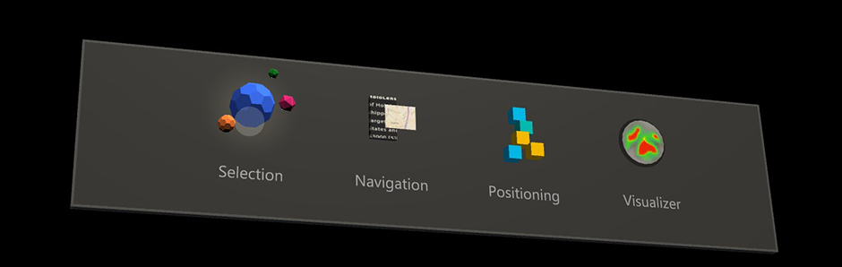

# Eye-gaze-based interaction on HoloLens 2

One of our exciting new capabilities on HoloLens 2 is eye tracking. On our [Eye tracking on HoloLens 2](eye-tracking.md) page, we mentioned the need for each user to go through a [Calibration](/hololens/hololens-calibration), provided some developer guidance, and highlighted use cases for eye tracking. Eye-gaze input is still a new type of user input and there's a lot to learn. 

While eye-gaze input is only used subtly in our Holographic Shell experience (the user interface that you see when you start your HoloLens 2), several apps, such as the ["HoloLens Playground"](https://www.microsoft.com/p/mr-playground/9nb31lh723s2), showcase great examples on how eye-gaze input can add to the magic of your holographic experience.
On this page, we discuss design considerations for integrating eye-gaze input to interact with your holographic applications.

You'll learn about key advantages and also unique challenges that come with eye-gaze input. Based on these, we provide several design recommendations to help you create satisfying eye-gaze-supported user interfaces. 

## Device support

<table>
<colgroup>
    <col width="25%" />
    <col width="25%" />
    <col width="25%" />
    <col width="25%" />
</colgroup>
<tr>
     <td><strong>Feature</strong></td>
     <td><a href="/hololens/hololens1-hardware"><strong>HoloLens (1st gen)</strong></a></td>
     <td><a href="https://docs.microsoft.com/hololens/hololens2-hardware"><strong>HoloLens 2</strong></td>
     <td><a href="../discover/immersive-headset-hardware-details.md"><strong>Immersive headsets</strong></a></td>
</tr>
<tr>
     <td>Eye-gaze</td>
     <td>❌</td>
     <td>✔️</td>
     <td>❌</td>
</tr>
</table>

## Head and eye tracking design concepts demo

If you'd like to see Head and Eye Tracking design concepts in action, check out our **Designing Holograms - Head Tracking and Eye Tracking** video demo below. When you've finished, continue on for a more detailed dive into specific topics.

> [!VIDEO https://docs.microsoft.com/en-us/shows/Docs-Mixed-Reality/Microsofts-Designing-Holograms-Head-Tracking-and-Eye-Tracking-Chapter/player]

*This video was taken from the "Designing Holograms" HoloLens 2 app. Download and enjoy the full experience [here](https://aka.ms/dhapp).*

## Eye-gaze input design guidelines

Building an interaction that takes advantage of fast-moving eye targeting can be challenging. 
In this section, we summarize the key advantages and challenges to consider when designing your application. 

### Benefits of eye-gaze input

- **High speed pointing.** 
The eye muscle is the fastest reacting muscle in the human body. 

- **Low effort.** 
Barely any physical movements are necessary. 

- **Implicitness.** 
Often described by users as "mind reading", information about a user's eye movements lets the system know which target the user plans to engage. 

- **Alternative input channel.** 
Eye-gaze can provide a powerful supporting input for hand and voice input building on years of experience from users based on their hand-eye coordination.

- **Visual attention.** 
Another important benefit is the possibility to infer what a user is paying attention to. 
This can help in various application areas ranging from more effectively evaluating different designs to aiding in smarter user interfaces and enhanced social cues for remote communication.

In a nutshell, using eye-gaze as an input offers a fast and effortless contextual input signal. 
This is powerful when combined with other inputs such as *voice* and *manual* input to confirm the user's intent.

### Challenges of eye-gaze as an input

While eye-gaze can be used to create satisfying user experiences, which make you feel like a superhero, it's also important to know what it isn't good at to appropriately account for this. 
The following list discusses some *challenges* to consider and how to address them when working with eye-gaze input: 

- **Your eye-gaze is "always on"** 
The moment you open your eye lids, your eyes start fixating on things in the environment. 
Reacting to every look you make and accidentally issuing actions, because you looked at something for too long, would result in an unsatisfying experience.
We recommend combining eye-gaze with a *voice command*, *hand gesture*, *button click* or extended dwell to trigger the selection of a target (for more information, see [eye-gaze and commit](gaze-and-commit-eyes.md)).
This solution also allows for a mode in which the user can freely look around without being overwhelmed by involuntarily triggering something. 
This issue should also be considered when designing visual and auditory feedback when looking at a target.
Try not to overwhelm the user with immediate pop-out effects or hover sounds. Subtlety is key. 
We'll discuss some best practices for this further below when talking about [design recommendations](eye-gaze-interaction.md#design-recommendations).

- **Observation vs. control** 
Imagine that you want to precisely straighten a photograph on your wall. 
You look at its borders and its surroundings to see if it aligns well. 
Now imagine how you would do that when you want to use your eye-gaze as an input to move the picture. 
Difficult, isn't it? 
This describes the double role of eye-gaze when it's required both for input and control. 

- **Leave before click:** 
For quick target selections, research has shown that a user's eye-gaze can move on before concluding a manual click (for example, an air tap). 
Pay special attention to synchronizing the fast eye-gaze signal with slower control input (for example, voice, hands, controller).

- **Small targets:**
Do you know the feeling when you try to read text that is just a bit too small to read comfortably? 
This straining feeling on your eyes can cause you to feel tired and worn out, because you try to readjust your eyes to focus better.
This is a feeling you might invoke in your users when forcing them to select targets that are too small in your application using eye targeting.
For your design, to create a pleasant and comfortable experience for your users, we recommend that targets should be at least 2° in visual angle, preferably larger.

- **Ragged eye-gaze movements** 
Our eyes perform rapid movements from fixation to fixation. 
If you look at scan paths of recorded eye movements, you can see that they look ragged. 
Your eyes move quickly and in spontaneous jumps in comparison to *head-gaze* or *hand motions*.  

- **Tracking reliability:**
Eye tracking accuracy may degrade a little in changing light as your eyes adjust to the new conditions.
While this shouldn't necessarily affect your application design, as the accuracy should be within the 2° limitation, it may be necessary for the user to calibrate again. 

## Design recommendations
The following is a list of specific design recommendations based on the described advantages and challenges for eye-gaze input:

1. **Eye-gaze isn't the same as Head-gaze:**
    - **Consider whether fast yet ragged eye movements fit your input task:** 
While our fast and ragged eye movements are great at quickly selecting targets across our field of view, it's less applicable for tasks that require smooth input trajectories (for example, drawing or encircling annotations). 
In this case, hand or head pointing should be preferred.
  
    - **Avoid attaching something directly to the user’s eye-gaze (for example, a slider or cursor).**
With cursors, this may result in a "fleeing cursor" effect because of slight offsets in the projected eye-gaze signal. 
With a slider, it can conflict with the double role of controlling the slider with your eyes while also wanting to check whether the object is at the correct location. 
For the example of the slider, it makes more sense to use eye-gaze in combination with hand gestures. 
This means that the user could quickly and effortlessly switch among many sliders, raising up their hand and pinching their thumb and index finger to grab and move it. 
When the pinch is released, the slider stops moving. 
Users could become overwhelmed and distracted, especially if the signal is imprecise for that user. 
  
2. **Combine eye-gaze with other inputs:** 
The integration of eye tracking with other inputs, such as hand gestures, voice commands or button presses, provides several advantages:
    - **Allow for free observation:** 
    Given that the main role of our eyes is to observe our environment, it's important that users are allowed to look around without triggering any (visual, auditory, and so on) feedback or actions. 
    Combining eye tracking with another input control allows smooth transitioning between eye tracking observation and input control modes.
  
    - **Powerful context provider:** 
Using information about where and what the user is looking at while saying a voice command or using a hand gesture allows seamlessly channeling the input across the field-of-view. 
For example: Say _"put that there"_ to quickly and fluently select and position a hologram across the scene by looking at a target and its intended destination. 

    - **Need for synchronizing multimodal inputs:** 
Combining rapid eye movements with more complex inputs, such as long voice commands or hand gestures, bears the risk that the user already continues to look around before the extra input command is finished and recognized. 
If you create your own input controls (for example, custom hand gestures), make sure to log the onset of this input or approximate duration to correlate it with what a user had looked at in the past.
    
3. **Subtle feedback for eye tracking input:**
It's useful to provide feedback when a target is looked at to indicate that the system is working as intended but should be kept subtle. 
This can include slowly blending in and out, visual highlights, or doing other subtle target behaviors, such as slow motions, such as slightly increasing the target size. This indicates that the system correctly detected that the user is looking at a target without unnecessarily interrupting the user’s current workflow. 

4. **Avoid enforcing unnatural eye movements as input:** 
Don't force users to use specific eye movements (gaze gestures) to trigger actions in your application.

5. **Account for imprecisions:** 
We distinguish two types of imprecisions, which are noticeable to users: offset and jitter. The easiest way to address an offset is to provide sufficiently large targets to interact with. It's suggested that you use a visual angle greater than 2° as a reference. For instance, your thumbnail is about 2° in visual angle when you stretch out your arm. This leads to the following guidance:
    - Don't force users to select tiny targets. Research has shown that if targets are sufficiently large and system are designed well, users describe their interactions as effortless, and magical. If targets become too small, users describe the experience as fatiguing and frustrating.
  
 

This page provided you with a good overview to get you started understanding eye-gaze as an input in mixed reality. 
To get started developing, check out our information on 
[eye-gaze in Unity](/windows/mixed-reality/mrtk-unity/features/input/eye-tracking/eye-tracking-main) and 
[eye-gaze in DirectX](../develop/native/gaze-in-directx.md).

## See also
* [Comfort](comfort.md)
* [Eye-gaze in DirectX](../develop/native/gaze-in-directx.md)
* [Eye-gaze in Unity (Mixed Reality Toolkit)](/windows/mixed-reality/mrtk-unity/features/input/eye-tracking/eye-tracking-main)
* [Eye tracking on HoloLens 2](eye-tracking.md)
* [Gaze and commit](gaze-and-commit.md)
* [Gaze and dwell](gaze-and-dwell.md)
* [Voice input](../out-of-scope/voice-design.md)