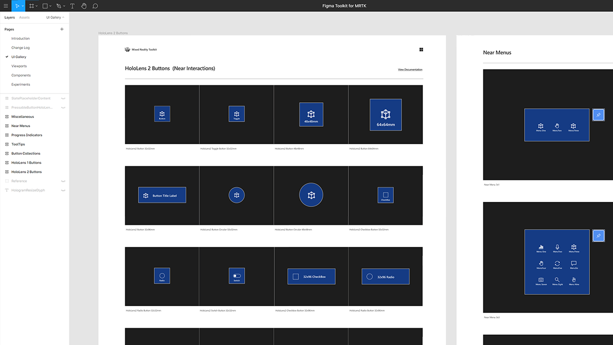

# Figma Toolkit

 

Figma Toolkit provides the assets that can be used for sketching and laying out UI. All UI controls are based on the components available in MRTK. 

## Download

[Download Figma Toolkit](http://#)

## How to use Figma Toolkit
Open **Introduction** page to learn about how to use components and states.

## Examples

Figma Toolkit could be useful to sketch menu UI.

 

Assets could be used for storyboarding.

 

## See also

* [Cursors](cursors.md)
* [Hand ray](point-and-commit.md)
* [Button](button.md)
* [Interactable object](interactable-object.md)
* [Bounding box and App bar](app-bar-and-bounding-box.md)
* [Manipulation](direct-manipulation.md)
* [Hand menu](hand-menu.md)
* [Near menu](near-menu.md)
* [Object collection](object-collection.md)
* [Voice command](voice-input.md)
* [Keyboard](keyboard.md)
* [Tooltip](tooltip.md)
* [Slate](slate.md)
* [Slider](slider.md)
* [Shader](shader.md)
* [Billboarding and tag-along](billboarding-and-tag-along.md)
* [Displaying progress](progress.md)
* [Surface magnetism](surface-magnetism.md)
