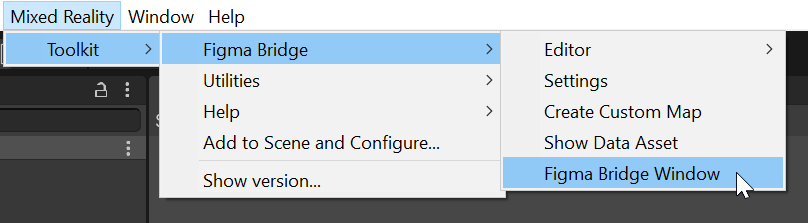
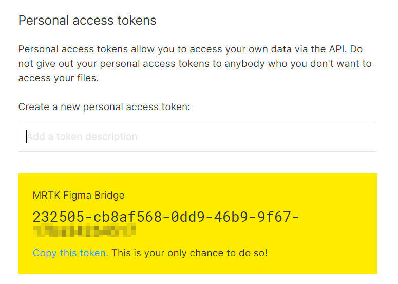
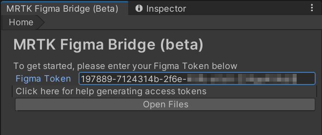
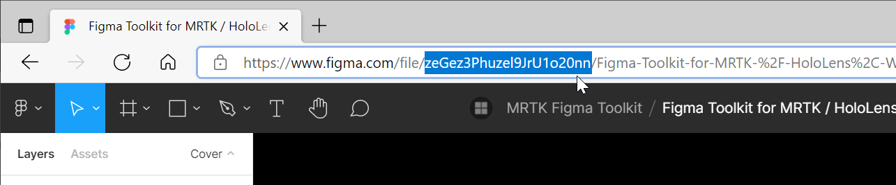
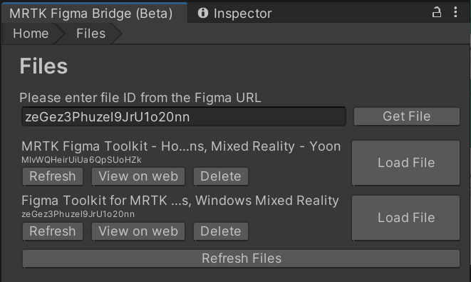
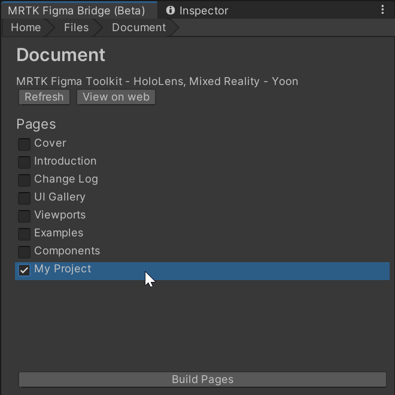
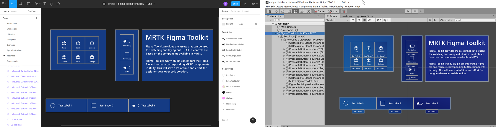

# MRTK Figma Bridge for Unity (Beta)

> [!VIDEO https://www.microsoft.com/en-us/videoplayer/embed/RWKiO4]

MRTK Figma Bridge for Unity allows you to bring the layout from Figma Toolkit into Unity. The bridge can import UI layout created with MRTK Figma Toolkit, then instantiates corresponding MRTK prefabs with proper position and size. Figma Bridge will help design integration process and collaboration between designers and developers.

See **[MRTK Figma Toolkit](figma-toolkit.md)** page to learn about Figma Toolkit which is the design file with HoloLens 2 style UI library.

## Prerequisites
- See [Install the tools](/windows/mixed-reality/develop/install-the-tools) for the required software for Mixed Reality development
- Unity 2019 or higher
- [MRTK-Unity 2.7.0 or higher](/windows/mixed-reality/mrtk-unity/)

> [!IMPORTANT]
> **Requires MRTK-Unity 2.7.0 or higher**
> 
> Since Figma Toolkit and Figma Bridge are based on MRTK 2.7.0 prefabs, MRTK 2.7.0 or higher version is required. When used with lower version of MRTK, some components won't be translated properly.

## How to use MRTK Figma Bridge

### 1. Installation

Figma Unity Bridge can be installed through [Mixed Reality Feature Tool](/windows/mixed-reality/develop/unity/welcome-to-mr-feature-tool). Download and run Mixed Reality Feature Tool.

In **Discover features** page, under **Mixed Reality Toolkit** section, select **MRTK Figma Unity Bridge**. Follow the steps to finish MR Feature Tool and come back to your Unity project. Unity will import the package for MRTK Figma Bridge.

### 2. Open Figma Bridge window

Once the import process is done, you will be able to find Figma Bridge under the menu **Mixed Reality > Toolkit > Figma Bridge**

 

### 3. Generate and enter your Figma Token

On the Figma website, click Figma menu on the upper left corner, open Help and account > Account settings. Generate a new personal access token in the 'Personal access tokens' section.

 

 

### 4. Enter ID for a Figma document
Each Figma document has a unique ID in the URL. Copy and paste this ID into Figma Bridge.

 

Click **Get File** to download Figma file. You can download other Figma files by entering a new ID.

Click **Load File** to open a Figma file.

 

### 5. Build a page

Figma Bridge will display the list of pages in the Figma file. Check pages that you want to build in Unity. Click **Build pages** button.

 

 

### 6. Refresh a document for changes

You can modify Figma file on the web (or using the desktop editor) and click **Refresh** to retrieve any changes. Click **Build pages** to build with updates. This way, you can easily iterate your design in Figma and see it in Unity.

## See also
* [Figma Toolkit](figma-toolkit.md)
* [Cursors](cursors.md)
* [Hand ray](point-and-commit.md)
* [Button](button.md)
* [Interactable object](interactable-object.md)
* [Bounding box and App bar](app-bar-and-bounding-box.md)
* [Manipulation](direct-manipulation.md)
* [Hand menu](hand-menu.md)
* [Near menu](near-menu.md)
* [Object collection](object-collection.md)
* [Voice command](voice-input.md)
* [Keyboard](keyboard.md)
* [Tooltip](tooltip.md)
* [Slate](slate.md)
* [Slider](slider.md)
* [Shader](shader.md)
* [Billboarding and tag-along](billboarding-and-tag-along.md)
* [Displaying progress](progress.md)
* [Surface magnetism](surface-magnetism.md)
