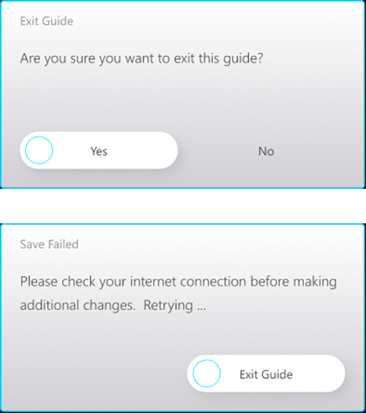
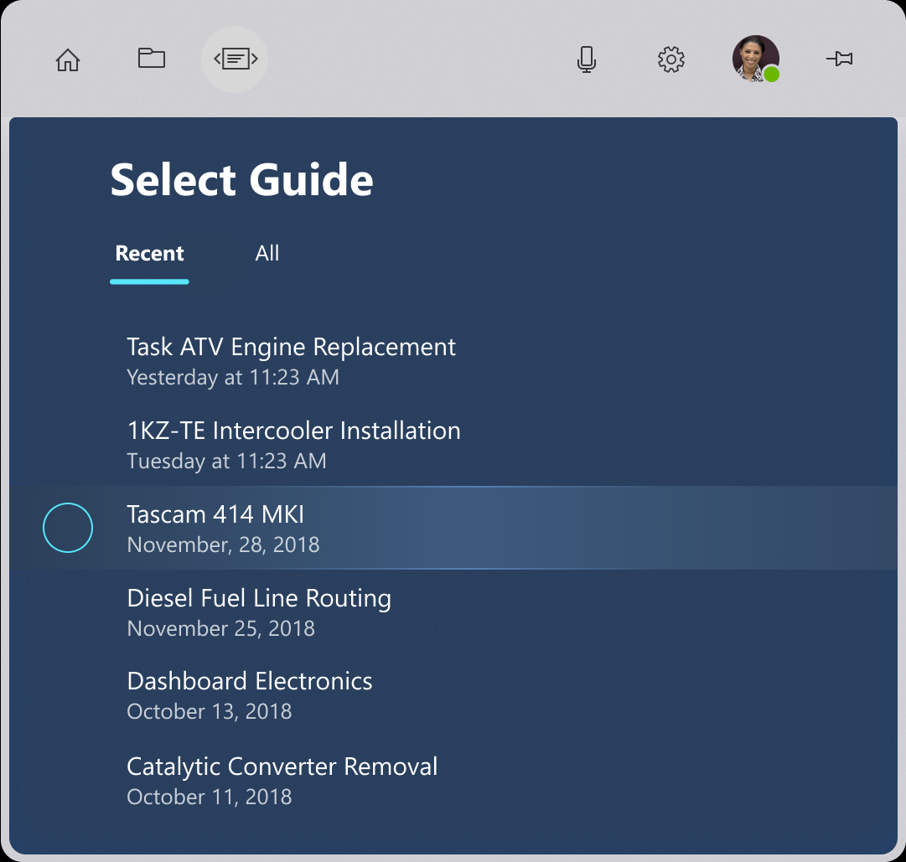

# Head-gaze and dwell

When hands are occupied with tools and parts, gestures can be tedious or impossible. Voice commands, like gestures, can be unreliable in certain contexts, for example under excessively loud conditions. Additionally, using voice to control computers isn't universally common, but it certainly is gaining steam! Head-gaze and dwell offers the most familiar and easy-to-master mechanism for working heads-up and hands-free on HoloLens. Additionally, head-gaze and dwell is 100% reliable independent of noise interference nor silence constraints in the operating environment.

## Scenarios

Head-gaze and dwell is great in scenarios where a person's hands are busy with other tasks. The feature is also useful when voice isn't 100% reliable or available because of environmental or social constraints. A good example is a person wearing a HoloLens to overlay reference information while repairing a car engine. Their hands are busy with tools or supporting their body as they lean into the engine compartment. The garage space is loud, with the constant banging and buzzing of tools, making voice commands difficult. Head-gaze and dwell allows the person using the HoloLens to confidently navigate their reference material without interrupting their workflow. 

## Device support

<table>
    <colgroup>
    <col width="25%" />
    <col width="25%" />
    <col width="25%" />
    <col width="25%" />
    </colgroup>
    <tr>
        <td><strong>Input model</strong></td>
        <td><a href="/hololens/hololens1-hardware"><strong>HoloLens (1st gen)</strong></a></td>
        <td><a href="https://docs.microsoft.com/hololens/hololens2-hardware"><strong>HoloLens 2</strong></td>
        <td><a href="/windows/mixed-reality/enthusiast-guide/immersive-headset-hardware-details"><strong>Immersive headsets</strong></a></td>
    </tr>
     <tr>
        <td>Head-gaze and dwell</td>
        <td>✔️ Recommended</td>
        <td>✔️ Recommended</td>
        <td>✔️ Recommended</td>
    </tr>
</table>

## Design principles

**Avoid "Gaze as a weapon"**

Head-gaze and dwell requires visual feedback to be intuitive, but too much feedback can induce anxiety. The feedback should help a user know what they're targeting, but not autoselect it against their intent. When reading text, icons, and labels, you need to provide users time to absorb the information before selecting.
	
**Seek Goldilocks speed**
	
Dwell interactions can have different timers based on impact of navigation - more frequently used functions will generally benefit from faster fill times, while more consequential functions may benefit from longer fill times. When using a fill-effect to show these timers, animation curves of the fill color can positively influence a feeling of faster fill times. Consideration should be taken to enable user decision from fast/medium/slow fill speed overrides.
	
**Say no-no to yo-yo effect**

The yo-yo effect is an uncomfortable head movement pattern that happens when the content placement and head-gaze/dwell controls forces people to look up and down repeatedly. For example, a list nav with the head-gaze and dwell button at the bottom induces a loop of - look down to dwell, look up at results, look down to dwell, and so on. The resulting pattern is uncomfortable, so we recommend placing navigation controls in a centralized location that requires less back-and-forth. Placement of dwell buttons based on their effects becomes important for comfort.
s
 

---

## UX Guidelines and best practices

### Target sizes

To be easily accessible, head-gaze and dwell targets need to be large enough to look at comfortably, and hold one's head stable on the target for the prescribed time. We recommend a minimum target size of 2 degrees to achieve the most comfortable experience. 

### Visual feedback

When using a radial fill to represent the dwell timer, start from the center of button. A consistent response is less confusing than all different directions on different buttons. 

  * This rule can be broken though for directional interactions (for example, nav up/down/left/right, and so on). For example, Microsoft Dynamics 365 Guides makes an exception on NEXT/BACK being left right fills.
  * Consider inverting radial fill from outside, for scenarios like toggling off a button. The inverse feeling of pushing a button is a nice visual pattern to maintain. 

### Progressive disclosure

Progressive disclosure means only showing as much detail as is relevant at each stage of an interaction. For dwell, that means the dwell target is revealed on highlight (for example, in a list control).

 ### Oversized targets

Dwell region can be larger than inactive icon to make it easier to use, like the Back button in Microsoft Dynamics 365 Guides.

### Prevent flickering with delayed feedback

Use a short delay before starting visual feedback to avoid flickering when someone passes over a dwell target.
* For buttons interacted with frequently, keep the delay short so the application feels reactive.
* For buttons that are interacted with infrequently, a longer delay can be appropriate to avoid the interface feeling twitchy.

 

---

## UI patterns

### High frequency buttons

:::row:::
    :::column:::
        High frequency buttons are buttons that are used commonly throughout an application. A good example of these are the next and back buttons in Microsoft Dynamics 365 Guides. 
         
        **Recommendations** 
  * High frequency buttons should be large, easier to hit with head-gaze
  * Stay near eye height to avoid ergonomic straining. 
         
*Image: Microsoft Dynamics 365 Guides next button*
    :::column-end:::
        :::column:::
        
    :::column-end:::
:::row-end:::

 

---

### Low frequency buttons

Low frequency buttons are buttons that aren't interacted with as regularly throughout the application. A good example might be a button to access the settings menu, or a button to clear all work.

* Try to keep these buttons out of the way of frequent head-gaze paths to avoid accidental activation. 

 

---

### Confirmations

:::row:::
    :::column:::
        When an action has significant impact, like charging money, deleting work, or starting a long process, it's useful to confirm that a person meant to select a button. 
         
        **Recommendations** 
  * Show selection highlight on main button.
  * Reveal dwell target at same time as selection highlight.
  * For the secondary button, reveal the dwell target on head-gaze. 
         
*Image: Microsoft Dynamics 365 Guides confirmation dialog*
    :::column-end:::
        :::column:::
        
    :::column-end:::
:::row-end:::
		
 

---

### Toggle buttons

Toggle buttons require some nuanced logic to work properly. When a person dwells on a toggle button and activates it, they need to exit the button and then return to restart the dwell logic. It's important that togglable buttons have a clear active versus inactive state. 

 

---

### List views

:::row:::
    :::column:::
        List views present a particular challenge for head-gaze and dwell input. People can scan the content without feeling like that have to tiptoe around the dwell targets. 
         
**Recommendations** 
  * Have the entire row highlight when head-gazed but doesn’t begin dwell unless head-gaze is on the specific dwell target.
  * Only show the dwell target when the row is highlighted to cut down on visual noise.
  * Be clear and consistent with the position of dwell targets.
  * Don't show all dwell targets at once to avoid repetitive UI.
  * Reuse the same pattern as often as possible to establish UX familiarity. 
         
*Image: Microsoft Dynamics 365 Guides list*
    :::column-end:::
        :::column:::
        
    :::column-end:::
:::row-end:::

 

---
 
 ## See also

* [Gaze and commit](gaze-and-commit.md)
* [Hands - Direct manipulation](direct-manipulation.md)
* [Hands - Gestures](gaze-and-commit.md#composite-gestures)
* [Hands - Point and commit](point-and-commit.md)
* [Instinctual interactions](interaction-fundamentals.md)
* [Voice input](voice-input.md)