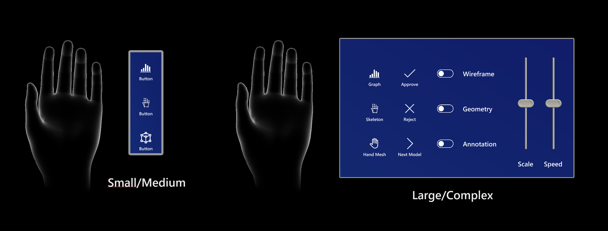
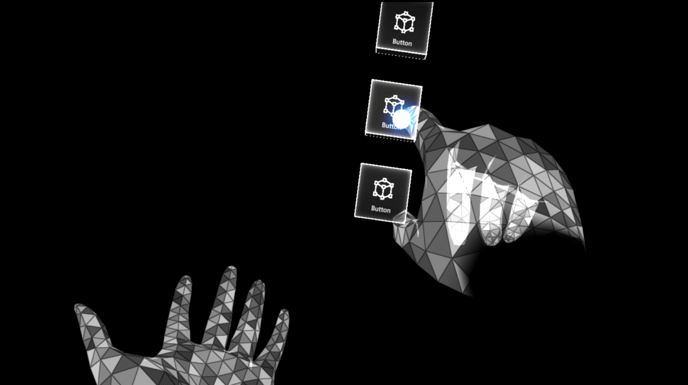

# Hand menu

The hand menu is one of the most unique UX patterns in HoloLens 2. It allows you to quickly bring up hand-attached UI. Since it's accessible anytime and can be shown and hidden easily, it's great for quick actions.

> [!VIDEO https://www.microsoft.com/en-us/videoplayer/embed/RE4AJAg]

You'll find our recommended best practices for working with hand menus in the list below. You can also find an example scene demonstrating the hand menu in [MRTK](https://docs.microsoft.com/windows/mixed-reality/mrtk-docs/features/ux-building-blocks/hand-menu.md).

 

---

## Best practices

**Keep the number of buttons small** 

Because of the close distance between a hand-locked menu and the eyes, and the tendency for users to focus on a relatively small visual area at any time (the attentional cone of vision is roughly 10 degrees), we recommend keeping the number of buttons small. Based on our exploration, one column with three buttons works well by keeping all the content within the field of view (FOV) even when a user moves their hands to the center of the FOV. 

**Use hand menu for quick action** 

Raising an arm and maintaining the position could easily cause arm fatigue. Use a hand-locked method for the menu requiring a short interaction. If your menu is complex and requires extended interaction times, consider using world-locked or body-locked instead. 

**Button / Panel angle**

Menus should billboard towards the opposite shoulder and middle of the head: This allows a natural hand move to interact with the menu with the opposite hand and avoids any awkward or uncomfortable hand positions when touching buttons. 

**Consider supporting one-handed or hands-free operation**

Don't assume both of the user's hands are always available. Consider a wide range of contexts when one or both hands aren't available, and make sure your design accounts for those situations. To support a one-handed hand menu, you can try transitioning the menu placement from hand-locked to world-locked when the hand flips (goes palm down). For hands-free scenarios, consider using a voice command to invoke the hand menu.

**Avoid adding buttons near the wrist (system home button)**

If the hand menu buttons are placed too close to the home button, it may accidentally trigger while interacting with the hand menu.

 

## Hand menu with large and complex UI controls

It's recommended to limit the number of buttons or UI controls on hand-attached menus. This is because extended interaction with a large number of UI elements can cause arm fatigue. If your experience requires a large menu, provide an easy way for the user to world lock the menu. One technique we recommend is to world-lock then menu when the hand drops or flips away from the user. A second technique is to allow the user to directly grab the menu with the other hand. When the user releases the menu, the menu should world lock. This way, a user can interact with various UI elements comfortably and confidently over an extended period of time. 

When the menu is world-locked, make sure to provide a way to move the menu, and close the menu when it's no longer needed. Make the menu movable by providing handles on the sides or top of menu. Add a close button to allow the menu to close. Allow for the menu to reattach to the hand when the user hand faces the user. We also recommend requiring that the users gaze at their hand to prevent false activations (see below).

**Large menu that shows a usability issue**

> [!VIDEO https://www.microsoft.com/en-us/videoplayer/embed/RE4AOPx]

**World-locked menu on hand drop**

> [!VIDEO https://www.microsoft.com/en-us/videoplayer/embed/RE4AGZi]

**Manual grab & pull to world-lock the menu**

> [!VIDEO https://www.microsoft.com/en-us/videoplayer/embed/RE4AJAf]

## How to prevent false activation

If you use just palm-up as an event to trigger the hand menu, it may accidentally appear when you don't need it (false-positive), because people move their hands both intentionally (for communication and object manipulation) and unintentionally. To reduce false activations, add an extra step besides the palm-up event to invoke the hand menu (such as fully opened fingers, or the user intentionally gazing at their hand).

**Require Flat Palm**

By requiring a flat open hand, you can prevent false activation that might occur as the user manipulates objects or gestures while communicating within an environment. 

**Require Gaze**

By requiring the user to gaze at their hand (either with eye gaze or head gaze), it prevents false activations because of the user having to direct their attention to the hand as a secondary activation step (with a tunable distance threshold used to allow for user comfort).  

> [!VIDEO https://www.microsoft.com/en-us/videoplayer/embed/RE4Asn4]

---

## Hand menu placement best practices

In human anatomy, the ulnar nerve is a nerve that runs near the ulna bone. The ulna is a long bone found in the forearm that stretches from the elbow to the smallest finger.

Below are two recommended placements based on our explorations:

:::row:::
    :::column:::
         
        **A. Ulnar inside palm** 
        This position is reliable because the hands don't overlap each other. This is critical for accurate hand detection and tracking.
    :::column-end:::
    :::column:::
         
        **B. Ulnar above hand** 
        This location is comfortable for users because they don't need to raise their arm too much to interact with the hand menu. We recommend placing menus **13 cm** above the palm and align the buttons inside the ulnar palm. [Read more about the optimal button size](interactable-object.md) 
         
        For technical reasons, we recommend this location with one required implementation: the developer will need to freeze the menu once the user's opposite hand gets close to interacting with it. This will avoid jitteriness from overlapping hands and also allows for a faster targeting of the buttons. 
         
        HoloLens 2 cameras identify hands accurately when they're separate from each other. Any overlapping hands can cause hand menus move away from the anchor location. 
    :::column-end:::
:::row-end:::

 

---

## Menu positions that aren't recommended

We have done user research with different menus layouts and locations, the following menu locations are **NOT recommended**, find the cons of each study below:

:::row:::
    :::column:::
         
        **Above the arm** 
        1 - Difficult to maintain good hand tracking 
        2 - Causes user fatigue because of unnatural position
    :::column-end:::
    :::column:::
         
        **Above fingers** 
        1 - Hand fatigue because of holding out hand for a long time 
        2 - Hand tracking issues on index and middle fingers
    :::column-end:::
:::row-end:::

 

:::row:::
    :::column:::
         
        **Above-center palm** 
        1 - Hand tracking issues because of overlapping hands 
        2 - Hand fatigue because of holding hands for long time to interact with menus
    :::column-end:::
    :::column:::
        
        **Top fingertip** 
        1 - Hand tracking issues 
        2 - Hand fatigue from holding hand above normal posture 
        3 - Issues pressing buttons with other fingers by accident because of limited space between fingers
    :::column-end:::
:::row-end:::

 

:::row:::
    :::column:::
         
        **Back of the arm** 
        1 - Can trigger home button by accident 
        2 - Not a natural or comfortable position
    :::column-end:::
    :::column:::
    :::column-end:::
:::row-end:::

 

---

## Hand menu in MRTK (Mixed Reality Toolkit) for Unity

**[MRTK](https://github.com/Microsoft/MixedRealityToolkit-Unity)** provides scripts and example scenes for the hand menu. The HandConstraintPalmUp solver script allows you to attach any objects to the hands with various configurable options. MRTK's hand menu examples include useful options such as flat palm and gaze requirement for preventing false activation.

* [Hand Menu Documentations](https://docs.microsoft.com/windows/mixed-reality/mrtk-docs/features/ux-building-blocks/hand-menu.md)
* [Hand Menu Example Scene](https://github.com/microsoft/MixedRealityToolkit-Unity/blob/mrtk_development/Assets/MRTK/Examples/Demos/HandTracking/Scenes/HandMenuExamples.unity)

You can try hand menu examples in HoloLens 2 with MRTK Examples Hub app. 
* [Hand Menu Scene in MRTK Examples Hub](https://www.microsoft.com/p/mrtk-examples-hub/9mv8c39l2sj4?activetab=pivot:overviewtab)

 

---

## See also

* [Cursors](cursors.md)
* [Hand ray](point-and-commit.md)
* [Button](button.md)
* [Interactable object](interactable-object.md)
* [Bounding box and App bar](app-bar-and-bounding-box.md)
* [Manipulation](direct-manipulation.md)
* [Hand menu](hand-menu.md)
* [Near menu](near-menu.md)
* [Object collection](object-collection.md)
* [Voice command](voice-input.md)
* [Keyboard](keyboard.md)
* [Tooltip](tooltip.md)
* [Slate](slate.md)
* [Slider](slider.md)
* [Shader](shader.md)
* [Billboarding and tag-along](billboarding-and-tag-along.md)
* [Displaying progress](progress.md)
* [Surface magnetism](surface-magnetism.md)
