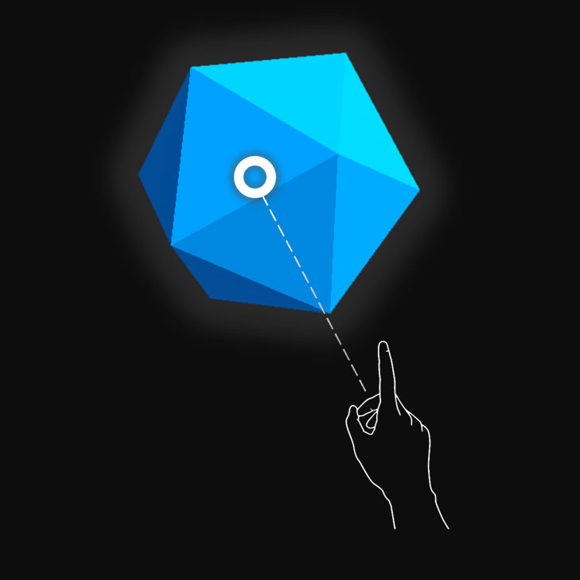
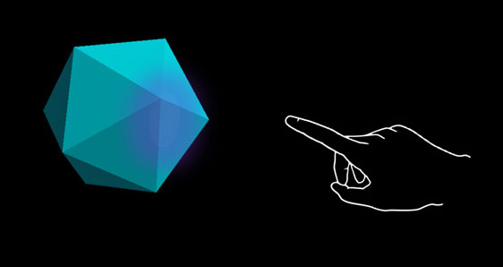
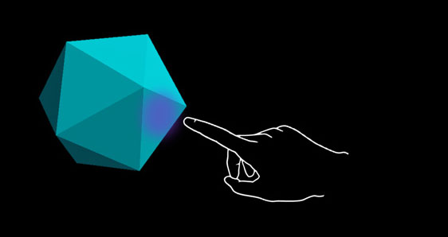
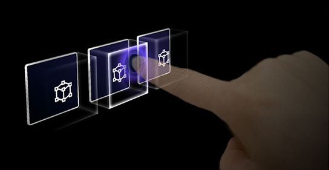

# Interactable object

A button has long been a metaphor used for triggering an event in the 2D abstract world. In the three-dimensional mixed reality world, we don’t have to be confined to this world of abstraction anymore. Anything can be an **interactable object** that triggers an event. An interactable object can be anything from a coffee cup on a table to a balloon in midair. We still do make use of traditional buttons in certain situation such as in dialog UI. The visual representation of the button depends on the context.

 

---

## Important properties of the interactable object

### Visual cues

Visual cues are sensory cues from light, received by the eye, and processed by the visual system during visual perception. Since the visual system is dominant in many species, especially humans, visual cues are a large source of information in how the world is perceived.

Since the holographic objects are blended with the real-world environment in mixed reality, it could be difficult to understand which objects you can interact with. For any interactable objects in your experience, it's important to provide differentiated visual cues for each input state. This helps the user understand which part of your experience is interactable and makes the user confident by using a consistent interaction method.

 

---

### Far interactions

For any objects that user can interact with gaze, hand ray, and motion controller's ray, we recommend having different visual cue for these three input states:

:::row:::
    :::column:::
        
       **Default (Observation) state** 
        Default idle state of the object.
       The cursor isn't on the object. Hand isn't detected.
    :::column-end:::
    :::column:::
        
        **Targeted (Hover) state** 
        When the object is targeted with gaze cursor, finger proximity or motion controller's pointer.
        The cursor is on the object. Hand is detected, ready.
    :::column-end:::
    :::column:::
        
       **Pressed state** 
        When the object is pressed with an air tap gesture, finger press or motion controller's select button.
        The cursor is on the object. Hand is detected, air tapped.
    :::column-end:::
:::row-end:::

 

---

You can use techniques such as highlighting or scaling to provide visual cues for the user’s input state. In mixed reality, you can find examples of visualizing different input states on the Start menu and with app bar buttons. 

Here's what these states look like on a **holographic button**:

:::row:::
    :::column:::
        
       **Default (Observation) state** 
    :::column-end:::
    :::column:::
        
        **Targeted (Hover) state** 
    :::column-end:::
    :::column:::
        
       **Pressed state** 
    :::column-end:::
:::row-end:::

 

---

### Near interactions (direct) 

HoloLens 2 supports articulated hand tracking input, which allows you to interact with objects. Without haptic feedback and perfect depth perception, it can be hard to tell how far away your hand is from an object or whether you're touching it. It's important to provide enough visual cues to communicate the state of the object, in particular the state of your hands based on that object.

Use visual feedback to communicate the following states:
* **Default (Observation)**: Default idle state of the object.
* **Hover**: When a hand is near a hologram, change visuals to communicate that hand is targeting hologram. 
* **Distance and point of interaction**: As the hand approaches a hologram, design feedback to communicate the projected point of interaction, and how far from the object the finger is
* **Contact begins**: Change visuals (light, color) to communicate that a touch has occurred
* **Grasped**: Change visuals (light, color) when the object is grasped
* **Contact ends**: Change visuals (light, color) when touch has ended

 

---

:::row:::
    :::column:::
         
        **Hover (Far)** 
        Highlighting based on the proximity of the hand.
    :::column-end:::
    :::column:::
         
        **Hover (Near)** 
        Highlight size changes based on the distance to the hand.
    :::column-end:::
:::row-end:::

:::row:::
    :::column:::
         
        **Touch / press** 
        Visual plus audio feedback.
    :::column-end:::
    :::column:::
         
        **Grasp** 
        Visual plus audio feedback.
    :::column-end:::
:::row-end:::

 

 

---

A [button on HoloLens 2](/windows/mixed-reality/mrtk-unity/features/ux-building-blocks/button) is an example of how the different input interaction states are visualized:

:::row:::
    :::column:::
         
        **Default** 
    :::column-end:::
    :::column:::
         
        **Hover** 
        Reveal a proximity-based lighting effect.
    :::column-end:::
:::row-end:::

:::row:::
    :::column:::
         
        **Touch** 
        Show ripple effect.
    :::column-end:::
    :::column:::
         
        **Press** 
        Move the front plate.
    :::column-end:::
:::row-end:::

 

---

:::row:::
    :::column:::
        ### The "ring" visual cue on HoloLens 2 
        On HoloLens 2, there's an extra visual cue, which can help the user's perception of depth. A ring near their fingertip shows up and scales down as the fingertip gets closer to the object. The ring eventually converges into a dot when the pressed state is reached. This visual affordance helps the user understand how far they are from the object. 
         
        *Video loop: Example of visual feedback based on proximity to a bounding box*
    :::column-end:::
        :::column:::
         
        
    :::column-end:::
:::row-end:::

 

---

### Audio cues

For direct hand interactions, proper audio feedback can dramatically improve the user experience. Use audio feedback to communicate the following cues:
* **Contact begins**: Play sound when touch begins
* **Contact ends**: Play sound on touch end
* **Grab begins**: Play sound when grab starts
* **Grab ends**: Play sound when grab ends

 

---

:::row:::
    :::column:::
        ### Voice commanding 
        For any interactable objects, it's important to support alternative interaction options. By default, we recommend that [voice commanding](../out-of-scope/voice-design.md) be supported for any objects that are interactable. To improve discoverability, you can also provide a tooltip during the hover state. 
         
        *Image: Tooltip for the voice command*
    :::column-end:::
        :::column:::
        
    :::column-end:::
:::row-end:::

 

---

## Sizing recommendations

To ensure all interactable objects can easily be touched, we recommend making sure the interactable meets a minimum size based on the distance it's placed from the user. The visual angle is often measured in degrees of visual arc. Visual angle is based on the distance between the user's eyes and the object and stays constant, while the physical size of the target may change as the distance from the user changes. To determine the necessary physical size of an object based on the distance from the user, try using a visual angle calculator such as [this one](https://elvers.us/perception/visualAngle/).

Below are the recommendations for minimum sizes of interactable content.

### Target size for direct hand interaction

| Distance | Viewing angle | Size |
|---------|---------|---------|
| 45 cm  | no smaller than 2° | 1.6 x 1.6 cm |

 
*Target size for direct hand interaction*

 

### Target size for hand ray or gaze interaction
| Distance | Viewing angle | Size |
|---------|---------|---------|
| 2 m  | no smaller than 1° | 3.5 x 3.5 cm |

 
*Target size for hand ray or gaze interaction*

 

---

## Interactable object in MRTK (Mixed Reality Toolkit) for Unity

In **[MRTK](https://github.com/Microsoft/MixedRealityToolkit-Unity)**, you can use the script [**Interactable**](https://github.com/microsoft/MixedRealityToolkit-Unity/tree/mrtk_release/Assets/MixedRealityToolkit.SDK/Features/UX/Interactable/Scripts) to make objects respond to various types of input interaction states. It supports various types of themes that allow you define visual states by controlling object properties such as color, size, material, and shader.

* [Interactable](/windows/mixed-reality/mrtk-unity/features/ux-building-blocks/interactable)
* [Button](/windows/mixed-reality/mrtk-unity/features/ux-building-blocks/button)
* [Hand interaction examples scene](https://github.com/microsoft/MixedRealityToolkit-Unity/blob/mrtk_release/Documentation/README_HandInteractionExamples.md)

MixedRealityToolkit's Standard shader provides various options such as **proximity light** that helps you create visual and audio cues.

* [MRTK Standard Shader](/windows/mixed-reality/mrtk-unity/features/rendering/mrtk-standard-shader)

 

---

## See also

* [Cursors](cursors.md)
* [Hand ray](point-and-commit.md)
* [Button](button.md)
* [Interactable object](interactable-object.md)
* [Bounding box and App bar](app-bar-and-bounding-box.md)
* [Manipulation](direct-manipulation.md)
* [Hand menu](hand-menu.md)
* [Near menu](near-menu.md)
* [Object collection](object-collection.md)
* [Voice command](voice-input.md)
* [Keyboard](keyboard.md)
* [Tooltip](tooltip.md)
* [Slate](slate.md)
* [Slider](slider.md)
* [Shader](shader.md)
* [Billboarding and tag-along](billboarding-and-tag-along.md)
* [Displaying progress](progress.md)
* [Surface magnetism](surface-magnetism.md)