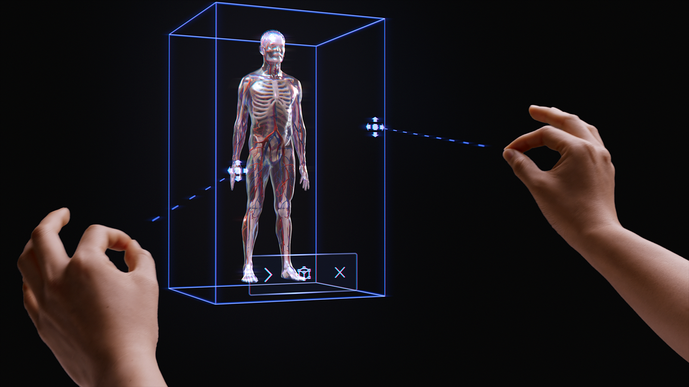

# Introducing instinctual interactions

The philosophy of simple, instinctual interactions is interwoven throughout the mixed reality (MR) platform. We've taken three steps to ensure that application designers and developers can provide their customers with easy and intuitive interactions. 

First, we've made sure our sensors and input technologies combine into multimodal interaction models. These interaction models include hand and eye tracking along with natural language input. Based on our research, designing and developing within a multimodal framework (and not based on individual inputs) is the key to creating instinctual experiences.

Second, we recognize that many developers target multiple HoloLens devices, such as HoloLens 2 and HoloLens (1st gen) or HoloLens and VR. So we've designed our interaction models to work across devices, even if the input technology varies on each device. For example, far interaction on a Windows Immersive headset with a 6DoF controller and HoloLens 2 both use identical affordances and patterns. This makes it easy for cross-device application development and provides a natural feel to user interactions. 

While we recognize that there are thousands of effective, engaging, and magical interactions possible in MR, we've found that intentionally employing a single interaction model in an application is the best way to ensure users are successful and have a great experience. To that end, we've included three things in this interaction guidance:
* Specific guidance around the three primary interaction models and the components and patterns required for each.
* Supplemental guidance about other benefits that our platform provides.
* General guidance to help select the appropriate interaction model for your development scenario.

## Basic hand tracking and instinctual interactions demo

Check out our **Designing Holograms - Head Tracking and Eye Tracking** video demo below, then move on to more specific topics:

> [!VIDEO https://channel9.msdn.com/Shows/Docs-Mixed-Reality/Microsofts-Designing-Holograms-Hand-Tracking-Chapter/player]

*This video was taken from the "Designing Holograms" HoloLens 2 app. Download and enjoy the full experience [here](https://aka.ms/dhapp).*

## Multimodal interaction models

Based on our research and feedback from customers, we've discovered that three primary interaction models suit most mixed reality experiences. In many ways, the interaction model is the user's mental model for how to complete a workflow. Each of these interaction models is optimized for a set of customer needs and is convenient, powerful, and usable when used correctly. 

The chart below is a simplified overview. Detailed information for using each interaction model is linked in the pages below with images and code samples. 

 
<table>
    <colgroup>
    <col width="25%" />
    <col width="25%" />
    <col width="25%" />
    <col width="25%" />
    </colgroup>
    <tr>
        <td><strong>Model</strong></td>
        <td><strong>Example scenarios</strong></td>
        <td><strong>Fit</strong></td>
        <td><strong>Hardware</strong></td>
    </tr>
    <tr>
        <td><a href="hands-and-tools.md">Hands and motion controllers</a></td>
        <td>3D spatial experiences, such as spatial layout and design, content manipulation, or simulation.</td>
        <td>Great for new users coupled with voice, eye tracking or head gaze. Low learning curve. Consistent UX across hand tracking and 6DoF controllers.</td>
        <td>HoloLens 2 Immersive headsets</td>
    </tr>
    <tr>
        <td><a href="hands-free.md">Hands-free</a></td>
        <td>Contextual experiences where a user's hands are occupied, such as on-the-job learning and maintenance.</td>
        <td>Some learning required. If hands are unavailable, the device pairs well with voice and natural language.</td>
        <td>HoloLens 2 HoloLens (1st gen) Immersive headsets</td>
    </tr>
    <tr>
        <td><a href="gaze-and-commit.md">Gaze and commit</a></td>
        <td>Click-through experiences, for example, 3D presentations, demos.</td>
        <td>Requires training on HMDs but not on mobile. Best for accessible controllers. Best for HoloLens (1st gen).</td>
        <td>HoloLens 2 HoloLens (1st gen) Immersive headsets Mobile AR</td>
    </tr>
</table>
 

To avoid gaps in the user interaction experience, it's best to follow the guidance for a single model from beginning to end.

The sections below walk through the steps for selecting and implementing one of these interaction models.  
 
### By the end of this page, you'll understand our guidance on:
 
* Choosing an interaction model for your customer
* Implementing the interaction model
* Transitioning between interaction models
* Design next steps

## Choose an interaction model for your customer

Typically, developers and creators have thought through the types of interactions that their customers can have. To encourage a customer-focused approach to design, we recommend the following guidance for selecting the interaction model that's optimized for your customer.

### Why follow this guidance?

* We test our interaction models for objective and subjective criteria, including physical and cognitive effort, intuitiveness, and learnability. 
* Because interactions differ, visual/audio affordances and object behavior might differ between interaction models.  
* Combining parts of multiple interaction models creates the risk of competing affordances, such as simultaneous hand rays and a head-gaze cursor. This can overwhelm and confuse users.

Here are some examples of how affordances and behaviors are optimized for each interaction model. 
We often see new users have similar questions, such as _"how do I know the system is working"_, _"how do I know what I can do"_, and _"how do I know if it understood what I just did?"_

 

<table>
    <colgroup>
    <col width="25%" />
    <col width="25%" />
    <col width="25%" />
    <col width="25%" />
    </colgroup>
    <tr>
        <td><strong>Model</strong></td>
        <td><strong>How do I know it's working?</strong></td>
        <td><strong>How do I know what I can do?</strong></td>
        <td><strong>How do I know what I just did?</strong></td>
    </tr>
    <tr>
        <td><a href="hands-and-tools.md">Hands and motion controllers</a></td>
        <td>I see a hand mesh, a fingertip affordance, or hand/controller rays.</td>
        <td>I see grabbable handles, or a bounding box appears when my hand is near an object.</td>
        <td>I hear audible tones and see animations on grab and release.</td>
    </tr>
    <tr>
        <td><a href="gaze-and-commit.md">Head-gaze and commit</a></td>
        <td>I see a cursor in the center of my field of view.</td>
        <td>The cursor changes state when it's over certain objects.</td>
        <td>I see/hear visual and audible confirmations when I take action.</td>
    </tr>	
    <tr>
        <td><a href="hands-free.md">Hands-free (Head-gaze and dwell)</a></td>
        <td>I see a cursor in the center of my field of view.</td>
        <td>I see a progress indicator when I dwell on an interactable object.</td>
        <td>I see/hear visual and audible confirmations when I take action.</td>
    </tr>
    <tr>
        <td><a href="hands-free.md">Hands-free (Voice commanding)</a></td>
        <td>I see a listening indicator and captions that show what the system heard.</td>
        <td>I get voice prompts and hints. When I say: "What can I say?" I see feedback.</td>
        <td>I see/hear visual and audible confirmations when I give a command, or get disambiguation UX when needed.</a></td>
    </tr>
</table>

### Below are questions that we've found help teams select an interaction model:
 
1.	Q:  Do my users want to touch holograms and perform precision holographic manipulations?  
A:  If so, check out the Hands and motion controllers interaction model for precision targeting and manipulation.
 
2.	Q:  Do my users need to keep their hands free for real-world tasks?  
A:  If so, take a look at the Hands-free interaction model, which provides a great hands-free experience through gaze and voice-based interactions.
 
3.	Q:  Do my users have time to learn interactions for my MR application or do they need the interactions with the lowest learning curve possible?  
A:  For the lowest learning curve and most intuitive interactions, we recommend the Hands and motion controllers model, as long as users can use their hands for interaction.
 
4.	Q:  Do my users use motion controllers for pointing and manipulation?  
A:  The Hands and motion controllers model includes all guidance for a great experience with motion controllers.
 
5.	Q:  Do my users use an accessibility controller or a common Bluetooth controller, such as a clicker?  
A:  We recommend the Head-gaze and commit model for all non-tracked controllers. It's designed to allow a user to traverse an entire experience with a simple "target and commit" mechanism. 
 
6.	Q: Do my users only progress through an experience by "clicking through" (for example in a 3D slideshow-like environment), as opposed to navigating dense layouts of UI controls?  
A:  If users don't need to control a lot of UI, Head-gaze and commit offers a learnable option where users don't have to worry about targeting. 
 
7.	Q:  Do my users use both HoloLens (1st gen) and HoloLens 2/Windows Mixed Reality immersive headsets (VR)?  
A:  Since Head-gaze and commit are the interaction model for HoloLens (1st gen), we recommend that creators who support HoloLens (1st gen) use Head-gaze and commit for any features or modes that users will experience on a HoloLens (1st gen) headset. See the next section on *Transitioning interaction models* for details on making a great experience for multiple HoloLens generations.
 
8.	Q: What about users who are mobile, covering a large space or moving between spaces, versus users who tend to work in a single space?  
A:  Any of the interaction models will work for these users.  

> [!NOTE]
> More guidance specific to app design [coming soon](../out-of-scope/news.md).

## Transitioning interaction models
There are also use cases that might require using more than one interaction model. For example, your application's creation flow uses the _"hands and motion controllers"_ interaction model, but you want to employ a hands-free mode for field technicians. If your experience does require multiple interaction models, users might have difficulty transitioning from one model to another, especially when they're new to mixed reality.

> [!Note]
> We're constantly working on more guidance that will be available to developers and designers, informing them about the how, when, and why for using multiple MR interaction models.
 

## See also
* [Comfort](comfort.md)
* [Eye-based interaction](eye-gaze-interaction.md)
* [Eye tracking on HoloLens 2](eye-tracking.md)
* [Gaze and commit](gaze-and-commit.md)
* [Gaze and dwell](gaze-and-dwell.md)
* [Hands - Direct manipulation](direct-manipulation.md)
* [Hands - Gestures](gaze-and-commit.md#composite-gestures)
* [Hands - Point and commit](point-and-commit.md)
* [Instinctual interactions](interaction-fundamentals.md)
* [Motion controllers](motion-controllers.md)
* [Spatial mapping](spatial-mapping.md)
* [Spatial sound design](spatial-sound-design.md)
* [Voice input](voice-input.md)

