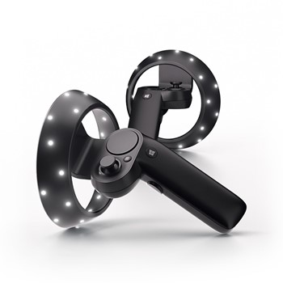
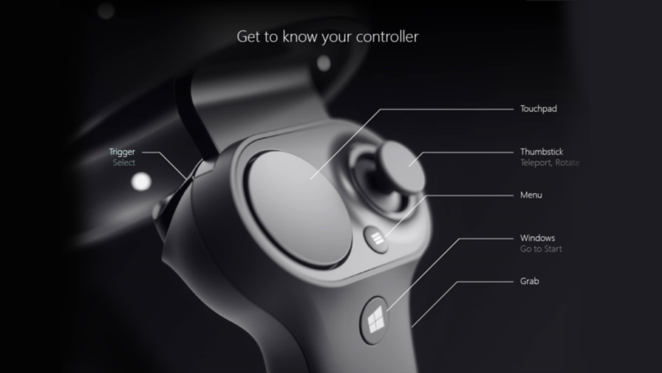
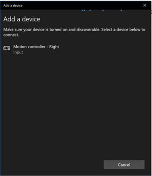
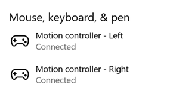

# Motion controllers

:::row:::
    :::column:::
        Motion controllers are [hardware accessories](../discover/hardware-accessories.md) that allow users to take action in mixed reality. An advantage of motion controllers over [gestures](gaze-and-commit.md#composite-gestures) is that the controllers have a precise position in space, allowing for fine grained interaction with digital objects. For Windows Mixed Reality immersive headsets, motion controllers are the primary way that users will take action in their world. 
         
        *Image: A Windows Mixed Reality motion controller*
    :::column-end:::
        :::column:::
         
    :::column-end:::
:::row-end:::

 

---

## Device support

<table>
<colgroup>
    <col width="25%" />
    <col width="25%" />
    <col width="25%" />
    <col width="25%" />
</colgroup>
<tr>
     <td><strong>Feature</strong></td>
     <td><a href="/hololens/hololens1-hardware"><strong>HoloLens (1st gen)</strong></a></td>
     <td><a href="https://docs.microsoft.com/hololens/hololens2-hardware"><strong>HoloLens 2</strong></td>
     <td><a href="/windows/mixed-reality/enthusiast-guide/immersive-headset-hardware-details"><strong>Immersive headsets</strong></a></td>
</tr>
<tr>
     <td>Motion controllers</td>
     <td>❌</td>
     <td>❌</td>
     <td>✔️</td>
</tr>
</table>

## Hardware details

<iframe width="940" height="530" src="https://www.youtube.com/embed/1nlcdDNOdm8" frameborder="0" allow="accelerometer; autoplay; encrypted-media; gyroscope; picture-in-picture" allowfullscreen></iframe>

Windows Mixed Reality motion controllers offer precise and responsive movement tracking in your field of view using the sensors in the immersive headset. There's no need to install hardware on the walls in your space. These motion controllers will offer the same ease of setup and portability as Windows Mixed Reality immersive headsets. Our device partners plan to market and sell these controllers on retail shelves this holiday.

 
*Get to know your controller*

**Features:**
* Optical tracking
* Trigger
* Grab button
* Thumbstick
* Touchpad

## Setup

### Before you begin

**You'll need:**
* A set of two motion controllers.
* Four AA batteries.
* A PC with Bluetooth 4.0 support.

**Check for Windows, Unity, and driver updates**
* Visit [Install the tools](../develop/install-the-tools.md) for the preferred versions of Windows, Unity, and so on, for mixed reality development.
* Make sure you have the most up-to-date [headset and motion controller drivers](/windows/mixed-reality/enthusiast-guide/mixed-reality-software).

### Pairing controllers

Motion controllers can be bonded with host PC using Windows settings like any other Bluetooth device.

1. Insert two AA batteries into the back of the controller. Leave the battery cover off for now.
2. If you're using an external USB Bluetooth Adapter instead of a built-in Bluetooth radio, review the [Bluetooth best practices](/windows/mixed-reality/enthusiast-guide/troubleshooting-windows-mixed-reality#bluetooth-best-practices) before proceeding. For desktop configuration with built-in radio, ensure antenna is connected.
3. Open **Windows Settings** -> **Devices** -> **Add Bluetooth or other device** -> **Bluetooth** and remove any earlier instances of “Motion controller – Right” and “Motion controller – Left”. Check also Other devices category at the bottom of the list.
4. Select **Add Bluetooth or other device** and see it starting to discover Bluetooth devices.
5. Press and hold the controller's Windows button to turn on the controller, release once it buzzes.
6. Press and hold the pairing button (tab in the battery compartment) until the LEDs begin pulsing.

:::row:::
    :::column:::
7. Wait "Motion controller - Left" or "Motion controller - Right" to appear to the bottom of the list. Select to pair. Controller will vibrate once when connected. 
         
        *Image: Select "Motion controller" to pair; if there are multiple instances, select one from the bottom of the list*
    :::column-end:::
        :::column:::
         
    :::column-end:::
:::row-end:::
   
8. You'll see the controller appear in the Bluetooth settings under **“Mouse, keyboard, & pen” category** as **Connected**. At this point, you may get a firmware update – see [next section](motion-controllers.md#updating-controller-firmware).
9. Reattach battery cover.
10. Repeat steps 1-9 for the second controller.

 

:::row:::
    :::column:::
        After successfully pairing both controllers, your settings should look like the following, under **“Mouse, keyboard, & pen” category**  
         
        *Image: Motion controllers connected*
    :::column-end:::
        :::column:::
        
    :::column-end:::
:::row-end:::

If the controllers are turned off after pairing, their status will show up as Paired. For controllers permanently under the “Other devices” category, pairing may have only partially completed. In this case, run the pairing steps again to get controller functional.

### Updating controller firmware

* If an immersive headset is connected to your PC with new controller firmware is available, the firmware will be pushed to your motion controllers automatically the next time you turn them on. Controller firmware updates are indicated by a pattern of illuminating LED quadrants in a circular motion, and take 1-2 minutes.

:::row:::
    :::column:::
* After the firmware update completes, the controllers will reboot and reconnect. Both controllers should be connected now.  
         
        *Image: Controllers connected in Bluetooth settings*
    :::column-end:::
        :::column:::
        
    :::column-end:::
:::row-end:::

* Verify your controllers work properly:
    1. Launch **Mixed Reality Portal** and enter your Mixed Reality Home.
    2. Move your controllers and verify tracking, test buttons, and verify [teleportation](../discover/navigating-the-windows-mixed-reality-home.md#getting-around-your-home) works. If they don't, then check out [motion controller troubleshooting](/windows/mixed-reality/enthusiast-guide/troubleshooting-windows-mixed-reality#motion-controllers).

## Gazing and pointing

Windows Mixed Reality supports two key models for interaction; **gaze and commit** and **point and commit**:
* With **gaze and commit**, users target an object with their [gaze](gaze-and-commit.md), and then select objects with hand air-taps, a gamepad, a clicker, or their voice.
* With **point and commit**, a user can aim a pointing-capable motion controller at the target object and then select objects with the controller's trigger.

Apps that support pointing with motion controllers should also enable gaze-driven interactions where possible, to give users a choice in what input devices they use.

### Managing recoil when pointing

When using motion controllers to point and commit, your users will use the controller to target and interact by pulling its trigger. Users who pull the trigger vigorously may end up aiming the controller higher at the end of their trigger pull than they'd intended.

To manage any such recoil that may occur when users pull the trigger, your app can snap its targeting ray when the trigger's analog axis value rises above 0.0. You can then take action using that targeting ray a few frames later once the trigger value reaches 1.0, as long as the final press occurs within a short time window. When using the higher-level [composite Tap gesture](gaze-and-commit.md#composite-gestures), Windows will manage this targeting ray capture and timeout for you.

## Grip pose vs. pointing pose

Windows Mixed Reality supports motion controllers in different form factors, with each controller's design differing in its relationship between the user's hand position and the natural "forward" direction that apps should use for pointing when rendering the controller.

To better represent these controllers, there are two kinds of poses you can investigate for each interaction source; the **grip pose** and the **pointer pose**.

### Grip pose

The **grip pose** represents the location of either the palm of a hand detected by a HoloLens, or the palm holding a motion controller.

On immersive headsets, the grip pose is best used to render **the user's hand** or **an object held in the user's hand**, such as a sword or gun. The grip pose is also used when visualizing a motion controller, as the **renderable model** provided by Windows for a motion controller uses the grip pose as its origin and center of rotation.

The grip pose is defined specifically as follows:
* The **grip position**: The palm centroid when holding the controller naturally, adjusted left or right to center the position within the grip. On the Windows Mixed Reality motion controller, this position generally aligns with the Grasp button.
* The **grip orientation's Right axis**: When you completely open your hand to form a flat five-finger pose, the ray that is normal to your palm (forward from left palm, backward from right palm)
* The **grip orientation's Forward axis**: When you close your hand partially (as if holding the controller), the ray that points "forward" through the tube formed by your non-thumb fingers.
* The **grip orientation's Up axis**: The Up axis implied by the Right and Forward definitions.

### Pointer pose

The **pointer pose** represents the tip of the controller pointing forward.

The system-provided pointer pose is best used to raycast when you're **rendering the controller model itself**. If you're rendering some other virtual object in place of the controller, such as a virtual gun, you should point with a ray that is most natural for that virtual object, such as a ray that travels along the barrel of the app-defined gun model. Because users can see the virtual object and not the physical controller, pointing with the virtual object will likely be more natural for those using your app.

## Controller tracking state

Like the headsets, the Windows Mixed Reality motion controller requires no setup of external tracking sensors. Instead, the controllers are tracked by sensors in the headset itself.

If the user moves the controllers out of the headset's field of view, in most cases Windows will continue to infer controller positions and provide them to the app. When the controller has lost visual tracking for long enough, the controller's positions will drop to approximate-accuracy positions.

At this point, the system will body-lock the controller to the user, tracking the user's position as they move around, while still exposing the controller's true orientation using its internal orientation sensors. Many apps that use controllers to point at and activate UI elements can operate normally while in approximate accuracy without the user noticing.

 

<iframe width="940" height="530" src="https://www.youtube.com/embed/rkDpRllbLII" frameborder="0" allow="accelerometer; autoplay; encrypted-media; gyroscope; picture-in-picture" allowfullscreen></iframe>

### Reasoning about tracking state explicitly

Apps that wish to treat positions differently based on tracking state may go further and inspect properties on the controller's state, such as SourceLossRisk and PositionAccuracy:

<table>
<tr>
<th> Tracking state </th><th> SourceLossRisk </th><th> PositionAccuracy </th><th> TryGetPosition</th>
</tr><tr>
<td> <b>High accuracy</b> </td><td> &lt; 1.0 </td><td> High </td><td> true</td>
</tr><tr>
<td> <b>High accuracy (at risk of losing)</b> </td><td> == 1.0 </td><td> High </td><td> true</td>
</tr><tr>
<td> <b>Approximate accuracy</b> </td><td> == 1.0 </td><td> Approximate </td><td> true</td>
</tr><tr>
<td> <b>No position</b> </td><td> == 1.0 </td><td> Approximate </td><td> false</td>
</tr>
</table>

These motion controller tracking states are defined as follows:
* **High accuracy:** While the motion controller is within the headset's field of view, it will generally provide high-accuracy positions, based on visual tracking. A moving controller that momentarily leaves the field of view or is momentarily obscured from the headset sensors (for example, by the user's other hand) will continue to return high-accuracy poses for a short time, based on inertial tracking of the controller itself.
* **High accuracy (at risk of losing):** When the user moves the motion controller past the edge of the headset's field of view, the headset will soon be unable to visually track the controller's position. The app knows when the controller has reached this FOV boundary by seeing the **SourceLossRisk** reach 1.0. At that point, the app may choose to pause controller gestures that require a steady stream of high quality poses.
* **Approximate accuracy:** When the controller has lost visual tracking for long enough, the controller's positions will drop to approximate-accuracy positions. At this point, the system will body-lock the controller to the user, tracking the user's position as they move around, while still exposing the controller's true orientation using its internal orientation sensors. Many apps that use controllers to point at and activate UI elements can operate as normal while in approximate accuracy without the user noticing. Apps with heavier input requirements may choose to sense this drop from **High** accuracy to **Approximate** accuracy by inspecting the **PositionAccuracy** property, for example to give the user a more generous hitbox on off-screen targets during this time.
* **No position:** While the controller can operate at approximate accuracy for a long time, sometimes the system knows that even a body-locked position isn't meaningful at the moment. For example, a controller that was turned on may have never been observed visually, or a user may put down a controller that's then picked up by someone else. At those times, the system won't provide any position to the app, and **TryGetPosition** will return false.

## Interactions: Low-level spatial input

The core interactions across hands and motion controllers are **Select**, **Menu**, **Grasp**, **Touchpad**, **Thumbstick**, and **Home**.
* **Select** is the primary interaction to activate a hologram, consisting of a press followed by a release. For motion controllers, you perform a Select press using the controller's trigger. Other ways to perform a Select are by speaking the [voice command](voice-input.md) "Select". The same select interaction can be used within any app. Think of Select as the equivalent of a mouse click; a universal action that you learn once and then apply across all your apps.
* **Menu** is the secondary interaction for acting on an object, used to pull up a context menu or take some other secondary action. With motion controllers, you can take a menu action using the controller's *menu* button. (that is, the button with the hamburger "menu" icon on it)
* **Grasp** is how users can directly take action on objects at their hand to manipulate them. With motion controllers, you can do a grasp action by squeezing your fist tightly. A motion controller may detect a Grasp with a grab button, palm trigger, or other sensor.
* **Touchpad** allows the user to adjust an action in two dimensions along the surface of a motion controller's touchpad, committing the action by clicking down on the touchpad. Touchpads provide a pressed state, touched state, and normalized XY coordinates. X and Y range from -1 to 1 across the range of the circular touchpad, with a center at (0, 0). For X, -1 is on the left and 1 is on the right. For Y, -1 is on the bottom and 1 is on the top.
* **Thumbstick** allows the user to adjust an action in two dimensions by moving a motion controller's thumbstick within its circular range, committing the action by clicking down on the thumbstick. Thumbsticks also provide a pressed state and normalized XY coordinates. X and Y range from -1 to 1 across the range of the circular touchpad, with a center at (0, 0). For X, -1 is on the left and 1 is on the right. For Y, -1 is on the bottom and 1 is on the top.
* **Home** is a special system action that is used to go back to the Start Menu. It's similar to pressing the Windows key on a keyboard or the Xbox button on an Xbox controller. You can go Home by pressing the Windows button on a motion controller. Note, you can always return to Start by saying "Hey Cortana, Go Home". Apps can't react specifically to Home actions, as these are handled by the system.

## Composite gestures: High-level spatial input

Both [hand gestures](gaze-and-commit.md#composite-gestures) and motion controllers can be tracked over time to detect a common set of high-level **[composite gestures](gaze-and-commit.md#composite-gestures)**. This enables your app to detect high-level **tap**, **hold**, **manipulation** and **navigation** gestures, whether users end up using hands or controllers.

## Rendering the motion controller model

**3D controller models**
 Windows makes available to apps a renderable model of each motion controller currently active in the system. By having your app dynamically load and articulate these system-provided controller models at runtime, you can ensure your app is forward-compatible to any future controller designs.

We recommend rendering all renderable models at the **grip pose** of the controller, as the origin of the model is aligned with this point in the physical world. If you're rendering controller models, you may then wish to raycast into your scene from the **pointer pose**, which represents the ray along which users will naturally expect to point, given that controller's physical design.

For more information about how to load controller models dynamically in Unity, see the [Rendering the motion controller model in Unity](../develop/unity/gestures-in-unity.md#rendering-the-motion-controller-model-in-unity) section.

**2D controller line art**
 While we recommend attaching in-app controller tips and commands to the in-app controller models themselves, some developers may want to use 2D line art representations of the motion controllers in flat "tutorial" or "how-to" UI. For those developers, we've made .png motion controller line art files available in both black and white below (right-click to save).

[Full-resolution motion controllers line art in '''white'''](images/motioncontrollers-white.png)
 
[Full-resolution motion controllers line art in '''black'''](images/motioncontrollers-black.png)

## FAQ

### Can I pair motion controllers to multiple PCs?

Motion controllers support pairing with a single PC. Follow instructions on [motion controller setup](motion-controllers.md#setup) to pair your controllers.

### How do I update motion controller firmware?

Motion controller firmware is part of the headset driver and will be updated automatically on connection, if necessary. Firmware updates typically take 1-2 minutes depending on Bluetooth radio and link quality. In rare cases, controller firmware updates may take up to 10 minutes, which can indicate poor Bluetooth connectivity or radio interference. See [Bluetooth best practices in the Enthusiast Guide](/windows/mixed-reality/enthusiast-guide/troubleshooting-windows-mixed-reality#bluetooth-best-practices) to troubleshoot connectivity issues. After a firmware update, controllers will reboot and reconnect to the host PC (you may notice the LEDs go bright for tracking). If a firmware update is interrupted (for example, the controllers lose power), it will be attempted again the next time the controllers are powered on.

### How I can check battery level?

In the [Windows Mixed Reality home](../discover/navigating-the-windows-mixed-reality-home.md), you can turn your controller over to see its battery level on the reverse side of the virtual model. There's no physical battery level indicator.

### Can you use these controllers without a headset? Just for the joystick/trigger/etc input?

Not for Universal Windows Applications.

## Troubleshooting

See [motion controller troubleshooting](/windows/mixed-reality/enthusiast-guide/troubleshooting-windows-mixed-reality#motion-controllers) in the Enthusiast Guide.

## Filing motion controller feedback/bugs

[Give us feedback](/hololens/hololens-feedback) in Feedback Hub, using the "Mixed Reality -> Input" category.

## See also

* [Motion controllers in Unity](../develop/unity/motion-controllers-in-unity.md)
* [Hands and motion controllers in DirectX](../develop/native/hands-and-motion-controllers-in-directx.md)
* [Gestures](gaze-and-commit.md#composite-gestures)
* [Enthusiast's Guide: Your Windows Mixed Reality home](/windows/mixed-reality/enthusiast-guide/your-mixed-reality-home)
* [Enthusiast's Guide: Using games & apps in Windows Mixed Reality](/windows/mixed-reality/enthusiast-guide/using-games-and-apps-in-windows-mixed-reality)
* [How inside-out tracking works](/windows/mixed-reality/enthusiast-guide/tracking-system)