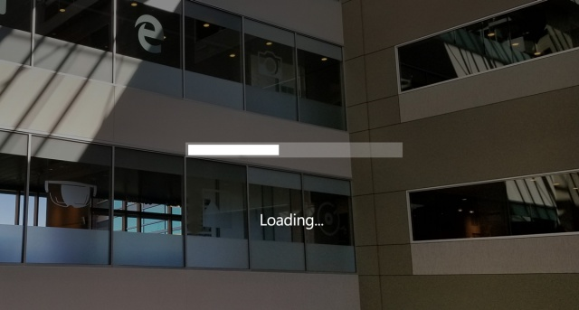

# Progress indicator

 

A progress control provides feedback that a long-running operation is underway. When a progress indicator is visible, users can see the wait time and can't interact with the app.

 

---

## Types of progress

It's important to provide the user information about what is happening. In mixed reality, users can be easily distracted by the physical environment or objects if your app doesn't have good visual feedback. For situations that take a few seconds, like when data is loading or a scene is updating, it's a good idea to show a visual indicator. There are two options to show the user that an operation is underway – a **Progress bar** or a **Progress ring**.

:::row:::
    :::column:::
        ### Progress bar 
        A Progress bar shows the percentage completed of a task. It should be used during an operation whose duration is known (determinate), but its progress shouldn't block the user's interaction with the app. 
         
        *Image: Progress bar example in HoloLens*
    :::column-end:::
        :::column:::
         
        
    :::column-end:::
:::row-end:::

 

---

:::row:::
    :::column:::
        ### Progress ring 
        A Progress ring only has an indeterminate state, and should be used when user interaction is blocked until the operation has completed. 
         
        *Image: Progress ring example in HoloLens*
    :::column-end:::
        :::column:::
         
        
    :::column-end:::
:::row-end:::

 

---

:::row:::
    :::column:::
        ### Progress with a custom object 
        You can add to your app's personality and brand identity by customizing the Progress control with your own custom 2D/3D objects. 
         
        *Image: Progress with custom mesh example in HoloLens*
    :::column-end:::
        :::column:::
         
        
    :::column-end:::
:::row-end:::

 

---

## Best practices

* Tightly couple [billboarding or tag-along](billboarding-and-tag-along.md) to the display of Progress since the user can easily move their head into empty space and lose context. Your app might look like it has crashed if the user is unable to see anything. Billboarding and tag-along is built into the Progress prefab.
* It's always good to provide status information about what is happening to the user. The Progress prefab provides various visual styles including the Windows standard ring-type progress for providing status. You can also use a custom mesh with an animation if you want the style of your progress to align to your app’s brand.

 

---

## Progress indicator in MRTK (Mixed Reality Toolkit) for Unity

* [MRTK - Progress indicator prefabs](https://github.com/microsoft/MixedRealityToolkit-Unity/tree/main/Assets/MRTK/SDK/Features/UX/Prefabs/ProgressIndicators)
* [MRTK - Scene transition service](/windows/mixed-reality/mrtk-unity/features/extensions/scene-transition-service)

 

---

## See also

* [Cursors](cursors.md)
* [Hand ray](point-and-commit.md)
* [Button](button.md)
* [Interactable object](interactable-object.md)
* [Bounding box and App bar](app-bar-and-bounding-box.md)
* [Manipulation](direct-manipulation.md)
* [Hand menu](hand-menu.md)
* [Near menu](near-menu.md)
* [Object collection](object-collection.md)
* [Voice command](voice-input.md)
* [Keyboard](keyboard.md)
* [Tooltip](tooltip.md)
* [Slate](slate.md)
* [Slider](slider.md)
* [Shader](shader.md)
* [Billboarding and tag-along](billboarding-and-tag-along.md)
* [Displaying progress](progress.md)
* [Surface magnetism](surface-magnetism.md)