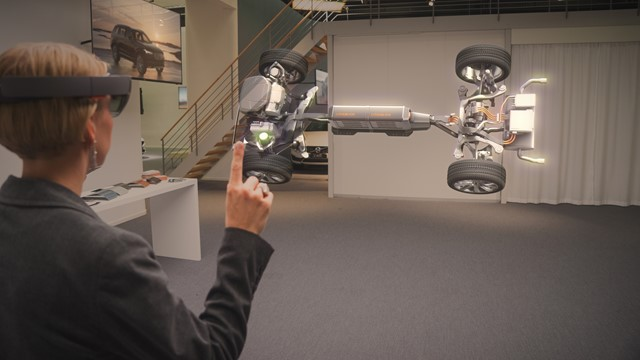

# Scale

The key to displaying realistic holographic content is mimicking the visual statistics of the real world as closely as possible. Incorporate visual cues to help real-world users understand where objects are, how big they are, and what they’re made of. The scale of an object is one of the most important visual cues because it gives viewer a sense of the objects size and cues to its location. Further, viewing objects at real scale is one of the key experience differentiators for mixed reality in general – something that hasn’t been possible on previous screen-based viewing.

 

---

## How to suggest the scale of objects and environments

There are many ways to suggest the scale of an object, some of which have possible effects on other perceptual factors. The key one is to display objects at a ‘real’ size, and maintain that realistic size as users move. Holograms will take up a different amount of a user’s visual angle of a user as they come closer or further away, the same way that real objects do.

### Use the distance of objects as they're presented to the user

One common method is to use the distance of objects as they're presented to the user. For example, consider visualizing a large family car in front of the user. If the car was directly in front of them within arm’s length, it would be too large to fit in the user’s field of view. Close objects require the user to move their head and body to understand the entirety of the object. If the car is placed further away (across the room), the user can establish a sense of scale by seeing the entire object in their field of view. Users could then move themselves closer to the object for a more detailed inspection.

:::row:::
    :::column:::
        **[Volvo used this technique to create a showroom](https://www.youtube.com/watch?v=DilzwF90vec)** experience for a new car, using the scale of the holographic car in a way that felt realistic and intuitive to the user. The experience begins with the car hologram on a physical table, allowing the user to understand the total size and shape of the model. Later in the experience, the car expands to a scale beyond the size of the device's field of view. Since the user already acquired a frame of reference from the smaller model, they can adequately navigate around features of the car. 
         
        *Image: Volvo Cars experience for HoloLens*
    :::column-end:::
        :::column:::
        
    :::column-end:::
:::row-end:::

 

---

### Use holograms to modify the user's real space

Another method is to use holograms to modify the user's real space, replacing the existing walls or ceilings with environments or appending ‘holes’ or ‘windows’. This allows over-sized objects to seemingly 'break-through' the physical space. For example, a large tree might not fit in most users’ living rooms, but by putting a virtual sky on their ceiling, the physical space expands into the virtual. This allows the user to walk around the base of the virtual tree and gather a sense of scale and real-world appearance. Users can then look up to see it extend far beyond the physical space of the room.

:::row:::
    :::column:::
        **[Minecraft developed a concept experiences](https://minecraft.net/)** using a similar technique. By adding a virtual window to a physical surface, the existing objects in the room are placed in the context of a vastly larger environment, beyond the physical scale limitations of the room. 
         
        *Image: Minecraft concept experience for HoloLens*
    :::column-end:::
        :::column:::
         
    :::column-end:::
:::row-end:::

 

---

## Experimenting with scale

Designers have experimented with modifying the scale by changing the displayed ‘real’ size of the object. At the same time, they maintain a single object position to approximate an object moving towards the viewer without any actual movement. This was tested in some cases as a way to simulate up-close viewing of items while still respecting potential comfort limitations of viewing virtual content closer than the “zone of comfort” would suggest.

This can create a few possible artifacts in the experience however:
* For virtual objects that represent some object with a ‘known’ size to the viewer, changing the scale without changing the position leads to conflicting visual cues. The eyes may still ‘see’ the object at some depth because of vergence cues. For more information, see the [Comfort](comfort.md) article. The size acts as a monocular cue that the object might be getting closer. These conflicting cues lead to confused perceptions – viewers often see the object as staying in place (because of the constant depth cue) but growing rapidly.
* In some cases, change of scale is seen as a ‘looming’ cue instead, where the object may or may not be seen to change scale by a viewer, but does appear to be moving directly toward the viewer’s eyes (which can be an uncomfortable sensation).
* With comparison surfaces in the real world, such scaling changes are sometimes seen as changing position along multiple axes – objects appear to drop lower instead of moving closer (similar in a 2D projection of 3D movement in some cases).
* Finally, for objects without a known ‘real world’ size (for example, arbitrary shapes with arbitrary sizes, UI elements, and so on), changing scale may act functionally as a way to mimic changes in distance. Viewers don't have as many pre-existing top-down cues to understand the object’s true size or location, so the scale can be processed as a more important cue.

 

---

## See also
* [Color, light, and materials](./color-light-and-materials.md)
* [Typography](typography.md)
* [Spatial sound design](spatial-sound-design.md)